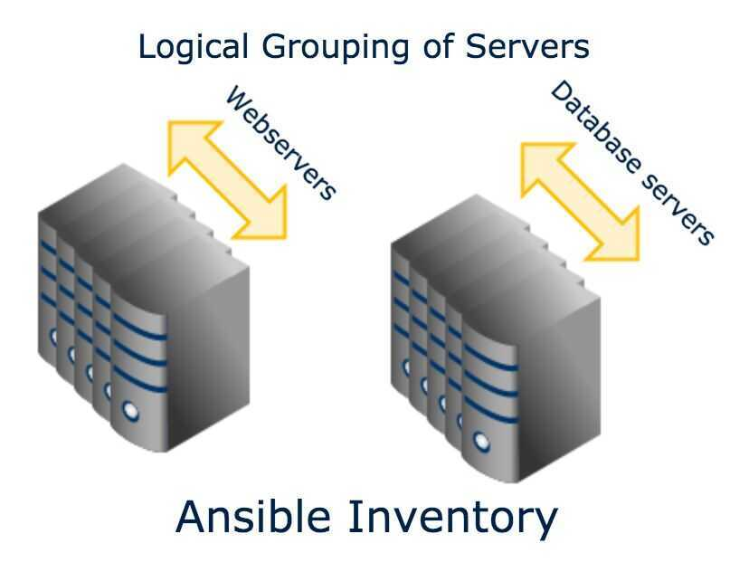
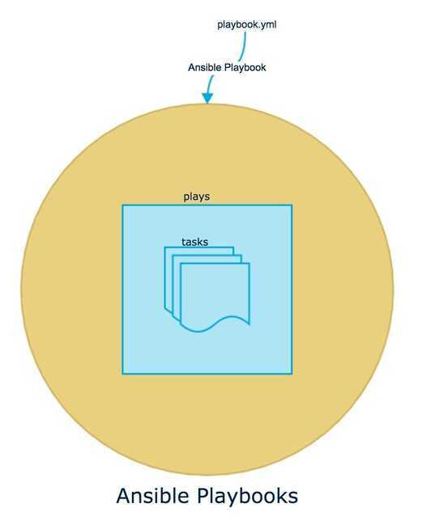
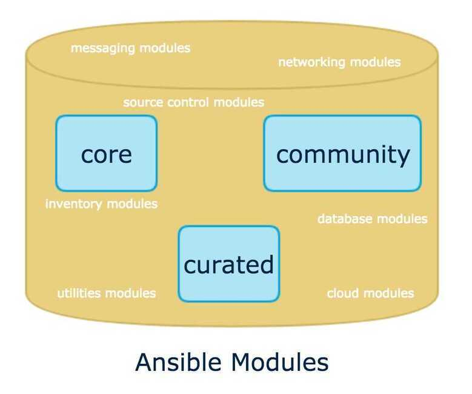

# Ansible

## Features

- Automation system
- Automates
    - Software provisioning
    - Configuration management
    - Application deployment
    - Ad-hoc task execution
    - Multinode orchestration
    - Copy files to-and-fro from machines
    - Control Machine
- Zero-downtime rolling updates with load balancers

## Architecture

Ansible has two types of servers -

- **controlling machines**
- **nodes**

First, there is a single controlling machine which is where orchestration begins. Nodes are managed by a controlling machine over SSH. The controlling machine describes the location of nodes through its inventory.

To orchestrate nodes, Ansible deploys modules to nodes over SSH. Modules are temporarily stored in the nodes and communicate with the controlling machine through a [JSON](https://en.wikipedia.org/wiki/JSON) protocol over the standard output.When Ansible is not managing nodes, it does not consume resources because no daemons or programs are executing for Ansible in the background.

In contrast with popular configuration management software - such as [Chef](https://en.wikipedia.org/wiki/Chef_(software)), [Puppet](https://en.wikipedia.org/wiki/Puppet_(software)), and [CFEngine](https://en.wikipedia.org/wiki/CFEngine) - Ansible uses an *agentless* architecture. With an [agent-based architecture](https://en.wikipedia.org/wiki/Agent-based_model), nodes must have a locally installed daemon that communicates with a controlling machine. With an agentless architecture, nodes are not required to install and run background daemons to connect with a controlling machine. This type of architecture reduces the overhead on the network by preventing the nodes from polling the controlling machine.

## Core components

### Ansible Inventory ( ex - vim /etc/ansible/hosts)

Logical grouping of servers which are to be managed by a sysadmin

### Ansible Playbooks

Collection of commands that a sysadmin would run on servers mentioned in Ansible Inventory

### Ansible Modules

In-built packages which are available for a sysadmin to use in Ansible Playbooks and then run them on the servers which are mentioned in Ansible Inventory

## Design Principles

- Have a dead simple setup process and a minimal learning curve
- Manage machines very quickly and in parallel
- Avoid custom-agents and additional open ports, be agentless by leveraging the existing SSH daemon
- Describe infrastructure in a language that is both machine and human friendly
- Focus on security and easy auditability/review/rewriting of content
- Manage new remote machines instantly, without bootstrapping any software
- Allow module development in any dynamic language, not just Python
- Be usable as non-root
- Be the easiest IT automation system to use, ever.

## Ansible Tower

Red HatAnsibleTower helps you scale IT automation, manage complex deployments and speed productivity. Centralize and control your IT infrastructure with a visual dashboard, role-based access control, job scheduling, integrated notifications and graphical inventory management. And Ansible Tower's REST API and CLI make it easy to embed Ansible Tower into existing tools and processes.

- Ansible Galaxy

## Ansible vs Terraform

Terraform is an open-source platform designed to provision cloud infrastructure, while Ansible is an open-source configuration management tool focused on the configuration of that infrastructure.

[Terraform vs. Ansible: Differences and Comparison of Tools](https://spacelift.io/blog/ansible-vs-terraform)

## References

https://www.priyanktrivedi.org/blog/ansible_automation
