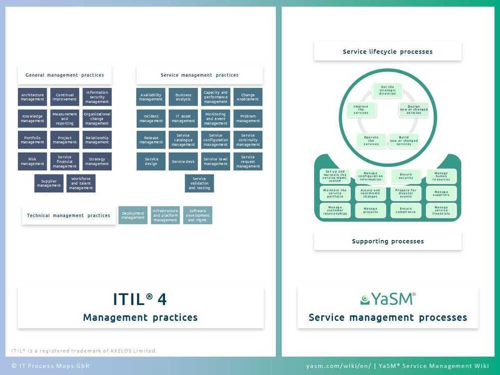

# Concepts

Container Orchestration Systems - to provide a higher level of deployment infrastructure abstraction, and evolution of continuous delivery systems such as [GoCD](https://www.gocd.org/kubernetes/?gclid=EAIaIQobChMIwu-o1_3E2gIVjcVkCh3XUAkoEAAYASAAEgJPQ_D_BwE) to build, test and deploy microservices as containers

## Multitenancy

Multitenancy is a reference to the mode of operation of software where multiple independent instances of one or multiple applications operate in a shared environment. The instances (tenants) are logically isolated, but physically integrated. The degree of logical isolation must be complete, but the degree of physical integration will vary. The more physical integration, the harder it is to preserve the logical isolation. The tenants (application instances) can be representations of organizations that obtained access to the multitenant application (this is the scenario of an ISV offering services of an application to multiple customer organizations). The tenants may also be multiple applications competing for shared underlying resources (this is the scenario of a private or public cloud where multiple applications are offered in a common cloud environment)

https://www.gartner.com/it-glossary/multitenancy

The term "**software multitenancy**" refers to a [software architecture](https://en.wikipedia.org/wiki/Software_architecture) in which a single [instance](https://en.wikipedia.org/wiki/Instance_(computer_science)) of [software](https://en.wikipedia.org/wiki/Computer_software) runs on a server and serves multiple tenants. A tenant is a group of users who share a common access with specific privileges to the software instance. With a multitenant architecture, a [software application](https://en.wikipedia.org/wiki/Application_software) is designed to provide every tenant a dedicated share of the instance - including its data, configuration, user management, tenant individual functionality and [non-functional properties](https://en.wikipedia.org/wiki/Non-functional_requirement). Multitenancy contrasts with multi-instance architectures, where separate software instances operate on behalf of different tenants.

https://en.wikipedia.org/wiki/Multitenancy

## LXC

LXC is the well known set of tools, templates, library and language bindings. It's pretty low level, very flexible and covers just about every containment feature supported by the upstream kernel.

## LXD

LXD is the new LXC experience. It offers a completely fresh and intuitive user experience with a single command line tool to manage your containers. Containers can be managed over the network in a transparent way through a REST API. It also works with large scale deployments by integrating with OpenStack.

## LXCFS

Userspace (FUSE) filesystem offering two main things:

- Overlay files for cpuinfo, meminfo, stat and uptime.
- A cgroupfs compatible tree allowing unprivileged writes.

It's designed to workaround the shortcomings of procfs, sysfs and cgroupfs by exporting files which match what a system container user would expect.

## ITIL

ITIL, formerlyan acronym for **Information Technology Infrastructure Library**, is a set of detailed practices for [IT service management](https://en.wikipedia.org/wiki/IT_service_management)(ITSM) that focuses on aligning IT services with the needs of business.

https://wiki.en.it-processmaps.com/index.php/ITIL_Processes

https://en.wikipedia.org/wiki/ITIL
