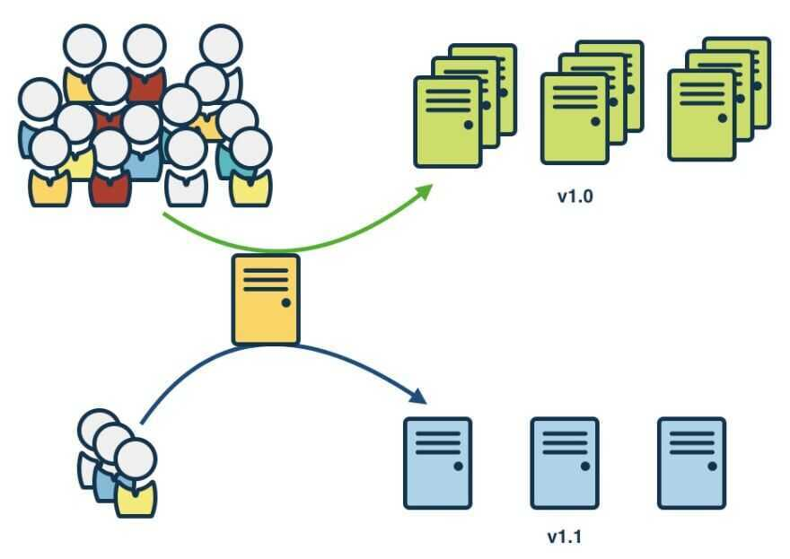

# Deployment Strategies

## Blue/Green Deployment

[Blue-green deployments](https://www.gocd.org/2017/07/25/blue-green-deployments/) are similar, where you have a new footprint of your new service, and then you do some testing and route some traffic through it. If everything is fine, you switch over all of your traffic to the new instance of services, otherwise, you keep the old footprint going.

## Canary Deployment

The name borrowed from a technique employed by coal miners many years ago, before the advent of modern sensor safety equipment. A common issue with coal mines is the build up of toxic gases, not all of which even have an odor. To alert themselves to the presence of dangerous gases, miners would bring caged canaries with them into the mines. In addition to their cheerful singing, canaries are highly susceptible to toxic gases. If the canary died, it was time for the miners to get out fast, before they ended up like the canary.

[Canary deployment](https://www.gocd.org/2017/08/15/canary-releases/) is where you take a new release and release it to a certain subsection of your production infrastructure, see how well that goes, and keep increasing the footprint of the new service until the time you completely roll it out. If you face issues, you can start rolling back the new version of your service.

## A/B Testing

A/B testing in its simplest sense is an experiment on two variants to see which performs better based on a given metric. Typically, two consumer groups are exposed to two different versions of the same thing to see if there is a significant difference in metrics like sessions, click-through rate, and/or conversions.

Using the visual above as an example, we could randomly split our customer base into two groups, a control group and a variant group. Then, we can expose our variant group with a red website banner and see if we get a significant increase in conversions. It's important to note that all other variables need to be held constant when performing an A/B test.

Getting more technical, A/B testing is a form of statistical and two-sample hypothesis testing. **Statistical hypothesis testing** is a method in which a sample dataset is compared against the population data.**Two-sample hypothesis testing**is a method in determining whether the differences between the two samples are statistically significant or not.

https://towardsdatascience.com/a-simple-guide-to-a-b-testing-for-data-science-73d08bdd0076

## References

Migrating to Microservices Databases, Chapter 2, Zero Downtime
