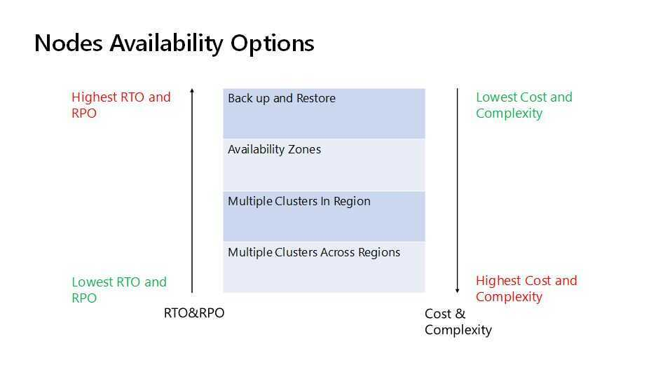

# Disaster Recovery

## RTO - Recovery Time Objective

The time it takes after a disruption to restore a business process to its service level, as defined by the operational level agreement (OLA). For example, if a disaster occurs at 12:00 PM (noon) and the RTO is eight hours, the DR process should restore the business process to the acceptable service level by 8:00 PM.

The time it takes a system to return to a working state after a disaster or service outage. In other words, RTO measures downtime.

## RPO - Recovery Point Objective

The acceptable amount of data loss measured in time. For example, if a disaster occurs at 12:00 PM (noon) and the RPO is one hour, the system should recover all data that was in the system before 11:00 AM. Data loss will span only one hour, between 11:00 AM and 12:00 PM (noon).

## PITR - Point In Time Recovery

Point-in-time recovery (PITR) in the context of [computers](https://en.wikipedia.org/wiki/Computer) involves systems whereby an administrator can restore or recover a set of data or a particular setting from a time in the past

PITR involves continuous archiving of WAL files and restoring the database to a specific point in time using the archived WAL files and a base backup.

## Recovery

Disaster recovery in the database world relates to the backups, logs and replication instances that are maintained while everything is working fine. These can then be switched on, switched over and analysed when something does go wrong, like a hardware failure, natural disaster or even human error.

- **Failover** - multiple clusters are set up so if one fails the other can take over.
- **Mirroring** - maintaining two copies of the same database at different locations. One in offline mode so we know where things are at when we need to use it.
- **Replication** - the secondary database is online and can be queried. This is not only good for Disaster Recovery but can be useful if you utilise one instance for reporting and one for live queries. If you are using AWS setting this up takes just a few clicks.

### 1. Backup and Restore Strategy

This method involves regular backups of data and systems to facilitate post-disaster recovery.

- Typical RTO: From several hours to a few days.
- Typical RPO: From a few hours up to the time of the last successful backup.

### 2. Pilot Light Approach

Maintains crucial components in a ready-to-activate mode, enabling rapid scaling in response to a disaster.

- Typical RTO: From a few minutes to several hours.
- Typical RPO: Depends on how often data is synchronized.

The term pilot light is often used to describe a DR scenario in which a minimal version of an environment is always running in the cloud. The idea of the pilot light is an analogy that comes from the gas heater. In a gas heater, a small flame that's always on can quickly ignite the entire furnace to heat up a house.

### 3. Warm Standby Solution

Establishes a semi-active environment with current data to reduce recovery time.

- Typical RTO: Generally within a few minutes to hours.
- Typical RPO: Up to the last few minutes or hours.

The term warm standby is used to describe a DR scenario in which a scaled-down version of a fully functional environment is always running in the cloud. A warm standby solution extends the pilot light elements and preparation.It further decreases the recovery time because some services are always running. By identifying your business-critical systems, you can fully duplicate these systems on AWS and have them always on.

These servers can be running on a minimum-sized fleet of Amazon EC2 instances on the smallest sizes possible. This solution is not scaled to take a full-production load, but it is fully functional. It can be used for non-production work, such as testing, quality assurance, and internal use.

In a disaster, the system is scaled up quickly to handle the production load. In AWS, this can be done by adding more instances to the load balancer and by resizing the small capacity servers to run on larger Amazon EC2 instance typ es. As stated in the preceding section, horizontal scaling is preferred over vertical scaling.

### 4. Hot Site / Multi-Site Configuration

Ensures a fully operational, duplicate environment that runs parallel to the primary system, enabling uninterrupted functionality.

- Typical RTO: Almost immediate, often just a few minutes.
- Typical RPO: Extremely minimal, usually only a few seconds old.

## Question

Scenario: An ERP application is deployed across multiple AZs in a single region. In the event of failure, the Recovery Time Objective (RTO) must be less than 3 hours, and the Recovery Point Objective (RPO) must be 15 minutes. The customer realizes that data corruption occurred roughly 1.5 hours ago. What DR strategy could be used to achieve this RTO and RPO in the event of this kind of failure?

Which of these solutions would you recommend and why? Draft a detailed solution response explaining the pros and cons of your recommended solution and why you selected a specific solution.

Option A. Take 15 minute DB backups stored in Glacier with transaction logs stored in S3 every 5 minutes.

Option B. Use synchronous database master-slave replication between two availability zones.

Option C. Take hourly DB backups to EC2 instance store volumes with transaction logs stored in S3 every 5 minutes.

https://aws.amazon.com/blogs/architecture/disaster-recovery-dr-architecture-on-aws-part-iii-pilot-light-and-warm-standby

### Solution

Option 1 - Take 15 minute DB backups stored in Glacier with transaction logs stored in S3 every 5 minutes

### Explanation

Since RPO is 15 minutes therefore DB backups must be taken every 15 minutes and stored in Glacier since RTO is 3 hours. Also transaction logs can be stored in S3 every 5 minutes so that it can be replayed after recovery of the database in event of failure. The time for storing transaction logs can be decreased to decrease the chance of data loss.

Pros - Satisfies the SLA given by customer

Cons - Restore of DB must be performed and during that time events can get lost.

For High Availability Option 2 can be used. A master-slave replication between two availability zones, or even further master-less database like Cassandra can be used so that hosts can join and leave a cluster without downtime of service, and Consistency can be configured according to SLA.

## Replication of Data

When you replicate data to a remote location, you should consider these factors:

- Distance between the sites - Larger distances typically are subject to more latency or jitter.
- Available bandwidth - The breadth and variability of the interconnections.
- Data rate required by your application - The data rate should be lower than the available bandwidth.
- Replication technology - The replication technology should be parallel (so that it can use the network effectively).

There are two main approaches for replicating data: synchronous and asynchronous.

## Tools

### Valero

Velero (formerly Heptio Ark) gives you tools to back up and restore your Kubernetes cluster resources and persistent volumes. You can run Velero with a public cloud platform or on-premises. Velero lets you:

- Take backups of your cluster and restore in case of loss.
- Migrate cluster resources to other clusters.
- Replicate your production cluster to development and testing clusters.

Velero consists of:

- A server that runs on your cluster
- A command-line client that runs locally

https://github.com/vmware-tanzu/velero

### Kanister

A framework for data management in Kubernetes. It allows domain experts to define application-specific data management workflows through Kubernetes API extensions. Kanister makes it easy to integrate your application's data with your storage infrastructure.

#### Features

- Tasks Execute Anywhere: Exec into running containers or spin up new ones.
- Object Storage: Efficiently and securely transfer data between your app and Object Storage using Restic.
- Block Storage: Backup, restore, and copy data using your storage's APIs.
- Kubernetes Workload Integration:Easily perform common workload operations like scaling up/down, acting on all mounted PVCs and many more.
- Application Centric: A single Blueprint handles workflows for every instance of your app.
- Kubernetes Native APIs: APIs built using CRDs that play nicely with the Kubernetes ecosystem.
- Secured by RBAC: Prevent unauthorized access to your workflows using RBAC.
- Reporting:Watching, logging and eventing let you know the impact of your workflows.

https://github.com/kanisterio/kanister

### AWS Elastic Disaster Recovery

Can run drills and initiate recovery from console

[AWS Elastic Disaster Recovery](https://aws.amazon.com/disaster-recovery/)

[What is Elastic Disaster Recovery? - AWS Elastic Disaster Recovery](https://docs.aws.amazon.com/drs/latest/userguide/what-is-drs.html)

[Get Started with AWS Elastic Disaster Recovery | Amazon Web Services - YouTube](https://www.youtube.com/watch?v=GAMUCIJR5as)

## Others

https://d1.awsstatic.com/whitepapers/architecture/AWS-Reliability-Pillar.pdf

[High availability is not disaster recovery - Disaster Recovery of Workloads on AWS: Recovery in the Cloud](https://docs.aws.amazon.com/whitepapers/latest/disaster-recovery-workloads-on-aws/high-availability-is-not-disaster-recovery.html)

[Disaster Recovery (DR) Architecture on AWS, Part I: Strategies for Recovery in the Cloud | AWS Architecture Blog](https://aws.amazon.com/blogs/architecture/disaster-recovery-dr-architecture-on-aws-part-i-strategies-for-recovery-in-the-cloud/)
