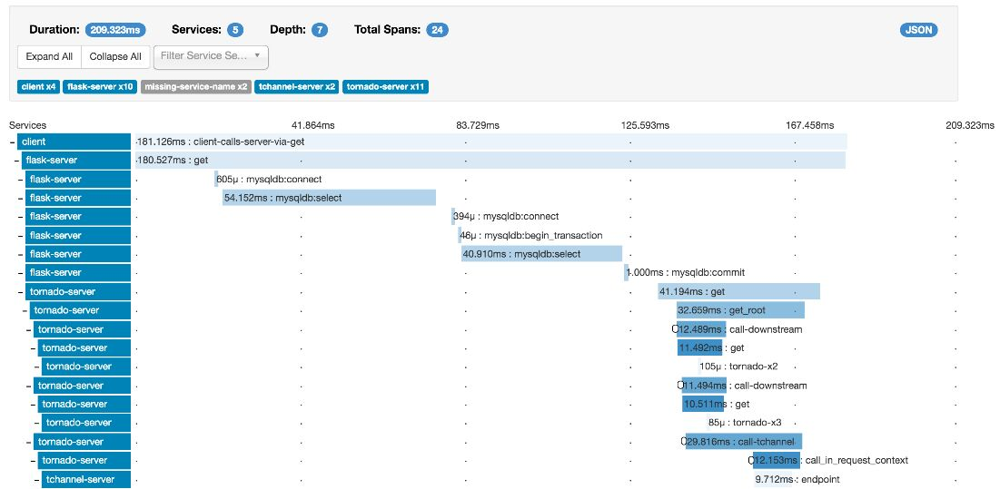

# Distributed Tracing

Distributed tracing, also called distributed request tracing, is a method used to profile and monitor applications, especially those built using a microservices architecture. Distributed tracing helps pinpoint where failures occur and what causes poor performance.

A category of tools and practices that allow developers to analyze the behavior of a service and troubleshoot problems by creating services that record information about requests and operations that are performed.

## Who Uses Distributed Tracing?

IT and DevOps teams can use distributed tracing to monitor applications. Distributed tracing is particularly well-suited to debugging and monitoring modern distributed software architectures, such as microservices.

Developers can use distributed tracing to help debug and optimize their code.

Tracing brings the benefits of visibility into an application as it grows to 10+ processes, starts seeing increased concurrency, or non-trivial interactions between mobile/web clients and servers.

A significant challenge of microservices is to understand the flow of events across services. A single transaction may involve calls to multiple services. To reconstruct the entire sequence of steps, each service should propagate a correlation ID that acts as a unique identifier for that operation. The correlation ID enables [distributed tracing](https://microservices.io/patterns/observability/distributed-tracing.html) across services.

The first service that receives a client request should generate the correlation ID. If the service makes an HTTP call to another service, it puts the correlation ID in a request header. If the service sends an asynchronous message, it puts the correlation ID into the message. Downstream services continue to propagate the correlation ID, so that it flows through the entire system. In addition, all code that writes application metrics or log events should include the correlation ID.

https://docs.microsoft.com/en-us/azure/architecture/microservices/logging-monitoring#distributed-tracing

## Tools

1. Grafana Tempo - https://grafana.com/oss/tempo
2. Twitter zipkin
3. Google Dapper - https://ai.google/research/pubs/pub36356
4. Jaeger

https://medium.com/@masroor.hasan/tracing-infrastructure-with-jaeger-on-kubernetes-6800132a677

## SE Radio - 337: Distributed Tracing

#### *Robert Blumen with Ben Sigelman*

Distributed tracing, a form of event-driven observability useful in debugging distributed systems, understanding latency outlyers, and delivering "white box" analytics.

- why it is harder in a distributed system
- the concept of tracing context
- how context is propagated
- how trace data is collected
- interoperability in a polyglot environment
- **two approaches to collection: instrumentation versus injection**
- the architecture of a tracing back end
- what type of databases are used
- querying the back end database
- typical queries that a human user would run
- other systems that query the back end
- integration with monitoring and alerting
- distributed tracing as a source of analytics for business insights
- adoption of distributed tracing in a software organization

https://opentracing.io/docs/overview/what-is-tracing

## Zipkin

Zipkin is a distributed tracing system. It helps gather timing data needed to troubleshoot latency problems in microservice architectures. It manages both the collection and lookup of this data. Zipkin's design is based on the [Google Dapper](http://research.google.com/pubs/pub36356.html) paper.

Applications are instrumented to report timing data to Zipkin. The Zipkin UI also presents a Dependency diagram showing how many traced requests went through each application. If you are troubleshooting latency problems or errors, you can filter or sort all traces based on the application, length of trace, annotation, or timestamp. Once you select a trace, you can see the percentage of the total trace time each span takes which allows you to identify the problem application.

https://github.com/openzipkin/zipkin

https://zipkin.apache.org
