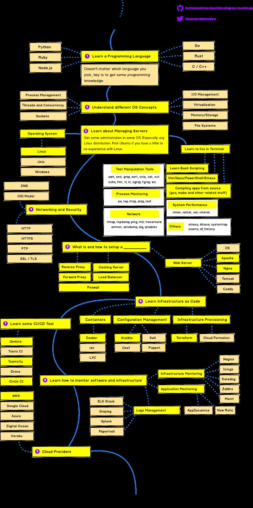
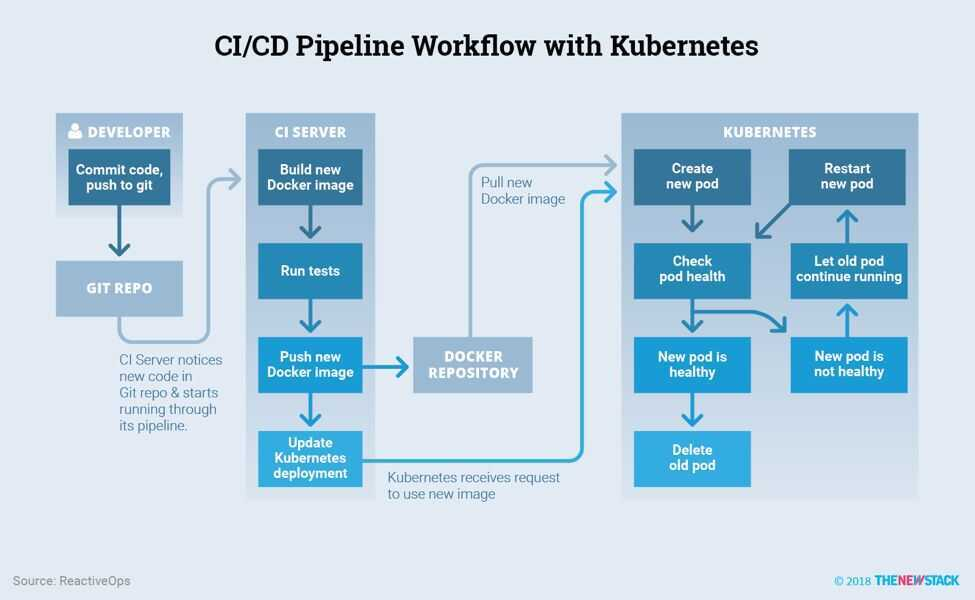

# Intro

DRI - Designated Response Individuals

SRE - Site Reliability Engineers

Devops (Development Operations) is a set of practices.

It is a software engineering culture and practice that aims at unifying software development (Dev) and software operations (Ops). The main characteristic of the DevOps movement is to strongly advocate [automation](https://en.wikipedia.org/wiki/Automation) and [monitoring](https://en.wikipedia.org/wiki/Event_monitoring) at all steps of [software construction](https://en.wikipedia.org/wiki/Software_build), from [integration](https://en.wikipedia.org/wiki/Continuous_integration), [testing](https://en.wikipedia.org/wiki/Test_automation), [releasing](https://en.wikipedia.org/wiki/Software_release_life_cycle) to deployment and [infrastructure management](https://en.wikipedia.org/wiki/Infrastructure_as_Code). DevOps aims at shorter development cycles, [increased deployment frequency](https://en.wikipedia.org/wiki/Continuous_delivery), and more dependable releases, in close alignment with business objectives.

[DevOps vs SRE vs Platform Engineering | Clear Big Misconceptions - YouTube](https://www.youtube.com/watch?v=an8SrFtJBdM)

## What is CI/CD and what are its benefits?

Continuous integration and continuous deployment is a practice wherein you integrate and test your software on every code change. Later on, that code is deployed to production. The main benefit is that it reduces manual work and the chances of human error during deployments.

## What are different deployment strategies?

Depending on your product and how's your technical implementation, you can choose to do a rolling strategy, recreate strategy, blue-green, A/B testing, canary deployment, or shadow strategy.

A definition proposed by Bass, Weber, and Zhu, is DevOps is a set of practices intended to reduce the time between committing a change to a system and the change being placed into normal production, while ensuring high quality.

1. Plan / Code - code development and review, [source code management](https://en.wikipedia.org/wiki/Version_control) tools, code merging
2. Create / Build - [continuous integration](https://en.wikipedia.org/wiki/Continuous_integration) tools, build status
3. Verify / Test - [continuous testing](https://en.wikipedia.org/wiki/Continuous_testing) tools that provide feedback on business risks
4. Package - [artifact repository](https://en.wikipedia.org/wiki/Binary_repository_manager), application pre-deployment staging
5. Release - change management, release approvals, [release automation](https://en.wikipedia.org/wiki/Application_release_automation)
6. Configure - infrastructure configuration and management, [Infrastructure as Code](https://en.wikipedia.org/wiki/Infrastructure_as_Code) tools
7. Monitor - [applications performance monitoring](https://en.wikipedia.org/wiki/Application_performance_management), end-user experience

The term "**deployment**" refers to the act of deploying a change to application components or infrastructure, and the term "**release**" refers to the act of enabling or exposing a feature to end-users (with a corresponding business impact)

## CI/CD on kubernetes

## Monitoring

Monitoring means knowing what's going on inside your system, how much traffic it's getting, how it's performing, how many errors there are. This is not the end goal though, merely a means. Our goal is to be able to detect, debug and resolve any problems that occur, and monitoring is an integral part of that process.

## Scheduling vs Orchestration

- Scheduling is deciding when and whether a task should run
- Orchestration is deciding where and how a task should run

## Remediation vs Repair

**Remediation is a more thorough and long-term solution than repair**. Repair is for minor damage that doesn't have an underlying cause. Remediation is for major or recurring damage caused by an underlying issue.

## Learning / Roadmap

1. devops-exercises (67.9k⭐)
	- Extensive practice with Linux, AWS, Docker, K8s
	- 2600+ hands-on exercises & scenarios
	- [GitHub - bregman-arie/devops-exercises: Linux, Jenkins, AWS, SRE, Prometheus, Docker, Python, Ansible, Git, Kubernetes, Terraform, OpenStack, SQL, NoSQL, Azure, GCP, DNS, Elastic, Network, Virtualization. DevOps Interview Questions](https://github.com/bregman-arie/devops-exercises)

2. DevOps Interview Guide
	- Cloud & DevOps specific scenarios
	- Certification preparation resources
	- [GitHub - ramanagali/Interview\_Guide: Interview, Certification preparation guide for Cloud DevOps professionals](https://github.com/ramanagali/Interview_Guide)

3. DevOps Projects by NotHarshhaa
	- Real-world project implementations
	- Step-by-step deployment guides
	- [GitHub - NotHarshhaa/DevOps-Projects: 𝑫𝒆𝒗𝑶𝒑𝒔 𝑹𝒆𝒂𝒍 𝑾𝒐𝒓𝒍𝒅 𝑷𝒓𝒐𝒋𝒆𝒄𝒕𝒔 𝒇𝒐𝒓 𝑨𝒔𝒑𝒊𝒓𝒊𝒏𝒈 𝑫𝒆𝒗𝑶𝒑𝒔 𝑬𝒏𝒈𝒊𝒏𝒆𝒆𝒓𝒔 \[𝑩𝒆𝒈𝒊𝒏𝒏𝒆𝒓 𝒕𝒐 𝑨𝒅𝒗𝒂𝒏𝒄𝒆𝒅\]](https://github.com/NotHarshhaa/DevOps-Projects)

4. DevOps Interview Questions
	- Comprehensive question bank
	- Latest industry practices covered
	- [GitHub - rohitg00/devops-interview-questions: Creating this repository as a central hub for all DevOps interview questions to help you land your next job.](https://github.com/rohitg00/devops-interview-questions)

5. Cloud-DevOps Learning Resources
	- Free courses & tutorials
	- Community contributed resources
	- [GitHub - ahmedtariq01/Cloud-DevOps-Learning-Resources: This repo includes Books and imp notes related to GCP, Azure, AWS, Docker, K8s, and DevOps. More, exam and interview prep notes.](https://github.com/ahmedtariq01/Cloud-DevOps-Learning-Resources)

[DevOps Roadmap: Learn to become a DevOps Engineer or SRE](https://roadmap.sh/devops)

[GitHub - milanm/DevOps-Roadmap: DevOps Roadmap for 2025. with learning resources](https://github.com/milanm/DevOps-Roadmap)

## References

- https://www.toptal.com/devops/bridging-gaps-devops-communication
- [Fundamentals of DevOps and Software Delivery](https://www.gruntwork.io/books/fundamentals-of-devops)
