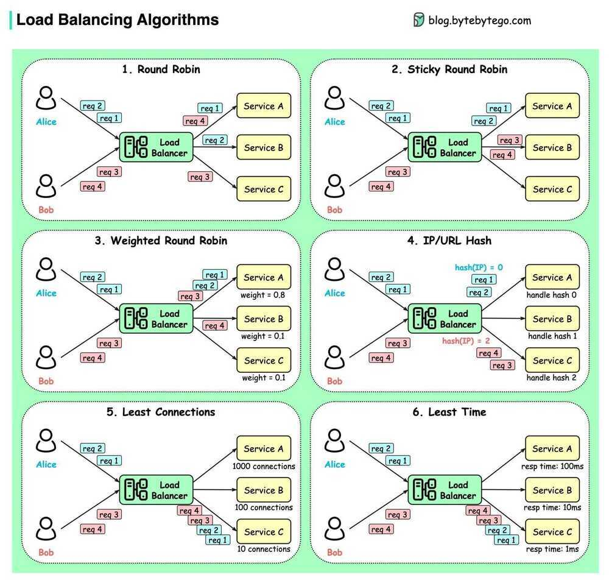

# Load Balancer / Proxy

In computing, load balancing improves the distribution of workloads across multiple computing resources, such as computers, a computer cluster, network links, central processing units, or disk drives. Load balancing aims to optimize resource use, maximize throughput, minimize response time, and avoid overload of any single resource. Using multiple components with load balancing instead of a single component may increase reliability and availability through redundancy. Load balancing usually involves dedicated software or hardware, such as a multilayer switch or a Domain Name System server process.

The above definition applies to all aspects of computing, not just networks. Operating systems use load balancing to schedule tasks across physical processors, container orchestrators such as Kubernetes use load balancing to schedule tasks across a compute cluster, and network load balancers use load balancing to schedule network tasks across available backends.

https://www.loggly.com/blog/benchmarking-5-popular-load-balancers-nginx-haproxy-envoy-traefik-and-alb

Load balancing is a way of distributing traffic between multiple hosts within a single upstream cluster in order to effectively make use of available resources. There are many different ways of accomplishing this, so Envoy provides several different load balancing strategies. At a high level, we can break these strategies into two categories: global load balancing and distributed load balancing.

## Distributed Load Balancing

Distributed load balancing refers to having Envoy itself determine how load should be distributed to the endpoints based on knowing the location of the upstream hosts.

## Examples

- [Active health checking](https://www.envoyproxy.io/docs/envoy/latest/intro/arch_overview/upstream/health_checking#arch-overview-health-checking): by health checking upstream hosts, Envoy can adjust the weights of priorities and localities to account for unavailable hosts.
- [Zone aware routing](https://www.envoyproxy.io/docs/envoy/latest/intro/arch_overview/upstream/load_balancing/zone_aware#arch-overview-load-balancing-zone-aware-routing): this can be used to make Envoy prefer closer endpoints without having to explicitly configure priorities in the control plane.
- [Load balancing algorithms](https://www.envoyproxy.io/docs/envoy/latest/intro/arch_overview/upstream/load_balancing/load_balancers#arch-overview-load-balancing-types): Envoy can use several different algorithms to use the provided weights to determine which host to select.

## Global Load Balancing

Global load balancing refers to having a single, global authority that decides how load should be distributed between hosts. For Envoy, this would be done by the control plane, which is able to adjust the load applied to individual endpoints by specifying various parameters, such as priority, locality weight, endpoint weight and endpoint health.

A simple example would be to have the control plane assign hosts to different [priorities](https://www.envoyproxy.io/docs/envoy/latest/intro/arch_overview/upstream/load_balancing/priority#arch-overview-load-balancing-priority-levels) based on network topology to ensure that hosts that require fewer network hops are preferred. This is similar to zone-aware routing, but is handled by the control plane instead of by Envoy. A benefit of doing it in the control plane is that it gets around some of the [limitations](https://www.envoyproxy.io/docs/envoy/latest/intro/arch_overview/upstream/load_balancing/zone_aware#arch-overview-load-balancing-zone-aware-routing-preconditions) of zone aware routing.

A more complicated setup could have resource usage being reported to the control plane, allowing it to adjust the weight of endpoints or [localities](https://www.envoyproxy.io/docs/envoy/latest/intro/arch_overview/upstream/load_balancing/locality_weight#arch-overview-load-balancing-locality-weighted-lb) to account for the current resource usage, attempting to route new requests to idle hosts over busy ones.

## Both Distributed and Global

Most sophisticated deployments will make use of features from both categories. For instance, global load balancing could be used to define the high level routing priorities and weights, while distributed load balancing could be used to react to changes in the system (e.g. using active health checking). By combining these you can get the best of both worlds: a globally aware authority that can control the flow of traffic on the macro level while still having the individual proxies be able to react to changes on the micro level.

https://www.envoyproxy.io/docs/envoy/latest/intro/arch_overview/upstream/load_balancing/overview

Sit infront of a service and delegate the client request to one of the nodes behind the service. This delegation can be based on

### Round Robin

Requests are distributed across all the instances sequentially

- Sticky Round Robin

### Weighted Round Robin

This algorithm assigns a weight to each instance in the pool, and new connections are forwarded in proportion to the assigned weight

### Least Connections

A request goes to the instance that is processing the least number of connections at the current time

### Weighted Least Request

The least request load balancer uses different algorithms depending on whether hosts have the same or different weights.

#### all weights equal

An O(1) algorithm which selects N random available hosts as specified in the [configuration](https://www.envoyproxy.io/docs/envoy/latest/api-v3/config/cluster/v3/cluster.proto#envoy-v3-api-msg-config-cluster-v3-cluster-leastrequestlbconfig)(2 by default) and picks the host which has the fewest active requests ([Mitzenmacher et al.](https://www.eecs.harvard.edu/~michaelm/postscripts/handbook2001.pdf) has shown that this approach is nearly as good as an O(N) full scan). This is also known as **P2C (power of two choices)**. The P2C load balancer has the property that a host with the highest number of active requests in the cluster will never receive new requests. It will be allowed to drain until it is less than or equal to all of the other hosts.

#### all weights not equal

If two or more hosts in the cluster have different load balancing weights, the load balancer shifts into a mode where it uses a weighted round robin schedule in which weights are dynamically adjusted based on the host's request load at the time of selection (weight is divided by the current active request count. For example, a host with weight 2 and an active request count of 4 will have a synthetic weight of 2 / 4 = 0.5). This algorithm provides good balance at steady state but may not adapt to load imbalance as quickly. Additionally, unlike P2C, a host will never truly drain, though it will receive fewer requests over time.

### IP Hash

This method generates a unique hash key from the source IP address and determines which instance receives the request (good for session management, where each client must be routed to same server)

Maintaining stateful connections

See at the source IP of the request and it builds a hash out of the source ip.

This is called Source Algorithm - Memorize IP address of the user.

But what if the server goes down, then all the hashes must be mapped to a new server. Here consistent hashing is used (for stable remapping)

### Least Response Time

The least response time method directs traffic to the server with the least amount of active connectionsandlowest average response time.

### Least Bandwidth

This application load balancer method measures traffic in megabits (Mbps) per second, sending client requests to the server with the least Mbps of traffic

### Others

- Grpc > Client-side > **Pick-First**
- Ring Hash
- Maglev
- Random
- Original destination

https://www.envoyproxy.io/docs/envoy/latest/intro/arch_overview/upstream/load_balancing/load_balancers

## Points

- Can operate at L4 or L7 layers of the OSI model. At L4 load balancer considers both client and destination ip addresses and port numbers to do the routing. While at L7 which is an HTTP level it uses HTTP URI to do the routing. Most of the load balancers operate at level 7.

- In transport level load balancing, the server terminates the TCP connection and opens another connection to the backend of choice. The application data (HTTP/2 and gRPC frames) are simply copied between the client connection to the backend connection. L3/L4 LB by design does very little processing, adds less latency compared with L7 LB, and is cheaper because it consumes fewer resources.

- In L7 (application level) load balancing, the LB terminates and parses the HTTP/2 protocol. The LB can inspect each request and assign a backend based on the request contents. For example, a session cookie sent as part of HTTP header can be used to associate with a specific backend, so all requests for that session are served by the same backend. Once the LB has chosen an appropriate backend, it creates a new HTTP/2 connection to that backend. It then forwards the HTTP/2 streams received from the client to the backend(s) of choice. With HTTP/2, LB can distribute the streams from one client among multiple backends.

## L3/L4 (Transport) vs L7 (Application)

| **Use case** | **Recommendation** |
|---|---|
| RPC load varies a lot among connections | Use Application level LB |
| Storage or compute affinity is important | Use Application level LB and use cookies or similar for routing requests to correct backend |
| Minimizing resource utilization in proxy is more important than features | Use L3/L4 LB |
| Latency is paramount | Use L3/L4 LB |

## GSLB - Global Server Load Balancing extends L4 and L7 capabilities to servers in different geographic locations

Global server load balancing(GSLB) refers to the intelligent distribution of traffic across server resources located in multiple geographies. The servers can be on premises in a company's own data centers, or hosted in a private cloud or the public cloud.

Disaster recovery is the primary reason that many companies deploy server resources at multiple locations. In the most common configuration, data is served from one active location but duplicated at one or more standby (passive) locations that serve it only if the active site fails. The global server load balancer's role in this case is to detect the failure at the active site and automatically divert requests to the standby sites.

A major reason to choose an active‑passive scheme is that there is no need to synchronize data across sites in real time; changes at the active site can be distributed to the passive sites using a simpler batch method and cheaper out‑of‑band connections. If you maintain multiple active sites serving the same content--and some of the benefits of GSLB in the following list emerge only if you do--then synchronizing the sites in real time becomes important.

https://www.nginx.com/resources/glossary/global-server-load-balancing

DNS load balancing - route data to closest data center possible

Hardware LoadBalancers vs Software LoadBalancers

## Proxy

The initial use case for the proxy is just load balancing: spread the incoming requests across the active set of pods. In addition to making the service IP highly available, this also enables splitting traffic across versions for canary testing and more generally for A/B testing. It is also the mechanism used for a progressive rollout of a new version.

As described thus far, the proxy operates at Layer 4 (L4), working at the level of TCP and IP. This is sufficient for basic services and works well with legacy applications that expect DNS, an IP address, and a port number. Services are at layer 7 (L7) typically use HTTPS requests, which provide more information and thus enable more sophisticated policies. Longer term, we expect L4 to be used for coarse-grained access control (to a cluster or a namespace within a cluster), and L7 to be used to implement the more complex policies required by modern enterprises and dynamic applications. These L7 policies can be managed using modern source control mechanisms that include explicit review and acceptance of source code changes (e.g. GitOps).

The proxy is also a great point for telemetry: it can measure service-level indicators (SLIs) for the service, such as request latency and throughput, without needing to know anything about the service (a hallmark of decoupling). It can also health check pods and remove them from duty, and its telemetry provides one basis for auto-scaling the service.

We discuss two different uses of proxies in the next two sections.

- The first kind manages the traffic among services within an application, which is sometimes called "East-West" traffic based on the typical architecture diagram with users on top (North) and services spread left to right (West to East).

- The second kind is a more traditional user-facing proxy, which manages traffic into the application (North-South) and provides user authentication, access control, various kinds of API management and mediation.

## Transparent Proxy (gateway)

- Doesn't change the content
- Only looks at Layer3/4 (IP and Port only)
- One TCP Connection with packet switching

## HTTP Proxy

- Two TCP connections
- Looks through the content
- Changes the content
- Provides anonymity (optionally)
- Used in service mesh (Linkerd - upgrades protocol)

## Socks Proxy (Socks5 proxy server)

And one of the most different between the **socks proxy** and **HTTP proxy** is, socks proxy can use on lots of different application, HTTP proxy can ONLY be used to handle HTTP request, the socks proxies can be used to FTP, ICQ MSN, Outlook, TheBat, Skype..and so on, And the commonly used ports of the proxy server are，

- Ports of HTTP Proxy: 80/8080
- Ports ofSOCKS proxy: 1080

## DNS Proxy

- The DNS proxy relays DNS requests to the current public network DNS server, then DNS proxy server transfer the replies to the client device.
- Though the DNS proxy use Cache, The DNS proxy is tracking the public DNS requests to monitor the configiration if previous resolution fails.

## Forward Proxy

Forward proxy can be used by the client to [bypass firewall restrictions](https://www.linuxbabe.com/ubuntu/shadowsocks-libev-proxy-server-ubuntu-16-04-17-10) in order to visit websites that are blocked by school, government, company etc. If a website blocked an IP range from visiting the website, then a person in that IP range can use forward proxy to hide the real IP of the client so that person can visit the website and maybe leave some spam comments. However forward proxy might be detected by the website administrator. There are some paid proxy service that has numerous proxy systems around the world so that they can change your IP address every time your visit a new web page and this makes it harder for website administrators to detect.

**The object of the forwarding proxy is the Client, and the object of the reverse proxy server is the server**

## Reverse Proxy

In [computer networks](https://en.wikipedia.org/wiki/Computer_network), areverse proxyis a type of [proxy server](https://en.wikipedia.org/wiki/Proxy_server) that retrieves resources on behalf of a [client](https://en.wikipedia.org/wiki/Client_(computing)) from one or more [servers](https://en.wikipedia.org/wiki/Server_(computing)). These resources are then returned to the client, appearing as if they originated from the proxy server itself.Unlike a [forward proxy](https://en.wikipedia.org/wiki/Forward_proxy), which is an intermediary for its associated clients to contact any server, a reverse proxy is an intermediary for its associated servers to be contacted by any client. In other words, aproxyacts on behalf of the client(s), while areverse proxyacts on behalf of the server(s).

Quite often, popular web servers use reverse-proxying functionality, shielding application frameworks of weaker HTTP capabilities. In this context, "weaker" means limitations in ability to handle excessive load, and limitation in handling the entire variety of request formats that can adhere to HTTP(S) 1.x, HTTP(S) 2.x, or requests which may be hard to detect. A reverse proxy in such cases could transform HTTPS requests into HTTP requests, buffer incoming requests based on the load of the "shielded" server(s), handle cookies/session data, or transform one request into multiple requests and then synthesize the responses, among other possibilities.

## Uses of reverse proxies

- Reverse proxies can hide the existence and characteristics of an [origin server](https://en.wikipedia.org/wiki/Origin_server) or servers.
- [Application firewall](https://en.wikipedia.org/wiki/Application_firewall) features can protect against common web-based attacks, like a [denial-of-service attack (DoS)](https://en.wikipedia.org/wiki/Denial-of-service_attack) or distributed denial-of-service attacks (DDoS). Without a reverse proxy, removing malware or initiating [takedowns](https://en.wikipedia.org/wiki/Notice_and_take_down), for example, can become difficult.
- In the case of [secure websites](https://en.wikipedia.org/wiki/Secure_website), a web server may not perform [TLS](https://en.wikipedia.org/wiki/Transport_Layer_Security)[encryption](https://en.wikipedia.org/wiki/Encryption) itself, but instead offloads the task to a reverse proxy that may be equipped with [TLS acceleration](https://en.wikipedia.org/wiki/TLS_acceleration) hardware. (See [TLS termination proxy](https://en.wikipedia.org/wiki/TLS_termination_proxy).)
- A reverse proxy can [distribute the load](https://en.wikipedia.org/wiki/Load_balancing_(computing)) from incoming requests to several servers, with each server serving its own application area. In the case of reverse proxying in the neighbourhood of [web servers](https://en.wikipedia.org/wiki/Web_server), the reverse proxy may have to rewrite the [URL](https://en.wikipedia.org/wiki/URL) in each incoming request in order to match the relevant internal location of the requested resource.
- A reverse proxy can reduce load on its origin servers by [caching](https://en.wikipedia.org/wiki/Web_cache)[static content](https://en.wikipedia.org/wiki/Static_web_page), as well as [dynamic content](https://en.wikipedia.org/wiki/Dynamic_web_page)- synonym:[web acceleration](https://en.wikipedia.org/wiki/Web_accelerator). Proxy caches of this sort can often satisfy a considerable number of website requests, greatly reducing the load on the origin server(s).
- A reverse proxy can optimize content by [compressing](https://en.wikipedia.org/wiki/HTTP_compression) it in order to speed up loading times.
- In a technique named "spoon-feed"a dynamically generated page can be produced all at once and served to the reverse proxy, which can then return it to the client a little bit at a time. The program that generates the page need not remain open, thus releasing server resources during the possibly extended time the client requires to complete the transfer.
- Reverse proxies can operate wherever multiple web-servers must be accessible via a single public IP address. The web servers listen on different ports in the same machine, with the same local IP address or, possibly, on different machines and different local IP addresses altogether. The reverse proxy analyzes each incoming request and delivers it to the right server within the [local area network](https://en.wikipedia.org/wiki/Local_area_network).
- Reverse proxies can perform [A/B testing](https://en.wikipedia.org/wiki/A/B_testing) and [multivariate testing](https://en.wikipedia.org/wiki/Multivariate_testing_in_marketing) without placing JavaScript tags or code into pages.
- A reverse proxy can add basic HTTP access authentication to a web server that does not have any authentication.

https://en.wikipedia.org/wiki/Reverse_proxy

## Anonymous proxy

Anonymous proxies are a commonly used type of proxy. They never pass your IP address to the website you are browsing although they will identify themselves as a proxy in the request. This helps keep your browsing activity private.

When you don't want targeted ads following you around the internet or you don't want your location attached to your request, these are some standard proxies to use. This is usually enough to get around most targeting activities, but there is still a chance that your information might be revealed.

## High anonymity proxy

These proxies are the most secure type because they don't pass along your IP address and personal data and they don't identify themselves as a proxy when making requests. They also sporadically change the IP address they use for requests. That's what allows high anonymity proxies to give you the most privacy online.

The TOR browser uses this type of proxy. Since the IP address changes occasionally, that makes it extremely hard for servers to keep track of what traffic belongs to what client. If you don't want to be tracked, this is the best option.

## Distorting proxy

A distorting proxy works similarly to an anonymous proxy except it passes an IP that is purposely false. It identifies itself as a proxy and uses that false IP address in requests. This is great when you want to appear as if you were in specific location.

This is useful when you want to get around specific content restrictions. It's like you get to choose the IP address you want the proxy to use.

## Residential proxy

Residential proxies are proxies that use real IP addresses. That means they are the addresses of real computers. These are the best types of proxies to use because they look like regular clients to servers.

Any of the proxy types discussed so far can be a residential proxy. As long as the proxy's IP address is associated with a physical device, these types of proxies tend to be undetectable and they get around some of the geographic problems other proxy types have.

## Data center proxy

These are kind of the opposite of residential proxies. Data center proxies have computer generated IP addresses that aren't attached to a real device. It's like having a proxy in the cloud.

An advantage to this kind of proxy is their speed. Usually cloud service providers have incredible internet connections that give you speeds you couldn't get otherwise. Although they would all share similar IP addresses, one server could host hundreds of data center proxies.

## Public proxy

Of all the proxy types, these are the most insecure, unreliable proxies available. They can go down at any moment and many are set up by hackers to steal data. The only reason people still use them is because they are free.

While it isn't difficult to find lists of free public proxies, it is a challenge to find good ones. You never know who these proxies are hosted by and it's a huge gamble to send any of your sensitive information through one. Any number of users can be on a public proxy at any time and there's no one regulating who uses it.

## Private proxy

Private proxies have some ambiguity around what they are because they're defined by the provider offering the service. This could mean your proxy can only be used by one client at a time or that your proxy needs authentication before you can use it. These are like more reliable versions of public proxies.

A private proxy can be transparent or have high anonymity, similar to some of the others above like the residential or data center proxy. This proxy type has more to do with who can connect to it than how it handles your requests.

## Dedicated proxy

A dedicated proxy is like a specific type of private proxy. It just means that the proxy can't be shared by multiple clients at the same time. So only one client can connect and send requests.

This helps prevent the IP address of the proxy from getting banned by different websites and services. It's one of the ways that a proxy provider can control who has access to the proxy to make sure that it isn't being abused.

## Shared proxy

These are some of the cheapest proxies available and they work similar to shared servers. Clients pool together and split the cost of the proxy and they can all access it at the same time. Shared proxies have a more complex architecture because they handle a lot of requests at the same time.

Depending on how resources are allocated on the shared proxy, requests might be slower than over your own IP address. Because it's handling multiple requests from multiple users, the configurations of these types of proxies is more critical than the others.

## Rotating proxy

Rotating proxies work a little differently from the others. Every time a client connects to the proxy, a new IP address is created for it. So they never use the same IP address more than once.

Every time a client sends a request a new IP address is generated. This is how proxies like the TOR browser work to keep your anonymity. A rotating proxy provides a high level of security and privacy when combined with some of the other types.

## SSL proxy

These proxies follow the same protocol as HTTPS requests. The 'S' in HTTPS means SSL which means your web requests are secure between your client and the server you're trying to get to.

That means you get even more security because all of your requests through the proxy are encrypted. Most proxies should be using this by default, but there is still a chance you'll run into some that use HTTP.

https://www.freecodecamp.org/news/what-is-a-proxy-server-in-english-please

## Reverse Proxy vs Load Balancers

- A [reverse proxy](https://www.nginx.com/resources/glossary/reverse-proxy-server) accepts a request from a client, forwards it to a server that can fulfill it, and returns the server's response to the client.
- A [load balancer](https://www.nginx.com/resources/glossary/load-balancing) distributes incoming client requests among a group of servers, in each case returning the response from the selected server to the appropriate client.

## Features

## Service discovery

Service discovery is the process by which a load balancer determines the set of available backends. The methods are quite varied and some examples include:

- Static configuration file.
- DNS.
- [Zookeeper](https://zookeeper.apache.org/), [Etcd](https://coreos.com/etcd/), [Consul](https://www.consul.io/), etc.
- Envoy's [universal data plane API](https://medium.com/@mattklein123/the-universal-data-plane-api-d15cec7a).

- Client-side discovery pattern
- Server-side discovery pattern
- Service Registry
  - etcd
  - zookeeper
  - consul
- Service registry pattern
  - self-registration pattern
  - third-party registration pattern
- DNS based Service Discovery (DNS-SD)

https://www.nginx.com/blog/service-discovery-in-a-microservices-architecture

https://iximiuz.com/en/posts/service-discovery-in-kubernetes

## Health checking

Health checking is the process by which the load balancer determines if the backend is available to serve traffic. Health checking generally falls into two categories:

### Active: The load balancer sends a ping on a regular interval (e.g., an HTTP request to a/healthcheckendpoint) to the backend and uses this to gauge health

### Passive: The load balancer detects health status from the primary data flow. e.g., an L4 load balancer might decide a backend is unhealthy if there have been three connection errors in a row. An L7 load balancer might decide a backend is unhealthy if there have been three HTTP 503 response codes in a row

## Load balancing

Yes, load balancers have to actually balance load! Given a set of healthy backends, how is the backend selected that will serve a connection or request? Load balancing algorithms are an active area of research and range from simplistic ones such as random selection and round robin, to more complicated algorithms that take into account variable latency and backend load. One of the most popular load balancing algorithms given its performance and simplicity is known as [power of 2 least request load balancing](https://brooker.co.za/blog/2012/01/17/two-random.html).

## Content-based Routing

If your application is composed of several individual services, an Application Load Balancer can route a request to a service based on the content of the request.

## Host-based Routing

You can route a client request based on the Host field of the HTTP header allowing you to route to multiple domains from the same load balancer.

## Path-based Routing

You can route a client request based on the URL path of the HTTP header.

## HTTP header-based routing

You can route a client request based on the value of any standard or custom HTTP header.

## HTTP method-based routing

You can route a client request based on any standard or custom HTTP method.

## Query string parameter-based routing

You can route a client request based on query string or query parameters.

## Source IP address CIDR-based routing

You can route a client request based on source IP address CIDR from where the request originates.

## Sticky sessions

In certain applications, it is important that requests for the samesessionreach the same backend. This might have to do with caching, temporary complex constructed state, etc. The definition of a session varies and might include HTTP cookies, properties of the client connection, or some other attribute. Many L7 load balancers have some support for sticky sessions. As an aside, I will note that session stickiness is inherently fragile (the backend hosting the session can die), so caution is advised when designing a system that relies on them.

## TLS termination

The topic of TLS and its role in both edge serving and securing service-to-service communication is worthy of its own post. With that said, many L7 load balancers do a large amount of TLS processing that includes termination, certificate verification and pinning, certificate serving using [SNI](https://en.wikipedia.org/wiki/Server_Name_Indication), etc.

## Observability

As I like to say in my talks: "Observability, observability, observability." Networks are inherently unreliable and the load balancer is often responsible for exporting stats, traces, and logs that help operators figure out what is wrong so they can remediate the problem. Load balancers vary widely in their observability output. The most advanced load balancers offer copious output that includes numeric stats, distributed tracing, and customizable logging. I will point out that enhanced observability is not free; the load balancer has to do extra work to produce it. However, the benefits of the data greatly outweigh the relatively minor performance implications.

## Security and DoS mitigation

Especially in the edge deployment topology (see below), load balancers often implement various security features including rate limiting, authentication, and DoS mitigation (e.g., IP address tagging and identification, [tarpitting](https://en.wikipedia.org/wiki/Tarpit_%28networking%29), etc.).

## Configuration and controlplane

Load balancers need to be configured. In large deployments, this can become a substantial undertaking. In general, the system that configures the load balancers is known as the "control plane" and varies widely in its implementation.

## Types of LoadBalancer topologies

- Middle proxy

In Proxy load balancing, the client issues RPCs to the a Load Balancer (LB) proxy. The LB distributes the RPC call to one of the available backend servers that implement the actual logic for serving the call. The LB keeps track of load on each backend and implements algorithms for distributing load fairly. The clients themselves do not know about the backend servers. Clients can be untrusted. This architecture is typically used for user facing services where clients from open internet can connect to servers in a data cente

- Edge proxy

- Embedded client library / Client-side load balancing

In Client side load balancing, the client is aware of multiple backend servers and chooses one to use for each RPC. The client gets load reports from backend servers and the client implements the load balancing algorithms. In simpler configurations server load is not considered and client can just round-robin between available servers.

## Client Side LB Options

## Thick client

A thick client approach means the load balancing smarts are implemented in the client. The client is responsible for keeping track of available servers, their workload, and the algorithms used for choosing servers. The client typically integrates libraries that communicate with other infrastructures such as service discovery, name resolution, quota management, etc.

## Tools

### Netflix Ribbon

[Client Side Load Balancing | Microservices Architecture Pattern | Tech Primers](https://www.youtube.com/watch?v=-PbnWGddmcM)

## Lookaside Load Balancing

Note: A lookaside load balancer is also known as an external load balancer or one-arm load balancer

With lookaside load balancing, the load balancing smarts are implemented in a special LB server. Clients query the lookaside LB and the LB responds with best server(s) to use. The heavy lifting of keeping server state and implementation of LB algorithm is consolidated in the lookaside LB. Note that client might choose to implement simple algorithms on top of the sophisticated ones implemented in the LB. gRPC defines a protocol for communication between client and LB using this model. See Load Balancing in gRPC [doc](https://github.com/grpc/grpc/blob/master/doc/load-balancing) for details.

The picture below illustrates this approach. The client gets at least one address from lookaside LB (#1). Then the client uses this address to make a RPC (#2), and server sends load report to the LB (#3). The lookaside LB communicates with other infrastructure such as name resolution, service discovery, and so on (#4).

## Recommendations and best practices

| Setup | Recommendation |
| ----- | -------------- |
| Very high traffic between clients and servers, Clients can be trusted | Thick client-side load balancing, Client side LB with ZooKeeper/Etcd/Consul/Eureka. [ZooKeeper Example](https://github.com/makdharma/grpc-zookeeper-lb) |
| Traditional setup - Many clients connecting to services behind a proxy, Need trust boundary between servers and clients | Proxy Load Balancing, L3/L4 LB with GCLB (if using GCP), L3/L4 LB with haproxy - [Config file](https://gist.github.com/thpham/114d20de8472b2cef966), Nginx coming soon, If need session stickiness - L7 LB with Envoy as proxy |
| Microservices - N clients, M servers in the data center, Very high performance requirements (low latency, high traffic), Client can be untrusted | Look-aside Load Balancing, Client-side LB using gRPC-LB protocol. Roll your own implementation (Q2’17), hosted gRPC-LB in the works. |
| Existing Service-mesh like setup using Linkerd or Istio | Service Mesh, Use built-in LB with [Istio](https://istio.io/), or [Envoy](https://github.com/lyft/envoy). |

https://grpc.io/blog/loadbalancing

- Sidecar proxy

## Direct Server Return (DSR)

DSR is an optimization in which only**ingress/request**packets traverse the load balancer.**Egress/response**packets travel around the load balancer directly back to the client. The primary reason why it's interesting to perform DSR is that in many workloads, response traffic dwarfs request traffic (e.g., typical HTTP request/response patterns).

## Fault tolerance via high availability pairs

## Global load balancing and the centralized control plane

## High Availability Clusters / HA Clusters / Fail-over clusters

https://en.wikipedia.org/wiki/High-availability_cluster

## References

[Devops > Kubernetes > Ingress](../kubernetes/services-loadbalancing-and-networking/ingress)

[How load balancers work - System Design Interview knowledge [Beyond the interview]](https://www.youtube.com/watch?v=escR-07yVAs)

[**https://blog.envoyproxy.io/introduction-to-modern-network-load-balancing-and-proxying-a57f6ff80236**](https://blog.envoyproxy.io/introduction-to-modern-network-load-balancing-and-proxying-a57f6ff80236)

https://dzone.com/articles/load-balancers-and-high-volume-traffic-management-1

https://medium.com/future-vision/what-is-a-load-balancer-fc786f4b04e6

https://www.loggly.com/blog/benchmarking-5-popular-load-balancers-nginx-haproxy-envoy-traefik-and-alb
