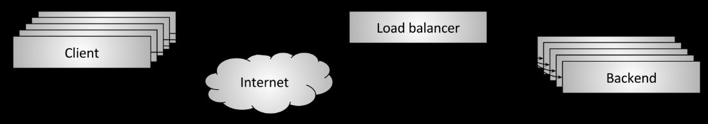
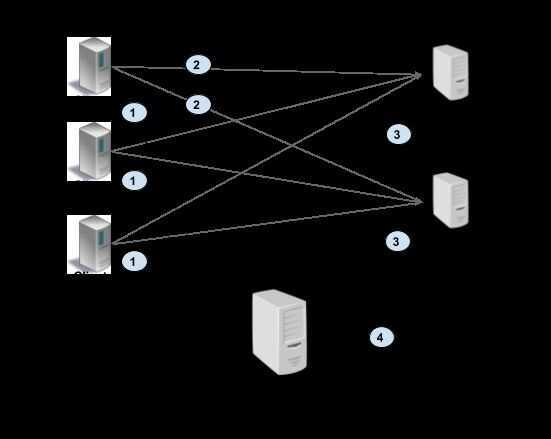
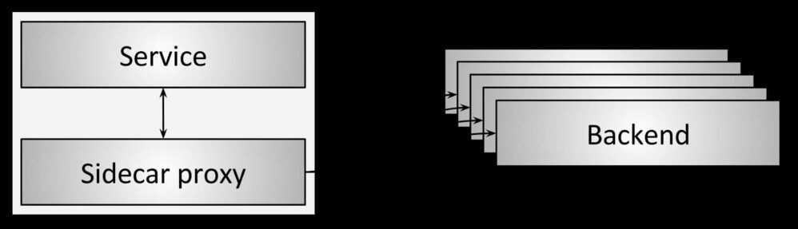
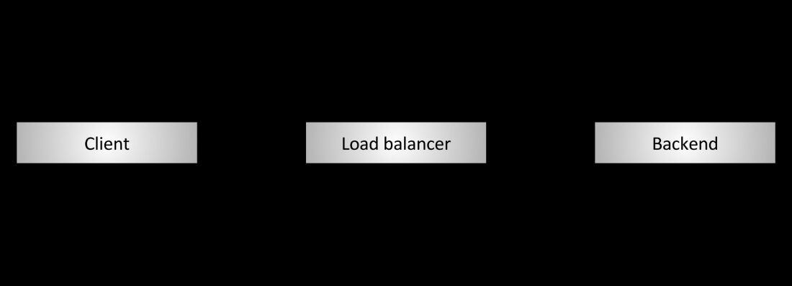
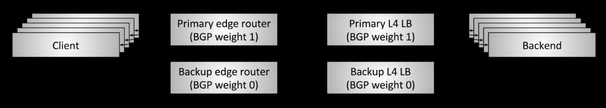
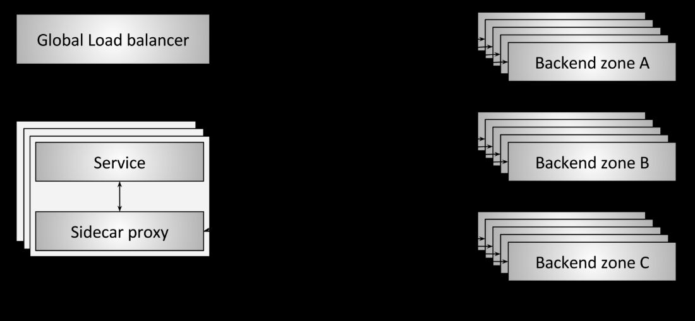

# Load Balancer

In computing, load balancing improves the distribution of workloads across multiple computing resources, such as computers, a computer cluster, network links, central processing units, or disk drives. Load balancing aims to optimize resource use, maximize throughput, minimize response time, and avoid overload of any single resource. Using multiple components with load balancing instead of a single component may increase reliability and availability through redundancy. Load balancing usually involves dedicated software or hardware, such as a multilayer switch or a Domain Name System server process.

The above definition applies to all aspects of computing, not just networks. Operating systems use load balancing to schedule tasks across physical processors, container orchestrators such as Kubernetes use load balancing to schedule tasks across a compute cluster, and network load balancers use load balancing to schedule network tasks across available backends.

https://www.loggly.com/blog/benchmarking-5-popular-load-balancers-nginx-haproxy-envoy-traefik-and-alb

Load balancing is a way of distributing traffic between multiple hosts within a single upstream cluster in order to effectively make use of available resources. There are many different ways of accomplishing this, so Envoy provides several different load balancing strategies. At a high level, we can break these strategies into two categories: global load balancing and distributed load balancing.

## Distributed Load Balancing

Distributed load balancing refers to having Envoy itself determine how load should be distributed to the endpoints based on knowing the location of the upstream hosts.

### Examples

- [Active health checking](https://www.envoyproxy.io/docs/envoy/latest/intro/arch_overview/upstream/health_checking#arch-overview-health-checking): by health checking upstream hosts, Envoy can adjust the weights of priorities and localities to account for unavailable hosts.
- [Zone aware routing](https://www.envoyproxy.io/docs/envoy/latest/intro/arch_overview/upstream/load_balancing/zone_aware#arch-overview-load-balancing-zone-aware-routing): this can be used to make Envoy prefer closer endpoints without having to explicitly configure priorities in the control plane.
- [Load balancing algorithms](https://www.envoyproxy.io/docs/envoy/latest/intro/arch_overview/upstream/load_balancing/load_balancers#arch-overview-load-balancing-types): Envoy can use several different algorithms to use the provided weights to determine which host to select.

## Global Load Balancing

Global load balancing refers to having a single, global authority that decides how load should be distributed between hosts. For Envoy, this would be done by the control plane, which is able to adjust the load applied to individual endpoints by specifying various parameters, such as priority, locality weight, endpoint weight and endpoint health.

A simple example would be to have the control plane assign hosts to different [priorities](https://www.envoyproxy.io/docs/envoy/latest/intro/arch_overview/upstream/load_balancing/priority#arch-overview-load-balancing-priority-levels) based on network topology to ensure that hosts that require fewer network hops are preferred. This is similar to zone-aware routing, but is handled by the control plane instead of by Envoy. A benefit of doing it in the control plane is that it gets around some of the [limitations](https://www.envoyproxy.io/docs/envoy/latest/intro/arch_overview/upstream/load_balancing/zone_aware#arch-overview-load-balancing-zone-aware-routing-preconditions) of zone aware routing.

A more complicated setup could have resource usage being reported to the control plane, allowing it to adjust the weight of endpoints or [localities](https://www.envoyproxy.io/docs/envoy/latest/intro/arch_overview/upstream/load_balancing/locality_weight#arch-overview-load-balancing-locality-weighted-lb) to account for the current resource usage, attempting to route new requests to idle hosts over busy ones.

## Both Distributed and Global

Most sophisticated deployments will make use of features from both categories. For instance, global load balancing could be used to define the high level routing priorities and weights, while distributed load balancing could be used to react to changes in the system (e.g. using active health checking). By combining these you can get the best of both worlds: a globally aware authority that can control the flow of traffic on the macro level while still having the individual proxies be able to react to changes on the micro level.

https://www.envoyproxy.io/docs/envoy/latest/intro/arch_overview/upstream/load_balancing/overview

## Points

- Can operate at L4 or L7 layers of the OSI model. At L4 load balancer considers both client and destination ip addresses and port numbers to do the routing. While at L7 which is an HTTP level it uses HTTP URI to do the routing. Most of the load balancers operate at level 7.

- In transport level load balancing, the server terminates the TCP connection and opens another connection to the backend of choice. The application data (HTTP/2 and gRPC frames) are simply copied between the client connection to the backend connection. L3/L4 LB by design does very little processing, adds less latency compared with L7 LB, and is cheaper because it consumes fewer resources.

- In L7 (application level) load balancing, the LB terminates and parses the HTTP/2 protocol. The LB can inspect each request and assign a backend based on the request contents. For example, a session cookie sent as part of HTTP header can be used to associate with a specific backend, so all requests for that session are served by the same backend. Once the LB has chosen an appropriate backend, it creates a new HTTP/2 connection to that backend. It then forwards the HTTP/2 streams received from the client to the backend(s) of choice. With HTTP/2, LB can distribute the streams from one client among multiple backends.

## L3/L4 (Transport) vs L7 (Application)

| **Use case** | **Recommendation** |
|---|---|
| RPC load varies a lot among connections | Use Application level LB |
| Storage or compute affinity is important | Use Application level LB and use cookies or similar for routing requests to correct backend |
| Minimizing resource utilization in proxy is more important than features | Use L3/L4 LB |
| Latency is paramount | Use L3/L4 LB |

## GSLB - Global Server Load Balancing

GSLB extends L4 and L7 capabilities to servers in different geographic locations

Global server load balancing(GSLB) refers to the intelligent distribution of traffic across server resources located in multiple geographies. The servers can be on premises in a company's own data centers, or hosted in a private cloud or the public cloud.

Disaster recovery is the primary reason that many companies deploy server resources at multiple locations. In the most common configuration, data is served from one active location but duplicated at one or more standby (passive) locations that serve it only if the active site fails. The global server load balancer's role in this case is to detect the failure at the active site and automatically divert requests to the standby sites.

A major reason to choose an active‑passive scheme is that there is no need to synchronize data across sites in real time; changes at the active site can be distributed to the passive sites using a simpler batch method and cheaper out‑of‑band connections. If you maintain multiple active sites serving the same content--and some of the benefits of GSLB in the following list emerge only if you do--then synchronizing the sites in real time becomes important.

https://www.nginx.com/resources/glossary/global-server-load-balancing

DNS load balancing - route data to closest data center possible

Hardware LoadBalancers vs Software LoadBalancers

## Load balancing

Yes, load balancers have to actually balance load! Given a set of healthy backends, how is the backend selected that will serve a connection or request? Load balancing algorithms are an active area of research and range from simplistic ones such as random selection and round robin, to more complicated algorithms that take into account variable latency and backend load. One of the most popular load balancing algorithms given its performance and simplicity is known as [power of 2 least request load balancing](https://brooker.co.za/blog/2012/01/17/two-random.html).

### Content-based Routing

If your application is composed of several individual services, an Application Load Balancer can route a request to a service based on the content of the request.

### Host-based Routing

You can route a client request based on the Host field of the HTTP header allowing you to route to multiple domains from the same load balancer.

### Path-based Routing

You can route a client request based on the URL path of the HTTP header.

### HTTP header-based routing

You can route a client request based on the value of any standard or custom HTTP header.

### HTTP method-based routing

You can route a client request based on any standard or custom HTTP method.

### Query string parameter-based routing

You can route a client request based on query string or query parameters.

### Source IP address CIDR-based routing

You can route a client request based on source IP address CIDR from where the request originates.

### Sticky sessions

In certain applications, it is important that requests for the samesessionreach the same backend. This might have to do with caching, temporary complex constructed state, etc. The definition of a session varies and might include HTTP cookies, properties of the client connection, or some other attribute. Many L7 load balancers have some support for sticky sessions. As an aside, I will note that session stickiness is inherently fragile (the backend hosting the session can die), so caution is advised when designing a system that relies on them.

## TLS termination

The topic of TLS and its role in both edge serving and securing service-to-service communication is worthy of its own post. With that said, many L7 load balancers do a large amount of TLS processing that includes termination, certificate verification and pinning, certificate serving using [SNI](https://en.wikipedia.org/wiki/Server_Name_Indication), etc.

## Observability

As I like to say in my talks: "Observability, observability, observability." Networks are inherently unreliable and the load balancer is often responsible for exporting stats, traces, and logs that help operators figure out what is wrong so they can remediate the problem. Load balancers vary widely in their observability output. The most advanced load balancers offer copious output that includes numeric stats, distributed tracing, and customizable logging. I will point out that enhanced observability is not free; the load balancer has to do extra work to produce it. However, the benefits of the data greatly outweigh the relatively minor performance implications.

## Security and DoS mitigation

Especially in the edge deployment topology (see below), load balancers often implement various security features including rate limiting, authentication, and DoS mitigation (e.g., IP address tagging and identification, [tarpitting](https://en.wikipedia.org/wiki/Tarpit_%28networking%29), etc.).

## Configuration and controlplane

Load balancers need to be configured. In large deployments, this can become a substantial undertaking. In general, the system that configures the load balancers is known as the "control plane" and varies widely in its implementation.

## Types of LoadBalancer topologies

### Middle proxy

In Proxy load balancing, the client issues RPCs to the a Load Balancer (LB) proxy. The LB distributes the RPC call to one of the available backend servers that implement the actual logic for serving the call. The LB keeps track of load on each backend and implements algorithms for distributing load fairly. The clients themselves do not know about the backend servers. Clients can be untrusted. This architecture is typically used for user facing services where clients from open internet can connect to servers in a data cente

### Edge proxy

### Embedded client library / Client-side load balancing

In Client side load balancing, the client is aware of multiple backend servers and chooses one to use for each RPC. The client gets load reports from backend servers and the client implements the load balancing algorithms. In simpler configurations server load is not considered and client can just round-robin between available servers.

## Client Side LB Options

### Thick client

A thick client approach means the load balancing smarts are implemented in the client. The client is responsible for keeping track of available servers, their workload, and the algorithms used for choosing servers. The client typically integrates libraries that communicate with other infrastructures such as service discovery, name resolution, quota management, etc.

### Lookaside Load Balancing

Note: A lookaside load balancer is also known as an external load balancer or one-arm load balancer

With lookaside load balancing, the load balancing smarts are implemented in a special LB server. Clients query the lookaside LB and the LB responds with best server(s) to use. The heavy lifting of keeping server state and implementation of LB algorithm is consolidated in the lookaside LB. Note that client might choose to implement simple algorithms on top of the sophisticated ones implemented in the LB. gRPC defines a protocol for communication between client and LB using this model. See Load Balancing in gRPC [doc](https://github.com/grpc/grpc/blob/master/doc/load-balancing) for details.

The picture below illustrates this approach. The client gets at least one address from lookaside LB (#1). Then the client uses this address to make a RPC (#2), and server sends load report to the LB (#3). The lookaside LB communicates with other infrastructure such as name resolution, service discovery, and so on (#4).

## Recommendations and best practices

| Setup | Recommendation |
| ----- | -------------- |
| Very high traffic between clients and servers, Clients can be trusted | Thick client-side load balancing, Client side LB with ZooKeeper/Etcd/Consul/Eureka. [ZooKeeper Example](https://github.com/makdharma/grpc-zookeeper-lb) |
| Traditional setup - Many clients connecting to services behind a proxy, Need trust boundary between servers and clients | Proxy Load Balancing, L3/L4 LB with GCLB (if using GCP), L3/L4 LB with haproxy - [Config file](https://gist.github.com/thpham/114d20de8472b2cef966), Nginx coming soon, If need session stickiness - L7 LB with Envoy as proxy |
| Microservices - N clients, M servers in the data center, Very high performance requirements (low latency, high traffic), Client can be untrusted | Look-aside Load Balancing, Client-side LB using gRPC-LB protocol. Roll your own implementation (Q2’17), hosted gRPC-LB in the works. |
| Existing Service-mesh like setup using Linkerd or Istio | Service Mesh, Use built-in LB with [Istio](https://istio.io/), or [Envoy](https://github.com/lyft/envoy). |

https://grpc.io/blog/loadbalancing

- Sidecar proxy

## Direct Server Return (DSR)

DSR is an optimization in which only**ingress/request**packets traverse the load balancer.**Egress/response**packets travel around the load balancer directly back to the client. The primary reason why it's interesting to perform DSR is that in many workloads, response traffic dwarfs request traffic (e.g., typical HTTP request/response patterns).

## Fault tolerance via high availability pairs

## Global load balancing and the centralized control plane

## High Availability Clusters / HA Clusters / Fail-over clusters

https://en.wikipedia.org/wiki/High-availability_cluster

## References

[Proxy](devops/devops-intro/proxy.md)

[Devops > Kubernetes > Ingress](../kubernetes/services-loadbalancing-and-networking/ingress)

[How load balancers work - System Design Interview knowledge [Beyond the interview]](https://www.youtube.com/watch?v=escR-07yVAs)

[**https://blog.envoyproxy.io/introduction-to-modern-network-load-balancing-and-proxying-a57f6ff80236**](https://blog.envoyproxy.io/introduction-to-modern-network-load-balancing-and-proxying-a57f6ff80236)

https://dzone.com/articles/load-balancers-and-high-volume-traffic-management-1

https://medium.com/future-vision/what-is-a-load-balancer-fc786f4b04e6

https://www.loggly.com/blog/benchmarking-5-popular-load-balancers-nginx-haproxy-envoy-traefik-and-alb
