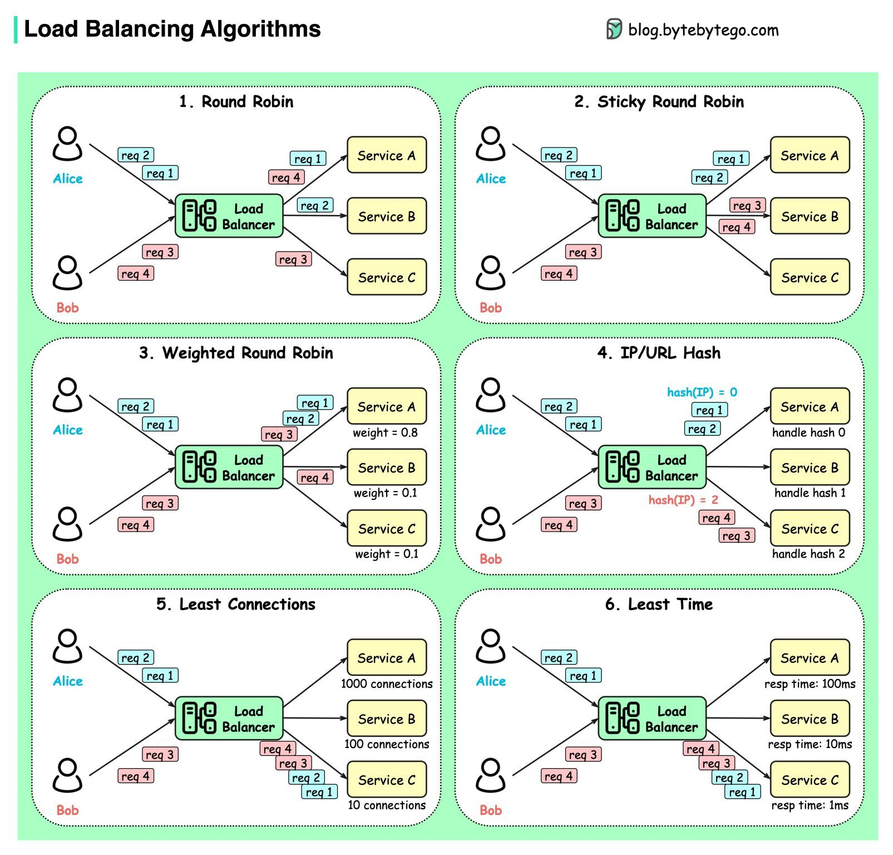

# Load Balancing Algorithms

### Round Robin

Requests are distributed across all the instances sequentially

- Sticky Round Robin

### Weighted Round Robin

This algorithm assigns a weight to each instance in the pool, and new connections are forwarded in proportion to the assigned weight

### Least Connections

A request goes to the instance that is processing the least number of connections at the current time

### Weighted Least Request

The least request load balancer uses different algorithms depending on whether hosts have the same or different weights.

#### all weights equal

An O(1) algorithm which selects N random available hosts as specified in the [configuration](https://www.envoyproxy.io/docs/envoy/latest/api-v3/config/cluster/v3/cluster.proto#envoy-v3-api-msg-config-cluster-v3-cluster-leastrequestlbconfig)(2 by default) and picks the host which has the fewest active requests ([Mitzenmacher et al.](https://www.eecs.harvard.edu/~michaelm/postscripts/handbook2001.pdf) has shown that this approach is nearly as good as an O(N) full scan). This is also known as **P2C (power of two choices)**. The P2C load balancer has the property that a host with the highest number of active requests in the cluster will never receive new requests. It will be allowed to drain until it is less than or equal to all of the other hosts.

#### all weights not equal

If two or more hosts in the cluster have different load balancing weights, the load balancer shifts into a mode where it uses a weighted round robin schedule in which weights are dynamically adjusted based on the host's request load at the time of selection (weight is divided by the current active request count. For example, a host with weight 2 and an active request count of 4 will have a synthetic weight of 2 / 4 = 0.5). This algorithm provides good balance at steady state but may not adapt to load imbalance as quickly. Additionally, unlike P2C, a host will never truly drain, though it will receive fewer requests over time.

### IP Hash

This method generates a unique hash key from the source IP address and determines which instance receives the request (good for session management, where each client must be routed to same server)

Maintaining stateful connections

See at the source IP of the request and it builds a hash out of the source ip.

This is called Source Algorithm - Memorize IP address of the user.

But what if the server goes down, then all the hashes must be mapped to a new server. Here consistent hashing is used (for stable remapping)

### Least Response Time

The least response time method directs traffic to the server with the least amount of active connections and lowest average response time.

### Least Bandwidth

This application load balancer method measures traffic in megabits (Mbps) per second, sending client requests to the server with the least Mbps of traffic

### Others

- Grpc > Client-side > **Pick-First**
- Ring Hash
- Maglev
- Random
- Original destination

https://www.envoyproxy.io/docs/envoy/latest/intro/arch_overview/upstream/load_balancing/load_balancers

