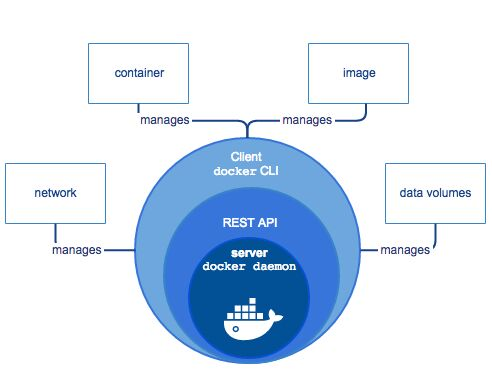
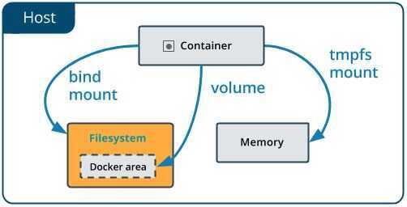

# Intro

Docker is a tool for deploying isolated, or containerized, applications. Docker containers are similar to virtual machines in a sense, but much more lightweight both in size and resource consumption.

"With Docker, developers can build any app in any language using any toolchain. "Dockerized" apps are completely portable and can run anywhere' OS X and Windows laptops, QA servers running Ubuntu in the cloud, and production data center VMs running Red Hat.

## Core components

1. Docker Engine (docker daemon)
2. REST API
3. Client (docker CLI)



## Optimizations

1. Fat image
2. Alpine (base image)
3. Layer caching
4. Cached dependencies
5. Multistage builds

## Difference between docker and docker-compose

The docker cli is used when managing individual containers on a docker engine. It is the client command line to access the docker daemon api.

The docker-compose cli can be used to manage a multi-container application. It also moves many of the options you would enter on the docker run cli into the docker-compose.yml file for easier reuse. It works as a front end "script" on top of the same docker api used by docker, so you can do everything docker-compose does with docker commands and a lot of shell scripting.

## Bind Mounts

When you use a bind mount, a file or directory on thehost machineis mounted into a container. The file or directory is referenced by its full or relative path on the host machine. By contrast, when you use a volume, a new directory is created within Docker's storage directory on the host machine, and Docker manages that directory's contents.

The file or directory does not need to exist on the Docker host already. It is created on demand if it does not yet exist. Bind mounts are very performant, but they rely on the host machine's filesystem having a specific directory structure available. If you are developing new Docker applications, consider using [named volumes](https://docs.docker.com/storage/volumes/) instead.

## Volumes

Volumes are the preferred mechanism for persisting data generated by and used by Docker containers. While [bind mounts](https://docs.docker.com/storage/bind-mounts/) are dependent on the directory structure of the host machine, volumes are completely managed by Docker. Volumes have several advantages over bind mounts:

- Volumes are easier to back up or migrate than bind mounts.
- You can manage volumes using Docker CLI commands or the Docker API.
- Volumes work on both Linux and Windows containers.
- Volumes can be more safely shared among multiple containers.
- Volume drivers let you store volumes on remote hosts or cloud providers, to encrypt the contents of volumes, or to add other functionality.
- New volumes can have their content pre-populated by a container.

In addition, volumes are often a better choice than persisting data in a container's writable layer, because a volume does not increase the size of the containers using it, and the volume's contents exist outside the lifecycle of a given container.



## Docker Containers vs Images

An instance of an image is called a container. You have an image, which is a set of layers as you describe. If you start this image, you have a running container of this image. You can have many running containers of the same image.

## Images

1. Full official image

    ```bash
    python:3.8.3
    node:14.1.1
    ```

2. stretch/buster/jessie - debian releases
3. -slim - paired down version of the full image
4. -alpine - Alpine images are based on the Alpine Linux Project, which is an operating system that was built specifically for use inside of containers.
5. -windowsservercore

https://medium.com/swlh/alpine-slim-stretch-buster-jessie-bullseye-bookworm-what-are-the-differences-in-docker-62171ed4531d

## Docker-compose

Compose is a tool for defining and running multi-container Docker applications.

Adocker-compose.ymlfile is a YAML file that defines how Docker containers should behave in production.

## Docker Security

- Package everything that an application needs, all the dependencies, all the code, all the resources, within an image, that can run on any platform.
- Running docker in read only mode, i.e. removing write access to the filesystems from containers
    - Logs can be written to some other endpoint to a append only file, so adversary cannot change the history

https://www.toptal.com/docker/interview-questions

https://codefresh.io/containers/docker-anti-patterns

[Docker Image Pipelines and Patterns](https://www.youtube.com/watch?v=ODXSPVZA4c8)

## Upgrades

[Docker just got an upgrade - YouTube](https://www.youtube.com/watch?v=ilkZ27TwYVg&ab_channel=Coderized)

- Docker init
- Docker debug
- Docker compose watch
- Docker build cloud
- Docker scout
