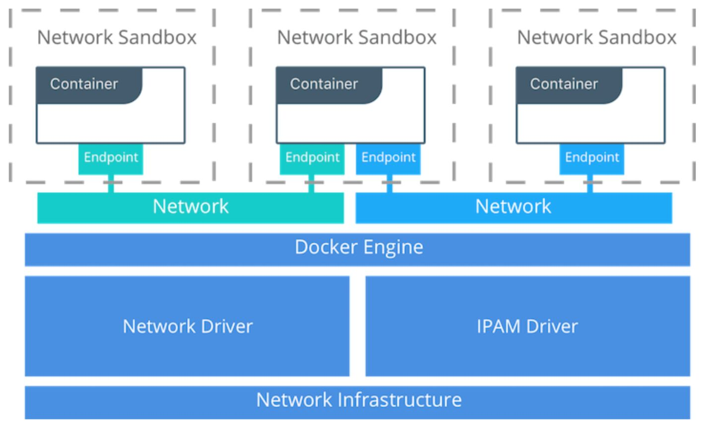

# Networking

## Container Networking Model CNM

The Docker networking architecture is built on a set of interfaces called theContainer Networking Model(CNM). The philosophy of CNM is to provide application portability across diverse infrastructures. This model strikes a balance to achieve application portability and also takes advantage of special features and capabilities of the infrastructure.

## Docker Native Network Drivers

| **Driver** | **Description**                                                                                                                                                                                                                                                                                                                                           |
|-----------|-------------------------------------------------------------|
| Host       | With thehostdriver, a container uses the networking stack of the host. There is no namespace separation, and all interfaces on the host can be used directly by the container                                                                                                                                                                           |
| Bridge     | Thebridgedriver creates a Linux bridge on the host that is managed by Docker. By default containers on a bridge can communicate with each other. External access to containers can also be configured through thebridgedriver                                                                                                                         |
| Overlay    | Theoverlaydriver creates an overlay network that supports multi-host networks out of the box. It uses a combination of local Linux bridges and VXLAN to overlay container-to-container communications over physical network infrastructure                                                                                                              |
| MACVLAN    | Themacvlandriver uses the MACVLAN bridge mode to establish a connection between container interfaces and a parent host interface (or sub-interfaces). It can be used to provide IP addresses to containers that are routable on the physical network. Additionally VLANs can be trunked to themacvlandriver to enforce Layer 2 container segmentation |
| None       | Thenonedriver gives a container its own networking stack and network namespace but does not configure interfaces inside the container. Without additional configuration, the container is completely isolated from the host networking stack                                                                                                            |

## Network Scope

1. Local scope

    Local scope drivers provide connectivity and network services (such as DNS or IPAM) within the scope of the host. Local scope networks have a unique network ID on each host.

2. Swarm scope

    Swarm scope drivers provide connectivity and network services across a swarm cluster. Swarm scope networks have the same network ID across the entire cluster.

## 341: Container Networking

#### *Kim Carter with Michael Hausenblas*

- single vs. multi-host container networking, orchestration, Kubernetes, service discovery
- roles that IPTables plays, how the allocation of IP addresses is handled, along with the assignment of ports.
- Overlay networks, open Container Network Interface (CNI).

## Docker Networking

- **User-defined bridge networks**are best when you need multiple containers to communicate on the same Docker host.
- **Host networks** are best when the network stack should not be isolated from the Docker host, but you want other aspects of the container to be isolated.
- **Overlay networks** are best when you need containers running on different Docker hosts to communicate, or when multiple applications work together using swarm services.
- **Macvlan networks** are best when you are migrating from a VM setup or need your containers to look like physical hosts on your network, each with a unique MAC address.
- **Third-party network** pluginsallow you to integrate Docker with specialized network stacks.

## Host Networking

If you use thehostnetwork mode for a container, that container's network stack is not isolated from the Docker host (the container shares the host's networking namespace), and the container does not get its own IP-address allocated. For instance, if you run a container which binds to port 80 and you usehostnetworking, the container's application is available on port 80 on the host's IP address.

Host mode networking can be useful to optimize performance, and in situations where a container needs to handle a large range of ports, as it does not require network address translation (NAT), and no "userland-proxy" is created for each port.

https://docs.docker.com/network/host

The goal of this tutorial is to start anginxcontainer which binds directly to port 80 on the Docker host. From a networking point of view, this is the same level of isolation as if thenginxprocess were running directly on the Docker host and not in a container. However, in all other ways, such as storage, process namespace, and user namespace, thenginxprocess is isolated from the host.

https://docs.docker.com/network/network-tutorial-host

## Bridge Networks

In terms of networking, a bridge network is a Link Layer device which forwards traffic between network segments. A bridge can be a hardware device or a software device running within a host machine's kernel.

In terms of Docker, a bridge network uses a software bridge which allows containers connected to the same bridge network to communicate, while providing isolation from containers which are not connected to that bridge network. The Docker bridge driver automatically installs rules in the host machine so that containers on different bridge networks cannot communicate directly with each other.

Bridge networks apply to containers running on thesameDocker daemon host. For communication among containers running on different Docker daemon hosts, you can either manage routing at the OS level, or you can use an [overlay network](https://docs.docker.com/network/overlay/).

When you start Docker, a [default bridge network](https://docs.docker.com/network/bridge/#use-the-default-bridge-network)(also calledbridge) is created automatically, and newly-started containers connect to it unless otherwise specified. You can also create user-defined custom bridge networks.**User-defined bridge networks are superior to the defaultbridgenetwork.**

https://docs.docker.com/network/bridge

## References

https://success.docker.com/article/networking

https://success.docker.com/article/ucp-service-discovery

https://docs.docker.com/network

https://docs.docker.com/network/network-tutorial-standalone
