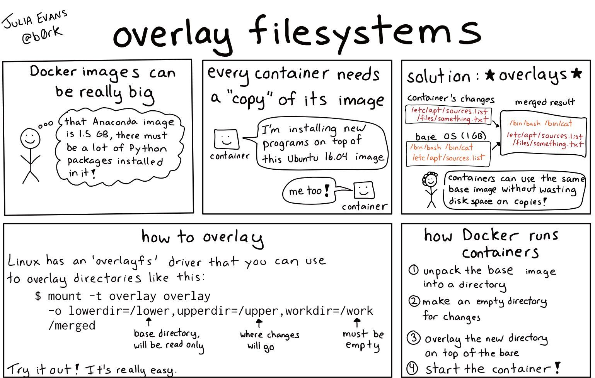

# Others

## Dive

An amazing tool for inspecting Docker images.

A tool for exploring a docker image, layer contents, and discovering ways to shrink your Docker image size.

https://github.com/wagoodman/dive

## Logging / aws logs / driver

```json
// /etc/docker/daemon.json
{
    "log-driver": "json-file",
    "log-opts": {
    "mode": "non-blocking",
    "max-buffer-size": "1m",
    "max-size": "10m",
    "max-file": "3",
    "compress": "true"
    }
}

// sudo vim /etc/docker/daemon.json
{
    "log-driver": "awslogs",
    "log-opts": {
    "awslogs-region": "us-west-2",
    "awslogs-group": "prodec2"
    }
}

// sudo service docker restart
```

Add push-cloudwatch-logs IAM policy in ec2 instances

```json
{
    "Version": "2012-10-17",
    "Statement": [
        {
            "Action": [
                "logs:CreateLogStream",
                "logs:PutLogEvents"
            ],
            "Effect": "Allow",
            "Resource": "*"
        }
    ]
}
```

```bash
docker run --log-driver=awslogs --log-opt awslogs-region=us-west-2 --log-opt awslogs-group=prodec2 hello-world

# Add this logging configuration to docker-compose for all services
logging:
    options:
        tag: "{{.Name}} {{.ImageName}}"
```

https://docs.docker.com/config/containers/logging/awslogs

## GELF

Structured events from anywhere. Compressed and chunked.

The Graylog Extended Log Format (GELF) is a log format that avoids the shortcomings of classic plain syslog:

- Limited to length of 1024 bytes -- Not much space for payloads like backtraces
- No data types in structured syslog. You don't know what is a number and what is a string.
- The RFCs are strict enough but there are so many syslog dialects out there that you cannot possibly parse all of them.
- No compression

http://docs.graylog.org/en/3.0/pages/gelf.html

https://docs.docker.com/config/containers/logging/gelf

## Security

https://www.stackrox.com/post/2019/09/docker-security-101

## overlayfs

Overlay filesystems, also known as "union filesystems" or "union mounts" let you mount a filesystem using 2 directories: a "lower" directory, and an "upper" directory.

Basically:

- the lower directory of the filesystem is read-only
- the upper directory of the filesystem can be both read to and written from

When a process reads a file, the overlayfs filesystem driver looks in the upper directory and reads the file from there if it's present. Otherwise, it looks in the lower directory.

When a process writes a file, overlayfs will just write it to the upper directory.



https://jvns.ca/blog/2019/11/18/how-containers-work--overlayfs

## Swap / Memory / Resources

`docker info`

WARNING: No swap limit support

This warning does not occur on RPM-based systems, which enable these capabilities by default.

If you don't need these capabilities, you can ignore the warning. You can enable these capabilities on Ubuntu or Debian by following these instructions. Memory and swap accounting incur an overhead of about 1% of the total available memory and a 10% overall performance degradation, even if Docker is not running.

https://docs.docker.com/engine/install/linux-postinstall/#your-kernel-does-not-support-cgroup-swap-limit-capabilities

https://docs.docker.com/config/containers/resource_constraints
