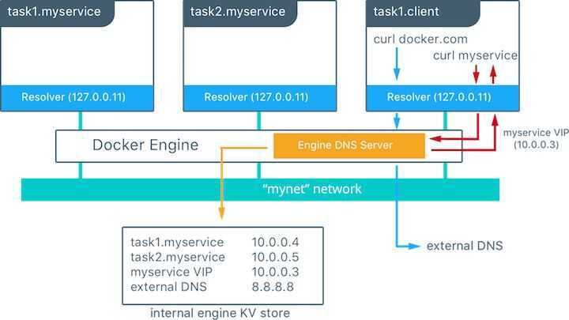

# Stack / Swarm

Defines the interactions of all the services.

## Swarm

A single container running in a service is called atask. Tasks are given unique IDs that numerically increment, up to the number ofreplicasyou defined indocker-compose.yml.

You can directly change the number of replicas in docker-compose.yml and re-run the application using stack deploy. Docker performs in-place update, no need to tear the stack down first or kill any containers.

In swarm mode, Docker uses DNS for service discovery as services are created, and different routing meshes are built into Docker to ensure your applications remain highly available.

## Features

- Cluster management integrated with Docker Engine
- Decentralized design
- Declarative service model
- Scaling
- Desired state reconciliation
- Multi-host networking
- Service discovery
- Load balancing
- Secure by default
- Rolling updates

## Commands

```bash
docker swarm init
docker stack deploy -c docker-compose.yml <app_name>
    docker stack deploy -c docker-compose.yml kafkaconsumer
docker service ls
docker service ps getstartedlab_web   #List the tasks for your service
docker service rm kafkaconsumer_kafka-consumer  #Take the app down
docker swarm leave --force  #Take down the swarm (remove docker engine from swarm mode)

Advanced overlay commands
docker network create --driver overlay my-overlay-network  #create an overlay network
docker network ls  #get all created networks
docker network inspect <network-name>  #inspect a network
docker network create --help  #show all configuration option
docker network create --driver overlay --subnet 10.0.9.0/24 --gateway 10.0.9.99 my-network
docker service create --replicas 3 --name my-web --network my-network nginx  #attach a service to overlay network

# scale a container to desired replicas
docker service scale SERVICE=REPLICAS
ex - docker service scale kafkaconsumer_kafka-consumer=3

Ingress commands
docker network inspect ingress
docker network rm ingress
docker network create \
--driver overlay \
--ingress \
--subnet=10.11.0.0/16 \
--gateway=10.11.0.2 \
--opt com.docker.network.mtu=1200 \
my-ingress

docker_gwbridge commands #brctl = bridge-utils
brctl docker show docker_gwbridge #after stopping docker
brctl status
brctl delbr docker_gwbridge # remove docker_gwbridge

docker service update <service_name>  #update services
docker service update --force kafkaconsumer  #force pull an image

# restart a service without any parameter updates
docker service update --force --update-parallelism 1 --update-delay 30s <service_name>
```

## Logs

`docker service logs -f --raw --timestamps kafkaconsumer_kafka-consumer`

## Kubernetes vs Docker Swarm

| **Kubernetes** | **Docker Swarm** |
|---|---|
| Developed by Google | Developed by Docker Swarm |
| Has a vast Open source community | Has a smaller community compared to Kubernetes |
| More extensive and customizable | Less extensive and less customizable |
| Requires heavy setup | Easy to set up and fits well into Docker ecosystem |
| Has high fault tolerance | Has low fault tolerance |
| Provides strong guarantees to cluster states, at the expense of speed | Facilitates for quick container deployment and scaling even in very large clusters |
| Enables load balancing when container pods are defined as services. | Features automated internal load balancing through any node in the cluster. |

## Networking

A Docker swarm generates two different kinds of traffic:

- **Control and management plane traffic:** This includes swarm management messages, such as requests to join or leave the swarm. This traffic is always encrypted.
- **Application data plane traffic:** This includes container traffic and traffic to and from external clients.

The following three network concepts are important to swarm services:

- **Overlay networks** manage communications among the Docker daemons participating in the swarm. You can create overlay networks, in the same way as user-defined networks for standalone containers. You can attach a service to one or more existing overlay networks as well, to enable service-to-service communication. Overlay networks are Docker networks that use theoverlaynetwork driver.
- The**ingress network** is a special overlay network that facilitates load balancing among a service's nodes. When any swarm node receives a request on a published port, it hands that request off to a module calledIPVS.IPVSkeeps track of all the IP addresses participating in that service, selects one of them, and routes the request to it, over theingressnetwork.
    Theingressnetwork is created automatically when you initialize or join a swarm. Most users do not need to customize its configuration, but Docker 17.05 and higher allows you to do so.
    - Only one ingress network is allowed
- The **docker_gwbridge** is a bridge network that connects the overlay networks (including theingressnetwork) to an individual Docker daemon's physical network. By default, each container a service is running is connected to its local Docker daemon host'sdocker_gwbridgenetwork.
    Thedocker_gwbridgenetwork is created automatically when you initialize or join a swarm. Most users do not need to customize its configuration, but Docker allows you to do so.

## Firewall

Docker daemons participating in a swarm need the ability to communicate with each other over the following ports:

- Port7946TCP/UDP for container network discovery.
- Port4789UDP for the container overlay network.

## Service Disovery in Docker

Service discovery is the mechanism Docker uses to route a request from your service's external clients to an individual swarm node, without the client needing to know how many nodes are participating in the service or their IP addresses or ports. You don't need to publish ports which are used between services on the same network

Service discovery can work in two different ways: internal connection-based load-balancing at Layers 3 and 4 using the embedded DNS and a virtual IP (VIP), or external and customized request-based load-balancing at Layer 7 using DNS round robin (DNSRR). You can configure this per service.

- By default, when you attach a service to a network and that service publishes one or more ports, Docker assigns the service a virtual IP (VIP), which is the "front end" for clients to reach the service. Docker keeps a list of all worker nodes in the service, and routes requests between the client and one of the nodes. Each request from the client might be routed to a different node.

- If you configure a service to use DNS round-robin (DNSRR) service discovery, there is not a single virtual IP. Instead, Docker sets up DNS entries for the service such that a DNS query for the service name returns a list of IP addresses, and the client connects directly to one of these. DNS round-robin is useful in cases where you want to use your own load balancer, such as HAProxy. To configure a service to use DNSRR, use the flag--endpoint-mode dnsrrwhen creating a new service or updating an existing one.

Docker uses embedded DNS to provide service discovery for containers running on a single Docker engine andtasksrunning in a Docker swarm. Docker engine has an internal DNS server that provides name resolution to all of the containers on the host in user-defined bridge, overlay, and MACVLAN networks. Each Docker container ( ortaskin swarm mode) has a DNS resolver that forwards DNS queries to the Docker engine, which acts as a DNS server. The Docker engine then checks if the DNS query belongs to a container orserviceon each network that the requesting container belongs to. If it does, then the Docker engine looks up the IP address that matches the name of a container, task, orservicein its key-value store and returns that IP orserviceVirtual IP (VIP) back to the requester.

Service discovery isnetwork-scoped, meaning only containers or tasks that are on the same network can use the embedded DNS functionality. Containers not on the same network cannot resolve each others' addresses. Additionally, only the nodes that have containers or tasks on a particular network store that network's DNS entries. This promotes security and performance.

If the destination container orserviceand the source container are not on the same network, the Docker engine forwards the DNS query to the default DNS server.

**Example**



In this example, there is a service of two containers called `myservice`. A second service (client) exists on the same network. The client executes two curl operations for docker.com and myservice. These are the resulting actions:

- DNS queries are initiated by client for `docker.com` and myservice.
- The container's built-in resolver intercepts the DNS queries on 127.0.0.11:53 and sends them to Docker Engine's DNS server.
- myservice resolves to the Virtual IP (VIP) of that service which is internally load balanced to the individual task IP addresses. Container names are resolved as well, albeit directly to their IP addresses.
- docker.com does not exist as a service name in the `mynet` network, so the request is forwarded to the configured default DNS server.

## Internal Load Balancing

When services are created in a Docker swarm cluster, they are automatically assigned a Virtual IP (VIP) that is part of the service's network. The VIP is returned when resolving the service's name. Traffic to the VIP is automatically sent to all healthy tasks of that service across the overlay network. This approach avoids any client-side load balancing because only a single IP is returned to the client. Docker takes care of routing and equally distributes the traffic across the healthy service tasks.

## Swarm-kit

A toolkit for orchestrating distributed systems at any scale. It includes primitives for node discovery, raft-based consensus, task scheduling and more.

https://github.com/docker/swarmkit

## References

https://docs.docker.com/v17.09/engine/swarm/networking

https://success.docker.com/article/ucp-service-discovery
