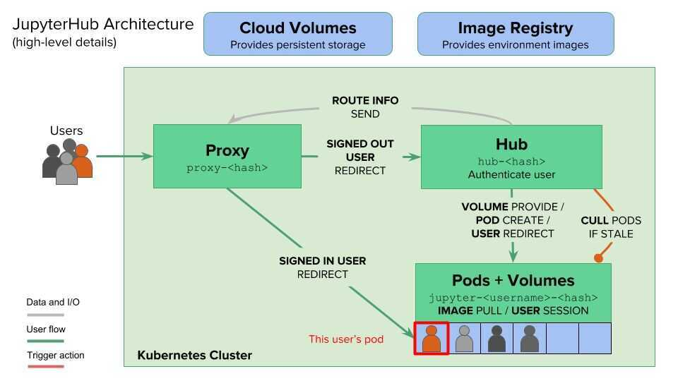

# Jupyter / Jupyterlab / notebook

## Overview

"Jupyter" is a loose acronym meaning Julia, Python, and R.

Components

1. Kernels
2. Dashboard

## Commands

The Jupyter Notebook has two different keyboard input modes.

1. **Edit mode** allows you to type code or text into a cell and is indicated by a green cell border.

2. **Command mode** binds the keyboard to notebook level commands and is indicated by a grey cell border with a blue left margin.

```bash
# for running django shell on jupyter notebook
pip install jupyter
pip install django-extensions
python manage.py shell_plus --notebook
python manage.py shell_plus --notebook & #background

# Launching Jupyter Notebook App
jupyter notebook
jupyter notebook --port=5555

jupyter notebook list
jupyter notebook stop 8888

# Run jupyter notebook in background
nohup jupyter notebook &

# Run terminal commands inside jupyter notebook
!pip install enum34
!pip install -U pybrain #For installing packages from cell
```

## Shortcuts

### Command Mode (pressEscto enable)

```bash
F: find and replace
Shift + Enter ⇧↩: run cell, select below
Ctrl + Enter ⌃↩: run selected cells
⌥↩: run cell and insert below
⌘S: Save and Checkpoint
S: Save and Checkpoint
H: show keyboard shortcuts
Y: change cell to code
M: change cell to markdown
A: insert cell above
B: insert cell below
D, D: delete selected cells
Z: undo cell deletion
L: toggle line numbers
O: toggle output of selected cells
```

Edit Mode (press Enter to enable)

### Jupyterlab

```bash
m - markdown
y - code
c - copy
x - cut
v - paste
z - undo
shift z - redo
dd - delete
```

## 10 Things about Jupyter Notebook

1. Themes (jupyter-themes, oceans16, jupyter-themer)
2. Extensions (nb_extensions)
    - split cells
    - limit output
    - snippets
    - magics (%lsmagic - show all the built-in magic available)
        - write latex
        - pdb
        - bash script

### Magics in Jupyter (magic commands)

#### 1. Line magic (`%`)

Operate on single line of input

#### 2. Cell magic (`%%`)

Operate on multiple lines of input

#### 3. Commands

```bash
%magic for help on magic
%lsmagic for list of magic available

# writes all the code in the cell to a python package
%writefile tensorboard.py

# appends the code in the cell to a file
%writefile --append tensorboard.py

%%time #measure execution time
```

## Code

```python
# For render HTML inside notebook output cell
from IPython.core.display import display, HTML
display(HTML(html_text))
```

## Hide all code

```python
from IPython.display import HTML
HTML('''<script>
code_show=true;
function code_toggle() {
 if (code_show){
 $('div.input').hide();
 } else {
 $('div.input').show();
 }
 code_show = !code_show
}
$( document ).ready(code_toggle);
</script>
<form action="javascript:code_toggle()"><input type="submit" value="Click here to toggle on/off the raw code."></form>''')
```

## References

- https://www.datacamp.com/community/tutorials/tutorial-jupyter-notebook
- https://www.dataquest.io/blog/advanced-jupyter-notebooks-tutorial
- https://towardsdatascience.com/speed-up-jupyter-notebooks-20716cbe2025
- https://towardsdatascience.com/how-to-effortlessly-optimize-jupyter-notebooks-e864162a06ee
- https://blog.dominodatalab.com/lesser-known-ways-of-using-notebooks

## Jupyter Extensions

### Interact Jupyter

The interact function (ipywidgets.interact) automatically creates user interface (UI) controls for exploring code and data interactively.

### Using button

`interact_manual(f, x=['apples','oranges']);`

### Dropdown

`interact(f, x=['apples','oranges']);`

https://ipywidgets.readthedocs.io/en/stable/index.html

https://ipywidgets.readthedocs.io/en/stable/examples/Using%20Interact.html

https://github.com/jupyterlab/jupyterlab/issues/4930

## Jupyter Lab

[JupyterLab](http://jupyterlab.readthedocs.io/en/stable/) is the next-generation user interface for [Project Jupyter](https://jupyter.org/) offering all the familiar building blocks of the classic Jupyter Notebook (notebook, terminal, text editor, file browser, rich outputs, etc.) in a flexible and a more powerful user interface.The basic idea of the Jupyter Lab is to bring all the building blocks that are in the classic notebook, plus some new stuff, under one roof.

```bash
pip install --upgrade jupyterlab

jupyter lab build

jupyter lab

jupyter lab --ip=0.0.0.0 --allow-root

jupyter lab --core-mode

start.sh jupyter lab --LabApp.token='jitCkhLMxSgw1mJp' --LabApp.ip='0.0.0.0' --LabApp.allow_root=True --LabApp.MappingKernelManager.cull_idle_timeout=600 --LabApp.MappingKernelManager.cull_interval=60 --LabApp.MappingKernelManager.cull_connected=True

c.NotebookApp.nbserver_extensions = {}

NotebookApp.max_buffer_size = your desired value

jupyter labextension list
```

### Extensions

- https://github.com/lckr/jupyterlab-variableInspector
- https://github.com/jupyterlab/jupyterlab-git
- https://github.com/jupyterlab/jupyterlab-toc

### References

https://towardsdatascience.com/jupyter-lab-evolution-of-the-jupyter-notebook-5297cacde6b

https://jupyterlab.readthedocs.io/en/stable/getting_started/overview.html

### Ready to use jupyter notebooks

`docker run -p 8888:8888 -e JUPYTER_ENABLE_LAB=yes -v "$PWD":/home/jovyan/work jupyter/datascience-notebook:latest`

https://hub.docker.com/r/jupyter/datascience-notebook

https://github.com/jupyter/docker-stacks

## JupyterHub

JupyterHub brings the power of notebooks to groups of users. It gives users access to computational environments and resources without burdening the users with installation and maintenance tasks. Users - including students, researchers, and data scientists - can get their work done in their own workspaces on shared resources which can be managed efficiently by system administrators.

JupyterHub runs in the cloud or on your own hardware, and makes it possible to serve a pre-configured data science environment to any user in the world. It is customizable and scalable, and is suitable for small and large teams, academic courses, and large-scale infrastructure.

https://jupyter.org/hub

JupyterHub on Kubernetes - https://z2jh.jupyter.org/en/latest/setup-jupyterhub.html

JupyterHub will automatically delete any user pods that have no activity for a period of time. This helps free up computational resources and keeps costs down if you are using an autoscaling cluster. When these users navigate back to your JupyterHub, they will have to start their server again, and the state of their previous session (variables they've created, any in-memory data, etc) will be lost. This is known as *culling*.



When you close the tab, it runs in background. You can't see the output though, but variables are not lost.. And you cannot run any code in that notebook bcoz it's processing in background. After the process finishes you can access those variables

### docker-compose.yaml

```yaml
services:
  jupyterlab:
    stdin_open: true
    tty: true
    build:
      context: .
      dockerfile: Dockerfile
    restart: always
    image: jupyter/datascience-notebook:latest
    container_name: jupyterlab
    environment:
      - JUPYTER_ENABLE_LAB=yes
    entrypoint:
      - /bin/bash
      - -c
      - |
          start.sh jupyter lab --LabApp.token='jitCkhLMxSgw1mJp' --LabApp.ip='0.0.0.0'
    volumes:
      - .:/home/jovyan
    ports:
      - 8888:8888
```

### Querybook

https://www.querybook.org

https://github.com/pinterest/querybook

Querybook is a Big Data Querying UI, combining collocated table metadata and a simple notebook interface.

## SQL Notebooks

https://engineering.fb.com/2022/04/26/developer-tools/sql-notebooks

## Others

[GitHub - marimo-team/marimo: A reactive notebook for Python - run reproducible experiments, execute as a script, deploy as an app, and version with git.](https://github.com/marimo-team/marimo)
