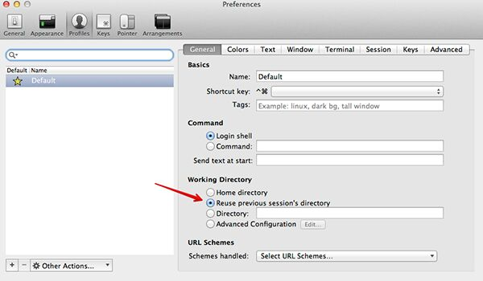

# Mac

## Shortcuts

#### Screenshots

```bash
Shift + Ctrl + Cmd + 3 - Copy window -> cmd+v (paste)
Cmd + Shift + 3 - whole window
Cmd + Shift + 4 - selection -> space (selection window)
Cmd + Shift + 5 - Record whole screen
```

Force kill - `cmd + opt + esc`

Exit Full Screen / Full screen - `^ + ⌘ + F (Ctrl + Cmd + F)`

`^ + ⌘ + q (Lock screen) (Ctrl + Cmd + Q)`

**Quicktime player Shortcuts -** Hold Option + fast forward button on quicktime player

**Preview pdf shortcuts -** Command + 1 - continuous scroll

#### Create a new text file

If you have the Finder window open, use Spotlight to open TextEdit. When you're ready to save the file, option+drag the text file icon from the title bar of TextEdit into the Finder window where you want to save it.

Show/hide hidden folders = Command + shift + .

Ctrl + Cmd + space - Character Palette

You can select the file and pressOption+Command+Cto copy the pathname to the clipboard.

Right Click on folder > option (gives more options)

#### Terminal Commands

Open two instance of same application - **open -n MQTT.fx.app**

#### Screenshots

```bash
⌘ + Shift + 4, #selection
⌘ + Shift + 4, + Space #window selection
⌘ + Shift + 3, #whole screen
```

```bash
⌘ + Option + D - show/hide dock
⌘ + Option + ESC - Force Quit Application dialogue
```

`Option + Characters - Special Characters like (µåß∂√ƒç≈Ω)`

## Setting up MAC

- **Add iterm2** - download from web, details below
- Install brew - command on official website (/bin/bash -c "$(curl -fsSL https://raw.githubusercontent.com/Homebrew/install/master/install.sh)")
- Add zsh - details below
- **Add docker**
- ~~Add Anaconda~~
- ~~Irvue~~
- ~~Onenote~~
- Obsidian
- **VSCode**

   Open the Command Palette(⇧⌘P) and type 'shell command' to find the Shell Command: Install 'code' command in PATH command.

   **Settings**

    - Auto Save - afterDelay
    - enablePreview - off
    - terminal.integrated.scrollback - 100000
    - Window: Open Folders In New Window - On

- **Google Drive for mac**
- ~~bittorrent web~~
- ~~Popcorn~~
	- sudo xattr -cr /Applications/Popcorn-Time.app
	- https://fusme.link/
	- https://jfper.link/
	- https://uxert.link/
	- https://yrkde.link/
- **VLC** or [GitHub - iina/iina: The modern video player for macOS.](https://github.com/iina/iina)
- ~~Anki Flash Cards~~ -
- ~~Anaconda navigator~~ - [~~https://conda.anaconda.org/conda-forge/~~](https://conda.anaconda.org/conda-forge/)
- **Bombsquad**
- ~~Alfred~~
- [Raycast - Supercharged productivity](https://www.raycast.com/)

    1. [GitHub - raycast/extensions: Everything you need to extend Raycast.](https://github.com/raycast/extensions)
    2. [GitHub - raycast/script-commands: Script Commands let you tailor Raycast to your needs. Think of them as little productivity boosts throughout your day.](https://github.com/raycast/script-commands)

- ~~Open MTP~~
- ~~Android file transfer (doesn't work)~~
    - MacDroid - mac app for transfering mobile to macbook for free (not wise verse)
        - Use USB Debugging
    - `brew install grishka/grishka/neardrop`
    - [**ShareDrop**](https://www.sharedrop.io/)
    - **Localsend**
- Office

### Google chrome

#### Shortcuts

| Action                                                              | Shortcuts                                     |
| ------------------------------------------------------------------- | --------------------------------------------- |
| switch profiles                                                     | cmd + shift + m - enter                       |
| to cycle between tabs                                               | Cmd + Shift + A + Enter                       |
| Jump to the next open tab                                           | ⌘ + Option + Right arrow or ctrl + tab        |
| Jump to the previous open tab                                       | ⌘ + Option + Left arrow or ctrl + shift + tab |
| Open the previous page in your browsing history for the current tab | `⌘ + [ or ⌘ + Left arrow`                     |
| Open the next page in your browsing history for the current tab     | `⌘ + ] or ⌘ + Right arrow`                    |
| Open the History page in a new tab                                  | ⌘ + y                                         |
| Open the Downloads page in a new tab                                | ⌘ + Shift + j                                 |
| Open the Find Bar to search the current page                        | ⌘ + f                                         |
| Jump to the next match to your Find Bar search                      | ⌘ + g                                         |
| Jump to the previous match to your Find Bar search                  | ⌘ + Shift + g                                 |
| When Find Bar is open, search for selected text                     | ⌘ + e                                         |
| Open the JavaScript Console                                         | ⌘ + Option + j                                |
| Search the web                                                      | ⌘ + Option + f                                |
| move tabs up/down                                                   | ctrl + shift + fn + up/down                   |

https://www.google.com/inputtools

[Chrome keyboard shortcuts - Computer - Google Chrome Help](https://support.google.com/chrome/answer/157179)

#### Extensions

- darkreader
- Session Buddy
- adblock
- Google meet attendance list
- JSON formatter
- Keepa - Amazon Price Tracker
- LINER: ChatGPT Google Assistant
- MarkDownload - Markdown Web Clipper
- Moesif Origin & CORS Changer
- SpeedUp: Netflix, Prime videos
- YouTube NonStop
- Duplicate Tab shortcut
    - Duplicate the current tab - ctrl + d
    - New tab to the right - cmd + t
- [ChatGPT Writer: Use AI on Any Site (GPT-4o, Claude, Gemini, and More)](https://chatgptwriter.ai/)

##### Screen recorders

- Nimbus Screenshot & Screen Video
- [Screen Recorder](https://chromewebstore.google.com/detail/screen-recorder/hniebljpgcogalllopnjokppmgbhaden)
- Best alternative to loom - [GitHub - alyssaxuu/screenity: The free and privacy-friendly screen recorder with no limits 🎥](https://github.com/alyssaxuu/screenity)
- Loom (cannot download with free version)
	- [Loom Video Downloader](https://getof.net/en/loom-video-downloader/)
- CloudApp
- Cantamsia

#### Others

- [Why Does The Arc Browser Work? - YouTube](https://www.youtube.com/watch?v=VZKHS0gBLts)
- [Arc from The Browser Company](https://arc.net/)
- Brave Browser

#### Google Chrome apps

- Keep Desktop app - Go to keep.google.com > go to chrome more tools > create shortcut > check open as new window
- Youtube music
- Meet - [Use Companion mode for hybrid learning & collaboration - Google Meet Help](https://support.google.com/meet/answer/11295507)

### brew

The missing package manager for macOS

```bash
brew list
brew install
brew uninstall
brew update
brew upgrade
brew outdated
brew doctor
brew cask upgrade minikube
brew info
brew info git # List versions, caveats, etc
brew info bash-completion
brew cleanup git # Remove old versions
brew list helm --versions

brew services list
   List all running services for the current user (or root).

brew services run (formula|--all)
   Run the service formula without registering to launch at login (or boot).

brew services start (formula|--all)
   Start the service formula immediately and register it to launch at login (or boot).

brew services stop (formula|--all)
   Stop the service formula immediately and unregister it from launching at login (or boot).

brew services restart (formula|--all)
   Stop (if necessary) and start the service formula immediately and register it to launch at login (or boot).

brew services cleanup
   Remove all unused services.
```

### brew install

- ~~tmux~~
- tldr
- watch
- **kubectl**
- **helm**
- **kubectx**
- **k9s (brew install derailed/k9s/k9s)**
- tree (directory tree structure)
- mysql-client / mysql@5.7
- bat
- ~~neovim~~ - https://github.com/neovim/neovim
- ~~fzf (A command-line fuzzy finder) - ~~https://github.com/junegunn/fzf
- [GitHub - ellie/atuin: 🐢 Magical shell history](https://github.com/ellie/atuin)
- ~~the_silver_searcher (command ag "services") - ~~https://github.com/ggreer/the_silver_searcher
- **awscli**
- **python3**
- moreutils
- thefuck - https://github.com/nvbn/thefuck
- **tldr -** https://tldr.sh https://github.com/tldr-pages/tldr
- brew install pre-commit
- rename

#### hstr (reverse search)

[GitHub - dvorka/hstr: bash and zsh shell history suggest box - easily view, navigate, search and manage your command history.](https://github.com/dvorka/hstr)

   ```bash
   brew install hstr

   hstr --show-configuration >> ~/.zshrc
   vim ~/.zshrc
   export HSTR_CONFIG=hicolor,raw-history-view

   ## ctrl+r
   https://github.com/dvorka/hstr
   ```

#### https://fig.io

```bash
brew install --cask fig
# https://github.com/withfig/autocomplete

fig doctor       check if Fig is properly configured
fig settings     update preferences (keybindings, UI, and more)
fig tweet        share your terminal set up with the world!
fig update       check for updates
fig --help       a summary of Fig commands with examples
```

### Settings in mac

#### for stopping bell sound

Search for - Silence bell in preferences

Unchecking the "User interface sounds" doesn't disable all sound. But sliding the "Alert Volume" option all the way to the left (minimum), together with unchecking the other options does the trick.

##### Others

- Finder - show status bar
- Default Downloads folder
- Search the current folder
- Show seconds and date in clock
- Show percent in battery
- Show bluetooth status in status bar
- touch id
- Keyboard - Delay until repeat - short
- Display text larger
- Finder - show status bar (cmd + /)

#### Setting up Shell

- install iterm2
- oh-my-zsh

   `sh -c "$(curl -fsSL https://raw.githubusercontent.com/ohmyzsh/ohmyzsh/master/tools/install.sh)"`

- Theme powerlevel10k

   https://gist.github.com/kevin-smets/8568070

   Command - `git clone https://github.com/romkatv/powerlevel10k.git $ZSH_CUSTOM/themes/powerlevel10k`

 `source ~/.zshrc` , // follow the instructions after that

- Auto Suggestion

   `git clone https://github.com/zsh-users/zsh-autosuggestions ${ZSH_CUSTOM:-~/.oh-my-zsh/custom}/plugins/zsh-autosuggestions`

   https://github.com/zsh-users/zsh-autosuggestions/blob/master/INSTALL

 add plugin to plugins in zshrc

#### Settings



#### Scroll buffer

`Preferences > Profiles > Terminal > scrollback lines > 100000`

#### Natural Text Editing

- Go to **Preferences...**>**Profiles**>**Keys > Key Mappings** (not Preferences... > Keys)
- Press **Presets...**
- Select **Natural Text Editing**
- Then, you can move a word backwards usingOption ⌥+←and a word forwards usingOption ⌥+→, move to the start of the line usingfn+←and to the end of the line withfn+→. Also you can delete a word backwards usingOption ⌥+⌫, delete the whole line usingCommand ⌘+⌫.

#### ~/.zshrc

```bash
ZSH_THEME="powerlevel10k/powerlevel10k"
# plugins=(git osx docker docker-compose common-aliases zsh-autosuggestions)
plugins=(git common-aliases zsh-autosuggestions)

# source profile and aliases
. ~/.bash_profile
. ~/.profile
. ~/.aliases

# Autocompletion kubectl
source <(kubectl completion zsh)

# Autocompletion helm
source <(helm completion zsh)

# kubectl aliases
[ -f ~/.kubectl_aliases ] && source ~/.kubectl_aliases
function kubectl() { echo "+ kubectl $@">&2; command kubectl $@; }

# run command - setopt auto_cd

# Set autocd, which means that rather than typing cd <foldername> you just type <foldername>
```

#### ~/.vimrc

```bash
syntax on
filetype on
```

#### ~/.aliases

```bash
alias ll='ls -alhtF'
alias cl='clear'
alias v='nvim'
alias vim='nvim'
alias f='v `fzf -i`'
alias f='fuck'

alias k='kubectl'
alias d='docker'
alias dc='docker-compose'
alias w='watch ' #remember to add space so other alias can be used

# aliases
# section git
alias gpom='git pull origin master'
function gdon() {
    git add .
    git commit --no-verify -a -m "$1"
    git push origin "$(git_current_branch)"
}

#Section Docker
alias docker-clean='docker rm $(docker ps -a -f status=exited -q); docker volume rm $(docker volume ls -f dangling=true -q); docker images -qf dangling=true | xargs docker rmi'
alias docker-remove-all-images='docker rmi $(docker images -a -q)'

alias rb12='openssl rand -base64 12'
alias r12='openssl rand -hex 12'
alias rb16='openssl rand -base64 16'
alias r16='openssl rand -hex 16'
alias rb32='openssl rand -base64 32'
alias r32='openssl rand -hex 32'
# base58 password doesn't contain 0OIl to avoid confusion

# alias sf='cd ~/Repositories/stashfin/'

alias python=/usr/local/bin/python3.7
alias pip=/usr/local/bin/pip3

alias publicIp="curl wgetip.com"

alias file_encrypt='openssl enc -aes-256-cbc -salt -pbkdf2 -in enc_file.md -out enc_file.md.enc && rm -rf enc_file.md'

alias file_decrypt='openssl enc -d -aes-256-cbc -salt -pbkdf2 -in enc_file.md.enc -out enc_file.md && rm -rf enc_file.md.enc'
```

#### Alias

- Suffix Alias (-s)
- Global Alias (-g)

https://thorsten-hans.com/5-types-of-zsh-aliases

### References

- https://medium.com/better-programming/6-must-have-tools-for-developers-430fd56933dd
- https://github.com/trimstray/the-book-of-secret-knowledge
- https://github.com/jaywcjlove/awesome-mac

### Cleanup

```bash
brew cleanup # Remove old versions

brew services cleanup # Remove all unused services
```

### Automator (reducing screenshots size)

```bash
defaults write com.apple.screencapture type JPG

# defaults write com.apple.screencapture type PNG

# defaults write com.apple.screencapture location "$HOME/Screenshots"
defaults write com.apple.screencapture location "$HOME/Desktop"

for f in "$@"
do
 mogrify -quality 10% "$f"
done
```

https://about.gitlab.com/blog/2020/01/30/simple-trick-for-smaller-screenshots

### ipv6 disable

**mac**

`networksetup -setv6off Wi-Fi`

**ubuntu**

```bash
sudo sysctl -w net.ipv6.conf.all.disable_ipv6=1

sudo sysctl -w net.ipv6.conf.default.disable_ipv6=1
```

**windows**

https://networking.grok.lsu.edu/article.aspx?articleid=17573

settings (google search - how to disable ipv6 in windows)
