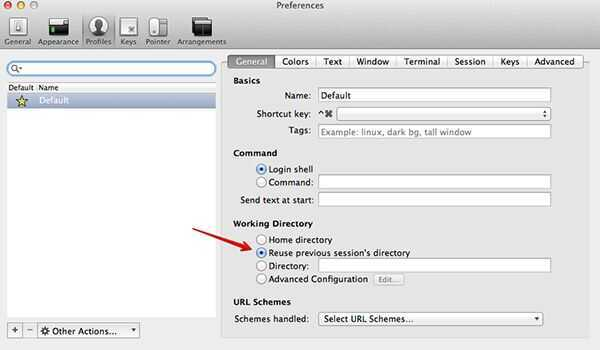

# Mac

## Shortcuts

#### Screenshots

```bash
Shift + Ctrl + Cmd + 3 - Copy window -> cmd+v (paste)
Cmd + Shift + 3 - whole window
Cmd + Shift + 4 - selection -> space (selection window)
Cmd + Shift + 5 - Record whole screen
```

Force kill - `cmd + opt + esc`

Exit Full Screen / Full screen - `^ + ⌘ + F (Ctrl + Cmd + F)`

`^ + ⌘ + q (Lock screen) (Ctrl + Cmd + Q)`

**Quicktime player Shortcuts -** Hold Option + fast forward button on quicktime player

**Preview pdf shortcuts -** Command + 1 - continuous scroll

#### Create a new text file

If you have the Finder window open, use Spotlight to open TextEdit. When you're ready to save the file, option+drag the text file icon from the title bar of TextEdit into the Finder window where you want to save it.

Show/hide hidden folders = Command + shift + .

Ctrl + Cmd + space - Character Palette

You can select the file and pressOption+Command+Cto copy the pathname to the clipboard.

Right Click on folder > option (gives more options)

#### Terminal Commands

Open two instance of same application - **open -n MQTT.fx.app**

#### Screenshots

```bash
⌘ + Shift + 4, #selection
⌘ + Shift + 4, + Space #window selection
⌘ + Shift + 3, #whole screen
```

```bash
⌘ + Option + D - show/hide dock
⌘ + Option + ESC - Force Quit Application dialogue
```

`Option + Characters - Special Characters like (µåß∂√ƒç≈Ω)`

## Setting up Windows

- Install wsl (powershell - `wsl --install`)
	- `ln -s /mnt/c/Users/deepa/Repositories ~/Repositories`
- Install ubuntu
- https://code.visualstudio.com/docs/remote/wsl
- In vscode setup WSL
- Install brew in WSL
- `ln -s /mnt/c/Users/deepa/Downloads ~/downloads`
- `cd /mnt/c` - windows file location
- setup lock default screen - [How to Enable or Disable Lock Screen in Windows 11 / 10 - YouTube](https://www.youtube.com/shorts/ay-0FqaEP-U)
- enable gpedit.msc in windows home - [Enable Group Policy Editor (gpedit.msc) on Windows 10/11 Home Edition \| Windows OS Hub](https://woshub.com/group-policy-editor-gpedit-msc-for-windows-10-home/)
- enable clipboard - windows + V
- capture text from images - [How to extract text from images on Windows 11 - ARTICLE - Microsoft Q&A](https://learn.microsoft.com/en-us/answers/questions/2285914/how-to-extract-text-from-images-on-windows-11-arti)
- group tabs settings - show tabs from apps when snapping or pressing alt+tab
- Title bar window shake
- folder options
	- Hide extensions for known file types
	- setup default downloads directory - [How to Make File Explorer Open to the Downloads Folder by Default - YouTube](https://www.youtube.com/watch?v=AxPIznxRNfc)
- Date & Time settings
	- show seconds in system tray
	- [How do I show the day of the week in the taskbar? - Microsoft Q&A](https://learn.microsoft.com/en-us/answers/questions/4367502/how-do-i-show-the-day-of-the-week-in-the-taskbar)
- Install apps
	- chrome
		- dark mode - I use both of dark reader extension and Chrome://flags. It can be interchangeable if the website has the problem with dark mode
		- [Change every single website to 'Dark Mode' in Google Chrome. : r/chrome](https://www.reddit.com/r/chrome/comments/uhhu3v/change_every_single_website_to_dark_mode_in/)
	- file download manager
	- google drive
	- obsidian
	- vscode
	- Zoom
	- jump desktop
	- tailscale
	- docker

### Windows Shortcuts

- win + A
- win + N
- win + v - clipboard history

## Setting up MAC

- **Add iterm2** - download from web, details below
- Install brew - command on official website (/bin/bash -c "$(curl -fsSL https://raw.githubusercontent.com/Homebrew/install/master/install.sh)")
	- [Homebrew on Linux — Homebrew Documentation](https://docs.brew.sh/Homebrew-on-Linux)
		- sudo apt update && sudo apt upgrade
		- sudo apt-get install build-essential procps curl file git
		- /bin/bash -c "$(curl -fsSL https://raw.githubusercontent.com/Homebrew/install/HEAD/install.sh)"
		- The installer will usually provide "Next Steps" to add Homebrew to your PATH.
			- echo 'eval "$(/home/linuxbrew/.linuxbrew/bin/brew shellenv)"' >> ~/.profile
			- eval "$(/home/linuxbrew/.linuxbrew/bin/brew shellenv)"
- Add zsh - details below
- **Add docker**
- ~~Add Anaconda~~
- ~~Irvue~~
- ~~Onenote~~
- Obsidian
- **VSCode**

   Open the Command Palette(⇧⌘P) and type 'shell command' to find the Shell Command: Install 'code' command in PATH command.

   **Settings**

    - Auto Save - afterDelay
    - enablePreview - off
    - terminal.integrated.scrollback - 100000
    - Window: Open Folders In New Window - On

- **Google Drive for mac**
- ~~bittorrent web~~
- ~~Popcorn~~
	- sudo xattr -cr /Applications/Popcorn-Time.app
	- https://fusme.link/
	- https://jfper.link/
	- https://uxert.link/
	- https://yrkde.link/
- **VLC** or [GitHub - iina/iina: The modern video player for macOS.](https://github.com/iina/iina)
- ~~Anki Flash Cards~~ -
- ~~Anaconda navigator~~ - [~~https://conda.anaconda.org/conda-forge/~~](https://conda.anaconda.org/conda-forge/)
- **Bombsquad**
- ~~Open MTP~~
- ~~Android file transfer (doesn't work)~~
    - MacDroid - mac app for transfering mobile to macbook for free (not wise verse)
        - Use USB Debugging
    - `brew install grishka/grishka/neardrop`
    - [**ShareDrop**](https://www.sharedrop.io/)
    - **Localsend**
- Office
- Screensaver - https://zzz.zoomquilt2.com/

### Spotlight Alternative

- Cmd + Shift + G in Finder
- Alfred - [Alfred - Productivity App for macOS](https://www.alfredapp.com/)
- [Raycast - Supercharged productivity](https://www.raycast.com/)
	- [GitHub - raycast/extensions: Everything you need to extend Raycast.](https://github.com/raycast/extensions)
	- [GitHub - raycast/script-commands: Script Commands let you tailor Raycast to your needs. Think of them as little productivity boosts throughout your day.](https://github.com/raycast/script-commands)
	- [A love letter to Raycast ❤️](https://rmoff.net/2025/12/18/a-love-letter-to-raycast/)

#### Comparison

- [Alfred vs Raycast vs Monarch \| Den's Hub](https://denshub.com/en/alfred-vs-raycast-vs-monarch/)
- [Alfred vs. Raycast: my constant debate - Josh Collinsworth blog](https://joshcollinsworth.com/blog/alfred-raycast)
- [Alfred vs. Raycast vs. Monarch vs. LaunchBar (vs. Quicksilver) : r/macapps](https://www.reddit.com/r/macapps/comments/1ihhwtv/alfred_vs_raycast_vs_monarch_vs_launchbar_vs/)

### Google chrome

#### Shortcuts

| Action                                                              | Shortcuts                                     |
| ------------------------------------------------------------------- | --------------------------------------------- |
| switch profiles                                                     | cmd + shift + m - enter                       |
| to cycle between tabs                                               | Cmd + Shift + A + Enter                       |
| Jump to the next open tab                                           | ⌘ + Option + Right arrow or ctrl + tab        |
| Jump to the previous open tab                                       | ⌘ + Option + Left arrow or ctrl + shift + tab |
| Open the previous page in your browsing history for the current tab | `⌘ + [ or ⌘ + Left arrow`                     |
| Open the next page in your browsing history for the current tab     | `⌘ + ] or ⌘ + Right arrow`                    |
| Open the History page in a new tab                                  | ⌘ + y                                         |
| Open the Downloads page in a new tab                                | ⌘ + Shift + j                                 |
| Open the Find Bar to search the current page                        | ⌘ + f                                         |
| Jump to the next match to your Find Bar search                      | ⌘ + g                                         |
| Jump to the previous match to your Find Bar search                  | ⌘ + Shift + g                                 |
| When Find Bar is open, search for selected text                     | ⌘ + e                                         |
| Open the JavaScript Console                                         | ⌘ + Option + j                                |
| Search the web                                                      | ⌘ + Option + f                                |
| move tabs up/down                                                   | ctrl + shift + fn + up/down                   |

https://www.google.com/inputtools

[Chrome keyboard shortcuts - Computer - Google Chrome Help](https://support.google.com/chrome/answer/157179)

[Logging in Outlook Account on Chrome Profile - Google Chrome Community](https://support.google.com/chrome/thread/153714697/logging-in-outlook-account-on-chrome-profile?hl=en)

#### Chrome Extensions

- [Remove YouTube Shorts - Chrome Web Store](https://chromewebstore.google.com/detail/remove-youtube-shorts/mgngbgbhliflggkamjnpdmegbkidiapm?hl=en)
- darkreader
- Session Buddy (not required, use group tabs in chrome)
- **adblock plus**
- Google meet attendance list
- JSON formatter
- Keepa - Amazon Price Tracker
- LINER: ChatGPT Google Assistant
- MarkDownload - Markdown Web Clipper
- Moesif Origin & CORS Changer
- **SpeedUp: Netflix, Prime videos**
- YouTube NonStop
- **Duplicate Tab shortcut**
    - Duplicate the current tab - ctrl + d
    - New tab to the right - cmd + t
- [ChatGPT Writer: Use AI on Any Site (GPT-4o, Claude, Gemini, and More)](https://chatgptwriter.ai/)

##### Screen recorders

- Nimbus Screenshot & Screen Video
- [Screen Recorder](https://chromewebstore.google.com/detail/screen-recorder/hniebljpgcogalllopnjokppmgbhaden)
- Best alternative to loom - [GitHub - alyssaxuu/screenity: The free and privacy-friendly screen recorder with no limits 🎥](https://github.com/alyssaxuu/screenity)
- Loom (cannot download with free version)
	- [Loom Video Downloader](https://getof.net/en/loom-video-downloader/)
- CloudApp
- Cantamsia

#### Others

- [Why Does The Arc Browser Work? - YouTube](https://www.youtube.com/watch?v=VZKHS0gBLts)
- [Arc from The Browser Company](https://arc.net/)
- Brave Browser

#### Google Chrome apps

- Keep Desktop app - Go to keep.google.com > go to chrome more tools > create shortcut > check open as new window
- Youtube music
- Meet - [Use Companion mode for hybrid learning & collaboration - Google Meet Help](https://support.google.com/meet/answer/11295507)

### brew

The missing package manager for macOS

```bash
brew list
brew install
brew uninstall
brew update
brew upgrade
brew outdated
brew doctor
brew cask upgrade minikube
brew info
brew info git # List versions, caveats, etc
brew info bash-completion
brew cleanup git # Remove old versions
brew list helm --versions

brew services list
   List all running services for the current user (or root).

brew services run (formula|--all)
   Run the service formula without registering to launch at login (or boot).

brew services start (formula|--all)
   Start the service formula immediately and register it to launch at login (or boot).

brew services stop (formula|--all)
   Stop the service formula immediately and unregister it from launching at login (or boot).

brew services restart (formula|--all)
   Stop (if necessary) and start the service formula immediately and register it to launch at login (or boot).

brew services cleanup
   Remove all unused services.
```

### brew install

- ~~tmux~~
- tldr
- watch
- **kubectl**
- **helm**
- **kubectx**
- **k9s (brew install derailed/k9s/k9s)**
- tree (directory tree structure)
- mysql-client / mysql@5.7
- bat
- ~~neovim~~ - https://github.com/neovim/neovim
- ~~fzf (A command-line fuzzy finder) - ~~https://github.com/junegunn/fzf
- [GitHub - ellie/atuin: 🐢 Magical shell history](https://github.com/ellie/atuin)
- ~~the_silver_searcher (command ag "services") - ~~https://github.com/ggreer/the_silver_searcher
- **awscli**
- **python3**
- moreutils
- thefuck - https://github.com/nvbn/thefuck
- **tldr -** https://tldr.sh https://github.com/tldr-pages/tldr
- brew install pre-commit
- rename
- maccy

#### Clipboard Manager

- brew install maccy
- [GitHub - p0deje/Maccy: Lightweight clipboard manager for macOS](https://github.com/p0deje/Maccy)
	- Settings
		- Launch at login
		- Check for updates automatically
		- Paste automatically
	- SHIFT (⇧) + COMMAND (⌘) + C to popup Maccy or click on its icon in the menu bar.
	- To disable Maccy and ignore new copies, click on the menu icon with OPTION (⌥) pressed.
	- To ignore only the next copy, click on the menu icon with OPTION (⌥) + SHIFT (⇧) pressed.
- [GitHub - PasteBar/PasteBarApp: PasteBar - Limitless, Free Clipboard Manager for Mac and Windows](https://github.com/PasteBar/PasteBarApp)
- [GitHub - hluk/CopyQ: Clipboard manager with advanced features](https://github.com/hluk/CopyQ)
- [GitHub - Slackadays/Clipboard: 😎🏖️🐬 Your new, 𝙧𝙞𝙙𝙤𝙣𝙠𝙪𝙡𝙞𝙘𝙞𝙤𝙪𝙨𝙡𝙮 smart clipboard manager](https://github.com/Slackadays/Clipboard)
- [GitHub - TermiT/Flycut: Clean and simple clipboard manager for developers](https://github.com/TermiT/Flycut)
- [The 5 best clipboard managers in 2025 \| Zapier](https://zapier.com/blog/best-clipboard-managers/)

#### hstr (reverse search)

[GitHub - dvorka/hstr: bash and zsh shell history suggest box - easily view, navigate, search and manage your command history.](https://github.com/dvorka/hstr)

   ```bash
   brew install hstr

   hstr --show-configuration >> ~/.zshrc
   vim ~/.zshrc
   export HSTR_CONFIG=hicolor,raw-history-view

   ## ctrl+r
   https://github.com/dvorka/hstr
   ```

#### https://fig.io

```bash
brew install --cask fig
# https://github.com/withfig/autocomplete

fig doctor       check if Fig is properly configured
fig settings     update preferences (keybindings, UI, and more)
fig tweet        share your terminal set up with the world!
fig update       check for updates
fig --help       a summary of Fig commands with examples
```

### Settings in mac

#### for stopping bell sound

Search for - Silence bell in preferences

Unchecking the "**Play user interface sound effects**" doesn't disable all sound. But sliding the "**Alert Volume**" option all the way to the left (minimum), together with unchecking the other options does the trick.

##### Others

- Finder settings
	- General - New Finder windows show - Default Downloads folder
	- Advanced - When performing a search - Search the current folder
	- Directly in Finder - show status bar (cmd + /)
- System Preferences
	- Show seconds and date in clock
	- Show percent in battery
	- Show bluetooth status in status bar
	- touch id
	- Keyboard - Delay until repeat - short
	- Tap to click
	- Trackpad - fast
	- Display settings - Display text larger (1496 x 967)
	- Dock settings - Turn Hiding On
	- Control Centre Modules - Focus - Always show in menu bar

#### Setting up Shell

- install iterm2
- oh-my-zsh

   `sh -c "$(curl -fsSL https://raw.githubusercontent.com/ohmyzsh/ohmyzsh/master/tools/install.sh)"`

- Theme powerlevel10k

   https://gist.github.com/kevin-smets/8568070

   Command - `git clone https://github.com/romkatv/powerlevel10k.git $ZSH_CUSTOM/themes/powerlevel10k`

 `source ~/.zshrc` , // follow the instructions after that

- Auto Suggestion

   `git clone https://github.com/zsh-users/zsh-autosuggestions ${ZSH_CUSTOM:-~/.oh-my-zsh/custom}/plugins/zsh-autosuggestions`

   https://github.com/zsh-users/zsh-autosuggestions/blob/master/INSTALL

 add plugin to plugins in zshrc

#### Settings



#### iterm settings

- scroll buffer - `Preferences > Profiles > Terminal > scrollback lines > 100000`
- Dark color - `Preferences > Profiles > Colors > color preset`
- No prompt Quit - `settings > general > closing > confirm quit iterm2`
- Magic - Instant replay, Clipboard history
- reopen last closed window iterm2
	- cmd+z
	- Method 3: Use system-level restore
		- Go to System Preferences > General and turn off "Close windows when quitting an app.".
		- Already - In iTerm2 preferences, go to General and set Startup to "Use system window restoration settings".
		- When you quit iTerm2, the OS should save your windows. You can then reopen them from the Dock or by using the System Preferences > Recent Items menu.

#### Natural Text Editing

- Go to **Preferences...**>**Profiles**>Default>**Keys > Key Bindings** (not Preferences... > Keys)
- Press **Presets...**
- Select **Natural Text Editing**
- Then, you can move a word backwards using `Option ⌥+←` and a word forwards using `Option ⌥+→`, move to the start of the line using `fn+←` and to the end of the line with `fn+→`. Also you can delete a word backwards using `Option ⌥+⌫`, delete the whole line using `Command ⌘+⌫`.

#### ~/.zshrc

```bash
ZSH_THEME="powerlevel10k/powerlevel10k"
# plugins=(git osx docker docker-compose common-aliases zsh-autosuggestions)
plugins=(git common-aliases zsh-autosuggestions)

# source profile and aliases
. ~/.bash_profile
. ~/.profile
. ~/.aliases

# Autocompletion kubectl
source <(kubectl completion zsh)

# Autocompletion helm
source <(helm completion zsh)

# kubectl aliases
[ -f ~/.kubectl_aliases ] && source ~/.kubectl_aliases
function kubectl() { echo "+ kubectl $@">&2; command kubectl $@; }

# run command - setopt auto_cd

# Set autocd, which means that rather than typing cd <foldername> you just type <foldername>
```

#### ~/.vimrc

```bash
syntax on
filetype on
```

#### ~/.aliases

```bash
alias ll='ls -alhtF'
alias cl='clear'
alias v='nvim'
alias vim='nvim'
alias f='v `fzf -i`'
alias f='fuck'

alias k='kubectl'
alias d='docker'
alias dc='docker-compose'
alias w='watch ' #remember to add space so other alias can be used

# aliases
# section git
alias gpom='git pull origin master'
function gdon() {
    git add .
    git commit --no-verify -a -m "$1"
    git push origin "$(git_current_branch)"
}

#Section Docker
alias docker-clean='docker rm $(docker ps -a -f status=exited -q); docker volume rm $(docker volume ls -f dangling=true -q); docker images -qf dangling=true | xargs docker rmi'
alias docker-remove-all-images='docker rmi $(docker images -a -q)'

alias rb12='openssl rand -base64 12'
alias r12='openssl rand -hex 12'
alias rb16='openssl rand -base64 16'
alias r16='openssl rand -hex 16'
alias rb32='openssl rand -base64 32'
alias r32='openssl rand -hex 32'
# base58 password doesn't contain 0OIl to avoid confusion

# alias sf='cd ~/Repositories/stashfin/'

alias python=/usr/local/bin/python3.7
alias pip=/usr/local/bin/pip3

alias publicIp="curl wgetip.com"

alias file_encrypt='openssl enc -aes-256-cbc -salt -pbkdf2 -in enc_file.md -out enc_file.md.enc && rm -rf enc_file.md'

alias file_decrypt='openssl enc -d -aes-256-cbc -salt -pbkdf2 -in enc_file.md.enc -out enc_file.md && rm -rf enc_file.md.enc'
```

#### Alias

- Suffix Alias (-s)
- Global Alias (-g)

https://thorsten-hans.com/5-types-of-zsh-aliases

### Sidebar Widget Settings - Stocks

- `^NSEI`
- `^NSMIDCP`
- NASDAQ
- S&P 500

### References

- https://medium.com/better-programming/6-must-have-tools-for-developers-430fd56933dd
- https://github.com/trimstray/the-book-of-secret-knowledge
- https://github.com/jaywcjlove/awesome-mac

### Cleanup

```bash
brew cleanup # Remove old versions

brew services cleanup # Remove all unused services
```

### Automator (reducing screenshots size)

```bash
defaults write com.apple.screencapture type JPG

# defaults write com.apple.screencapture type PNG

# defaults write com.apple.screencapture location "$HOME/Screenshots"
defaults write com.apple.screencapture location "$HOME/Desktop"

for f in "$@"
do
 mogrify -quality 10% "$f"
done
```

https://about.gitlab.com/blog/2020/01/30/simple-trick-for-smaller-screenshots

### ipv6 disable

**mac**

`networksetup -setv6off Wi-Fi`

**ubuntu**

```bash
sudo sysctl -w net.ipv6.conf.all.disable_ipv6=1

sudo sysctl -w net.ipv6.conf.default.disable_ipv6=1
```

**windows**

https://networking.grok.lsu.edu/article.aspx?articleid=17573

settings (google search - how to disable ipv6 in windows)
