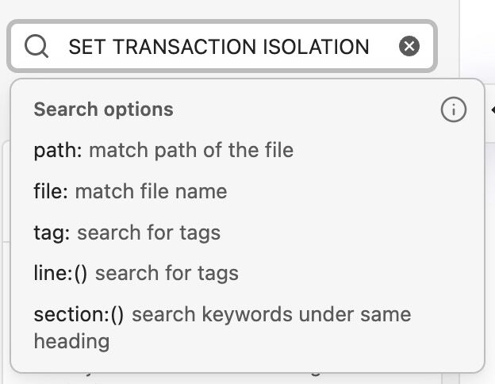

Obsidian is a powerful and extensible knowledge base that works on top of your local folder of plain text files.

## Extensions / Plugins

[2024 Gems of the year winners - Obsidian](https://obsidian.md/blog/2024-goty-winners/)

Extensions that helps make obsidian better

- Advanced Tables
- Outliners (Outlines like Roam Research)
- DataView - [How to use the Obsidian Dataview plugin](https://www.youtube.com/watch?v=JTObSymEvWA)
- Kanban
    - [GitHub - mgmeyers/obsidian-kanban: Create markdown-backed Kanban boards in Obsidian.](https://github.com/mgmeyers/obsidian-kanban) ⭐ 4.3k
    - [Obsidian Kanban Plugin - Obsidian Kanban Plugin - Obsidian Publish](https://publish.obsidian.md/kanban)
    - [Set a WIP Limit - Obsidian Kanban Plugin - Obsidian Publish](https://publish.obsidian.md/kanban/How+do+I/Set+a+WIP+Limit)
- Calendar
- Outliner
- Git
- Obsidian Git
- Mind Map
- Natural Language Dates
- Day Planner
- Periodic Notes
- Paste URL into selection
- Better Word Count
- Recent Files
- Auto Link Title
- Automatically Reveal Active File
- Wikipedia
- Editing Toolbar / Obsidian Markdown formattting Assistant
- Linter
- Reading Time
- [GitHub - SilentVoid13/Templater: A template plugin for obsidian · GitHub](https://github.com/SilentVoid13/Templater)
	- [Some of My Best Templates · SilentVoid13/Templater · Discussion #1754 · GitHub](https://github.com/SilentVoid13/Templater/discussions/1754)
- [GitHub - platers/obsidian-linter: An Obsidian plugin that formats and styles your notes with a focus on configurability and extensibility. · GitHub](https://github.com/platers/obsidian-linter)
- [Regex Find/Replace](https://github.com/Gru80/obsidian-regex-replace) ⭐ 93
- [GitHub - zsviczian/excalibrain: A graph view to navigate your Obsidian vault](https://github.com/zsviczian/excalibrain) ⭐ 961
- [GitHub - valentine195/obsidian-leaflet-plugin: Adds interactive maps to Obsidian using Leaflet.js](https://github.com/valentine195/obsidian-leaflet-plugin) ⭐ 696
- [GitHub - SkepticMystic/breadcrumbs: Visualise a custom hierarchy in your Obsidian vault. API: https://skepticmystic.github.io/breadcrumbs/](https://github.com/SkepticMystic/breadcrumbs) ⭐ 793
- [My Top 44 Obsidian Plugins RANKED](https://www.youtube.com/watch?v=xVQGrn9gQKI)
- [GitHub - flyingnobita/obsidian-github-stars: Display the number of stars next to GitHub repository links in Obsidian.](https://github.com/flyingnobita/obsidian-github-stars) ⭐ 5
- [4 game-changing Obsidian workflows I wish I tried earlier](https://www.xda-developers.com/game-changing-obsidian-workflows/)
- Make.md [Make.md is the best Obsidian plugin to help keep you organized and beautify your notes](https://www.xda-developers.com/makemd-best-obsidian-plugin-organize-beautify-notes/)
- [GitHub - scambier/obsidian-omnisearch: A search engine that "just works" for Obsidian. Supports OCR and PDF indexing.](https://github.com/scambier/obsidian-omnisearch) ⭐ 2.0k
- [GitHub - OliverBalfour/obsidian-pandoc: Pandoc document export plugin for Obsidian (https://obsidian.md)](https://github.com/OliverBalfour/obsidian-pandoc) ⭐ 894
- [GitHub - meld-cp/obsidian-encrypt: Hide secrets in your Obsidian.md vault](https://github.com/meld-cp/obsidian-encrypt) ⭐ 941
- **[GitHub - logancyang/obsidian-copilot: THE Copilot in Obsidian](https://github.com/logancyang/obsidian-copilot) ⭐ 7.2k**
- [GitHub - nhaouari/obsidian-textgenerator-plugin: Text Generator is a versatile plugin for Obsidian that allows you to generate text content using various AI providers, including OpenAI, Anthropic, Google and local models.](https://github.com/nhaouari/obsidian-textgenerator-plugin) ⭐ 1.9k
	- [GPT in Obsidian: Text Generator Plugin - YouTube](https://www.youtube.com/watch?v=OergqWCdFKc)
- TODO - [Use H1 or YAML property "title" instead of or in addition to filename as display name - Feature requests - Obsidian Forum](https://forum.obsidian.md/t/use-h1-or-yaml-property-title-instead-of-or-in-addition-to-filename-as-display-name/687/148)
	- [Add option to display title instead of filename - Help - Obsidian Forum](https://forum.obsidian.md/t/add-option-to-display-title-instead-of-filename/40897/5)
- [GitHub - javalent/admonitions: Adds admonition block-styled content to Obsidian.md](https://github.com/javalent/admonitions) ⭐ 1.3k
- [GitHub - brianpetro/obsidian-smart-connections: Chat with your notes & see links to related content with AI embeddings. Use local models or 100+ via APIs like Claude, Gemini, ChatGPT & Llama 3](https://github.com/brianpetro/obsidian-smart-connections) ⭐ 5.1k
	- [Obsidian Smart Connections UPDATE 📝 Rediscover Notes With Obsidian AI - YouTube](https://www.youtube.com/watch?v=7Rvl9Sl29Jk)
- [GitHub - mirnovov/obsidian-homepage: An Obsidian plugin that opens a specified note, canvas, or workspace on startup, instead of the most recent one.](https://github.com/mirnovov/obsidian-homepage) ⭐ 674
- [GitHub - PaulTreanor/notes-dater: Adds created\_on and updated\_on dates of the active note to status bar](https://github.com/PaulTreanor/notes-dater) ⭐ 18
- [GitHub - polyipseity/obsidian-terminal: Integrate consoles, shells, and terminals. · GitHub](https://github.com/polyipseity/obsidian-terminal) ⭐ 846
- [GitHub - obsidian-community/obsidian-style-settings: A dynamic user interface for adjusting theme, plugin, and snippet CSS variables within Obsidian · GitHub](https://github.com/obsidian-community/obsidian-style-settings) ⭐ 2.3k
- Folder organization
	- [File Explorer Organization \| Custom Sort Revisited - YouTube](https://www.youtube.com/watch?v=VY_VPI-STlg)
	- [What Nobody Tells You About Organizing Folders in Obsidian - YouTube](https://www.youtube.com/watch?v=RNH4zpVUm3E)
	- [How to Manage Projects with Four Intensities - YouTube](https://www.youtube.com/watch?v=Ew7ZBu4r8vg)
	- [A Custom Obsidian Theme To Feel More Reflective - YouTube](https://www.youtube.com/watch?v=lUZjpIhYOEw)

### LearnKit - Spaced Repetition (Flashcards)

#### Key features

- **FSRS scheduling** — adaptive spaced repetition so every review counts.
- **Rich flashcard types** — cloze, basic, reversed, multiple choice, image occlusion, and more.
- **Text-to-speech & audio** — built-in playback for language learning and listening practice.
- **Study analytics** — charts, heatmaps, and retention trends at a glance.
- **Markdown-first** — flashcards live inside your notes, linked to the knowledge they came from.
- **Reading view customisation** — keep notes clean and distraction-free while studying.
- **Note review mode** — spaced repetition for your notes, not just flashcards.
- **Study coach** — personalised study plans and coaching for your exams.
- **Test mode** — AI-generated quizzes straight from your notes.

#### Companion — AI learning assistant

Companion is LearnKit's built-in AI study assistant for working directly with the notes you already have.

- **Ask anything** — get instant answers grounded in the note you're reading.
- **Generate flashcards and tests** — turn any note into study-ready material in seconds.
- **Review and improve** — get targeted feedback that makes your notes clearer and more complete.
- **Edit with AI** — Companion can rewrite, restructure, and refine your notes for you, right where you work.

Turn notes into study-ready material without leaving Obsidian.

- [LearnKit - Obsidian Plugin](https://community.obsidian.md/plugins/learnkit)
- [GitHub - ctrlaltwill/LearnKit: A native study system for your Obsidian vault. LearnKit turns notes into durable knowledge with flashcards, spaced repetition, reviews, tests, and AI tools. · GitHub](https://github.com/ctrlaltwill/LearnKit)

**Settings / Preferences**

- Templates - Date Format - `ddd, DD MMM YYYY`

## Themes

- [Ultimate guide to best Obsidian themes | Elizabeth Butler](https://elizabethbutlermd.com/5-of-the-best-custom-minimalist-digital-note-taking-themes-for-obsidian-in-2022/)
	- Minimal Things
		- [GitHub - kepano/obsidian-minimal-settings: Settings plugin to control colors and fonts in Minimal Theme · GitHub](https://github.com/kepano/obsidian-minimal-settings)
- [7+ Obsidian Themes for a Drastic Design Facelift!](https://akshayhallur.com/blog/best-obsidian-themes)
- Things (current)
	- [GitHub - colineckert/obsidian-things: An Obsidian theme inspired by the beautifully-designed app, Things.](https://github.com/colineckert/obsidian-things) ⭐ 982
- [GitHub - aaaaalexis/obsidian-cupertino: A native look and feel Obsidian theme designed for a clean, focused, and mobile-friendly writing experience.](https://github.com/aaaaalexis/obsidian-cupertino) ⭐ 1.1k

## Obsidian MCP Servers

- [Obsidian MCP server + VScode Agent + Claude - YouTube](https://www.youtube.com/watch?v=BPGsl62rV-c)
- [Let Claude Automate Your Obsidian Notes: Second Brain AI Agent (MCP) - YouTube](https://www.youtube.com/watch?v=VeTnndXyJQI)
- [GitHub - MarkusPfundstein/mcp-obsidian: MCP server that interacts with Obsidian via the Obsidian rest API community plugin](https://github.com/MarkusPfundstein/mcp-obsidian) ⭐ 3.9k
- [Obsidian MCP servers: experiences and recommendations? - Help - Obsidian Forum](https://forum.obsidian.md/t/obsidian-mcp-servers-experiences-and-recommendations/99936/6)
- [Automate Note Generation in Obsidian with Claude Desktop and MCP Servers - Share & showcase - Obsidian Forum](https://forum.obsidian.md/t/automate-note-generation-in-obsidian-with-claude-desktop-and-mcp-servers/99542)
- [GitHub - StevenStavrakis/obsidian-mcp: A simple MCP server for Obsidian](https://github.com/StevenStavrakis/obsidian-mcp) ⭐ 715
- [Mind blown: MCP + Obsidian : r/ClaudeAI](https://www.reddit.com/r/ClaudeAI/comments/1hdl0cl/mind_blown_mcp_obsidian/)
- [Writing 2,000 words in 90 minutes with Obsidian + MCP + Claude.](https://www.haihai.ai/obsidian-mcp/)
- [AI in Obsidian: Local LLM Setup Guide in CoPilot - YouTube](https://www.youtube.com/watch?v=hOaSO_e7MYs)
- [I started using NotebookLM with Obsidian and it’s been a game-changer](https://www.xda-developers.com/using-notebooklm-with-obsidian/)
- Claude Code
	- [Reddit - Is Obsidian MCP actually worth it over just using Claude Code's file tools?](https://www.reddit.com/r/ClaudeAI/comments/1olrwr9/is_obsidian_mcp_actually_worth_it_over_just_using/)
	- [How I Use Obsidian + Claude Code to Run My Life - YouTube](https://www.youtube.com/watch?v=6MBq1paspVU)
	- `/trace-demo how i use obsidian`
	- [Obsidian + AI: How to Do It The Right Way (Claude Code + Obsidian) - YouTube](https://www.youtube.com/watch?v=a1FDaoF8Jog)
	- [Andrej Karpathy Just 10x’d Everyone’s Claude Code - YouTube](https://www.youtube.com/watch?v=sboNwYmH3AY)
		- [llm-wiki · GitHub](https://gist.github.com/karpathy/442a6bf555914893e9891c11519de94f)
		- [Step-by-Step Guide: Build Your Own AI Second Brain with Obsidian and Karpathy’s LLM Wiki Pattern](https://www.thetoolnerd.com/p/step-by-step-guide-build-your-own-second-brain-obsidian-kaparthy)
	- **[Obsidian With Claude: The Setup I Said You Didn't Need - YouTube](https://www.youtube.com/watch?v=B35SWx_4BNM)**
	- [How to Build an AI Second Brain with Claude Code and Obsidian \| MindStudio](https://www.mindstudio.ai/blog/build-ai-second-brain-claude-code-obsidian-2)
	- [💎 How Claude + Obsidian + MCP Solved My Organizational Problems](https://www.eleanorkonik.com/p/how-claude-obsidian-mcp-solved-my)
- [GitHub - memd-app/me.md: AI-guided personal knowledge system. Build a verified knowledge graph of yourself through interview-style sessions with Claude. All data stays local. · GitHub](https://github.com/memd-app/me.md) ⭐ 11
	- [me.md - Your Verified Personal Context](https://www.me.md/)
- [GitHub - tobi/qmd: mini cli search engine for your docs, knowledge bases, meeting notes, whatever. Tracking current sota approaches while being all local · GitHub](https://github.com/tobi/qmd) ⭐ 26k

## Obsidian Shortcuts

| **Todo**                       | **Shortcut**                         |
| ------------------------------ | ------------------------------------ |
| Search in all files            | `Cmd+Shift+F`                        |
| Search in specific path/folder | `path:technologies/flink checkpoint` |
| Toggle edit/preview mode       | `Ctrl/Cmd E`                         |
| Insert External link           | `Ctrl/Cmd-K`                         |
| Indent                         | `Ctrl/Cmd-]`                         |
| Unindent                       | `Cmd-[`                              |
| Jump into selected backlink    | `Alt/Opt-Enter`                      |
| Navigate forward               | `cmd+ctrl + ->`                      |
| Naviagte back                  | `cmd+ctrl + <-`                      |
| Add current date               | Insert current date (cmd + y)        |
| Add checkbox                   | `cmd + L`                            |
| Delete the line                |                                      |
| Insert Current Date            | `cmd + D`                            |
| Strikethrough                  | `cmd + shift + x`                    |

### Some basics

- Make new note - Cmd-n
- Create note in new pane - Cmd-shift-n
- Open the link you're hovering over in a new pane (while in edit mode)- Cmd-click
- Toggle edit/preview mode - Cmd-e
- Open quick switcher - Cmd-o
- Close active pane - Cmd-w
- Formatting basics
- Undo, cut, copy, paste, bold, italicize - Cmd-z,x,c,v,b,i

### Intermediate

- Open command palette - Cmd-p
- Search and replace in current file - Cmd-f
- Search in all files - Cmd-shift-f
- Some faves for outlining
- Swap line up - I mapped this to:Cmd-1
- Swap line down - I mapped this to:Cmd-2
- Toggle fold on current line - I mapped this toCmd-3
- Toggle line to bulleted of numbered list† - I mapped this toCmd-4
- †: Requires the plugin "Hotkeys++"
- Formatting intermediate
- Insert template - I mapped this to:Cmd-t

### Advanced

- Changing the view
- Load workspace - I mapped this to:Shift-Esc
- Manage workspaces - I mapped this to:Control-Esc
- Toggle left sidebar - I mapped this to:Cmd-LeftArrow
- Toggle right sidebar - I mapped this to:Cmd-RightArrow
- Some secret weapons
- Navigate back - I mapped this to:Opt-a
- Navigate forward - I mapped this to:Opt-s
- Programmed to my mouse
- Open previous daily note - extra mouse button back
- Open next daily note - extra mouse button forward
- Open my Home note - When I click this mouse button, it typesCmd-o, 000, Enter
- Setup and File Management
- Open settings - Cmd-,
- Show in system explorer - I mapped this to:Cmd-ctrl-opt-i
- Reveal active file in navigation - I mapped this to:Cmd-ctrl-i
- Move file to another folder - I mapped this to:Cmd-shift-i
- Open another vault - I mapped this to:Cmd-ctrl-opt-o
- Note Management
- Toggle pin - I mapped this to:Cmd-shift-e
- Note Refactor: Extract selection to new note - first line as file name†† - I mapped this to:Cmd-shift-r
- Edit file title - I mapped this to:Cmd-l(then hitenterto return to the note)
- Calendar: Open Weekly Note - I mapped this to:Cmd-shift-m
- ††: Requires the plugin "Note Refactor"
- †††: Requires the plugin "Calendar"

### Search



- line:(old school)
- line:("old school")
- line:("old school") -path:Readwise (can be saved in a new note using native query)

### Custom

Toggle side bars

- Left - `ctrl + [`
- Right - `ctrl + ]`

## LYT - Linking Your Thinking

- obsidian
- [My 2020 Comprehensive Obsidian Workflow For Zettelkasten and Evergreen Notes](https://www.youtube.com/watch?v=Ewhfok91AdE)
- [Obsidian Plugins (0.9.10) - My top plugins in the Obsidian app](https://www.youtube.com/watch?v=X61wRmfZU8Y)
- https://github.com/obsidianmd
- https://github.com/ransurf/obsidian-resources
- https://forum.obsidian.md/t/example-workflows-in-obsidian/1093
- https://forum.obsidian.md/t/plugin-for-flashcards-note-level-spaced-repetition-all-inside-obsidian/16498
- https://github.com/st3v3nmw/obsidian-spaced-repetition
- https://github.com/theohbrothers/ConvertOneNote2MarkDown
- https://www.linkingyourthinking.com/lyt-kit-v5-overview

## Publish Free

- **[Build optimized websites quickly, focus on your content | Docusaurus](https://docusaurus.io)**
- [10 Obsidian Publish Alternatives to Publish Your Notes Online for Free](https://beingpax.medium.com/7-obsidian-publish-alternatives-to-publish-your-notes-online-for-free-33db4fb06f5)
- https://github.com/jackyzha0/quartz - 1.4k
- https://github.com/mathieudutour/gatsby-digital-garden - 575
- https://github.com/maximevaillancourt/digital-garden-jekyll-template - 566
- https://github.com/secure-77/Perlite - 328
- https://github.com/TuanManhCao/digital-garden - 281
- https://github.com/jobindjohn/obsidian-publish-mkdocs - 207
- https://github.com/yoursamlan/pubsidian - 204
- https://github.com/Jekyll-Garden/jekyll-garden.github.io - 191
- **https://github.com/codebushi/gatsby-theme-document - 124**
- https://github.com/theowenyoung/gatsby-theme-primer-wiki - 73
- https://github.com/theowenyoung/obsidian-template-gatsby-theme-primer-wiki
    - https://thomassajot.github.io/brain-dam
    - https://demo-gatsby-starter-primer-wiki.owenyoung.com
    - https://demo-obsidian.owenyoung.com/
- https://github.com/flowershow/flowershow - 156
- https://forum.obsidian.md/t/obsidian-mkdocs-a-free-publish-alternative-workflow/29540
- https://forum.obsidian.md/t/pubsidian-free-and-elegant-obsidian-publish-alternative/21825
- [GitHub - nikitavoloboev/knowledge: Everything I know](https://github.com/nikitavoloboev/knowledge) ⭐ 4.9k

## Publish / Examples / Showcases / Codex

- [Second Brain Showcases Awesome](https://github.com/KasperZutterman/Second-Brain) ⭐ 1.8k
- https://publish.obsidian.md/chromatically/publish+homepage
- https://www.nitinpai.in/
- https://publish.obsidian.md/alexisrondeau/Welcome+to+my+digital+garden
- https://publish.obsidian.md/myquantumwell/Welcome+to+The+Quantum+Well
- https://publish.obsidian.md/planet
- https://publish.obsidian.md/christopher/%2BWelcome+to+Chris's+note-in-use
- https://quartz.jzhao.xyz/notes/showcase/
- https://scalingsynthesis.com
- https://publish.obsidian.md/andymatuschak/Andy+Matuschak/Evergreen+notes
- https://filipedonadio.com/
- https://forum.obsidian.md/t/the-all-obsidian-publish-s-collection-by-leo-latest-update-20210324/7248
- https://hiran.in/notes
- https://vinzent03.github.io/obsidian-advanced-uri
- https://wiki.nikiv.dev/
- [Slate Star Codex](https://slatestarcodex.com/)
- [https://arpitbhayani.me/](https://arpitbhayani.me/)
- https://vinija.ai/

### Blogs example templates

- https://mathieudutour.github.io/gatsby-digital-garden
- https://jackiexiao.github.io/foam/backlinking
- https://hikerpig.github.io/foam-jekyll-template

## Company Knowledge Base

- **Confluence**
- **Outline** - [GitHub - outline/outline: The fastest knowledge base for growing teams. Beautiful, realtime collaborative, feature packed, and markdown compatible.](https://github.com/outline/outline) ⭐ 39k
    - [Outline – Team knowledge base & wiki](https://www.getoutline.com/)
- [GitHub - requarks/wiki: Wiki.js \| A modern and powerful wiki app built on Node.js · GitHub](https://github.com/Requarks/wiki) ⭐ 28k
- [GitBook - Where technical teams document](https://www.gitbook.com/)
- https://orgmode.org
- https://www.orgroam.com
- AppFlowy - Open-source alternative to Notion

## Open Source Alternatives

- [GitHub Star History](https://www.star-history.com/#logseq/logseq&TriliumNext/Trilium&laurent22/joplin&Date)
- [GitHub - laurent22/joplin: Joplin - the privacy-focused note taking app with sync capabilities for Windows, macOS, Linux, Android and iOS.](https://github.com/laurent22/joplin) ⭐ 55k
	- [Joplin](https://joplinapp.org/)
	- [I switched from Obsidian to this actually open-source app and I’m not going back](https://www.makeuseof.com/switched-from-obsidian-to-joplin/)
	- [GitHub - laurent22/joplin: Joplin - the privacy-focused note taking app with sync capabilities for Windows, macOS, Linux, Android and iOS.](https://github.com/laurent22/joplin) ⭐ 55k
- [**https://github.com/logseq/logseq**](https://github.com/logseq/logseq) ⭐ 42k - A privacy-first, open-source platform for knowledge management and collaboration
- [GitHub - TriliumNext/Trilium: Build your personal knowledge base with Trilium Notes](https://github.com/TriliumNext/Trilium) ⭐ 36k
- [Obsidian alternatives that are open source (free) and sync feature as well : r/ObsidianMD](https://www.reddit.com/r/ObsidianMD/comments/x95y56/obsidian_alternatives_that_are_open_source_free/)

## Obsidian Automated Metadata: Core Learnings

### Generating Dynamic Frontmatter

To automatically inject metadata (properties) into new notes, use the **Templater** community plugin.

- Standard Obsidian templates insert static text, which hardcodes a single date.
- Templater tags dynamically evaluate variables at the exact millisecond of file creation.
- **The Evergreen Blueprint:** Place this block at the very top of your master template file:

```markdown
---
slug: obsidian-new-note-template
title: Obsidian Simple New Note Template
description: Obsidian Simple New Note Template for creating a new note.
created: <% tp.file.creation_date("YYYY-MM-DD") %>
updated: <% tp.file.creation_date("YYYY-MM-DD") %>
---
```

### Tracking File Modifications (The `updated` Key)

Because template engines only run **once** at file birth, tracking ongoing file updates requires a continuous background process.

If you choose the multi-purpose **Linter** plugin to manage timestamps, you must explicitly connect text modifications to the frontmatter parser.

- **The "Never" Pitfall:** By default, Linter ignores text changes and only looks at property shifts.
- **The Fix:** You must change **Update YAML Timestamp on File Contents Update** from _Never_ to _On Lint_.
- **The Trigger:** Combine this with **Lint on Save** or **Lint on Change** so the plugin actively runs its checks as you work.

## Note: Tags vs. Keywords in Documentation Systems

### Core Concept

While **tags** and **keywords** both classify content, they serve entirely different systems. **Tags** build the public architecture for human navigation, whereas **keywords** inject invisible metadata intended for machine parsing.

### Structural Comparison

| Attribute            | Tags                                                                 | Keywords                                                       |
| -------------------- | -------------------------------------------------------------------- | -------------------------------------------------------------- |
| **Primary Audience** | **Human Users** (site visitors)                                      | **Search Crawlers** / Internal Indexers                        |
| **Visibility**       | **Visible:** Stamped as clickable UI badges on the page              | **Hidden:** Buried entirely within the HTML source header      |
| **System Action**    | Programmatically generates unique index pages grouping related files | Injects a static `<meta name="keywords" content="...">` string |

### Behavior and Impact

#### Tags (Human-Centric Navigation)

- **How it works:** When a user clicks a tag badge, the system dynamically generates a collection route displaying all files matching that metadata parameter.
- **SEO Risk:** If left unmanaged, search engines crawl these thin collection pages, treating them as duplicate content. This can exhaust your website's crawl budget.

#### Keywords (Machine-Centric Metadata)

- **How it works:** Designed historically to summarize page context directly for automated web crawlers.
- **SEO Reality:** Modern search engines (like Google) completely ignore the `<meta name="keywords">` tag because it was historically abused for search manipulation.
- **Current Value:** Only useful if your system relies on an isolated internal search plugin (e.g., localized tools requiring strict meta-tag definitions to surface site results).

## Others

- [**https://github.com/foambubble/foam**](https://github.com/foambubble/foam) ⭐ 17k
- https://wiki.dendron.so
- https://github.com/standardnotes/app
- Roam Research
- https://www.producthunt.com/posts/heyday-4 - Automatically organize content - without learning a new app
- https://www.producthunt.com/posts/reflect-notes - Fast networked note-taking
- Notion - [The ULTIMATE Second Brain Setup in Notion](https://www.youtube.com/watch?v=vs8WQh2k-Ow)
- AppFlowy - Open-source alternative to Notion
- https://anytype.io/en
- [Dendron](https://www.dendron.so/)
- [Heptabase](https://heptabase.com/)
- https://www.slant.co/topics/4962/~knowledge-base-systems-for-personal-use
- Use DriveSync to sync using Google Drive
- https://dev.to/joeholmes/creating-a-diy-digital-garden-with-obsidian-and-gatsby-378e
- https://foambubble.github.io/foam/user/recipes/recipes
- [TwinMind: Real-Time AI Notetaker to Summarize & Analyze Meetings](https://twinmind.com/)
- [I wish I knew these before creating my Obsidian vault 3 years ago](https://www.makeuseof.com/i-wish-i-knew-these-before-creating-my-obsidian-vault/)
- Zettlr - [I found an open-source app like Obsidian, except it's better](https://www.xda-developers.com/found-open-source-app-like-obsidian-except-its-better/)
	- [GitHub - Zettlr/Zettlr: Your One-Stop Publication Workbench](https://github.com/Zettlr/Zettlr) ⭐ 13k
- Google Keep
	- [Memos - Open Source, Self-hosted Note Taking - Memos](https://usememos.com/)
	- [GitHub - usememos/memos: A modern, open-source, self-hosted knowledge management and note-taking platform designed for privacy-conscious users and organizations.](https://github.com/usememos/memos) ⭐ 61k
