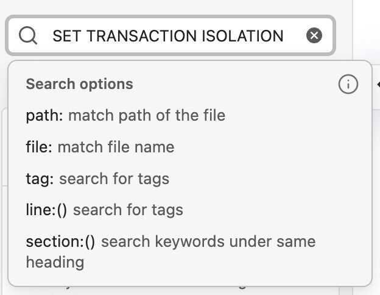

# Obsidian

Obsidian is a powerful and extensible knowledge base that works on top of your local folder of plain text files.

## Extensions

Extensions that helps make obsidian better

- Advanced Tables
- Outliners (Outlines like Roam Research)
- DataView - [How to use the Obsidian Dataview plugin](https://www.youtube.com/watch?v=JTObSymEvWA)
- Kanban
    - [GitHub - mgmeyers/obsidian-kanban: Create markdown-backed Kanban boards in Obsidian.](https://github.com/mgmeyers/obsidian-kanban)
    - [Obsidian Kanban Plugin - Obsidian Kanban Plugin - Obsidian Publish](https://publish.obsidian.md/kanban)
    - [Set a WIP Limit - Obsidian Kanban Plugin - Obsidian Publish](https://publish.obsidian.md/kanban/How+do+I/Set+a+WIP+Limit)
- Calendar
- Outliner
- Obsidian Git
- Mind Map
- Natural Language Dates
- Day Planner
- Periodic Notes
- Paste URL into selection
- Recent Files
- Auto Link Title
- Automatically Reveal Active File
- Wikipedia
- Editing Toolbar / Obsidian Markdown formattting Assistant
- Linter
- Reading Time
- Templater
- Spaced Repetition (Flashcards)
- [Regex Find/Replace](https://github.com/Gru80/obsidian-regex-replace)
- [GitHub - zsviczian/excalibrain: A graph view to navigate your Obsidian vault](https://github.com/zsviczian/excalibrain)
- [GitHub - valentine195/obsidian-leaflet-plugin: Adds interactive maps to Obsidian using Leaflet.js](https://github.com/valentine195/obsidian-leaflet-plugin)
- [GitHub - SkepticMystic/breadcrumbs: Visualise a custom hierarchy in your Obsidian vault. API: https://skepticmystic.github.io/breadcrumbs/](https://github.com/SkepticMystic/breadcrumbs)
- [My Top 44 Obsidian Plugins RANKED](https://www.youtube.com/watch?v=xVQGrn9gQKI)

## Themes

[Ultimate guide to best Obsidian themes | Elizabeth Butler](https://elizabethbutlermd.com/5-of-the-best-custom-minimalist-digital-note-taking-themes-for-obsidian-in-2022/)

[7+ Obsidian Themes for a Drastic Design Facelift!](https://akshayhallur.com/blog/best-obsidian-themes)

- Things (current)

## Obsidian Shortcuts

| **Todo** | **Shortcut** |
| ---- | ---- |
| Search in all files | `Cmd+Shift+F` |
| Toggle edit/preview mode | `Ctrl/Cmd E` |
| Insert External link | `Ctrl/Cmd-K` |
| Indent | `Ctrl/Cmd-]` |
| Unindent | `Cmd-[` |
| Jump into selected backlink | `Alt/Opt-Enter` |
| Navigate forward | `cmd+ctrl + ->` |
| Naviagte back | `cmd+ctrl + <-` |
| Add current date | Insert current date (cmd + y) |
| Add checkbox | `cmd + L` |
| Delete the line |  |
| Insert Current Date | `cmd + D` |
| Strikethrough | `cmd + shift + x` |

### Some basics

- Make new note - Cmd-n
- Create note in new pane - Cmd-shift-n
- Open the link you're hovering over in a new pane (while in edit mode)- Cmd-click
- Toggle edit/preview mode - Cmd-e
- Open quick switcher - Cmd-o
- Close active pane - Cmd-w
- Formatting basics
- Undo, cut, copy, paste, bold, italicize - Cmd-z,x,c,v,b,i

### Intermediate

- Open command palette - Cmd-p
- Search and replace in current file - Cmd-f
- Search in all files - Cmd-shift-f
- Some faves for outlining
- Swap line up - I mapped this to:Cmd-1
- Swap line down - I mapped this to:Cmd-2
- Toggle fold on current line - I mapped this toCmd-3
- Toggle line to bulleted of numbered list† - I mapped this toCmd-4
- †: Requires the plugin "Hotkeys++"
- Formatting intermediate
- Insert template - I mapped this to:Cmd-t

### Advanced

- Changing the view
- Load workspace - I mapped this to:Shift-Esc
- Manage workspaces - I mapped this to:Control-Esc
- Toggle left sidebar - I mapped this to:Cmd-LeftArrow
- Toggle right sidebar - I mapped this to:Cmd-RightArrow
- Some secret weapons
- Navigate back - I mapped this to:Opt-a
- Navigate forward - I mapped this to:Opt-s
- Programmed to my mouse
- Open previous daily note - extra mouse button back
- Open next daily note - extra mouse button forward
- Open my Home note - When I click this mouse button, it typesCmd-o, 000, Enter
- Setup and File Management
- Open settings - Cmd-,
- Show in system explorer - I mapped this to:Cmd-ctrl-opt-i
- Reveal active file in navigation - I mapped this to:Cmd-ctrl-i
- Move file to another folder - I mapped this to:Cmd-shift-i
- Open another vault - I mapped this to:Cmd-ctrl-opt-o
- Note Management
- Toggle pin - I mapped this to:Cmd-shift-e
- Note Refactor: Extract selection to new note - first line as file name†† - I mapped this to:Cmd-shift-r
- Edit file title - I mapped this to:Cmd-l(then hitenterto return to the note)
- Calendar: Open Weekly Note - I mapped this to:Cmd-shift-m
- ††: Requires the plugin "Note Refactor"
- †††: Requires the plugin "Calendar"

### Search

- line:(old school)
- line:("old school")
- line:("old school") -path:Readwise (can be saved in a new note using native query)

## LYT - Linking Your Thinking

- obsidian
- [My 2020 Comprehensive Obsidian Workflow For Zettelkasten and Evergreen Notes](https://www.youtube.com/watch?v=Ewhfok91AdE)
- [Obsidian Plugins (0.9.10) - My top plugins in the Obsidian app](https://www.youtube.com/watch?v=X61wRmfZU8Y)
- https://github.com/obsidianmd
- https://github.com/ransurf/obsidian-resources
- https://forum.obsidian.md/t/example-workflows-in-obsidian/1093
- https://forum.obsidian.md/t/plugin-for-flashcards-note-level-spaced-repetition-all-inside-obsidian/16498
- https://github.com/st3v3nmw/obsidian-spaced-repetition
- https://github.com/theohbrothers/ConvertOneNote2MarkDown
- https://www.linkingyourthinking.com/lyt-kit-v5-overview

## Publish Free

- **[Build optimized websites quickly, focus on your content | Docusaurus](https://docusaurus.io)**
- [10 Obsidian Publish Alternatives to Publish Your Notes Online for Free](https://beingpax.medium.com/7-obsidian-publish-alternatives-to-publish-your-notes-online-for-free-33db4fb06f5)
- https://github.com/jackyzha0/quartz - 1.4k
- https://github.com/mathieudutour/gatsby-digital-garden - 575
- https://github.com/maximevaillancourt/digital-garden-jekyll-template - 566
- https://github.com/secure-77/Perlite - 328
- https://github.com/TuanManhCao/digital-garden - 281
- https://github.com/jobindjohn/obsidian-publish-mkdocs - 207
- https://github.com/yoursamlan/pubsidian - 204
- https://github.com/Jekyll-Garden/jekyll-garden.github.io - 191
- **https://github.com/codebushi/gatsby-theme-document - 124**
- https://github.com/theowenyoung/gatsby-theme-primer-wiki - 73
- https://github.com/theowenyoung/obsidian-template-gatsby-theme-primer-wiki
    - https://thomassajot.github.io/brain-dam
    - https://demo-gatsby-starter-primer-wiki.owenyoung.com
    - https://demo-obsidian.owenyoung.com/
- https://github.com/flowershow/flowershow - 156
- https://forum.obsidian.md/t/obsidian-mkdocs-a-free-publish-alternative-workflow/29540
- https://forum.obsidian.md/t/pubsidian-free-and-elegant-obsidian-publish-alternative/21825
- [GitHub - nikitavoloboev/knowledge: Everything I know](https://github.com/nikitavoloboev/knowledge)

## Publish / Examples / Showcases / Codex

- [Second Brain Showcases Awesome](https://github.com/KasperZutterman/Second-Brain)
- https://publish.obsidian.md/chromatically/publish+homepage
- https://www.nitinpai.in/
- https://publish.obsidian.md/alexisrondeau/Welcome+to+my+digital+garden
- https://publish.obsidian.md/myquantumwell/Welcome+to+The+Quantum+Well
- https://publish.obsidian.md/planet
- https://publish.obsidian.md/christopher/%2BWelcome+to+Chris's+note-in-use
- https://quartz.jzhao.xyz/notes/showcase/
- https://scalingsynthesis.com
- https://publish.obsidian.md/andymatuschak/Andy+Matuschak/Evergreen+notes
- https://filipedonadio.com/
- https://forum.obsidian.md/t/the-all-obsidian-publish-s-collection-by-leo-latest-update-20210324/7248
- https://hiran.in/notes
- https://vinzent03.github.io/obsidian-advanced-uri
- https://wiki.nikiv.dev/
- [Slate Star Codex](https://slatestarcodex.com/)
- [https://arpitbhayani.me/](https://arpitbhayani.me/)

### Blogs example templates

- https://mathieudutour.github.io/gatsby-digital-garden
- https://jackiexiao.github.io/foam/backlinking
- https://hikerpig.github.io/foam-jekyll-template

## Company Knowledge Base

- **Confluence**
- **Outline** - [GitHub - outline/outline: The fastest knowledge base for growing teams. Beautiful, realtime collaborative, feature packed, and markdown compatible.](https://github.com/outline/outline)
    - [Outline – Team knowledge base & wiki](https://www.getoutline.com/)
- [GitBook - Where technical teams document](https://www.gitbook.com/)
- https://orgmode.org
- https://www.orgroam.com

## Others

- [**https://github.com/logseq/logseq**](https://github.com/logseq/logseq) - A privacy-first, open-source platform for knowledge management and collaboration
- [**https://github.com/foambubble/foam**](https://github.com/foambubble/foam)
- https://wiki.dendron.so
- https://github.com/standardnotes/app
- Roam Research
- https://www.producthunt.com/posts/heyday-4 - Automatically organize content - without learning a new app
- https://www.producthunt.com/posts/reflect-notes - Fast networked note-taking
- Notion - [The ULTIMATE Second Brain Setup in Notion](https://www.youtube.com/watch?v=vs8WQh2k-Ow)
- AppFlowy - Open-source alternative to Notion
- https://anytype.io/en
- [Dendron](https://www.dendron.so/)
- [Heptabase](https://heptabase.com/)

https://www.slant.co/topics/4962/~knowledge-base-systems-for-personal-use

## Others

- Use DriveSync to sync using Google Drive
- https://dev.to/joeholmes/creating-a-diy-digital-garden-with-obsidian-and-gatsby-378e
- https://foambubble.github.io/foam/user/recipes/recipes
