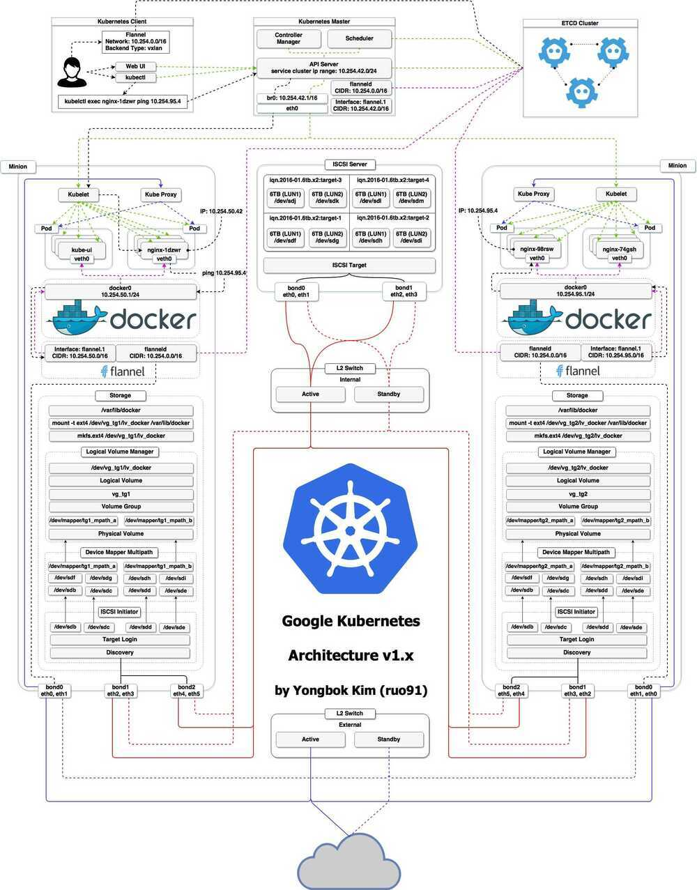
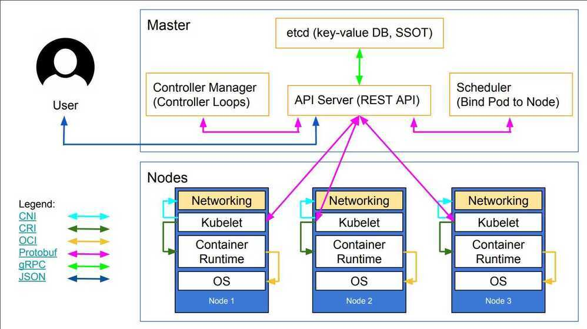
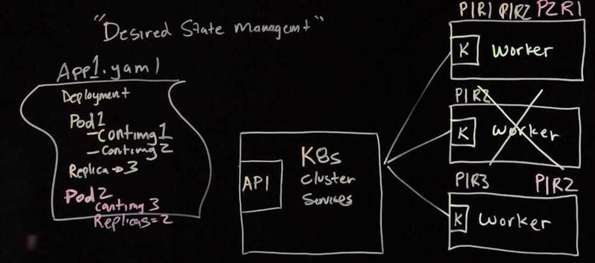

# Architecture

## Kubernetes Architecture

### Kubernetes Master Node

- API Server
- Scheduler
- Controller (Coordinator of entire cluster) / watches the desired state it manages
- Distributed key-value store - etcd (distributed key value database, single source of truth)

### Kubernetes Worker Nodes

- kube-proxy (ensure that communication is running between all the containers)
- kubelet (report health to etcd and the kubernetes master)
- Supervisord (Docker and kubelet are packaged into this layer. A process manager where you can run multiple processes, inside one parent process)
- fluentd (responsible for managing the logs and talking to the central logging service)

### Registry

- DockerHub
- GoogleCloud / ECR

## Nodes

A node is a worker machine in Kubernetes, previously known as aminion. A node may be a VM or physical machine, depending on the cluster. Each node contains the services necessary to run [pods](https://kubernetes.io/docs/concepts/workloads/pods/pod/) and is managed by the master components. The services on a node include the [container runtime](https://kubernetes.io/docs/concepts/overview/components/#node-components), kubelet and kube-proxy.

## Node Controller

The node controller is a Kubernetes master component which manages various aspects of nodes.

https://learnk8s.io/kubernetes-node-size

## Others

https://cloudyuga.guru/blog/cloud-controller-manager
