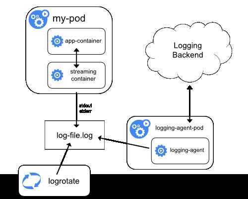

# Logging Architecture

The easiest and most embraced logging method for containerized applications is to write to the **standard output and standard error streams**.

However, the native functionality provided by a container engine or runtime is usually not enough for a complete logging solution. For example, if a container crashes, a pod is evicted, or a node dies, you'll usually still want to access your application's logs. As such, logs should have a separate storage and lifecycle independent of nodes, pods, or containers. This concept is calledcluster-level-logging. Cluster-level logging requires a separate backend to store, analyze, and query logs. Kubernetes provides no native storage solution for log data, but you can integrate many existing logging solutions into your Kubernetes cluster.

## References

https://kubernetes.io/docs/concepts/cluster-administration/logging

https://github.com/moby/moby/issues/7440
