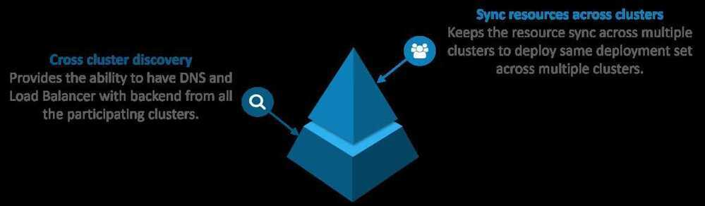

# Cluster Administration

1. Cluster Administration Overview
2. Certificates
3. Cloud Providers
4. Managing Resources
5. Cluster Networking
6. Logging Architecture
7. Configuring kubelet Garbage Collection
8. Federation
9. Proxies in Kubernetes
10. Controller manager metrics
11. Installing Addons

## Federation

Multiple Kubernetes clusters can be managed as a single cluster with the help of federated clusters. So, you can create multiple Kubernetes clusters within a data center/cloud and use federation to control/manage them all at one place.

Kubernetes Cluster Federation (KubeFed for short) allows you to coordinate the configuration of multiple Kubernetes clusters from a single set of APIs in a hosting cluster. KubeFed aims to provide mechanisms for expressing which clusters should have their configuration managed and what that configuration should be. The mechanisms that KubeFed provides are intentionally low-level, and intended to be foundational for more complex multicluster use cases such as deploying multi-geo applications and disaster recovery.

The federated clusters can achieve this by doing the following two things

1. Cross cluster discovery
2. Sync resources across clusters

https://github.com/kubernetes-sigs/kubefed
