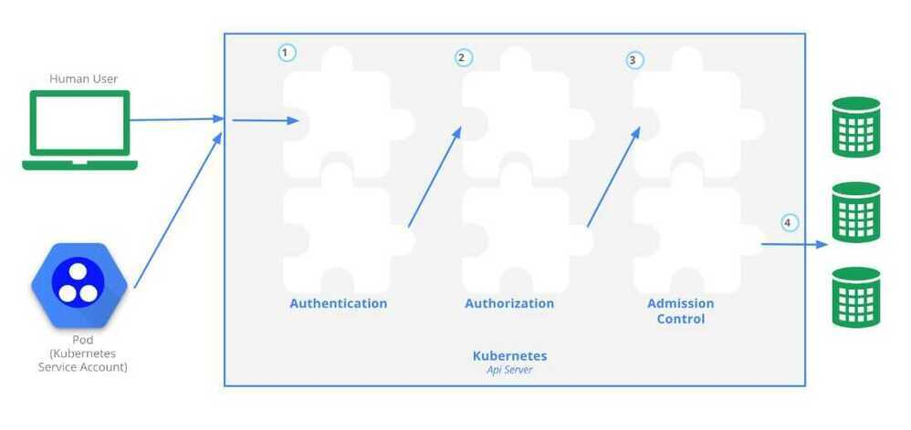

# Policies

## Limit Ranges

## Resource Quotas

When several users or teams share a cluster with a fixed number of nodes, there is a concern that one team could use more than its fair share of resources.

Resource quotas are a tool for administrators to address this concern.

A resource quota, defined by a ResourceQuota object, provides constraints that limit aggregate resource consumption per namespace. It can limit the quantity of objects that can be created in a namespace by type, as well as the total amount of compute resources that may be consumed by resources in that project.

Resource quotas work like this:

- Different teams work in different namespaces. Currently this is voluntary, but support for making this mandatory via ACLs is planned.
- The administrator creates one ResourceQuota for each namespace.
- Users create resources (pods, services, etc.) in the namespace, and the quota system tracks usage to ensure it does not exceed hard resource limits defined in aResourceQuota.
- If creating or updating a resource violates a quota constraint, the request will fail with HTTP status code403 FORBIDDEN with a message explaining the constraint that would have been violated.
- If quota is enabled in a namespace for compute resources like cpu and memory, users must specify requests or limits for those values; otherwise, the quota system may reject pod creation. Hint: Use the LimitRanger admission controller to force defaults for pods that make no compute resource requirements.

kubectl create quota myrq --hard=cpu=1, memory=1G, pods=2 --dry-run -o yaml

https://kubernetes.io/docs/concepts/policy/resource-quotas

https://kubernetes.io/docs/tasks/administer-cluster/manage-resources/quota-memory-cpu-namespace

https://kubernetes.io/docs/tasks/administer-cluster/manage-resources/memory-default-namespace

```
## apiVersion: v1
## kind: LimitRange
## metadata
## name: mem-limit-range
## spec
## limits

- **default**:
## memory: 512Mi
## defaultRequest
## memory: 256Mi
## type: Container
## Security
```

- **admission control system**, which lets you look at and possibly modify the requests that are coming in, and do a final deny or accept on those requests.
- How you can secure your Pods more tightly using **security contexts and pod security policies**, which are full-fledged API objects in Kubernetes.
- **Network policies**. By default, we tend not to turn on network policies, which letany traffic flow through all of our pods, in all the different namespaces. Using network policies, we can actually define Ingress rules so that we can restrict the Ingress traffic between the different namespaces. The network tool in use, such as Flannel or Calico will determine if a network policy can be implemented.



https://kubernetes.io/docs/reference/access-authn-authz/controlling-access

1. **Authentication**

There are three main points to remember with authentication in Kubernetes:

- In its straightforward form, authentication is done with certificates, tokens or basic authentication (i.e. username and password).
- Users are not created by the API, but should be managed by an external system.
- System accounts are used by processes to access the API

There are two more advanced authentication mechanisms: Webhooks which can be used to verify bearer tokens, and connection with an external OpenID provider.

The type of authentication used is defined in thekube-apiserverstartup options. Below are four examples of a subset of configuration options that would need to be set depending on what choice of authentication mechanism you choose:

--basic-auth-file

--oidc-issuer-url

--token-auth-file

--authorization-webhook-config-file

One or more Authenticator Modules are used: x509 Client Certs;static token, bearer or bootstrap token; static password file; service account and OpenID connect tokens. Each is tried until successful, and the order is not guaranteed.Anonymous access can also be enabled, otherwise you will get a 401 response. Users are not created by the API, and should be managed by an external system.

https://kubernetes.io/docs/reference/access-authn-authz/authentication

2. **Authorization**

There are three main authorization modes and two global Deny/Allow settings. The three main modes are:

- ABAC (Attribute Based Access Control)

Policies are defined in a JSON file and referenced to by akube-apiserverstartup option:

--authorization-policy-file=my_policy.json

For example, the policy file shown belowauthorizes user Bob to read pods in the namespacefoobar:

```json
{
 "apiVersion": "abac.authorization.kubernetes.io/v1beta1",
  "kind": "Policy",
 "spec": {
    "user": "bob",
    "namespace": "foobar",
    "resource": "pods",
    "readonly": true
 }
}
```

- RBAC (Role Based Access Control)

All resources are modeled API objects in Kubernetes, from Pods to Namespaces. They also belong to API Groups, such as **core** and **apps**. These resources allow operations such as Create, Read, Update, and Delete (CRUD), which we have been working with so far. Operations are called **verbs** inside YAML files. Adding to these basic components, we will add more elements of the API, which can then be managed via RBAC.

Rules are operations which can act upon an API group. Roles are a group of rules which affect, or scope, a single namespace, whereas **ClusterRoles** have a scope of the entire cluster.

Each operation can act upon one of three subjects, which are **User Accounts** which don't exist as API objects, **Service Accounts**, and **Groups** which are known as **clusterrolebinding** when using kubectl.

RBAC is then writing rules to allow or deny operations by users, roles or groups upon resources.

While RBAC can be complex, the basic flow is to create a certificate for a user. As a user is not an API object of Kubernetes, we are requiring outside authentication, such as OpenSSL certificates. After generatingthe certificate against the cluster certificate authority, we can set that credential for the user using a context.

Roles can then be used to configure an association of **apiGroups**, **resources**, and the **verbs** allowed to them. The user can then be bound to a role limiting what and where they can work inthe cluster.

Here is a summary of the RBAC process:

- Determine or create namespace
- Create certificate credentials for user
- Set the credentials for the user to the namespace using a context
- Create a role for the expected task set
- Bind the user to the role
- Verify the user has limited access.

- Webhook

They can be configured as kube-apiserver startup options:

```
--authorization-mode=ABAC
--authorization-mode=RBAC
--authorization-mode=Webhook
--authorization-mode=AlwaysDeny
--authorization-mode=AlwaysAllow
```

The authorization modes implement policies to allow requests. Attributes of the requests are checked against the policies (e.g. user, group, namespace, verb).

3. **Adminssion Controller**

Admission controllers are pieces of software that can access the content of the objects being created by the requests. They can modify the content or validate it, and potentially deny the request.

Admission controllers are needed for certain features to work properly. Controllers have been added as Kubernetes matured. Starting with the 1.13.1 release of thekube-apiserver, the admission controllers are now compiled into the binary, instead of a list passed during execution. To enable or disable, you can pass the following options, changing out the plugins you want to enable or disable:

--enable-admission-plugins=Initializers, NamespaceLifecycle, LimitRanger

--disable-admission-plugins=PodNodeSelector

The first controller isInitializerswhich will allow the dynamic modification of the API request, providing great flexibility. Each admission controller functionality is explained in the documentation. For example, theResourceQuotacontroller will ensure that the object created does not violate any of the existing quotas.

## Security Contexts

Pods and containers within pods can be given specific security constraints to limit what processes running in containers can do. For example, the UID of the process, the Linux capabilities, and the filesystem group can be limited.

This security limitation is called a security context. It can be defined for the entire pod or per container, and is represented as additional sections in the resources manifests. The notable difference is that Linux capabilities are set at the container level.

For example, if you want to enforce a policy that containers cannot run their process as the root user, you can add a pod security context like the one below:

```yaml
apiVersion: v1
kind: Pod
metadata:
name: nginx
spec:
securityContext:
  runAsNonRoot: true
containers:
- image: nginx
  name: nginx
```

Then, when you create this Pod, you will see a warning that the container is trying to run as root and that it is not allowed. Hence, the Pod will never run:

`$ kubectl get pods`

NAME READY STATUS RESTARTS AGE

nginx 0/1 container has runAsNonRoot and image will run as root 0 10s

https://kubernetes.io/docs/tasks/configure-pod-container/security-context

## Pod Security Policies (PSP)

Pod Security Policies enable fine-grained authorization of pod creation and updates.

APod Security Policy is a cluster-level resource that controls security sensitive aspects of the pod specification. ThePodSecurityPolicyobjects define a set of conditions that a pod must run with in order to be accepted into the system, as well as defaults for the related fields.

To automate the enforcement of security contexts, you can define [PodSecurityPolicies](https://kubernetes.io/docs/concepts/policy/pod-security-policy/)(PSP). A PSP is defined via a standard Kubernetes manifest following the PSP API schema. An example is presented below.

https://kubernetes.io/docs/concepts/policy/pod-security-policy

A policy to limit the ability of pods to elevate permissions or modify the node upon which they are scheduled. This wide-ranging limitation may prevent a pod from operating properly. The use of PSPs may be replaced by**Open Policy Agent(OPA)** in the future.

While PSP has been helpful, there are other methods gaining popularity. The [Open Policy Agent](https://www.openpolicyagent.org/)(OPA), often pronounced as "oh-pa", provides a unified set of tools and policy framework. This allows a single point of configuration for all of your cloud deployments.

## Open Policy Agent(OPA)

The Open Policy Agent (OPA) is an open source, general-purpose policy engine that enables unified, context-aware policy enforcement across the entire stack.

OPA can be deployed as an admission controller inside of Kubernetes, which allows OPA to enforce or mutate requests as they are received. Using the OPA Gatekeeper it can be deployed using Custom Resource Definitions.

You can see an example of a PSP below:

```yaml
apiVersion: policy/v1beta1
kind: PodSecurityPolicy
metadata:
name: restricted
spec:
seLinux:
  rule: RunAsAny
supplementalGroups:
 rule: RunAsAny
runAsUser:
  rule: MustRunAsNonRoot
fsGroup:
 rule: RunAsAny
```

For Pod Security Policies to be enabled, you need to configure the admission controller of the controller-manager to containPodSecurityPolicy. These policies make even more sense when coupled with theRBAC configuration in your cluster. This will allow you to finely tunewhat your users are allowed to run and what capabilities and low level privileges their containers will have.

https://www.openpolicyagent.org

https://github.com/open-policy-agent/opa

## Network Policies

A network policy is a specification of how groups of pods are allowed to communicate with each other and other network endpoints.

NetworkPolicyresources use labels to select pods and define rules which specify what traffic is allowed to the selected pods.

Network policies allow you to define rules that determine what type of traffic is allowed to flow between different services. Using network policies you can also define rules to restrict traffic. They are a means to improve your cluster's security.

For example, you can only allow traffic from frontend to backend in your application.

Network policies also help in isolating traffic within namespaces. For instance, if you have separate namespaces for development and production, you can prevent traffic flow between them by restrict pod to pod communication within the same namespace.

The use of policies has become stable, noted with thev1 apiVersion. The example below narrows down the policy to affect the default namespace.

Only Pods with the label ofrole: dbwill be affected by this policy, and the policy has both Ingress and Egress settings.

Theingresssetting includes a172.17network, with a smaller range of172.17.1.0IPs being excluded from this traffic.

```yaml
apiVersion: networking.k8s.io/v1
kind: NetworkPolicy
metadata:
name: ingress-egress-policy
namespace: default
spec:
podSelector:
 matchLabels:
  role: db
 policyTypes:
- Ingress
- Egress
ingress:
- from:
- ipBlock:
   cidr: 172.17.0.0/16
   except:
  - 172.17.1.0/24
- namespaceSelector:
  matchLabels:
   project: myproject
- podSelector:
  matchLabels:
   role: frontend
 ports:
- protocol: TCP
 port: 6379
egress:
- to:
- ipBlock:
  cidr: 10.0.0.0/24
ports:
- protocol: TCP
 port: 5978
```

These rules change the namespace for the following settings to be labeledproject: myproject. The affected Pods also would need to match the labelrole: frontend. Finally, TCP traffic on port 6379 would be allowed from these Pods.

The egress rules have thetosettings, in this case the10.0.0.0/24range TCP traffic to port 5978.

The use of empty ingress or egress rules denies all type of traffic for the included Pods, though this is not suggested. Use another dedicatedNetworkPolicyinstead.

## Default Policy

The empty braces will match all Pods not selected by otherNetworkPolicyand will not allow ingress traffic. Egress traffic would be unaffected by this policy.

```yaml
apiVersion: networking.k8s.io/v1
kind: NetworkPolicy
metadata:
name: default-deny
spec:
podSelector: {}
policyTypes:
- Ingress
```

https://kubernetes.io/docs/concepts/services-networking/network-policies

## Links

- [Migrate from PodSecurityPolicy to the Built-In PodSecurity Admission Controller | Kubernetes](https://kubernetes.io/docs/tasks/configure-pod-container/migrate-from-psp/)
- [Migrating from Pod Security Policies: A Comprehensive Guide (Part 1: Transitioning to PSA) | HackerNoon](https://hackernoon.com/migrating-from-pod-security-policies-a-comprehensive-guide-part-1-transitioning-to-psa)
