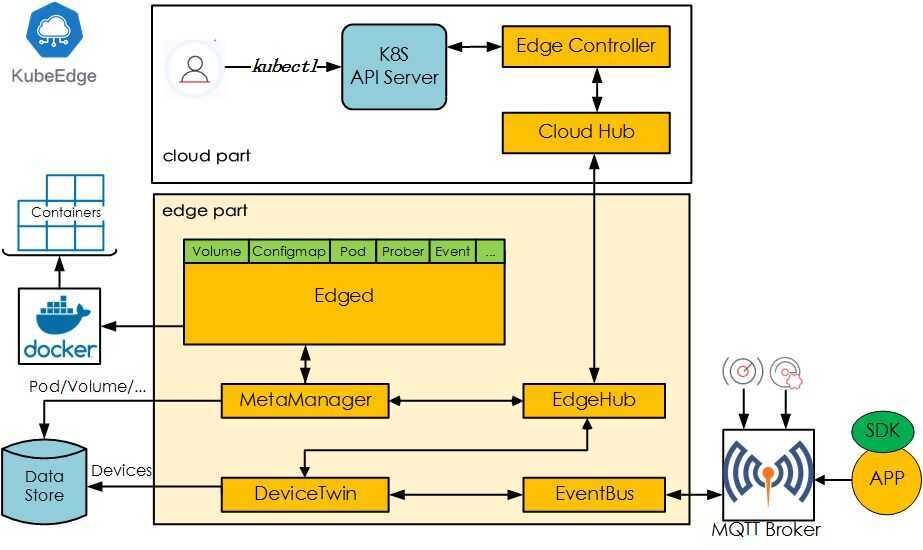

# KubeEdge

KubeEdge is an open source system for extending native containerized application orchestration capabilities to hosts at Edge.It is built upon kubernetes and provides fundamental infrastructure support for network, app. deployment and metadata synchronization between cloud and edge. It also supportsMQTTand allows developers to author custom logic and enable resource constrained device communication at the Edge. KubeEdge consists of a cloud part and an edge part.

## Advantages

## Edge Computing

With business logic running at the Edge, much larger volumes of data can be secured & processed locally where the data is produced. Edge nodes can run autonomously which effectively reduces the network bandwidth requirements and consumptions between Edge and Cloud. With data processed at the Edge, the responsiveness is increased dramatically and data privacy is protected.

## Simplified development

Developers can write regular http or mqtt based applications, containerize them, and run them anywhere - either at the Edge or in the Cloud - whichever is more appropriate.

## Kubernetes-native support

With KubeEdge, users can orchestrate apps, manage devices and monitor app and device status on Edge nodes just like a traditional Kubernetes cluster in the Cloud. Locations of edge nodes are transparent to customers.

## Abundant applications

It is easy to get and deploy existing complicated machine learning, image recognition, event processing and other high level applications to the Edge.

## Introduction

KubeEdge is composed of the following components:

- **Edged:**an agent that runs on edge nodes and manages containerized applications.
- **EdgeHub:**a web socket client responsible for interacting with Cloud Service for the edge computing (like Edge Controller as in the KubeEdge Architecture). This includes syncing cloud-side resource updates to the edge, and reporting edge-side host and device status changes to the cloud.
- **CloudHub:**a web socket server responsible for watching changes at the cloud side, caching and sending messages to EdgeHub.
- **EdgeController:**an extended kubernetes controller which manages edge nodes and pods metadata so that the data can be targeted to a specific edge node.
- **EventBus:**a MQTT client to interact with MQTT servers (mosquitto), offering publish and subscribe capabilities to other components.
- **DeviceTwin:**responsible for storing device status and syncing device status to the cloud. It also provides query interfaces for applications.
- **MetaManager:**the message processor between edged and edgehub. It is also responsible for storing/retrieving metadata to/from a lightweight database (SQLite).

## Architecture

## References

https://kubeedge.io/en

https://github.com/kubeedge/kubeedge
