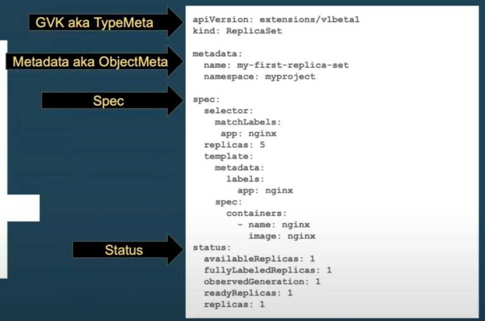

# Kubernetes Manifests Examples

## Resource Schema Components (Manifests)

- GVK (Group Version Kind) aka TypeMeta - apiVersion & Kind
- Metadata aka ObjectMeta
- Spec
- Status (only controllers fills it out)



### Configmap

```yaml
apiVersion: v1
kind: ConfigMap
metadata:
  name: nginx-configmap
  namespace: zenalytix
data:
  nginx.conf: |
    user root;
    worker_processes auto;
    pid /var/run/nginx.pid;
    error_log /var/log/nginx/error.log warn;
    events {
            worker_connections 2048;
            # multi_accept on;
    }

---

apiVersion: v1
kind: ConfigMap
metadata:
  name: loanetl-configmap
  namespace: apps
data:
  DEBUG: "False"

  AWS_ACCESS_KEY_ID: "xxx"
  AWS_SECRET_ACCESS_KEY: "xxx"

  # aws redshift credentials"
  REDSHIFT_DB_HOST: "host"
  REDSHIFT_DB_PORT: "5439"
  REDSHIFT_DB_DBNAME: "dbname"
  REDSHIFT_DB_USER: "user"
  REDSHIFT_DB_PASSWORD: "pass"
```

### Service

```yaml
apiVersion: v1
kind: Service
metadata:
 name: nginx
 namespace: nginx
 labels:
  name: nginx
spec:
 type: LoadBalancer / ClusterIP
 ports:
  - port: 80
  targetPort: 80
  protocol: TCP
  name: http
 selector:
  name: nginx
```

### Deployments

```yaml
apiVersion: apps/v1
kind: Deployment
metadata:
  labels:
    name: flask-republisher
  name: flask-republisher
  namespace: consumers
spec:
  replicas: 1
  selector:
    matchLabels:
      name: flask-republisher
  minReadySeconds: 10
  strategy:
 type: RollingUpdate
 rollingUpdate:
   maxSurge: 1
   maxUnavailable: 0
  template:
    metadata:
      labels:
        name: flask-republisher
    spec:
      containers:
        - name: flask-republisher
          image: image
          imagePullPolicy: IfNotPresent
   ports:
   - containerPort: 80
          env:
            - name: DEBUG
              value: "True"
          envFrom:
            - configMapRef:
                name: nginx-env-configmap
   volumeMounts:
            - mountPath: /root/zenalytix
              name: zenalytix-data
            - mountPath: /etc/nginx/nginx.conf
              name: nginx-configmap
              subPath: nginx.conf
          command:
            - /bin/bash
            - -c
            - |
              python manage.py test
   startupProbe:
   httpGet:
    path: /healthz
    port: liveness-port
   failureThreshold: 30
   periodSeconds: 10
   readinessProbe:
   httpGet:
    path: /
    port: 5000
   initialDelaySeconds: 5
   periodSeconds: 5
   timeoutSeconds: 5
   successThreshold: 1
   failureThreshold: 3
          livenessProbe:
            httpGet:
              path: /healthz
              port: 5000
            initialDelaySeconds: 10
            periodSeconds: 10
   resources:
   requests:
    memory: 256Mi / 8Gi
    cpu: 250m / 1000m
   limits:
    memory: 3Gi
    cpu: 3000m
      volumes:
        - name: config-volume
          - name: nginx-configmap
       configMap:
      name: nginx-configmap

      restartPolicy: Always
```

### statefulsets

```yaml
apiVersion: apps/v1
kind: StatefulSet
metadata:
    name: jupyterlab
    namespace: jlab
    labels:
    name: jupyterlab
spec:
    serviceName: jupyterlab
```

### Shared Volume Data between two containers

```yaml
apiVersion: apps/v1
kind: Deployment
metadata:
    labels:
    name: flask-republisher
    name: flask-republisher
    namespace: consumers
spec:
    replicas: 1
    selector:
    matchLabels:
        name: flask-republisher
    template:
    metadata:
        labels:
        name: flask-republisher
    spec:
        containers:
        - name: flask-republisher
            image: gcr.io/abc-data-archiver/kafka_republisher:1.1.6
            imagePullPolicy: IfNotPresent
            ports:
            - containerPort: 80
            env:
            - name: DEBUG
                value: "False"
            envFrom:
            - configMapRef:
                name: kafka-flask-config
            command:
            - /bin/bash
            - -c
            - |
                gunicorn kafka_flask_republisher:app -b 0.0.0.0:5000 --workers 2 -k gevent --timeout 300 --worker-connections 1000 --max-requests 1000000 --limit-request-line 8190 --access-logfile /var/log/access.log
            volumeMounts:
            - name: shared-data
                mountPath: /var/log/
            livenessProbe:
            httpGet:
                path: /status
                port: 5000
            initialDelaySeconds: 10
            periodSeconds: 10

        - name: telegraf
            image: telegraf:1.12.3-alpine
            imagePullPolicy: IfNotPresent
            volumeMounts:
            - name: shared-data
                mountPath: /var/log/
            - mountPath: /etc/telegraf/telegraf.conf
                name: kafka-flask-telegraf-config
                subPath: telegraf.conf

        - name: logrotate
            image: blacklabelops/logrotate:1.3
            imagePullPolicy: IfNotPresent
            env:
            - name: LOGROTATE_INTERVAL
                value: "hourly"
            - name: LOGROTATE_SIZE
                value: "10M"
            - name: LOG_FILE_ENDINGS
                value: "log"
            - name: LOGS_DIRECTORIES
                value: "/var/log"
            - name: LOGROTATE_COPIES
                value: "25"
            - name: TZ
                value: "Asia/Kolkata"
            volumeMounts:
            - name: shared-data
                mountPath: /var/log/
        nodeSelector:
        beta.kubernetes.io/os: linux
        kubernetes.io/role: agent
        type: virtual-kubelet
        tolerations:
        - key: virtual-kubelet.io/provider
            operator: Equal
            value: azure
            effect: NoSchedule
        volumes:
        - name: kafka-flask-telegraf-config
            configMap:
            name: kafka-flask-telegraf-config
        - name: shared-data
            emptyDir: {}
        restartPolicy: Always
```

https://kubernetes.io/docs/tasks/access-application-cluster/communicate-containers-same-pod-shared-volume/

### PVC

```yaml
kind:PersistentVolumeClaim
apiVersion:v1
metadata:
 name:alertdriver-pvc
 namespace:monitoring
spec:
 #for attaching again to same pv
 volumeName:pvc-0ad81c1b-fef6-11e9-9e23-3e36fc17cb95
 storageClassName:managed-premium-retain
 accessModes:
  - ReadWriteOnce
 resources:
  requests:
   storage:1Gi
```

### Cronjob

```yaml
apiVersion: batch/v1beta1
kind: CronJob
metadata:
  name: livenotebook-commit
  namespace: zenalytix
spec:
  # 12:15 AM
  schedule: "15 20 * * *"
  suspend: true #false
  jobTemplate:
    spec:
      template:
        spec:
          containers:
            - name: livenotebook-commit
              image: gcr.io/abc-data-archiver/zenalytix:a7f14578479e
              workingDir: /root/zenalytix/notebooks
              command:
                - /bin/bash
                - -c
                - |
                  sh /root/zenalytix/k8s/scripts/livenotebook-backup.sh
              volumeMounts:
                - mountPath: /root/zenalytix
                  name: zenalytix-data
          restartPolicy: OnFailure
          volumes:
            - name: zenalytix-data
              persistentVolumeClaim:
                claimName: zenalytix-pvc
```

### Job

```yaml
apiVersion: batch/v1
kind: Job
metadata:
  name: pi
spec:
  template:
    spec:
      containers:
      - name: pi
        image: perl:5.34.0
        command: ["perl",  "-Mbignum=bpi", "-wle", "print bpi(2000)"]
      restartPolicy: Never
  backoffLimit: 4
```

### HPA

```yaml
apiVersion: autoscaling/v2beta2
kind: HorizontalPodAutoscaler
metadata:
    name: api-v1-hpa
    namespace: prod
spec:
    scaleTargetRef:
    apiVersion: apps/v1
    kind: Deployment
    name: api-v1
    minReplicas: 3
    maxReplicas: 8
    metrics:
    - type: Resource
    resource:
        name: cpu
        target:
        type: Utilization
        averageUtilization: 90
    - type: Resource
    resource:
        name: memory
        target:
        type: Utilization
        averageUtilization: 80
    behavior:
    scaleDown:
        stabilizationWindowSeconds: 300
        policies:
        - type: Percent
        value: 50
        periodSeconds: 60
        - type: Pods
        value: 2
        periodSeconds: 60
    scaleUp:
        stabilizationWindowSeconds: 0
        policies:
        - type: Percent
        value: 100
        periodSeconds: 15
        - type: Pods
        value: 3
        periodSeconds: 15
        selectPolicy: Max
```

### Example Sidecar - busybox / ubuntu

```yaml
apiVersion: v1
kind: Pod
metadata:
  name: ubuntu
spec:
  containers:
  - name: ubuntu
    image: ubuntu:latest
    # Just spin & wait forever
    command: [ "/bin/bash", "-c", "--" ]
    args: [ "while true; do sleep 600; done;" ]
    volumeMounts:
    - mountPath: /bitnami/postgresql
      name: data
      readOnly: true
  nodeSelector:
    kubernetes.io/hostname: lke163034-239223-343b41fd0000
  tolerations:
  - key: key
    operator: Equal
    value: value
    effect: NoSchedule
  volumes:
  - name: data
    persistentVolumeClaim:
      claimName: data-airflow-postgresql-0
```
