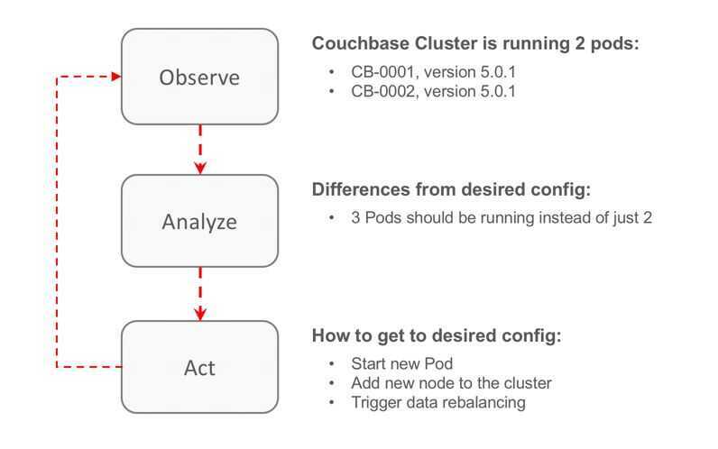
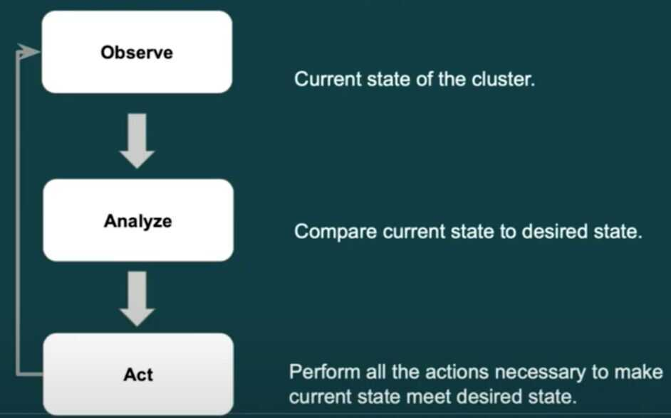

# Operators

https://operatorhub.io

## Operators

An Operator is a method of packaging, deploying and managing a Kubernetes application. A Kubernetes application is an application that is both deployed on Kubernetes and managed using the Kubernetes APIs and kubectl tooling.

To be able to make the most of Kubernetes, you need a set of cohesive APIs to extend in order to service and manage your applications that run on Kubernetes. You can think of Operators as the runtime that manages this type of application on Kubernetes.

It builds upon the basic Kubernetes **resource** and **controller** concepts but includes domain or application-specific **knowledge** to automate common tasks.

## Resources - Pod, ConfigMap, Route

## Controllers - ReplicaSet, DaemonSet, Deployment

## Domain or Application Specific Knowledge

- Installing
- Self-Heal
- Scale
- Clean up
- Update
- Backup
- Restore

## Operator Framework

1. Operator SDK

2. Operator LifeCycle Manager

3. Operator Metering

## Game Changer

An Operator is nothing more than a set of application-specific custom controllers. So, why is it a game-changer? Well, controllers have direct access to Kubernetes API, which means that they can monitor the cluster, change pods/services, scale up/down, and call endpoints of the running applications, all according to custom rules written inside those controllers.

As you can see in the figure above, the Operator monitors and analyzes the cluster, and based on a set of parameters, trigger a series of actions to achieve the desired state. This reconciliation process is all over the place in K8s. But not all actions are equal. In our example, we have two distinct categories:

- Infrastructure: Add a new node. The Operator requests via the Kubernetes API to launch a new Pod running Couchbase Server.

- Domain-specific: Add node to the cluster/trigger data rebalancing.The Operator knows how Couchbase works and calls the correct REST endpoint to add the new node to the cluster and trigger data rebalancing.

That is the real power of Operators:they allow you to write an application to fully manage another, and guess which kind stateful applications are the hardest to manage? You are right: databases.

The Operator's ecosystem is growing quickly; for instance, it lets you deploy something very similar to AWS S3.

Finally, Kubernetes provides a cloud-agnostic application deployment and management. It is so powerful that might lead us to treat cloud providers almost like a commodity, as you will be able to migrate freely between them.

https://dzone.com/articles/why-kubernetes-operators-are-a-game-changer

## Custom Resource Definition (CRDs)

Custom Resources/Controllers - https://kubernetes.io/docs/concepts/extend-kubernetes/api-extension/custom-resources

## Capabilities

1. Basic Install

Automated application provisioning and configuration management

2. Seamless Upgrades

Patch and minor version upgrades supported

3. Full Lifecycle

App lifecycle, storage lifecycle (backup, failure recovery)

4. Deep Insights

Metrics, alerts, log processing and workload analysis

5. Auto Pilot

Horizontal/vertical scaling, auto config tuning, abnormal detection, scheduling tuning

## Creating

## Controllers

## Operator Lifecycle Manager (OLM)

Enable cluster admins to manage Operators on any Kubernetes cluster (dependency management)

## Kafka Operator

1. Automated Provisioning
    - Configuration for Confluent Platform clusters to achieve zero-touch provisioning.
    - Deployment of clusters across multiple racks or availability zones.
    - Integration with [Persistent Volume Claims](https://kubernetes.io/docs/concepts/storage/persistent-volumes/) to store data either on local disk or network attached storage.

2. Cluster Management and Operations
    - Automated rolling update of the Confluent Platform clusters after either a Confluent Platform version, configuration, or resource update
    - Elastic scaling of Kafka clusters up or down by updating cluster configuration.
    - Automated data balancing to distribute replicas evenly across all brokers in a Kafka cluster, after new brokers are added to the cluster during a scale up operation, as well as, before existing brokers are deleted from the cluster during a scale down operation.

3. Resiliency
    - Restoration of a Kafka node to a pod with the same broker id, configuration, and Persistent volumes when a Kafka pod dies

4. Monitoring
    - End-to-end data completeness SLA monitoring with Control Center
    - Exposes Prometheus metrics for additional alerting and monitoring

https://www.confluent.io/blog/introducing-the-confluent-operator-apache-kafka-on-kubernetes

https://github.com/krallistic/kafka-operator

## Prometheus Operator

https://github.com/coreos/prometheus-operator/tree/master/contrib/kube-prometheus

## References

https://github.com/operator-framework

https://coreos.com/operators

https://github.com/operator-framework/awesome-operators

https://cloud.google.com/blog/products/containers-kubernetes/best-practices-for-building-kubernetes-operators-and-stateful-apps

https://github.com/kubernetes-sigs/kubebuilder

https://book.kubebuilder.io

https://codeengineered.com/blog/2018/kubernetes-helm-related-tools

https://medium.com/@cloudark/kubernetes-operators-and-helm-it-takes-two-to-tango-3ff6dcf65619
