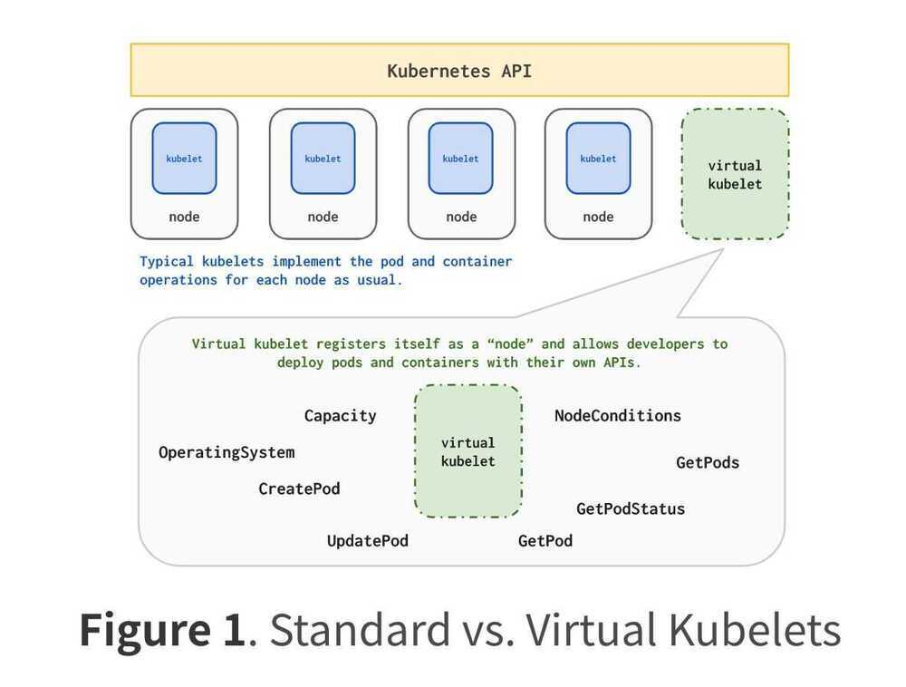
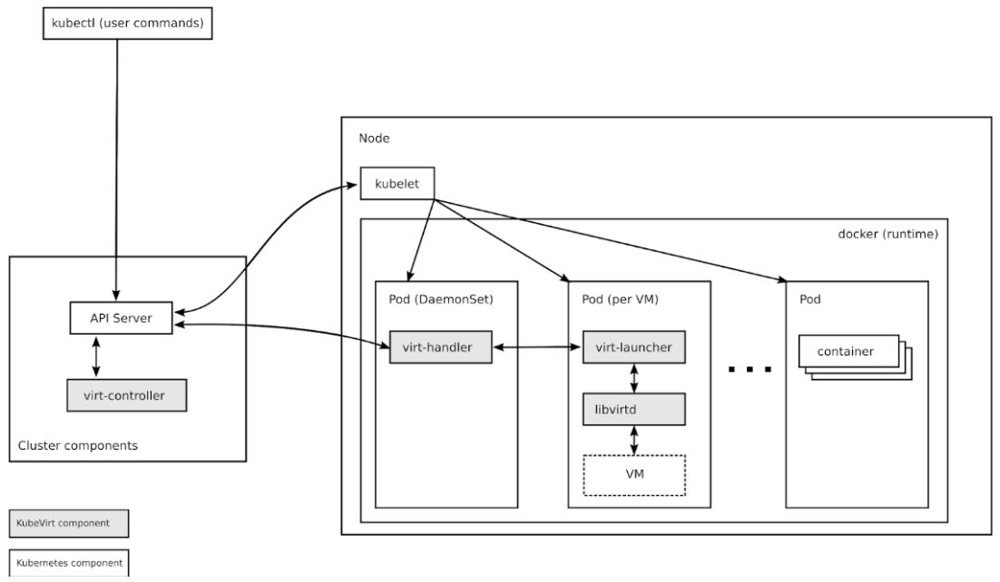

# Others

## Pricing

Pricing table for a 8 node (1 core, 3.5gb) cluster:

|    | Short-term (100 hrs) / per month | Long-term (3yrs committed) / per month |
|----------|-----------------------------|----------------------------------|
| GKE | 40$                             | 125$                                  |
| AKS | 60$                             | 150$                                  |
| EKS | 50$+20$ (master)               | 150$ + 144$ (master)                 |

https://blog.hasura.io/gke-vs-aks-vs-eks-411f080640dc

https://www.toptal.com/kubernetes/k8s-aws-vs-gcp-vs-azure-aks-eks-gke

## Kaniko

[Kaniko](https://github.com/GoogleContainerTools/kaniko) is an open source tool to build container images within Kubernetes

It can build an image using any standard Dockerfile

## Rook

Rook is an open sourcecloud-native storage orchestratorfor Kubernetes, providing the platform, framework, and support for a diverse set of storage solutions to natively integrate with cloud-native environments.

Rook turns storage software into self-managing, self-scaling, and self-healing storage services. It does this by automating deployment, bootstrapping, configuration, provisioning, scaling, upgrading, migration, disaster recovery, monitoring, and resource management. Rook uses the facilities provided by the underlying cloud-native container management, scheduling and orchestration platform to perform its duties.

https://github.com/rook/rook

https://rook.io

## Ceph

[Ceph](https://ceph.com/) is a distributed storage system that provides file, block and object storage and is deployed in large scale production clusters.

https://ceph.com/community/rook-automating-ceph-kubernetes

## knative

Kubernetes-based platform to build, deploy, and manage modern serverless workloads

https://cloud.google.com/knative

https://github.com/knative/serving

https://medium.com/@pczarkowski/introduction-to-knative-b93a0b9aeeef

https://github.com/knative/docs

## CloudEvents

CloudEvents is a specification for describing event data in common formats to provide interoperability across services, platforms and systems.

https://github.com/cloudevents/spec

## Fission

Open Source, Cloud-native Serverless Framework.

- Write short-lived functions in any language, and map them to HTTP requests (or other event triggers).
- Deploy functions instantly with one command. There are no containers to build, and no Docker registries to manage.

## Performance: 100msec cold start

Fission maintains a pool of "warm" containers that each contain a small dynamic loader. When a function is first called, i.e. "cold-started", a running container is chosen and the function is loaded. This pool is what makes Fission fast: cold-start latencies are typically about 100msec.

## Concept

Fission has three main concepts: Functions, Environments, and Triggers

## Functions

A Fission function is something that Fission executes. It's usually a module with one entry point, and that entry point is a function with a certain interface. A number of programming languages are supported for Functions.

## Environments

Environments are the language-specific parts of Fission. An Environment contains just enough software to build and run a Fission Function.

## Triggers

Functions are invoked on the occurrence of an event; a Trigger is what configures Fission to use that event to invoke a function. In other words, a Trigger is a binding of events to function invocations. gi

## Other Concepts

## ARCHIVES

An Archive is a zip file containing source code or compiled binaries. Archives with runnable functions in them are called Deployment

Archives; those with source code in them are called Source Archives.

## PACKAGES

A Package is a Fission object containing a Deployment Archive and a Source Archive. A Package also references a certain environment.

When you create a Package with a Source Archive, Fission automatically builds it using the appropriate builder environment and adds a Deployment Archive to the package.

## SPECIFICATIONS

Specifications (specs for short) are simply YAML config files containing the objects we've spoken about so far - Functions, Environments, Triggers, Packages, and Archives.

https://fission.io

https://github.com/fission/fission

## Seldon Core

An open source platform to deploy your machine learning models on Kubernetes at massive scale.

https://docs.seldon.io/projects/seldon-core/en/v1.1.0

https://www.seldon.io

## Ship

Replicated Ship is a Kubernetes app deployment and automation tool that can:

1. Track and automate the maintenance of 3rd-party applications whether packaged as Helm Charts, Kubernetes YAML manifests, or Knative apps.
2. Quickly develop app [kustomizations](https://www.kustomize.io/) using Ship's easy-to-use import & migration tools.
3. Enable application developers to package and deliver a canonical version of their application configuration while encouraging last-mile customizations through overlays instead of forking or upstream requests.

https://github.com/replicatedhq/ship

https://www.replicated.com/ship

## Virtual Kubelet

Kubeletis the name of the Kubernetes agent that runs on every node of our cluster. When a node boots up, Kubelet is started. It connects to the Kubernetes API server, and it says (more or less) "Hi there, my name isnode752. I have that many cores, that much RAM and disk space. Do you per chance have any pod that I should run?" and after that, it waits for the Kubernetes API server for instructions. The Kubernetes API server registers the node in etcd. From that point, the scheduler knows about the node, and will be able to assign pods to it. When a pod gets assigned to the node, the pod's manifest is pushed to the node, and the node runs it. Later on, the Kubelet will keep updating the API server with the node's status.

Virtual Kubeletis a program that uses the same API as Kubelet. It connects to the API server, introduces itself, and announces that it can run pods. Except, when it is assigned a pod, instead of creating containers (with Docker, CRI-O, containerd, or what have you), Virtual Kubelet will defer that work to a provider like Fargate or ACI.

So Virtual Kubelet looks like a regular cluster node (it shows up in the output ofkubectl get nodes) except that it doesn't correspond to an actual node. Anything scheduled on Virtual Kubelet will run on its configured provider.

https://jpetazzo.github.io/2019/02/13/running-kubernetes-without-nodes-with-kiyot

Virtual Kubelet is an open source [Kubernetes kubelet](https://kubernetes.io/docs/reference/generated/kubelet/) implementation that masquerades as a kubelet for the purposes of connecting Kubernetes to other APIs. This allows the nodes to be backed by other services like ACI, AWS Fargate, [IoT Edge](https://github.com/Azure/iot-edge-virtual-kubelet-provider) etc. The primary scenario for VK is enabling the extension of the Kubernetes API into serverless container platforms like ACI and Fargate, though we are open to others. However, it should be noted that VK is explicitly not intended to be an alternative to Kubernetes federation.

Virtual Kubelet features a pluggable architecture and direct use of Kubernetes primitives, making it much easier to build on.

[https://virtual-kubelet.io](https://virtual-kubelet.io/)

https://github.com/virtual-kubelet/virtual-kubelet

https://docs.microsoft.com/en-us/azure/aks/virtual-kubelet#installation

Others - Kiyot

https://static.elotl.co/docs/latest/kiyot/kiyot.html

## KubeVirt

KubeVirt technology addresses the needs of development teams that have adopted or want to adopt [Kubernetes](https://kubernetes.io/) but possess existing Virtual Machine-based workloads that cannot be easily containerized. More specifically, the technology provides a unified development platform where developers can build, modify, and deploy applications residing in both Application Containers as well as Virtual Machines in a common, shared environment.

Benefits are broad and significant. Teams with a reliance on existing virtual machine-based workloads are empowered to rapidly containerize applications. With virtualized workloads placed directly in development workflows, teams can decompose them over time while still leveraging remaining virtualized components as is comfortably desired.

[https://kubevirt.io](https://kubevirt.io/)

## Kubernetes migrations & Disaster Management

https://github.com/kubemove/kubemove

[**https://github.com/heptio/velero**](https://github.com/heptio/velero)

https://heptio.github.io/velero/master/migration-case.html

https://akomljen.com/kubernetes-backup-and-restore-with-velero

## ExternalDNS

ExternalDNS synchronizes exposed Kubernetes Services and Ingresses with DNS providers.

Inspired by [Kubernetes DNS](https://github.com/kubernetes/dns), Kubernetes' cluster-internal DNS server, ExternalDNS makes Kubernetes resources discoverable via public DNS servers. Like KubeDNS, it retrieves a list of resources (Services, Ingresses, etc.) from the [Kubernetes API](https://kubernetes.io/docs/api/) to determine a desired list of DNS records.UnlikeKubeDNS, however, it's not a DNS server itself, but merely configures other DNS providers accordingly - e.g.[AWS Route 53](https://aws.amazon.com/route53/) or [Google Cloud DNS](https://cloud.google.com/dns/docs/).

In a broader sense, ExternalDNS allows you to control DNS records dynamically via Kubernetes resources in a DNS provider-agnostic way.

https://github.com/kubernetes-sigs/external-dns

## Brigade: Event-based Scripting for Kubernetes

Script simple and complex workflows using JavaScript. Chain together containers, running them in parallel or serially. Fire scripts based on times, GitHub events, Docker pushes, or any other trigger. Brigade is the tool for creating pipelines for Kubernetes.

## Bitnami Kubernetes Production Runtime (BKPR)

Bitnami Kubernetes Production Runtime (BKPR) is a curated collection of the services needed to deploy on top of your Kubernetes cluster to enable logging, monitoring, certificate management, automatic discovery of Kubernetes resources via public DNS servers, and other common infrastructure needs. The services are ready-to-run and pre-integrated with each other, so they work out of the box.

BKPR is open source under the Apache 2 License and is available for Google Kubernetes Engine (GKE), Azure Kubernetes Service (AKS) and Amazon Elastic Container Service for Kubernetes (EKS) clusters.

## Monitoring

- Prometheus
- Grafana
- Alertmanager

## Logging

- Elasticsearch
- Kibana
- Fluentd

## Ingress

- nginx-ingress
- ExternalDNS
- cert-manager
- OAuth2 Proxy

https://kubeprod.io

## Kubernetes Autoscaler

[Cluster Autoscaler](https://github.com/kubernetes/autoscaler/tree/master/cluster-autoscaler)- a component that automatically adjusts the size of a Kubernetes Cluster so that all pods have a place to run and there are no unneeded nodes. Works with GCP, AWS and Azure. Version 1.0 (GA) was released with kubernetes 1.8.

https://github.com/kubernetes/autoscaler/tree/master/cluster-autoscaler

https://github.com/helm/charts/tree/master/stable/cluster-autoscaler

## [Vertical Pod Autoscaler](https://github.com/kubernetes/autoscaler/tree/master/vertical-pod-autoscaler) / VPA

A set of components that automatically adjust the amount of CPU and memory requested by pods running in the Kubernetes Cluster. Current state - beta

https://github.com/kubernetes/autoscaler/tree/master/vertical-pod-autoscaler

https://medium.com/infrastructure-adventures/vertical-pod-autoscaler-deep-dive-limitations-and-real-world-examples-9195f8422724

[https://povilasv.me/vertical-pod-autoscaling-the-definitive-guide/#](https://povilasv.me/vertical-pod-autoscaling-the-definitive-guide/)

## Goldilocks

https://github.com/FairwindsOps/goldilocks

[Addon Resizer](https://github.com/kubernetes/autoscaler/tree/master/addon-resizer)- a simplified version of vertical pod autoscaler that modifies resource requests of a deployment based on the number of nodes in the Kubernetes Cluster. Current state - beta.

https://github.com/kubernetes/autoscaler

## Forge

Forge is an open source tool that lets you deploy source straight into Kubernetes, whether it's for development, testing, or production. Forge supports dependency management, fast parallel builds, and more. Forge is self-contained, and designed to run anywhere from your laptop to your CI system.

https://github.com/datawire/forge

https://forge.sh

## Sonobuoy

Sonobuoy is a diagnostic tool that makes it easier to understand the state of a Kubernetes cluster by running a set of plugins (including [Kubernetes](https://github.com/kubernetes/kubernetes) conformance tests) in an accessible and non-destructive manner. It is a customizable, extendable, and cluster-agnostic way to generate clear, informative reports about your cluster.

Cluster operators

- Is my cluster in a good state?
- Why is my cluster misbehaving?

Service providers

- Does my service work in this cluster?
- Does cluster with my service still pass conformance?

https://sonobuoy.io

https://github.com/vmware-tanzu/sonobuoy

## Others

https://medium.com/free-code-camp/how-to-set-up-a-serious-kubernetes-terminal-dd07cab51cd4

https://www.weave.works/blog/application-checklist-kubernetes

https://www.weave.works/blog/production-ready-checklist-kubernetes

https://www.stackrox.com/post/2019/09/12-kubernetes-configuration-best-practices

API Versions - https://matthewpalmer.net/kubernetes-app-developer/articles/kubernetes-apiversion-definition-guide.html

Using private container registry - https://container-solutions.com/using-google-container-registry-with-kubernetes

Centralized monitoring on Kubernetes - https://github.com/coreos/prometheus-operator/tree/master/contrib/kube-prometheus

Questions - https://ymmt2005.hatenablog.com/entry/k8s-things

[Stakater · GitHub](https://github.com/stakater/)
