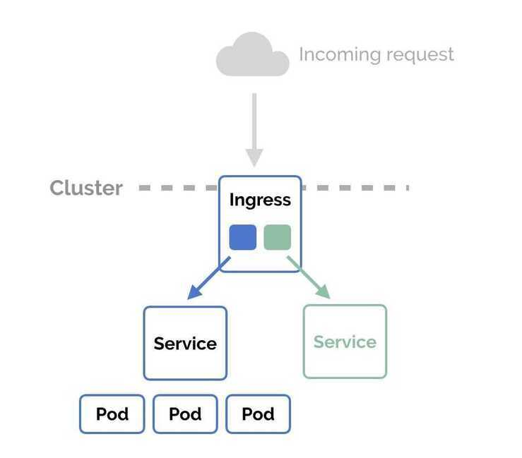

# Ingress

An API object that manages external access to the services in a cluster, typically HTTP.

An ingress controller is a piece of software that provides reverse proxy, configurable traffic routing, and TLS termination for Kubernetes services.

Ingress, added in Kubernetes v1.1, exposes HTTP and HTTPS routes from outside the cluster to [services](https://kubernetes.io/docs/concepts/services-networking/service/) within the cluster. Traffic routing is controlled by rules defined on the ingress resource.

An ingress can be configured to give services externally-reachable URLs, load balance traffic, terminate SSL, and offer name based virtual hosting. An [ingress controller](https://kubernetes.io/docs/concepts/services-networking/ingress/#ingress-controllers) is responsible for fulfilling the ingress, usually with a loadbalancer, though it may also configure your edge router or additional frontends to help handle the traffic.

An ingress does not expose arbitrary ports or protocols. Exposing services other than HTTP and HTTPS to the internet typically uses a service of type [Service.Type=NodePort](https://kubernetes.io/docs/concepts/services-networking/service/#nodeport) or [Service.Type=LoadBalancer](https://kubernetes.io/docs/concepts/services-networking/service/#loadbalancer).

Ingress allows external users and client applications access to HTTP services. Ingress consists of two components: Ingress Resource and Ingress Controller.

- **Ingress Resource** is a collection of rules for the inbound traffic to reach Services. These are Layer 7 (L7) rules that allow hostnames (and optionally paths) to be directed to specific Services in Kubernetes.
- **Ingress Controller** acts upon the rules set by the Ingress Resource, typically via an HTTP or L7 load balancer. It is vital that both pieces are properly configured to route traffic from an outside client to a Kubernetes Service.

An API object that manages external access to the services in a cluster, typically HTTP.

Ingress can provide load balancing, SSL termination and name-based virtual hosting.

**Types of ingress:**

1. Single service ingress
2. Simple fanout
3. Name based virtual hosting
4. TLS
5. Loadbalancing

In Kubernetes, an Ingress is an object that allows access to your Kubernetes services from outside the Kubernetes cluster. You configure access by creating a collection of rules that define which inbound connections reach which services.

This lets you consolidate your routing rules into a single resource. For example, you might want to send requests toexample.com/api/v1/to anapi-v1service, and requests toexample.com/api/v2/to theapi-v2service. With an Ingress, you can easily set this up without creating a bunch of LoadBalancers or exposing each service on the Node.

NodePort and LoadBalancer let you expose a service by specifying that value in the service'stype. Ingress, on the other hand, is a completely independent resource to your service. You declare, create and destroy it separately to your services

This makes it decoupled and isolated from the services you want to expose. It also helps you to consolidate routing rules into one place.

## Ingress Controllers

- AWS ALB Ingress Controller
- Kong
- Traefik
- HAProxy
- Istio Ingress Gateway
- Nginx Ingress Controller
- Ambassador

https://www.nginx.com/blog/testing-performance-nginx-ingress-controller-kubernetes

- Voyager
- Contour
- Gloo
- Skipper

https://medium.com/flant-com/comparing-ingress-controllers-for-kubernetes-9b397483b46b

https://itnext.io/kubernetes-ingress-controllers-how-to-choose-the-right-one-part-1-41d3554978d2

https://medium.com/flant-com/comparing-ingress-controllers-for-kubernetes-9b397483b46b

## AWS ALB

AWS ALB Ingress controller supports two traffic modes: instance mode and ip mode. Users can explicitly specify these traffic modes by declaring the alb.ingress.kubernetes.io/target-type annotation on the Ingress and the service definitions.

- **instance mode:** Ingress traffic starts from the ALB and reaches the [NodePort](https://kubernetes.io/docs/concepts/services-networking/service/#nodeport) opened for your service. Traffic is then routed to the pods within the cluster. The number of hops for the packet to reach its destination in this mode is always two.
- **ip mode:** Ingress traffic starts from the ALB and reaches the pods within the cluster directly. To use this mode, the networking plugin for the Kubernetes cluster must use a secondary IP address on ENI as pod IP, also known as the [AWS CNI plugin for Kubernetes](https://github.com/aws/amazon-vpc-cni-k8s). The number of hops for the packet to reach its destination in this mode is always one.

https://github.com/kubernetes-sigs/aws-alb-ingress-controller

https://docs.aws.amazon.com/eks/latest/userguide/alb-ingress.html

https://aws.amazon.com/blogs/opensource/kubernetes-ingress-aws-alb-ingress-controller

## Ingress tls with self-signed cert

[Create a Kubernetes TLS Ingress from scratch in Minikube - YouTube](https://www.youtube.com/watch?v=7K0gAYmWWho)

[Step 4: Enable HTTPS traffic and verify the certificate - AWS CloudHSM](https://docs.aws.amazon.com/cloudhsm/latest/userguide/ssl-offload-enable-traffic-and-verify-certificate.html)

## References

https://matthewpalmer.net/kubernetes-app-developer/articles/kubernetes-ingress-guide-nginx-example.html

https://kubernetes.io/docs/concepts/services-networking/ingress
