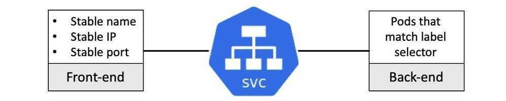

# Services

A Kubernetes **Service** is an abstraction which defines a logical set of **Pods** and a policy by which to access them - sometimes called a micro-service.

Remember that Pods are not durable. When a Pod dies, the ReplicaSet creates a new Pod instance. The new Pod's IP address differs from the old Pod's IP address. Therefore services are used. A service gets its own stable IP address, a stable DNS name and a stable port. Services provide service discovery, load-balancing, and features to support zero-downtime deployments.

- An abstraction to define a logical set of Pods bound by a policy by to access them
- Services are exposed through intenal and external endpoints
- Services can also point to non-Kubenetes endpoints through a Virtual-IP-Bridge
- Supports TCP and UDP
- Interfaces with kube-proxy to manipulate iptables
- Service can be exposed internal or external to the cluster

Kubernetes provides two types of Services.

1. A **ClusterIP service** gives you a service inside your cluster. Your apps inside your cluster can access that service via a stable IP address, DNS name and port. A ClusterIP service does not provide access from outside the cluster.

2. A **NodePort service** provides access to a Pod from outside the cluster. And everything a ClusterIP service provides.

3. [LoadBalancer](https://kubernetes.io/docs/concepts/services-networking/#loadbalancer): Exposes the service externally using a cloud provider's load balancer.NodePortandClusterIPservices, to which the external load balancer will route, are automatically created.

4. **[ExternalName](https://kubernetes.io/docs/concepts/services-networking/#externalname):** Maps the service to the contents of theexternalNamefield (e.g.foo.bar.example.com), by returning aCNAMErecord with its value. No proxying of any kind is set up. This requires version 1.7 or higher ofkube-dns.
    - An ExternalName Service is a special case of Service that does not have selectors and uses DNS names instead.
    - When looking up the hostmy-service.prod.svc.cluster.local, the cluster DNS Service returns aCNAMErecord with the valuemy.database.example.com. Accessingmy-serviceworks in the same way as other Services but with the crucial difference that redirection happens at the DNS level rather than via proxying or forwarding. Should you later decide to **move your database into your cluster**, you can start its Pods, add appropriate selectors or endpoints, and change the Service'stype.

For Kubernetes-native applications, Kubernetes offers a simple **Endpoints** API that is updated whenever the set of **Pods** in a **Service** changes. For non-native applications, Kubernetes offers a virtual-IP-based bridge to Services which redirects to the backend **Pods**.

## Headless services

Sometimes you don't need or want load-balancing and a single service IP. In this case, you can create "headless" services by specifying"None"for the cluster IP (.spec.clusterIP).

This option allows developers to reduce coupling to the Kubernetes system by allowing them freedom to do discovery their own way. Applications can still use a self-registration pattern and adapters for other discovery systems could easily be built upon this API.

For suchServices, a cluster IP is not allocated, kube-proxy does not handle these services, and there is no load balancing or proxying done by the platform for them. How DNS is automatically configured depends on whether the service has selectors defined.

## With selectors

For headless services that define selectors, the endpoints controller createsEndpointsrecords in the API, and modifies the DNS configuration to return A records (addresses) that point directly to thePodsbacking theService.

## Without selectors

For headless services that do not define selectors, the endpoints controller does not createEndpointsrecords. However, the DNS system looks for and configures either:

- CNAME records for [ExternalName](https://kubernetes.io/docs/concepts/services-networking/service/#externalname)-type services.
- A records for anyEndpointsthat share a name with the service, for all other types.

<https://kubernetes.io/docs/concepts/services-networking/service>

## Anatomy of a Kubernetes Service

It's useful to think of a Kubernetes Service as having a front-end and a back-end:

- Front-end: name, IP, port that never change
- Back-end: Pods that match a label selector

The front-end isstableandreliable. This means thename, IPandport numberare guaranteed to never change for the entire life of the Service. The stable nature of the Service front-end also means that you do not need to worry about stale entries on clients that cache DNS results for longer than the standards recommend.

The back-end is highly dynamic and will load-balance traffic to all Pods in the cluster that match the set oflabelsthe Service is configured to look for.

Load-balancingin this situation is simple L4 round-robin load-balancing. This works at the "connection" level where all requests over the sameconnectiongo to the same Pod. This means two things:

- Multiple requests from the same browser will always hit the samePod. This is because browsers send all requests over a singleconnectionthat is kept open using keepalives. Requests via tools likecurlopen a newconnectionfor each request and will therefore hit different Pods.

- Load-balancing is not aware ofapplication layer(L7) concepts such as HTTP headers and cookie-based session affinity.

<https://nigelpoulton.com/blog/f/demystifying-kubernetes-service-discovery>
