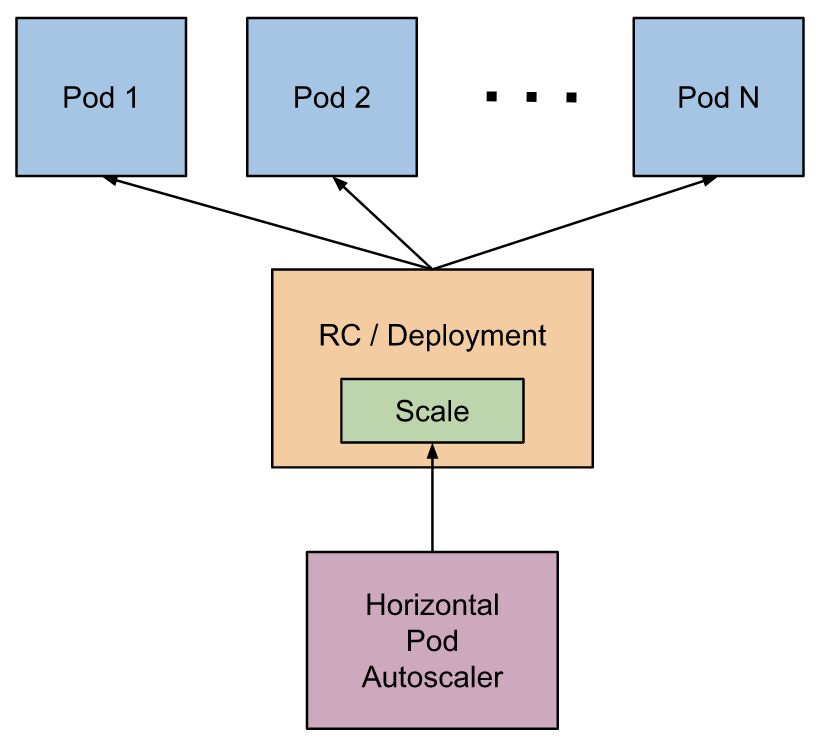

# Tasks

## Monitoring, Logging and Debugging

## Auditing

https://kubernetes.io/docs/tasks/debug-application-cluster/audit

https://www.cncf.io/blog/2019/12/03/kubernetes-audit-making-log-auditing-a-viable-practice-again

https://www.cncf.io/webinars/k8s-audit-logging-deep-dive

## Administer a Cluster

https://kubernetes.io/docs/tasks/administer-cluster/kms-provider

https://kubernetes.io/docs/tasks/administer-cluster/encrypt-data

## Horizontal Pod Autoscaler (HPA)

The Horizontal Pod Autoscaler automatically scales the number of pods in a replication controller, deployment, replica set or stateful set based on observed CPU utilization (or, with[custom metrics](https://git.k8s.io/community/contributors/design-proposals/instrumentation/custom-metrics-api) support, on some other application-provided metrics). Note that Horizontal Pod Autoscaling does not apply to objects that can't be scaled, for example, DaemonSets.

The Horizontal Pod Autoscaler is implemented as a Kubernetes API resource and a controller. The resource determines the behavior of the controller. The controller periodically adjusts the number of replicas in a replication controller or deployment to match the observed average CPU utilization to the target specified by user.

The Horizontal Pod Autoscaler is implemented as a control loop, with a period controlled by the controller manager's--horizontal-pod-autoscaler-sync-periodflag (with a default value of 15 seconds).

When managing the scale of a group of replicas using the Horizontal Pod Autoscaler, it is possible that the number of replicas keeps fluctuating frequently due to the dynamic nature of the metrics evaluated. This is sometimes referred to as *thrashing*.

desiredReplicas = ceil[currentReplicas * ( currentMetricValue / desiredMetricValue )]

https://kubernetes.io/docs/tasks/run-application/horizontal-pod-autoscale

## PLEG - Pod Lifecycle Event Generator

https://developers.redhat.com/blog/2019/11/13/pod-lifecycle-event-generator-understanding-the-pleg-is-not-healthy-issue-in-kubernetes
