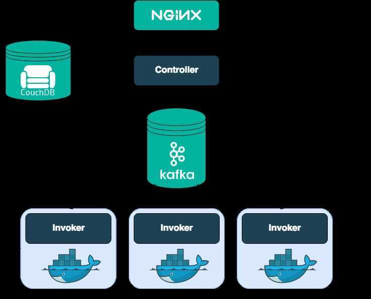

# Serverless Tools

- **OpenFaas**: Offers Docker and Kubernetes support with an active community. Managed with faas-cli, it uses Prometheus for metrics and offers prebuilt triggers and runtimes. Installation via Brew and deployment to Kubernetes using Helm or raw YAML.
- **OpenWhisk**: Apache project supported by IBM and Adobe. Main concepts include Actions, Triggers, Feeds, Alarms, and Rules. Supports deployment on Kubernetes, Mesos, OpenShift, and Compose but recommends Kubernetes. Complex architecture written in Scala.
- **Kubeless**: Described as the most Kubernetes-native. Easy installation and simple architecture using Custom Resource Definitions. No scale-to-zero functionality at the time of writing.
- **Knative**: Developed mainly by Google and Pivotal, with contributions from Red Hat and IBM. Comprised of Building, Serving, and Eventing components. Dependent on Istio and offers Google Cloud Run as a managed service. Provisioning complexity and cost considerations.
- **Fission**: Focused on developer productivity and high performance, specifically for Kubernetes. Offers Environment, Function, and Trigger concepts. Active community and features like canary deployments and live-reload. Components scalability concerns.

[6 Serverless Frameworks on Kubernetes You Need to Know](https://www.appvia.io/blog/serverless-on-kubernetes)

## knative

Kubernetes-based platform to build, deploy, and manage modern serverless workloads

https://cloud.google.com/knative

https://github.com/knative/serving

https://medium.com/@pczarkowski/introduction-to-knative-b93a0b9aeeef

https://github.com/knative/docs

## Apache OpenWhisk (Incubating)

Apache OpenWhisk (Incubating) is an open source, distributed [Serverless](https://en.wikipedia.org/wiki/Serverless_computing) platform that executes functions (fx) in response to events at any scale. OpenWhisk manages the infrastructure, servers and scaling using Docker containers so you can focus on building amazing and efficient applications.

The OpenWhisk platform supports a programming model in which developers write functional logic (called [Actions](https://github.com/apache/incubator-openwhisk/blob/master/docs/actions#openwhisk-actions)), in any supported programming language, that can be dynamically scheduled and run in response to associated events (via [Triggers](https://github.com/apache/incubator-openwhisk/blob/master/docs/triggers_rules#creating-triggers-and-rules)) from external sources ([Feeds](https://github.com/apache/incubator-openwhisk/blob/master/docs/feeds#implementing-feeds)) or from HTTP requests. The project includes a REST API-based Command Line Interface (CLI) along with other tooling to support packaging, catalog services and many popular container deployment options.

### Architecture

https://openwhisk.apache.org

## Fission

Open Source, Cloud-native Serverless Framework.

- Write short-lived functions in any language, and map them to HTTP requests (or other event triggers).
- Deploy functions instantly with one command. There are no containers to build, and no Docker registries to manage.

### Performance: 100msec cold start

Fission maintains a pool of "warm" containers that each contain a small dynamic loader. When a function is first called, i.e. "cold-started", a running container is chosen and the function is loaded. This pool is what makes Fission fast: cold-start latencies are typically about 100msec.

### Concept

Fission has three main concepts: Functions, Environments, and Triggers

### Functions

A Fission function is something that Fission executes. It's usually a module with one entry point, and that entry point is a function with a certain interface. A number of programming languages are supported for Functions.

### Environments

Environments are the language-specific parts of Fission. An Environment contains just enough software to build and run a Fission Function.

### Triggers

Functions are invoked on the occurrence of an event; a Trigger is what configures Fission to use that event to invoke a function. In other words, a Trigger is a binding of events to function invocations.

### Other Concepts

#### ARCHIVES

An Archive is a zip file containing source code or compiled binaries. Archives with runnable functions in them are called Deployment

Archives; those with source code in them are called Source Archives.

#### PACKAGES

A Package is a Fission object containing a Deployment Archive and a Source Archive. A Package also references a certain environment.

When you create a Package with a Source Archive, Fission automatically builds it using the appropriate builder environment and adds a Deployment Archive to the package.

#### SPECIFICATIONS

Specifications (specs for short) are simply YAML config files containing the objects we've spoken about so far - Functions, Environments, Triggers, Packages, and Archives.

https://fission.io

https://github.com/fission/fission
