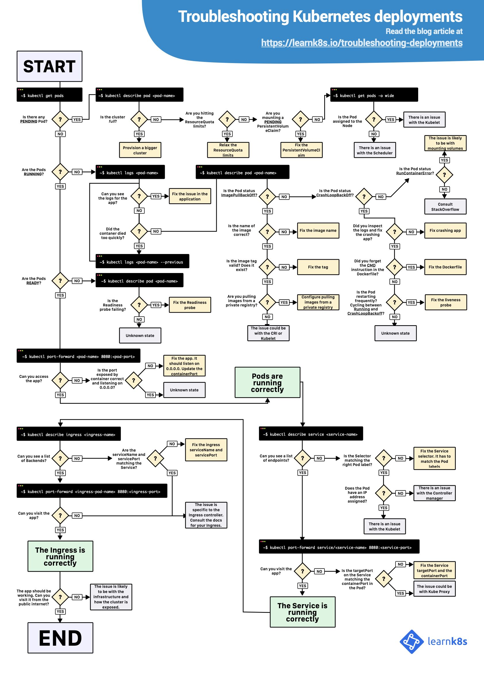

# Troubleshooting

[Linux BPF CPU Profiling with kubectl on Microsoft Azure Kubernetes (AKS)](https://www.youtube.com/watch?v=TMwHWofbMtY)

./flameget.sh --node "ip-10-40-33-102.ap-south-1.compute.internal" --pod "bad-deploy-6d5cc4d5f6-gvs6f" --container "bad-app" -t "60" -i "aimvector/ebpf-tools:azure.4.15.0.1061"

https://medium.com/@aimvec/linux-bpf-cpu-profiling-with-kubectl-on-kubernetes-8ca329297e5a

https://github.com/marcel-dempers/cpu-performance-analysis

[Docker container CPU analysis with Linux BPF tools](https://www.youtube.com/watch?v=mGcu7C-YVM0)

https://learnk8s.io/troubleshooting-deployments
