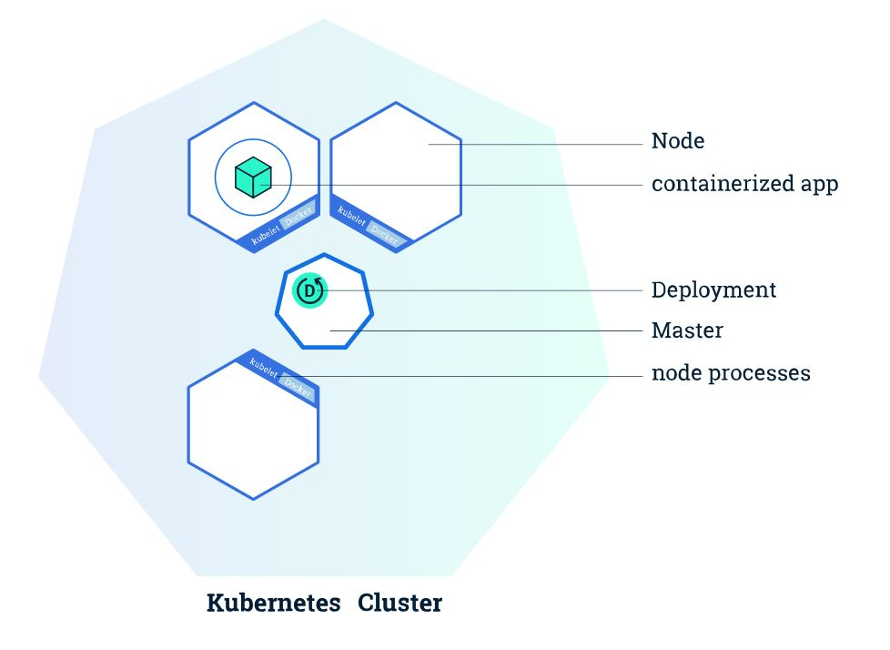

# Controllers

## Controllers / Operators

An important concept for orchestration is the use of controllers. These are also known as watch-loops and operators. They query the current state, compare it against the spec, and execute code based on how they differ.Various controllers ship with Kubernetes, and you can create your own, as well. A simplified view of a controller is an agent, or Informer, and a downstream store. Using a **DeltaFIFO** queue, the source and downstream are compared. A loop process receives anobjor object, which is an array of deltas from the FIFO queue. As long as the delta is not of the type **Deleted**, the logic of the controller is used to create or modify some object until it matches the specification.

The Informer which uses the API server as a source requests the state of an object via an API call. The data is cached to minimize API server transactions. A similar agent is the SharedInformer; objects are often used by multiple other objects. It creates a shared cache of the state for multiple requests.

A Workqueue uses a key to hand out tasks to various workers. The standard Go workqueues of rate limiting, delayed, and time queue are typically used.

The **endpoints, namespace, andserviceaccounts** controllers each manage the eponymous resources for Pods.

## ReplicaSet

ReplicaSet is the next-generation Replication Controller. The only difference between a *ReplicaSet* and a [*Replication Controller*](https://kubernetes.io/docs/concepts/workloads/controllers/replicationcontroller/) right now is the selector support. ReplicaSet supports the new set-based selector requirements as described in the [labels user guide](https://kubernetes.io/docs/concepts/overview/working-with-objects/labels/#label-selectors) whereas a Replication Controller only supports equality-based selector requirements.

A ReplicaSet ensures that a specified number of Pod replicas are running at any given time. A ReplicaSet is a management wrapper around a Pod. If a Pod, that is managed by a ReplicaSet, dies, the ReplicaSet brings up a new Pod instance.

Note: A [**Deployment**](https://kubernetes.io/docs/concepts/workloads/controllers/deployment/) that configures a [**ReplicaSet](https://kubernetes.io/docs/concepts/workloads/controllers/replicaset/) is now the recommended way to set up replication

## Deployment

A Deploymentcontroller provides declarative updates for [Pods](https://kubernetes.io/docs/concepts/workloads/pods/pod/) and [ReplicaSets](https://kubernetes.io/docs/concepts/workloads/controllers/replicaset/).

You describe adesired statein a Deployment object, and the Deployment controller changes the actual state to the desired state at a controlled rate. You can define Deployments to create new ReplicaSets, or to remove existing Deployments and adopt all their resources with new Deployments.

Once you have a running Kubernetes cluster, you can deploy your containerized applications on top of it. To do so, you create a Kubernetes **Deployment** configuration. The Deployment instructs Kubernetes how to create and update instances of your application. Once you've created a Deployment, the Kubernetes master schedules mentioned application instances onto individual Nodes in the cluster.

Once the application instances are created, a Kubernetes Deployment Controller continuously monitors those instances. If the Node hosting an instance goes down or is deleted, the Deployment controller replaces it.This provides a **self-healing mechanism to address machine failure or maintenance.**

https://learnk8s.io/kubernetes-rollbacks

## StatefulSet

StatefulSet is the workload API object used to manage stateful applications.

StatefulSets are valuable for applications that require one or more of the following.

- Stable, unique network identifiers.
- Stable, persistent storage.
- Ordered, graceful deployment and scaling.
- Ordered, automated rolling updates.

## Components

- A Headless Service, named nginx, is used to control the network domain.
- The StatefulSet, named web, has a Spec that indicates that 3 replicas of the nginx container will be launched in unique Pods.
- The volumeClaimTemplates will provide stable storage using [PersistentVolumes](https://kubernetes.io/docs/concepts/storage/persistent-volumes/) provisioned by a PersistentVolume Provisioner.

https://kubernetes.io/docs/tutorials/stateful-application/basic-stateful-set

https://kubernetes.io/docs/tasks/run-application/run-single-instance-stateful-application

Kubernetes StatefulSets gives you a set of resources to deal with stateful containers, such as volumes, stable network IDs, ordinal indexes from 0 to N, etc. Volumes are one of the key features that allow us to run stateful applications on top of Kubernetes.

1. Ephermeral Storage Volumes

2. Persistant Storage Volumes

The data lifetime is independent of the Pod's lifetime. So, even when the Pod dies or is moved to another node, that data will still persist until it is explicitly deleted by the user.

The spec.serviceName in StatefulSet manifest must be equal to metadata.name in a headless service definition

## DaemonSet

ADaemonSetensures that all (or some) Nodes run a copy of a Pod. As nodes are added to the cluster, Pods are added to them. As nodes are removed from the cluster, those Pods are garbage collected. Deleting a DaemonSet will clean up the Pods it created.

Some typical uses of a DaemonSet are:

- running a cluster storage daemon, such asglusterd, ceph, on each node.
- running a logs collection daemon on every node, such asfluentdorlogstash.
- running a node monitoring daemon on every node, such as [Prometheus Node Exporter](https://github.com/prometheus/node_exporter), collectd, [Dynatrace OneAgent](https://www.dynatrace.com/technologies/kubernetes-monitoring/), [AppDynamics Agent](https://docs.appdynamics.com/display/CLOUD/Container+Visibility+with+Kubernetes), Datadog agent, NewRelic agent, Gangliagmondor Instana agent.

## Garbage Collection

The role of the Kubernetes garbage collector is to delete certain objects that once had an owner, but no longer have an owner.

https://kubernetes.io/docs/concepts/workloads/controllers/garbage-collection

## TTL Controller

The TTL controller provides a TTL mechanism to limit the lifetime of resource objects that have finished execution.

## Jobs

Ajobcreates one or more pods and ensures that a specified number of them successfully terminate. As pods successfully complete, thejobtracks the successful completions. When a specified number of successful completions is reached, the job itself is complete. Deleting a Job will cleanup the pods it created.

A simple case is to create one Job object in order to reliably run one Pod to completion. The Job object will start a new Pod if the first pod fails or is deleted (for example due to a node hardware failure or a node reboot).

A Job can also be used to run multiple pods in parallel.

There are three main types of jobs:

1. Non-parallel Jobs
    - normally only one pod is started, unless the pod fails.
    - job is complete as soon as Pod terminates successfully.

2. Parallel Jobs with afixed completion count:
    - specify a non-zero positive value for.spec.completions.
    - the job is complete when there is one successful pod for each value in the range 1 to.spec.completions.
    - not implemented yet:Each pod passed a different index in the range 1 to.spec.completions.

3. Parallel Jobs with awork queue:
    - do not specify.spec.completions, default to.spec.parallelism.
    - the pods must coordinate with themselves or an external service to determine what each should work on.
    - each pod is independently capable of determining whether or not all its peers are done, thus the entire Job is done.
    - whenanypod terminates with success, no new pods are created.
    - once at least one pod has terminated with success and all pods are terminated, then the job is completed with success.
    - once any pod has exited with success, no other pod should still be doing any work or writing any output. They should all be in the process of exiting.

Jobs are part of thebatchAPI group. They are used to run a set number of pods to completion. If a pod fails, it will be restarted until the number of completion is reached.

While they can be seen as a way to do batch processing in Kubernetes, they can also be used to run one-off pods. A Job specification will have a parallelism and a completion key. If omitted, they will be set to one. If they are present, the parallelism number will set the number of pods that canrunconcurrently, and the completion number will set how many pods need to run successfully for the Job itself to be considered done. Several Job patterns can be implemented, like a traditional work queue.

Cronjobs work in asimilar manner to Linux jobs, with the same time syntax. There are some cases where a job would not be run during a time period or could run twice; as a result, the requested Pod should be idempotent.

An optionspecfield is.spec.concurrencyPolicywhich determines how to handle existing jobs, should the time segment expire. If set toAllow, the default, another concurrent job will be run. If set toForbid, the current job continues and the new job is skipped. A value ofReplacecancels the current job and starts a new job in its place.

backoffLimit: 6

completions: 1

parallelism: 1

activeDeadlineSeconds: 15

## CronJob

ACron Jobcreates [Jobs](https://kubernetes.io/docs/concepts/workloads/controllers/jobs-run-to-completion/) on a time-based schedule.

A CronJob creates a watch loop which will create a batch job on your behalf when the time becomes true.

One CronJob object is like one line of acrontab(cron table) file. It runs a job periodically on a given schedule, written in [Cron](https://en.wikipedia.org/wiki/Cron) format.

A CronJob is basically a Kubernetes Job with time-based scheduling and some specific parameters to handle failure. Each Kubernetes Job creates 1 to n pod. Those pods run a program defined for the task and exit when the task is over.

https://kubernetes.io/docs/concepts/architecture/controller
