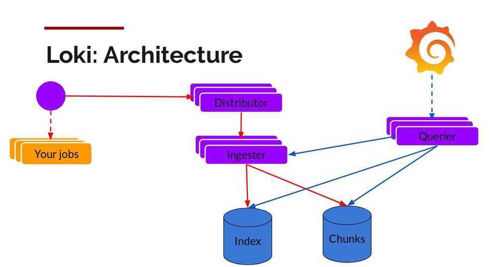
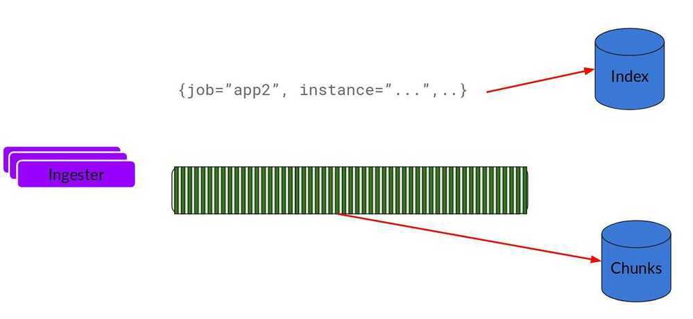

# Grafana Loki

Loki is a horizontally-scalable, highly-available, multi-tenant log aggregation system inspired by [Prometheus](https://prometheus.io/). It is designed to be very cost effective and easy to operate. It does not index the contents of the logs, but rather a set of labels for each log stream.

Compared to other log aggregation systems, Loki:

- does not do full text indexing on logs. By storing compressed, unstructured logs and only indexing metadata, Loki is simpler to operate and cheaper to run.
- indexes and groups log streams using the same labels you're already using with Prometheus, enabling you to seamlessly switch between metrics and logs using the same labels that you're already using with Prometheus.
- is an especially good fit for storing [Kubernetes](https://kubernetes.io/) Pod logs. Metadata such as Pod labels is automatically scraped and indexed.
- has native support in Grafana (needs Grafana v6.0).

A Loki-based logging stack consists of 3 components:

- promtailis the agent, responsible for gathering logs and sending them to Loki.
- lokiis the main server, responsible for storing logs and processing queries.
- [Grafana](https://github.com/grafana/grafana) for querying and displaying the logs.

Loki is like Prometheus, but for logs: we prefer a multidimensional label-based approach to indexing, and want a single-binary, easy to operate system with no dependencies. Loki differs from Prometheus by focusing on logs instead of metrics, and delivering logs via push, instead of pull.

## PLG Stack (Promtail, Loki and Grafana)

Don't be surprised if you don't find this acronym, it is mostly known as Grafana Loki. Anyway, this stack is getting good popularity due to its opinionated design decisions. You might know about Grafana which is a popular visualization tool. Grafana labs designed **Loki** which is a horizontally scalable, highly available, multi-tenant log aggregation system inspired by Prometheus. It indexes only metadata and doesn't index the content of the log. This design decision makes it very cost-effective and easy to operate.

Promtail is an agent that ships the logs from the local system to the Loki cluster.Grafanais the visualization tool which consumes data from Loki data sources


https://grafana.com/docs/loki/latest/clients/promtail

The Loki is built on the same design principles of Prometheus, therefore it is a good fit for storing and analyzing the logs of Kubernetes.

## Loki Architecture

Loki can be run in single-process mode or in multiple process mode providing independent horizontal scalability.


Loki is designed in a way that it can be used as a single monolith or can be used as microservice. The single-process model is good for local development and small monitoring setup. For production and scalable workload, it is recommended to go with the microservices model. The write path and read path in Loki are decoupled so it is highly tuneable and can be scaled independently based on the need.

Let's look into its logging architecture at high level with below diagram.


Below is the breakdown of the Loki (Microservice model).



## Components

### Promtail

This is the agent which is installed on the nodes (as Daemonset), it pulls the logs from the jobs and talks to Kubernetes API server to get the metadata and use this information to tag the logs. Then it forwards the log to Loki central service. The agents support the same labelling rules as Prometheus to make sure the metadata matches.

### Distributor

Promtail sends logs to the distributor which acts as a buffer. To handle millions of writes, it batches the inflow and compresses it in chunks as they come in. There are multiple ingesters, the logs belonging to each stream would end up in the same ingester for all relevant entries in the same chunk. This is done using the ring of ingesters and consistent hashing. To provide resiliency and redundancy, it doesn(default 3) times.

### Ingester

As the chunks come in, they are gzipped and appended with logs. Once the chunk fills up, the chunk is flushed to the database. The metadata goes into Index and log chunk data goes into Chunks (usually an Object store). After flushing, ingester creates a new chunk and add new entries in to that.



### Index

Index is the database like DynamoDB, Cassandra, Google Bigtable, etc.

### Chunks

Chunk of logs in a compressed format is stored in the object stores like S3

### Querier

This is in the read path and does all the heavy lifting. Given the time range and label selector, it looks at the index to figure out which are the matching chunks. Then it reads through those chunks and greps for the result.

### Storage

Unlike other logging systems, Loki is built around the idea of only indexing metadata about your logs: labels (just like Prometheus labels). Log data itself is then compressed and stored in chunks in object stores such as S3 or GCS, or even locally on the filesystem. A small index and highly compressed chunks simplifies the operation and significantly lowers the cost of Loki.

Loki 2.0 brings an index mechanism named 'boltdb-shipper' and is what we now call **Single Store Loki**. This index type only requires one store, the object store, for both the index and chunks.

https://grafana.com/docs/loki/latest/storage

https://grafana.com/docs/loki/latest/operations/storage/boltdb-shipper

https://www.infracloud.io/logging-in-kubernetes-efk-vs-plg-stack

https://grafana.com/oss/loki

https://github.com/grafana/loki

https://grafana.com/go/webinar/observability-with-loki-2.0

https://grafana.com/go/webinar/intro-to-loki-like-prometheus-but-for-logs

https://grafana.com/docs/loki/latest/architecture

https://grafana.com/grafana/dashboards/13407

https://grafana.com/grafana/dashboards/10880

https://grafana.com/grafana/dashboards/10004

https://grafana.com/docs/loki/latest/operations/observability

https://grafana.com/blog/2020/10/28/loki-2.0-released-transform-logs-as-youre-querying-them-and-set-up-alerts-within-loki

## LogQL

Loki comes with its own PromQL-inspired language for queries called **LogQL**. LogQL can be considered a distributed **grep** that aggregates log sources. LogQL uses labels and operators for filtering.

There are two types of LogQL queries:

- **Log queries** return the contents of log lines.
- **Metric queries** extend log queries and calculate sample values based on the content of logs from a log query.

https://grafana.com/docs/loki/latest/logql/metric_queries

## Examples

```bash
{container="decision-engine"} != "get_device_sms_score" |= "get_device_sms"
|= "2985892"
rate({app="reminder-messages-sms-consumer"}[5m])
```

https://grafana.com/docs/loki/latest/logql
