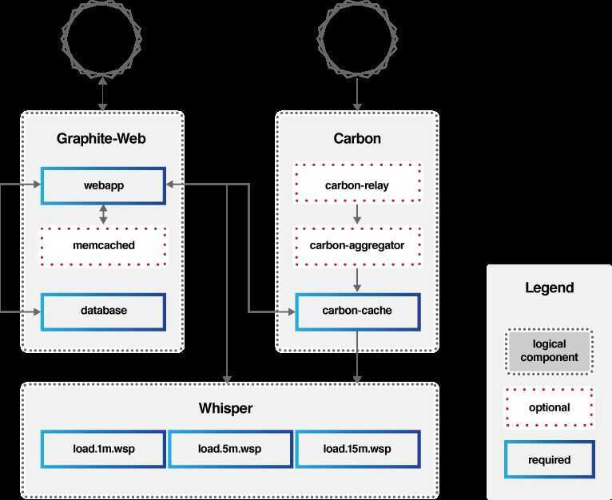

# Graphite

## Graphite does two things

1. Store numeric time-series data

2. Render graphs of this data on demand

## Architecture

Graphite consists of three software components:

1. **carbon**
    - **a high-performance service that listens for time-series data**
    - **a [Twisted](http://www.twistedmatrix.com/) daemon that listens for time-series data**

2. **whisper**
    - **a simple database library for storing time-series data (similar in design to [RRD](http://oss.oetiker.ch/rrdtool/))**

3. **graphite-web**
    - **Graphite's user interface & API for rendering graphs and dashboards**
    - **A [Django](http://www.djangoproject.com/) webapp that renders graphs on-demand using [Cairo](http://www.cairographics.org/)**

Metrics get fed into the stack via theCarbonservice, which writes the data out toWhisperdatabases for long-term storage. Users interact with theGraphite webUI or API, which in turn queries Carbon and Whisper for the data needed to construct the requested graphs.

Graphite's web platform offers a variety of output styles and formats, including raw images, CSV, XML, and JSON, allowing anyone to easily embed custom graphs in other web pages or dashboards.

## Points

https://graphite.readthedocs.io/en/latest/faq.html

https://grafana.com/oss/metrictank

Metrictank is a multi-tenant timeseries platform for Graphite

## References

https://graphiteapp.org

https://graphite.readthedocs.io/en/latest
