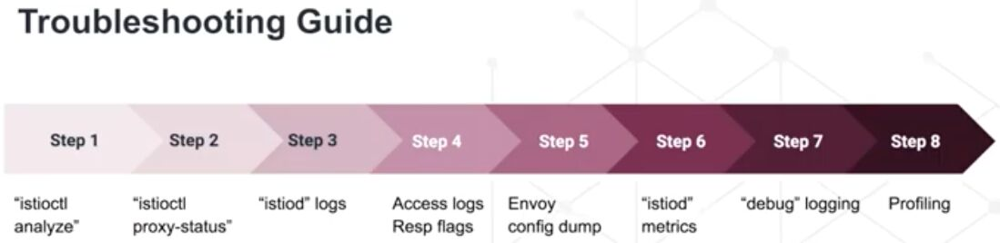

# Commands

```bash
curl -L https://istio.io/downloadIstio | sh - #installing istioctl
brew install istioctl
istioctl manifest apply --set profile=demo

kubectl label namespace default istio-injection=enabled

kubectl get VirtualService --all-namespaces
kubectl get DestinationRule --all-namespaces

istioctl x precheck #pre flight checks before installing istio
istioctl verify-install
istioctl proxy-status
istioctl analyze --timeout 60s
istioctl analyze -L

annotations:
        sidecar.istio.io/proxyCPU: "10m"
        sidecar.istio.io/proxyMemory: "50Mi"
        sidecar.istio.io/inject: "false"
```



https://istio.io/latest/docs/reference/commands/istioctl
