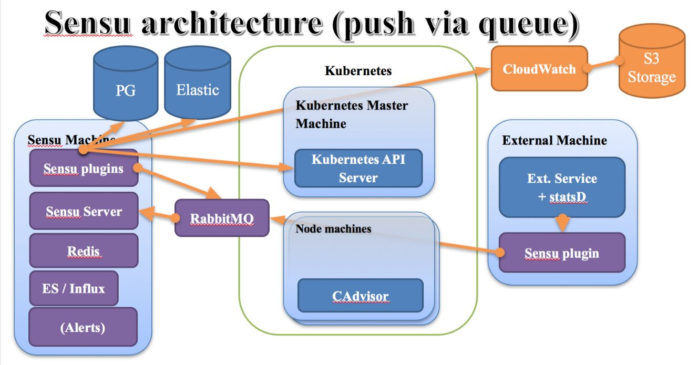

# Others

## Status pages

- blackbox exporter - [Prometheus Blackbox Exporter: Guide & Tutorial | Squadcast](https://www.squadcast.com/blog/prometheus-blackbox-exporter)
- statuspage.io
    - [Statuspage | Atlassian](https://www.atlassian.com/software/statuspage) - Paid
- [Uptime Kuma](https://uptime.kuma.pet/)
- [Status.io - Hosted Status Pages](https://status.io/) - Paid
- [UptimeRobot: Free Website Monitoring Service](https://uptimerobot.com/) - Free
    - Get 50 monitors with 5-minute checks totally FREE.
- [Better Stack: Spot, Resolve, and Prevent Downtime.](https://betterstack.com/)
    - 10 monitors & heartbeats
    - E-mail alerts with 3 minute checks
    - 1 status page
    - 3 GB ingested logs per month retained for 3 days
    - 10M ingested metrics data points retained for 30 days
    - Connect with Slack
- https://instatus.com/

## netdata

Netdata is high-fidelity infrastructure monitoring and troubleshooting.

Open-source, free, preconfigured, opinionated, and always real-time.

Netdata'sdistributed, real-time monitoring Agentcollects thousands of metrics from systems, hardware, containers, and applications with zero configuration. It runs permanently on all your physical/virtual servers, containers, cloud deployments, and edge/IoT devices, and is perfectly safe to install on your systems mid-incident without any preparation.

You can install Netdata on most Linux distributions (Ubuntu, Debian, CentOS, and more), container platforms (Kubernetes clusters, Docker), and many other operating systems (FreeBSD, macOS). Nosudorequired.

Netdata is designed by system administrators, DevOps engineers, and developers to collect everything, help you visualize metrics, troubleshoot complex performance problems, and make data interoperable with the rest of your monitoring stack.

https://github.com/netdata/netdata

https://www.netdata.cloud

https://my-netdata.io/infographic.html

## Kube-state-metrics

kube-state-metrics is a simple service that listens to the Kubernetes API server and generates metrics about the state of the objects. (See examples in the Metrics section below.) It is not focused on the health of the individual Kubernetes components, but rather on the health of the various objects inside, such as deployments, nodes and pods.

kube-state-metrics is about generating metrics from Kubernetes API objects without modification. This ensures that features provided by kube-state-metrics have the same grade of stability as the Kubernetes API objects themselves. In turn, this means that kube-state-metrics in certain situations may not show the exact same values as kubectl, as kubectl applies certain heuristics to display comprehensible messages. kube-state-metrics exposes raw data unmodified from the Kubernetes API, this way users have all the data they require and perform heuristics as they see fit.

The metrics are exported on the HTTP endpoint/metricson the listening port (default 80). They are served as plaintext. They are designed to be consumed either by Prometheus itself or by a scraper that is compatible with scraping a Prometheus client endpoint. You can also open/metricsin a browser to see the raw metrics.

https://github.com/kubernetes/kube-state-metrics

## cAdvisor (Container Advisor)

Analyzes resource usage and performance characteristics of running containers.

cAdvisor (Container Advisor) provides container users an understanding of the resource usage and performance characteristics of their running containers. It is a running daemon that collects, aggregates, processes, and exports information about running containers. Specifically, for each container it keeps resource isolation parameters, historical resource usage, histograms of complete historical resource usage and network statistics. This data is exported by container and machine-wide.

cAdvisor has native support for [Docker](https://github.com/docker/docker) containers and should support just about any other container type out of the box. We strive for support across the board so feel free to open an issue if that is not the case. cAdvisor's container abstraction is based on [lmctfy](https://github.com/google/lmctfy)'s so containers are inherently nested hierarchically.

https://github.com/google/cadvisor

## Zabbix

Zabbix is an open source monitoring software tool for diverse IT components, including networks, servers, virtual machines (VMs) and cloud services. Zabbix provides monitoring metrics, among others network utilization, CPU load and disk space consumption. Zabbix monitoring configuration can be done using XML based templates which contains elements to monitor. The software monitors operations on Linux, Hewlett Packard Unix (HP-UX), Mac OS X, Solaris and other operating systems (OSes); however, Windows monitoring is only possible through agents. Zabbix can use [MySQL](https://en.wikipedia.org/wiki/MySQL), [MariaDB](https://en.wikipedia.org/wiki/MariaDB), [PostgreSQL](https://en.wikipedia.org/wiki/PostgreSQL), [SQLite](https://en.wikipedia.org/wiki/SQLite), [Oracle](https://en.wikipedia.org/wiki/Oracle_database) or [IBM DB2](https://en.wikipedia.org/wiki/IBM_DB2) to store data. Its backend is written in [C](https://en.wikipedia.org/wiki/C_(programming_language)) and the web frontend is written in [PHP](https://en.wikipedia.org/wiki/PHP).

Zabbix offers several monitoring options:

- Simple checks can verify the availability and responsiveness of standard services such as SMTP or HTTP without installing any software on the monitored host.
- A Zabbix [agent](https://en.wikipedia.org/wiki/Software_agent) can also be installed on UNIX and Windows hosts to monitor statistics such as CPU load, network utilization, disk space, etc.
- As an alternative to installing an agent on hosts, Zabbix includes support for monitoring via [SNMP](https://en.wikipedia.org/wiki/Simple_Network_Management_Protocol), [TCP](https://en.wikipedia.org/wiki/Transmission_Control_Protocol) and [ICMP](https://en.wikipedia.org/wiki/Internet_Control_Message_Protocol) checks, as well as over [IPMI](https://en.wikipedia.org/wiki/Intelligent_Platform_Management_Interface), [JMX](https://en.wikipedia.org/wiki/Java_Management_Extensions), [SSH](https://en.wikipedia.org/wiki/Secure_Shell), [Telnet](https://en.wikipedia.org/wiki/Telnet) and using custom parameters. Zabbix supports a variety of near-real-time notification mechanisms, including [XMPP](https://en.wikipedia.org/wiki/Extensible_Messaging_and_Presence_Protocol).

https://en.wikipedia.org/wiki/Zabbix

https://www.zabbix.com

### Creating custom dashboards

[Creating and customizing dashboards in Zabbix](https://serverspace.io/support/help/creating-and-customizing-dashboards-in-zabbix/)

## Nagios

Nagios [/ˈnɑːɡiːoʊs/](https://en.wikipedia.org/wiki/Help:IPA/English), now known as Nagios Core, is a [free](https://en.wikipedia.org/wiki/Free_software) and [open source](https://en.wikipedia.org/wiki/Open-source_software)[computer](https://en.wikipedia.org/wiki/Computer)-[software application](https://en.wikipedia.org/wiki/Software_application) that [monitors](https://en.wikipedia.org/wiki/Event_monitoring) [systems](https://en.wikipedia.org/wiki/System_monitor), [networks](https://en.wikipedia.org/wiki/Network_monitoring) and infrastructure. Nagios offers monitoring and alerting services for servers, switches, applications and services. It alerts users when things go wrong and alerts them a second time when the problem has been resolved

### Features

- Monitoring of network services ([SMTP](https://en.wikipedia.org/wiki/Simple_Mail_Transfer_Protocol), [POP3](https://en.wikipedia.org/wiki/Post_Office_Protocol), [HTTP](https://en.wikipedia.org/wiki/Hypertext_Transfer_Protocol), [NNTP](https://en.wikipedia.org/wiki/Network_News_Transfer_Protocol), [ICMP](https://en.wikipedia.org/wiki/Internet_Control_Message_Protocol), [SNMP](https://en.wikipedia.org/wiki/Simple_network_management_protocol), [FTP](https://en.wikipedia.org/wiki/File_Transfer_Protocol), [SSH](https://en.wikipedia.org/wiki/Secure_Shell))
- Monitoring of host resources ([processor](https://en.wikipedia.org/wiki/Central_processing_unit) load, [disk](https://en.wikipedia.org/wiki/Hard_disk) usage, system logs) on a majority of [network operating systems](https://en.wikipedia.org/wiki/Network_operating_system), including [Microsoft Windows](https://en.wikipedia.org/wiki/Microsoft_Windows), using [monitoring agents](https://en.wikipedia.org/wiki/Nagios#Nagios_agents).
- Monitoring of any hardware (like probes for temperature, alarms, etc.) which have the ability to send collected data via a network to specifically written plugins
- Monitoring via remotely run scripts via [Nagios Remote Plugin Executor](https://en.wikipedia.org/wiki/NRPE)
- Remote monitoring supported through [SSH](https://en.wikipedia.org/wiki/Secure_shell) or [SSL](https://en.wikipedia.org/wiki/Secure_Sockets_Layer)[encrypted](https://en.wikipedia.org/wiki/Encryption) tunnels.
- A simple plugin design that allows users to easily develop their own service checks depending on needs, by using their tools of choice ([shell scripts](https://en.wikipedia.org/wiki/Shell_scripts), [C++](https://en.wikipedia.org/wiki/C%2B%2B), [Perl](https://en.wikipedia.org/wiki/Perl), [Ruby](https://en.wikipedia.org/wiki/Ruby_(programming_language)), [Python](https://en.wikipedia.org/wiki/Python_(programming_language)), [PHP](https://en.wikipedia.org/wiki/PHP), [C#](https://en.wikipedia.org/wiki/C_Sharp_(programming_language)), etc.)
- Available data graphing plugins
- Parallelized service checks
- Flat-text formatted configuration files (integrates with many config editors)
- The ability to define network host using 'parent' hosts, allowing the detection of and distinction between hosts that are down or unreachable
- Contact notifications when service or host problems occur and get resolved (via [e-mail](https://en.wikipedia.org/wiki/E-mail), [pager](https://en.wikipedia.org/wiki/Pager), [SMS](https://en.wikipedia.org/wiki/Short_message_service), or any user-defined method through plugin system)
- The ability to define event handlers to be run during service or host events for proactive problem resolution
- Automatic [log file](https://en.wikipedia.org/wiki/Computer_data_logging) rotation
- Support for implementing [redundant](https://en.wikipedia.org/wiki/Redundancy_(engineering)) monitoring hosts
- Support for implementing performance data graphing
- Support for database backend (such as [NDOUtils](https://exchange.nagios.org/directory/Addons/Database-Backends/NDOUtils/details))
- A web-interface for viewing current network status, notifications, problem history, log files, etc.

https://en.wikipedia.org/wiki/Nagios

## Monit

Monit is a small Open Source utility for managing and monitoring Unix systems. Monit conducts automatic maintenance and repair and can execute meaningful causal actions in error situations.

### Mmonit

M/Monit can monitor and manage distributed computer systems, conduct automatic maintenance and repair and execute meaningful causal actions in error situations.

https://mmonit.com/monit

## Sentry

Sentry fundamentally is a service that helps you monitor and fix crashes in realtime. The server is in Python, but it contains a full API for sending events from any language, in any application.

### settings.py

```python
settings.py
example_SENTRY_PROJECT_ID=11

import sentry_sdk
from sentry_sdk.integrations.django import DjangoIntegration

if not DEBUG:
  sentry_sdk.init(
      dsn="https://5495d5289c414d00b217c2ff52e914d7@sentry.example.com/" + str(
          os.environ ['example_SENTRY_PROJECT_ID']),
      integrations=[DjangoIntegration()],
      attach_stacktrace=True,
debug=True,    )
```

### Commands

```bash
sentry
sentry upgrade
sentry cleanup
sentry cleanup --days 7
psql -h localhost -p 5432 -U postgres
1RtBZRNxG7
VACUUM FULL;

sentry run cron
```

### Links

- https://github.com/getsentry/sentry/blob/master/src/sentry/conf/server.py
- https://github.com/getsentry/sentry
- https://sentry.io/welcome
- https://blog.hlab.tech/a-step-by-step-tutorial-on-how-to-monitor-software-errors-in-real-time-using-sentry-in-django-web-applications
- [**https://getsentry.github.io/sentry-python/api.html**](https://getsentry.github.io/sentry-python/api.html)
- https://docs.sentry.io/platforms/python
- Android - https://sentry.io/for/android
- https://docs.sentry.io/platforms/javascript/guides/react
- https://docs.sentry.io/platforms/android

Others - [RunWhen Home](https://www.runwhen.com/) - Help every engineer troubleshoot any part of your tech stack

- We combine a community writing troubleshooting scripts for apps, platform and infrastructure in the Kubernetes ecosystem with Digital Assistants to help any engineer find which to run, and when.

## NewRelic

```python
import newrelic.agent
newrelic.agent.initialize('/path/to/newrelic.ini')

newrelic-admin generate-config $YOUR_LICENSE_KEY newrelic.ini

NEW_RELIC_CONFIG_FILE=newrelic.ini newrelic-admin run-program gunicorn app:app -b 0.0.0.0:5000 --workers 2 -k gevent --timeout 300 --worker-connections 1000 --max-requests 1000000 --limit-request-line 8190 --access-logfile '-'

if debug:
    newrelic.agent.initialize('newrelic.ini', 'development')
else:
    newrelic.agent.initialize('newrelic.ini', 'production')
```

https://one.nr/0w0ZZO5j

Query Builder in NewRelic One along with Data Explorer

```sql
SELECT count(*) FROM Transaction FACET httpResponseCode, request.uri WHERE appName= 'lms-prod' SINCE 30 MINUTES AGO TIMESERIES

SELECT count(*) FROM Transaction FACET httpResponseCode, request.uri WHERE httpResponseCode LIKE '5%' AND appName= 'lms-prod' SINCE 1 week ago TIMESERIES

SELECT count(*) FROM Transaction FACET appName, httpResponseCode, request.uri WHERE httpResponseCode != 200 SINCE 30 MINUTES AGO LIMIT MAX

SELECT count(*) FROM Transaction WHERE httpResponseCode LIKE '5%' SINCE 1 week ago FACET appName

SELECT count(*) FROM Transaction FACET appName, httpResponseCode, request.uri WHERE httpResponseCode LIKE '5%' SINCE 30 MINUTES AGO LIMIT MAX
```

https://pypi.org/project/newrelic

Send error logs (record exception) - https://docs.newrelic.com/docs/agents/python-agent/python-agent-api/record_exception

https://discuss.newrelic.com/c/customer-on-boarding/proven-practices-best-practices-guide

https://docs.newrelic.com/docs/integrations/kubernetes-integration/kubernetes-events/kubernetes-integration-predefined-alert-policy

[New Relic AI | New Relic](https://newrelic.com/platform/new-relic-ai)

### Data Tables

1. A screenshot of a table in New Relic where you were particularly frustrated by how it displays your data.
2. A screenshot of a table in New Relic where you felt it was missing information that would make it easier for you to complete a task that you're trying to do.
3. A screenshot of a table in New Relic where you felt that this table is really is really well set up for your needs.
4. A screenshot of a data table from somewhere else, that you think New Relic could learn from something that they are doing differently

## Sensu



## syslog

https://docs.docker.com/config/containers/logging/syslog

## DataDog

- [Best Practices for Tagging Your Infrastructure and Applications | Datadog](https://www.datadoghq.com/blog/tagging-best-practices/)
- [Monitoring Kubernetes With Datadog | Datadog](https://www.datadoghq.com/blog/monitoring-kubernetes-with-datadog/)
- [Monitor Apache Airflow With Datadog | Datadog](https://www.datadoghq.com/blog/monitor-airflow-with-datadog/)
- [Datadog Monitoring | Datadog](https://www.datadoghq.com/dg/monitor/kafka-benefits/)
- [Airflow](https://docs.datadoghq.com/integrations/airflow/)
- [Monitoring in the Kubernetes Era | Datadog](https://www.datadoghq.com/blog/monitoring-kubernetes-era/)

## Others

- https://victoriametrics.com/products/open-source
- [Airbrake](https://airbrake.io)
- [Home - ThoughtData](https://thoughtdata.com/)
- [No-code Enterprise Data Quality Monitoring Tool: Lightup](https://lightup.ai/)
- [Kloudfuse](https://www.kloudfuse.com/)
    - AI-ENABLED UNIFIED OBSERVABILITY, Designed for 10X More Data At 1/10th of the Cost
