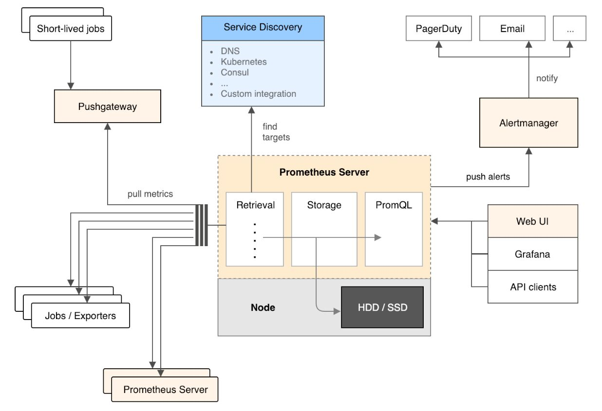
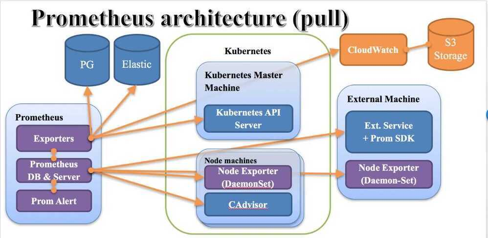

# Prometheus

A CNCF (Cloud Native Computing Foundation) project, is a systems and service monitoring system. It collects metrics from configured targets at given intervals, evaluates rule expressions, displays the results, and can trigger alerts if some condition is observed to be true.

## Features

- amulti-dimensionaldata model (timeseries defined by metric name and set of key/value dimensions)
- **PromQL**, aflexible query languageto leverage this dimensionality
- no dependency on distributed storage;single server nodes are autonomous
- timeseries collection happens via apull modelover HTTP
- pushing timeseriesis supported via an intermediary gateway
- targets are discovered viaservice discoveryorstatic configuration
- multiple modes ofgraphing and dashboarding support
- support for hierarchical and horizontalfederation

## Components

- the main [Prometheus server](https://github.com/prometheus/prometheus) which scrapes and stores time series data
- [client libraries](https://prometheus.io/docs/instrumenting/clientlibs/) for instrumenting application code
- a [push gateway](https://github.com/prometheus/pushgateway) for supporting short-lived jobs
- special-purpose [exporters](https://prometheus.io/docs/instrumenting/exporters/) for services like HAProxy, StatsD, Graphite, etc.
- an [alertmanager](https://github.com/prometheus/alertmanager) to handle alerts
- various support tools

## Architecture Overview

## Concepts

1. Data model

2. Metric types

3. Jobs and instances

## Dashboards

- <http://localhost:9090/metrics> # for seeing all metrics that are currently scraped
- <http://localhost:9090/graph> # for visualizing graphs for the metrics

## Metrics

- Node metrics (related to physical or virtual machines)
  - CPU, RAM, disk usage on the whole node
  - Total number of processes running, and their states
  - Number of open files, sockets, and their states
  - I/O activity (disk, network), per operation or volume
  - Physical/hardware (when applicable): temperature, fan speed ...

- Container metrics (resource usage per container)
  - Similar to node metrics, but not totally identical
  - RAM breakdown will be different
    - active vs inactive memory
    - some memory issharedbetween containers, and accounted specially
  - I/O activity is also harder to track
    - async writes can cause deferred "charges"
    - some page-ins are also shared between containers

<http://jpetazzo.github.io/2013/10/08/docker-containers-metrics>

- Application Metrics
  - Arbitrary metrics related to your application and business
  - System performance: request latency, error rate ...
  - Volume information: number of rows in database, message queue size ...
  - Business data: inventory, items sold, revenue ...

- Databases, message queues, load balancers, ...
- Instrumentation (=deluxeprintffor our code)
- Business metrics (customers served, revenue, ...)

## Scraping config

additionalScrapeConfigs:

- job_name: 'kubernetes-pods'
kubernetes_sd_configs:
- role: pod
relabel_configs:
- source_labels: [__meta_kubernetes_pod_annotation_prometheus_io_scrape]
action: keep
regex: true
- source_labels: [__meta_kubernetes_pod_annotation_prometheus_io_path]
action: replace
target_label: **metrics_path**
regex: (.+)
- source_labels: [**address**, __meta_kubernetes_pod_annotation_prometheus_io_port]
action: replace
regex: ([^:]+)(?::d+)?;(d+)
replacement: $1:$2
target_label: **address**
- action: labelmap
regex: __meta_kubernetes_pod_label_(.+)
- source_labels: [__meta_kubernetes_namespace]
action: replace
target_label: kubernetes_namespace
- source_labels: [__meta_kubernetes_pod_name]
action: replace
target_label: kubernetes_pod_name

## Tools

- M3DB

Distributed TSDB, Aggregator and Query Engine, Prometheus Sidecar, Metrics Platform

The fully open source metrics platform built on M3DB, a distributed timeseries database

<https://github.com/m3db/m3>

<https://m3db.io>

- PushGateway

The Prometheus Pushgateway exists to allow ephemeral and batch jobs to expose their metrics to Prometheus. Since these kinds of jobs may not exist long enough to be scraped, they can instead push their metrics to a Pushgateway. The Pushgateway then exposes these metrics to Prometheus.

<https://github.com/prometheus/pushgateway>

## References

<https://github.com/prometheus/prometheus>

<https://prometheus.io>

<https://prometheus.io/docs/introduction/overview>

TSDB - <https://fabxc.org/tsdb>

On Kubernetes - <https://github.com/coreos/prometheus-operator/tree/master/contrib/kube-prometheus>

<https://github.com/prometheus-community/helm-charts/tree/main/charts/kube-prometheus-stack>
