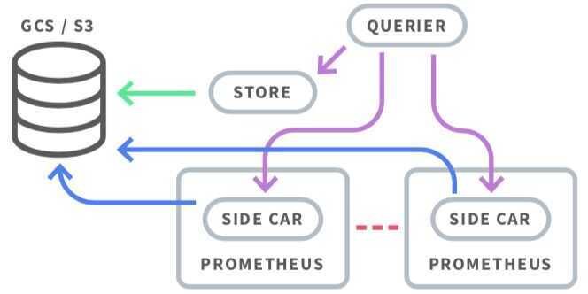

# Prometheus Architecture

## Components

- **Exporters:** Sidecar containers that collect and expose container and service metrics
- **Prometheus server**: Walks through all the exporters' and other metrics' endpoints collecting (pulling) the data
- **AlertManager**: Provides alerting capabilities on top of the metrics server
- **Grafana**: Dashboarding interface for querying and displaying metrics
- **Prometheus metrics**: Metric format for Prometheus

## Scaling and Augmenting Prometheus

1. Simplified metric collection
2. Events correlation and alerts
3. Troubleshooting and tracing
4. Security

## Metrics Collection Questions

- How many metrics can your monitoring system ingest, and how many do you need?
- What's your metrics cardinality? Cardinality is the number of labels that each metric can have. This is a common issue with metrics coming from dynamic environments, where containers get a different ID or name every time they start, restart, or are moved between nodes.
- Do you need high availability?
- How long do you need to keep metrics and with what resolution?

## Vertical Sharing and Federation

### Vertical Sharing

If a single Prometheus server cannot handle it all, one server per datacenter or availability zone can be run per cluster or even per application. It is not unusual to see Kubernetes with its own Prometheus server for cluster metrics while there is another server for service and application metrics. This way, you can scale down the requirements of each Prometheus server. This is known as vertical sharing.

### Federation

Federation is another approach that allows for building a hierarchical tree to aggregate metrics. Some Prometheus servers collect high-resolution metrics (this could be per container metrics) and then the upstream server only stores the aggregated metrics (global service metrics).

## CORTEX, THANOS, AND M3

To solve some of these limitations, a lot of third-party open-source projects have appeared recently.

### Cortex

Cortex allows for storing time series data in a key-value store like Cassandra, AWS DynamoDB, or Google BigTable. It offers a Prometheus compatible query API, and you can push metrics into a write endpoint. This makes it best suited for cloud environments and multi-tenant scenarios like service providers building hosted and managed platforms.

A multitenant, horizontally scalable Prometheus as a Service

Cortex provides horizontally scalable, highly available, multi-tenant, long term storage for [Prometheus](https://prometheus.io/).

- Horizontally scalable:Cortex can run across multiple machines in a cluster, exceeding the throughput and storage of a single machine. This enables you to send the metrics from multiple Prometheus servers to a single Cortex cluster and run "globally aggregated" queries across all data in a single place.
- Highly available:When run in a cluster, Cortex can replicate data between machines. This allows you to survive machine failure without gaps in your graphs.
- Multi-tenant:Cortex can isolate data and queries from multiple different independent Prometheus sources in a single cluster, allowing untrusted parties to share the same cluster.
- Long term storage:Cortex supports Amazon DynamoDB, Google Bigtable, Cassandra, S3 and GCS for long term storage of metric data. This allows you to durably store data for longer than the lifetime of any single machine, and use this data for long term capacity planning.

https://github.com/cortexproject/cortex

#### Architecture

Cortex has a fundamentally service-based design, with its essential functions split up into single-purpose components that can be independently scaled:

- **Distributor-** Handles time series data written to Cortex by Prometheus instances using Prometheus'[remote write API](https://prometheus.io/docs/prometheus/latest/storage/#remote-storage-integrations). Incoming data is automatically replicated and sharded, and sent to multiple Cortex ingesters in parallel.
- **Ingester -** Receives time series data from distributor nodes and then writes that data to long-term storage backends, compressing data into Prometheus chunks for efficiency.
- **Ruler-** Executes rules and generates alerts, sending them to [Alertmanager](https://prometheus.io/docs/alerting/alertmanager/)(Cortex installations include Alertmanager).
- **Querier-** Handles PromQL queries from clients (including [Grafana](https://grafana.com/) dashboards), abstracting over both ephemeral time series data and samples in long-term storage.

Each of these components can be managed independently, which is key to Cortex's scalability and operations story. You can see a basic diagram of Cortex and the systems it interacts with below:

As the diagram shows, Cortex "completes" the Prometheus Monitoring System. To adapt it to existing Prometheus installations, you just need to re-configure your Prometheus instances to remote write to your Cortex cluster and Cortex handles the rest.

https://www.cncf.io/blog/2018/12/18/cortex-a-multi-tenant-horizontally-scalable-prometheus-as-a-service

### Thanos

Thanos stores time series data in an object store like AWS S3, Google Cloud Storage, etc. Thanos pushes metrics through a side-car container from each Prometheus server through the gRPC store API to the query service in order to provide a global query view. The side-car container also pushes immutable data blocks to the object storage. When you need to retrieve data that is on block storage, the store component takes care of that. The compactor component takes care of compaction and downsampling.

[Thanos - Highly available Prometheus setup with long term storage capabilities](https://thanos.io/)

### M3

M3 is an open source, large-scale metrics platform developed by Uber. It has its own time series database, M3DB. Like Thanos, M3 also uses a side-car container to push the metrics to the DB. In addition, it supports metric deduplication and merging, and provides distributed query support.

## Links

[Prometheus Architecture: Complete Breakdown Of Key Components](https://devopscube.com/prometheus-architecture)
