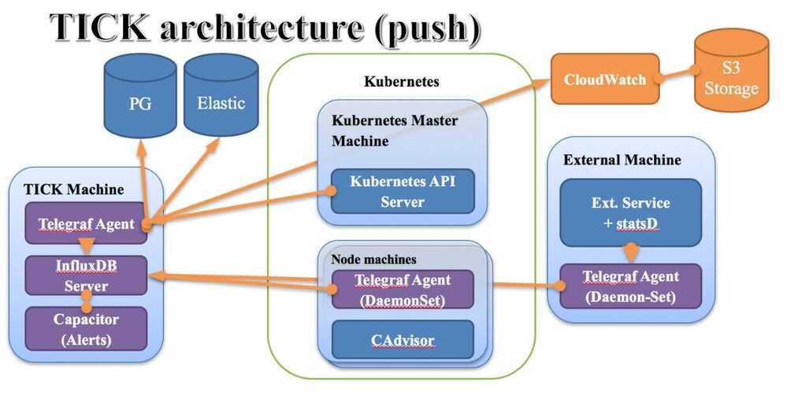

# Telegraf

Telegraf is an agent written in Go for collecting, processing, aggregating, and writing metrics.

Design goals are to have a minimal memory footprint with a plugin system so that developers in the community can easily add support for collecting metrics.

Telegraf is plugin-driven and has the concept of 4 distinct plugins:

1. [Input Plugins](https://github.com/influxdata/telegraf#input-plugins) collect metrics from the system, services, or 3rd party APIs
2. [Processor Plugins](https://github.com/influxdata/telegraf#processor-plugins) transform, decorate, and/or filter metrics
3. [Aggregator Plugins](https://github.com/influxdata/telegraf#aggregator-plugins) create aggregate metrics (e.g. mean, min, max, quantiles, etc.)
4. [Output Plugins](https://github.com/influxdata/telegraf#output-plugins) write metrics to various destinations

## Architecture



## Input Data Formats

Telegraf contains many general purpose plugins that support parsing input data using a configurable parser into [metrics](https://github.com/influxdata/telegraf/blob/master/docs/METRICS). This allows, for example, thekafka_consumerinput plugin to process messages in either InfluxDB Line Protocol or in JSON format.

- [InfluxDB Line Protocol](https://github.com/influxdata/telegraf/blob/master/plugins/parsers/influx)
- [Collectd](https://github.com/influxdata/telegraf/blob/master/plugins/parsers/collectd)
- [CSV](https://github.com/influxdata/telegraf/blob/master/plugins/parsers/csv)
- [Dropwizard](https://github.com/influxdata/telegraf/blob/master/plugins/parsers/dropwizard)
- [Graphite](https://github.com/influxdata/telegraf/blob/master/plugins/parsers/graphite)
- [Grok](https://github.com/influxdata/telegraf/blob/master/plugins/parsers/grok)
- [JSON](https://github.com/influxdata/telegraf/blob/master/plugins/parsers/json)
- [Logfmt](https://github.com/influxdata/telegraf/blob/master/plugins/parsers/logfmt)
- [Nagios](https://github.com/influxdata/telegraf/blob/master/plugins/parsers/nagios)
- [Value](https://github.com/influxdata/telegraf/blob/master/plugins/parsers/value), ie: 45 or "booyah"
- [Wavefront](https://github.com/influxdata/telegraf/blob/master/plugins/parsers/wavefront)

https://github.com/influxdata/telegraf/blob/master/docs/DATA_FORMATS_INPUT

## Plugins

Plugins that are used to access data and populate the data

https://github.com/influxdata/telegraf/tree/master/plugins

## Inputs plugins

Input plugins are used to get data from various sources to telegraf database

1. inputs.tail

2. inputs.file

3. inputs.filecount

4. inputs.filestat

5. inputs.logparser

### Grok Parser

`%{<capture_syntax>[:<semantic_name>][:<modifier>]}`

The capture_syntax defines the grok pattern that's used to parse the input line and thesemantic_nameis used to name the field or tag. The extensionmodifiercontrols the data type that the parsed item is converted to or other special handling.

`2018-05-23 15:45:39+0530 [-] "14.140.106.2" - - [23/May/2018:10:15:38 +0000] "POST /add/vLKQRUzsgiNa9ptpnrh3wVk7W3QRtsmI5lyq HTTP/1.1" 200 - "-" "-"`

Line - 3042

### Grok patterns

```bash
^"%{IPORHOST:clientip}" %{USER:ident} %{USER:auth} [%{HTTPDATE:timestamp}] "(?:%{WORD:verb} %{NOTSPACE:request}(?: HTTP/%{NUMBER:httpversion})?|%{DATA:rawrequest})" %{NUMBER:response} (?:%{NUMBER:bytes}|-) %{QS:referrer} %{QS:agent}$

"%{CLIENT:client_ip}" %{NOTSPACE:ident} %{NOTSPACE:auth} [%{HTTPDATE:ts:ts-httpd}] "(?:%{WORD:verb:tag} %{NOTSPACE:request}(?: HTTP/%{NUMBER:http_version:float})?|%{DATA})" %{NUMBER:resp_code:tag} (?:%{NUMBER:resp_bytes:int}|-) "%{DATA:referrer}" "%{DATA:agent}"
```

https://github.com/vjeantet/grok/blob/master/patterns/grok-patterns

Telegraf grok patterns - https://github.com/influxdata/telegraf/blob/master/plugins/parsers/grok/influx_patterns.go

Access logs - /var/log/apache2/access.log

Using this log file telegraf populate the number of requests and number of hits per second dashboard in grafana

## Output plugins

Output plugins are used to send data to various sources (mqtt, kafka, influxdb, cloudwatch, etc.)

## Glossary of terms

## Agent

An agent is the core part of Telegraf that gathers metrics from the declared input plugins and sends metrics to the declared output plugins, based on the plugins enabled by the given configuration.

## Aggregator Plugin

Aggregator plugins receive raw metrics from input plugins and create aggregate metrics from them. The aggregate metrics are then passed to the configured output plugins.

## Batch Size

The Telegraf agent sends metrics to output plugins in batches, not individually. The batch size controls the size of each write batch that Telegraf sends to the output plugins.

## Collection Interval

The default global interval for collecting data from each input plugin. The collection interval can be overridden by each individual input plugin's configuration.

## Collection Jitter

Collection jitter is used to prevent every input plugin from collecting metrics simultaneously, which can have a measurable effect on the system. Each collection interval, every input plugin will sleep for a random time between zero and the collection jitter before collecting the metrics.

## Flush Interval

The global interval for flushing data from each output plugin to its destination. This value should not be set lower than the collection interval.

## Flush Jitter

Flush jitter is used to prevent every output plugin from sending writes simultaneously, which can overwhelm some data sinks. Each flush interval, every output plugin will sleep for a random time between zero and the flush jitter before emitting metrics. This helps smooth out write spikes when running a large number of Telegraf instances.

## Input Plugin

Input plugins actively gather metrics and deliver them to the core agent, where aggregator, processor, and output plugins can operate on the metrics. In order to activate an input plugin, it needs to be enabled and configured in Telegraf's configuration file.

## Metric Buffer

The metric buffer caches individual metrics when writes are failing for an output plugin. Telegraf will attempt to flush the buffer upon a successful write to the output. The oldest metrics are dropped first when this buffer fills.

## Output Plugin

Output plugins deliver metrics to their configured destination. In order to activate an output plugin, it needs to be enabled and configured in Telegraf's configuration file.

## Precision

The precision configuration setting determines how much timestamp precision is retained in the points received from input plugins. All incoming timestamps are truncated to the given precision. Telegraf then pads the truncated timestamps with zeros to create a nanosecond timestamp; output plugins will emit timestamps in nanoseconds. Valid precisions arens, usorµs, ms, ands.

For example, if the precision is set toms, the nanosecond epoch timestamp1480000000123456789would be truncated to1480000000123in millisecond precision and then padded with zeroes to make a new, less precise nanosecond timestamp of1480000000123000000. Output plugins do not alter the timestamp further. The precision setting is ignored for service input plugins.

## Processor Plugin

Processor plugins transform, decorate, and/or filter metrics collected by input plugins, passing the transformed metrics to the output plugins.

## Service Input Plugin

Service input plugins are input plugins that run in a passive collection mode while the Telegraf agent is running. They listen on a socket for known protocol inputs, or apply their own logic to ingested metrics before delivering them to the Telegraf agent.

https://docs.influxdata.com/telegraf/v1.10/concepts/glossary

## Metric Filtering

## Selectors

Selector filters include or exclude entire metrics. When a metric is excluded from a Input or an Output plugin, the metric is dropped. If a metric is excluded from a Processor or Aggregator plugin, it is skips the plugin and is sent onwards to the next stage of processing.

- namepass: An array of glob pattern strings. Only metrics whose measurement name matches a pattern in this list are emitted.
- namedrop: The inverse ofnamepass. If a match is found the metric is discarded. This is tested on metrics after they have passed thenamepasstest.
- tagpass: A table mapping tag keys to arrays of glob pattern strings. Only metrics that contain a tag key in the table and a tag value matching one of its patterns is emitted.
- tagdrop: The inverse oftagpass. If a match is found the metric is discarded. This is tested on metrics after they have passed thetagpasstest.

## Modifiers

Modifier filters remove tags and fields from a metric. If all fields are removed the metric is removed.

- fieldpass: An array of glob pattern strings. Only fields whose field key matches a pattern in this list are emitted.
- fielddrop: The inverse offieldpass. Fields with a field key matching one of the patterns will be discarded from the metric. This is tested on metrics after they have passed thefieldpasstest.
- taginclude: An array of glob pattern strings. Only tags with a tag key matching one of the patterns are emitted. In contrast totagpass, which will pass an entire metric based on its tag, tagincluderemoves all non matching tags from the metric. Any tag can be filtered including global tags and the agenthosttag.
- tagexclude: The inverse oftaginclude. Tags with a tag key matching one of the patterns will be discarded from the metric. Any tag can be filtered including global tags and the agenthosttag.

Metrics can be routed to different outputs using the metric name and tags

https://github.com/influxdata/telegraf/blob/master/docs/CONFIGURATION#metric-filtering
