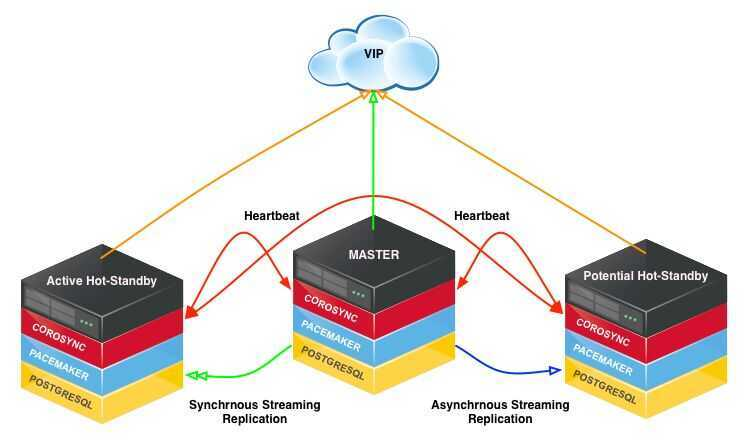

# CoreSync, Pacemaker

Corosync is an open source program that provides cluster membership and messaging capabilities, often referred to as themessaginglayer, to client servers. Pacemaker is an open source cluster resource manager (CRM), a system that coordinates resources and services that are managed and made highly available by a cluster. In essence, Corosync enables servers to communicate as a cluster, while Pacemaker provides the ability to control how the cluster behaves.

https://www.digitalocean.com/community/tutorials/how-to-create-a-high-availability-setup-with-corosync-pacemaker-and-floating-ips-on-ubuntu-14-04

## HA Multi-Node PostgreSQL Cluster

Building a highly avialable multi-node PostgreSQL cluster, using freely available software including [Pacemaker](http://clusterlabs.org/), [Corsync](http://corosync.github.io/corosync/), [Cman](http://www.sourceware.org/cluster/cman/) and [PostgresSQL](http://www.postgresql.org/) on [CentOS](http://www.centos.org/)

## Infrastructure

Three node HotStandby HA cluster

https://github.com/smbambling/pgsql_ha_cluster/wiki/Tutorial:-Building-A-Highly-Available-Multi-Node-PostgreSQL-Cluster

## CIB - Cluster Information Base

## Others

- [How to set up a Pacemaker cluster for high availability Linux | Enable Sysadmin](https://www.redhat.com/sysadmin/rhel-pacemaker-cluster)
- [GitHub - ClusterLabs/pcs: Pacemaker command line interface and GUI](https://github.com/ClusterLabs/pcs)
