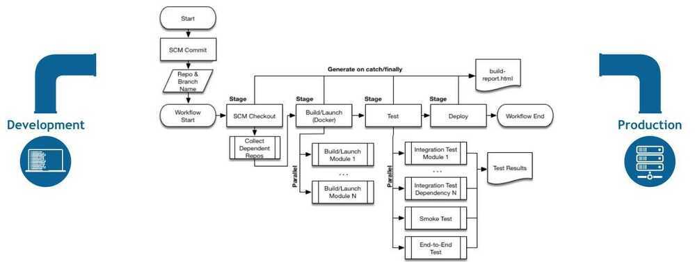
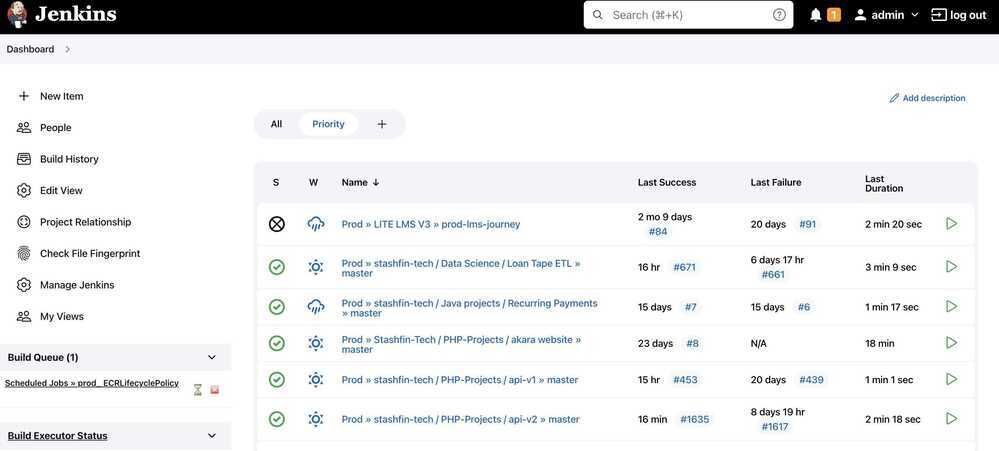

# Jenkins

## What can you do with Jenkins?

Jenkins is a continuous integration tool which enables software teams to build the integration pipelines for their projects. You can customize your Jenkins-powered pipelines to include different software development processes like building, testing, and staging as well as perform static analysis of your code.

## Types of Jenkins Projects

- Freestyle
    - Simple, single tasks
    - e.g. run tests
- Pipeline
    - Whole delivery cycle
    - e.g. test | build | ... for a single branch
- Multibranch Pipeline
    - like pipeline for multiple branches

## Credential Scopes

- System - Only available on Jenkins server NOT for Jenkins jobs
- Global - Everywhere accessible
- Project - Limited to project, ONLY with multibranch pipeline

## Pipeline Syntax

### Scripted

A Scripted Pipeline in Jenkins is a Groovy-based approach to defining continuous integration and continuous delivery (CI/CD) pipelines. It allows users to write pipeline scripts using Groovy syntax, providing full flexibility and customization for defining build, test, and deployment stages. Scripted Pipelines enable users to incorporate conditional logic, loops, and functions within the pipeline script to handle complex workflows and custom requirements. While offering extensive power and flexibility, Scripted Pipelines require users to have knowledge of Groovy programming and scripting concepts. They are well-suited for projects with intricate build processes or those requiring advanced automation and customization capabilities.

- First syntax
- Groovy engine
- Advanced scripting capabilities, high flexibility
- Difficult to start

### Declarative

Declarative Pipeline in Jenkins offers a simplified and structured approach for defining CI/CD pipelines, using a human-readable syntax with predefined sections like pipeline, stages, and agent. It's designed to be easy to read and maintain, making it suitable for users without strong scripting skills.It enforces a stricter syntax and allows for less flexibility compared to the scripted pipeline, which can be seen as an advantage for ensuring consistency and readability.

- Recent addition
- Easier to get started but not that powerful
- pre-defined structure

## Regex (Java Style)

`^dev|master|feature.*$`

## Trigger changes

- Poll scm - poll every few minutes to ask for changes from remote repository
- Git Hooks - Send jenkins a notification of change
- Best practise is to configure both

## Pipelines

Jenkins Pipeline (or simply "Pipeline" with a capital "P") is a suite of plugins which supports implementing and integrating continuous delivery pipelines into Jenkins.

A continuous delivery (CD) pipeline is an automated expression of your process for getting software from version control right through to your users and customers. Every change to your software (committed in source control) goes through a complex process on its way to being released. This process involves building the software in a reliable and repeatable manner, as well as progressing the built software (called a "build") through multiple stages of testing and deployment.

Pipeline provides an extensible set of tools for modeling simple-to-complex delivery pipelines "as code" via the [Pipeline domain-specific language (DSL) syntax](https://jenkins.io/doc/book/pipeline/syntax).

The definition of a Jenkins Pipeline is written into a text file (called a [Jenkinsfile](https://jenkins.io/doc/book/pipeline/jenkinsfile)) which in turn can be committed to a project's source control repository. This is the foundation of "Pipeline-as-code"; treating the CD pipeline a part of the application to be versioned and reviewed like any other code.

Creating a Jenkinsfile and committing it to source control provides a number of immediate benefits:

- Automatically creates a Pipeline build process for all branches and pull requests.
- Code review/iteration on the Pipeline (along with the remaining source code).
- Audit trail for the Pipeline.
- Single source of truth for the Pipeline, which can be viewed and edited by multiple members of the project.

While the syntax for defining a Pipeline, either in the web UI or with a Jenkinsfile is the same, it is generally considered best practice to define the Pipeline in a Jenkinsfile and check that in to source control.

## Declarative versus Scripted Pipeline syntax

A Jenkinsfile can be written using two types of syntax - Declarative and Scripted.

Declarative and Scripted Pipelines are constructed fundamentally differently. Declarative Pipeline is a more recent feature of Jenkins Pipeline which:

- provides richer syntactical features over Scripted Pipeline syntax, and
- is designed to make writing and reading Pipeline code easier.

Many of the individual syntactical components (or "steps") written into a Jenkinsfile, however, are common to both Declarative and Scripted Pipeline.

## Why Pipeline?

Jenkins is, fundamentally, an automation engine which supports a number of automation patterns. Pipeline adds a powerful set of automation tools onto Jenkins, supporting use cases that span from simple continuous integration to comprehensive CD pipelines. By modeling a series of related tasks, users can take advantage of the many features of Pipeline:

- **Code:** Pipelines are implemented in code and typically checked into source control, giving teams the ability to edit, review, and iterate upon their delivery pipeline.
- **Durable:** Pipelines can survive both planned and unplanned restarts of the Jenkins master.
- **Pausable:** Pipelines can optionally stop and wait for human input or approval before continuing the Pipeline run.
- **Versatile:** Pipelines support complex real-world CD requirements, including the ability to fork/join, loop, and perform work in parallel.
- **Extensible:** The Pipeline plugin supports custom extensions to its DSL and multiple options for integration with other plugins.



https://jenkins.io/doc/book/pipeline

## Jenkinsfile

```java
// Plugins requrired - Credentials, Credentials Binding

// getGitChanges() is a groovy script that will set the boolean variable
CODE_CHANGES = getGitChanges()

// global variable
def gv

// All environment variables in Jenkinsfile are available in the groovy script

pipeline {
 agent any
 tools {
  maven 'Maven'
  // gradle
  // jdk
 }
 parameters {
  string(name: "VERSION", defaultValue: "", description: "version to deploy on prod")
  choice(name: "VERSION", CHOICES: ["1.1.0", "1.2.0", "1.3.1"], description: "")
  booleanParame(name: "executeTests", defaultValue: true, description: "")
 }
 environment {
  NEW_VERSION = "1.3.0"
  SERVER_CREDENTIALS = credentials("sever-credentials")
 }
 stages {
  stage("init") {
   steps {
    script {

    }
   }
  }
  stage("Build") {
   when {
    expression {
     BRANCH_NAME == "dev" && CODE_CHANGES == true
    }
   }
   steps {
    echo "Building.."
    // use double quotes to use environment variables inside string
    echo "Building version ${NEW_VERSION}"
   }
  }
  stage("Test") {
   when {
    expression {
     BRANCH_NAME == "dev" || BRANCH_NAME == "master"
    }
   }
   steps {
    echo "Testing.."
   }
  }
  stage("Deploy") {
   steps {
    echo "Deploying...."
    when {
     expression {
      params.executeTests == true
     }
    }
    withCredentials([
     // type of credentials is username password
     // store usernameVariable in USER and passwordVariable in PASSWORD
     usernamePassword(credentials: 'server-credentials', usernameVariable: USER, passwordVariable: PASSWORD)
    ]) {
     sh "some script ${USERNAME} ${PASSWORD}"
    }
   }
  }
 }
 post {
  always {
   junit "**/target/*.xml"
  }
  failure {
   mail to: team@example.com, subject: "The Pipeline failed :("
  }
 }
}
```

https://www.youtube.com/watch?v=7KCS70sCoK0&list=PLy7NrYWoggjw_LIiDK1LXdNN82uYuuuiC&index=6&ab_channel=TechWorldwithNana

https://www.jenkins.io/doc/book/pipeline/jenkinsfile

## Jenkins

show all env variables in Jenkins - `http://jenkins_server_url:port/env-vars.html/`

## Multibranch Pipeline

The Multibranch Pipeline allows you to automatically create a pipeline for each branch on your repository with the help ofJenkinsfile.

Jenkinsfile is stored along with your source code inside a Source Code Management (SCM) eg. GitHub, BitBucket, etc.

A Jenkinsfile is nothing but a pipeline script that defines your CI/CD pipeline

## Plugins

- https://jenkins.io/doc/pipeline/steps/slack
- folder plugin
- Credentials
- Credentials Binding

## Jenkins X

Full CI/CD on kubernetes

https://kublr.com/blog/cicd-pipeline-with-jenkins-nexus-kubernetes

## Jenkins Operator

The Jenkins Operator is a [Kubernetes Native Operator](https://kubernetes.io/docs/concepts/extend-kubernetes/operator/) which manages operations for Jenkins on Kubernetes. It has been built with Immutability and declarative Configuration as Code in mind.

https://github.com/jenkinsci/kubernetes-operator

## 338: Jenkins 2 Build Server - Robert Bluemen with Brent Laster

Continuous integration and continuous delivery (CI/CD), the role of the build server in CI/CD, build pipelines, DevOps and the "pipeline as code" model, differences between Jenkins and Jenkins 2, the Jenkinsfile, scripted pipelines in a groovy DSL versus a declarative model, shared libraries of code, Jenkins2 as a workflow management system, scaling out Jenkins with a pool of compute resources, management of on-demand resources, integration of pipelines with Docker, the Jenkins plugin model, how Jenkins jobs are initiated (scheduled, event-driven, or UI), failure modes for pipelines, alerting people or other systems from Jenkins, management of credentials, users, roles and role-based authorization, and key drivers for adoption of Jenkins within an organization.

## Bind docker socket to container

`docker run -v /var/run/docker.sock:/var/run/docker.sock ...`

## Azure CI/CD with Jenkins

```bash
docker tag azure-vote-front gcr.io/example-data-archiver/azure-vote-front:v1

docker push gcr.io/example-data-archiver/azure-vote-front:v1
```

https://docs.microsoft.com/en-us/azure/aks/jenkins-continuous-deployment

## Optimizations

https://engineering.taboola.com/5-simple-tips-boosting-jenkins-performance

1. Minimize the amount of builds on the master node
2. Do not keep too much build history - Discard old builds
3. Clear old Jenkins data
4. Define the right heap size
5. Tune the garbage collector
    - Enable G1GC -- this is the most modern GC implementation (default on JDK9)
    - Enable GC logging -- this will help you monitor and tune later
    - Monitor GC behavior -- I use http://gceasy.io

## Views

[Views](https://www.jenkins.io/doc/developer/views/)
 

## Scripts

```java
// Kill all jobs

import java.util.ArrayList
import hudson.model.*;
import jenkins.model.Jenkins

  // Remove everything which is currently queued
  def q = Jenkins.instance.queue
  for (queued in Jenkins.instance.queue.items) {
    q.cancel(queued.task)
  }

  // stop all the currently running jobs
  for (job in Jenkins.instance.items) {
    stopJobs(job)
  }

  def stopJobs(job) {
    if (job in com.cloudbees.hudson.plugins.folder.Folder) {
      for (child in job.items) {
        stopJobs(child)
      }
    } else if (job in org.jenkinsci.plugins.workflow.multibranch.WorkflowMultiBranchProject) {
      for (child in job.items) {
        stopJobs(child)
      }
    } else if (job in org.jenkinsci.plugins.workflow.job.WorkflowJob) {

      if (job.isBuilding()) {
        for (build in job.builds) {
        build.doKill()
        }
      }
    }
}

// Clear build queue, Manage Jenkins > Script Console:
Jenkins.instance.queue.clear()
```

## Resources

- https://koudingspawn.de/the-complete-ci-cd-part-1
- [**https://www.jenkins.io/projects/blueocean/**](https://www.jenkins.io/projects/blueocean/)
- [How to deploy Jenkins on Kubernetes for CI/CD (DevOps)](https://www.youtube.com/watch?v=eRWIJGF3Y2g)
- https://www.youtube.com/watch?v=eqOCdNO2Nmk
- https://www.infracloud.io/blogs/jenkins-freestyle-pipeline-migration
