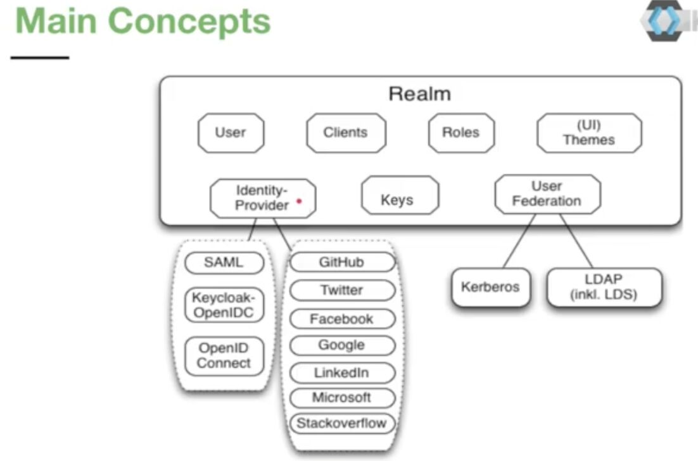
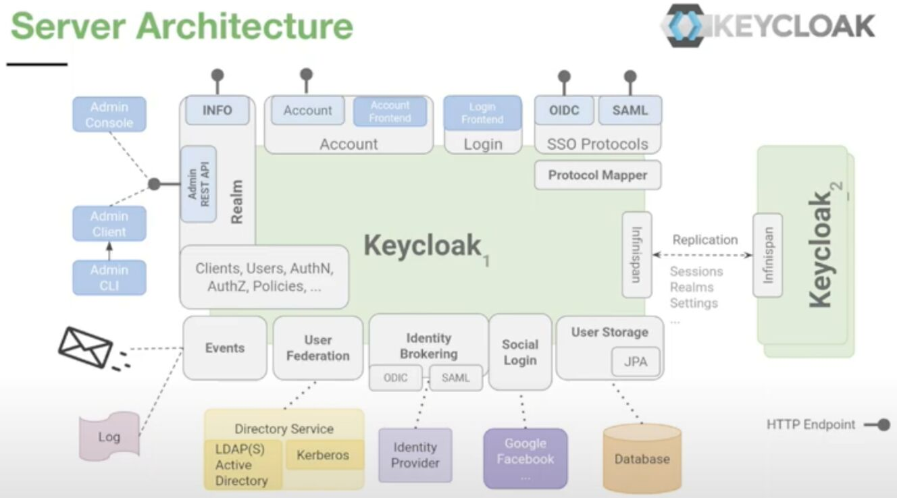
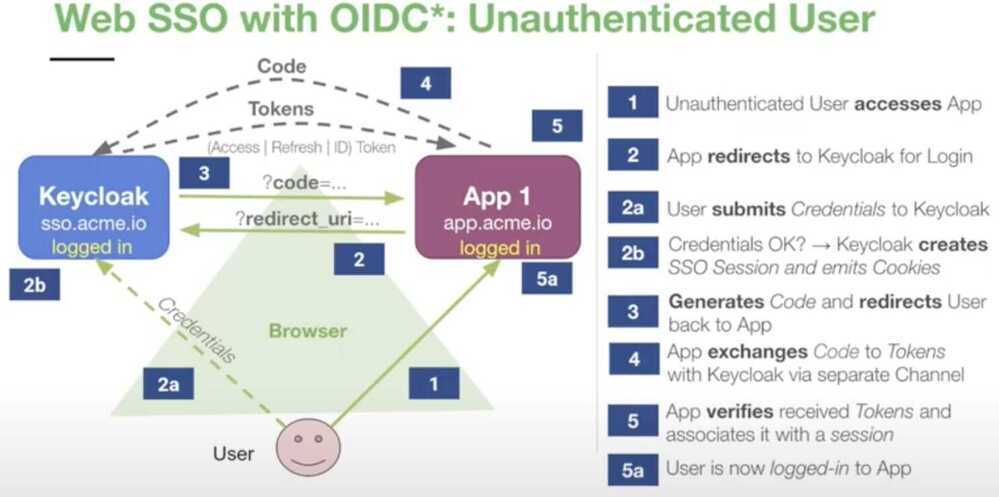
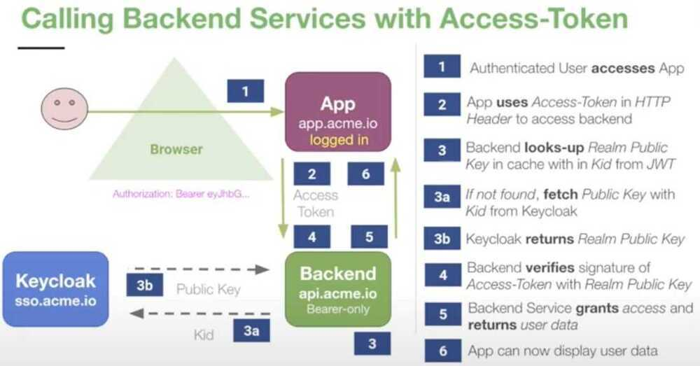
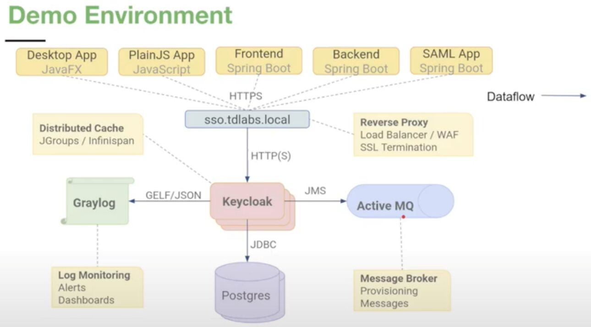

# KeyCloak

Add authentication to applications and secure services with minimum fuss.

- User Federation
- Identity Brokering
- Social Login

A realm in Keycloak is the equivalent of a tenant. It allows creating isolated groups of applications and users. By default there is a a single realm in Keycloak called **master**. This is dedicated to manage Keycloak and should not be used for your own applications.

## Features

- Single sign-on and single sign-out
- Standard protocols - OAuth 2.0, OIDC 1.0, SAML 2.0
- Flexible Authentication and Authorization
- Multi-Factor Authentication - One-time Passwords
- Social Login - Google, Facebook, Twitter,...
- Provides centralized User Management
- Supports Directory Services
- Customizable and Extensible
- Easy setup and integration

## Single sign-on

- SSO - Login once to access all applications
- Standardized Protocols
    - OpenID Connect 1.0 (OIDC)
    - Security Assertion Markup Language 2.0 (SAML)
- Browser based Web SSO
    - Web, Mobile and Desktop Apps
- Support for single logout
    - Logouts can be propagated to applications
    - Applications can opt-in

## Keycloak Tokens

- **OAuth / OpenID Connect**
    - Signed self-contained **JSON Web Token**
    - Claims: KV-Pairs with user information + Metadata
    - Issued by Keycloak, **signed** with Realm **Private Key**
    - **Verified** with Realm **Public Key**
    - Limited lifespan, can be revoked
- **Essential Token Types**
    - **Access-Token** short-lived (Minutes+) -> used for **accessing Resources**
    - **Refresh-Token** longer-lived (Hours+) -> used for **requesting new Tokens**
    - **IDToken** -> contains **User information (OIDC)**
    - **Offline-Token** long-lived (Days++) "Refresh-Token" that "never" expires

## Keycloak Integration Options

- **OpenID Connect Keycloak Adapters**
    - Spring security, Spring boot, ServletFilter, Tomcat, Jetty, Undertow, Wildfly, JBoss, EAP,...
    - NodeJS, JavaScript, Angular, AngularJS, Aurelia, CLI & Desktop Apps...
- **SAML Keycloak Adapters**
    - ServletFilter, Tomcat, Jetty, Wildfly...
- **Reverse Proxies**
    - Keycloak Gatekeeper, dedicated Proxy, written in Go, injects auth info into HTTP headers
    - Apache mod_auth_oidc for OpenID connect
    - Apache mod_auth_mellon for SAML

Python - https://github.com/marcospereirampj/python-keycloak

https://github.com/chunky-monkeys/keycloak-client

Django integration - https://medium.com/@sairamkrish/keycloak-integration-part-3-integration-with-python-django-backend-5dac3b4a8e4e

https://github.com/keycloak/keycloak

https://github.com/keycloak/keycloak-quickstarts

https://github.com/thomasdarimont/keycloak-extension-playground

https://www.keycloak.org/docs/latest/getting_started

https://www.keycloak.org/docs/latest/authorization_services

https://www.openshift.com/blog/adding-authentication-to-your-kubernetes-web-applications-with-keycloak

https://stackoverflow.com/questions/42186537/resources-scopes-permissions-and-policies-in-keycloak

[How to secure your Microservices with Keycloak - Thomas Darimont](https://www.youtube.com/watch?v=FyVHNJNriUQ)

[Bilding an effective identity and access management architecture with Keycloak](https://www.youtube.com/watch?v=RupQWmYhrLA)
