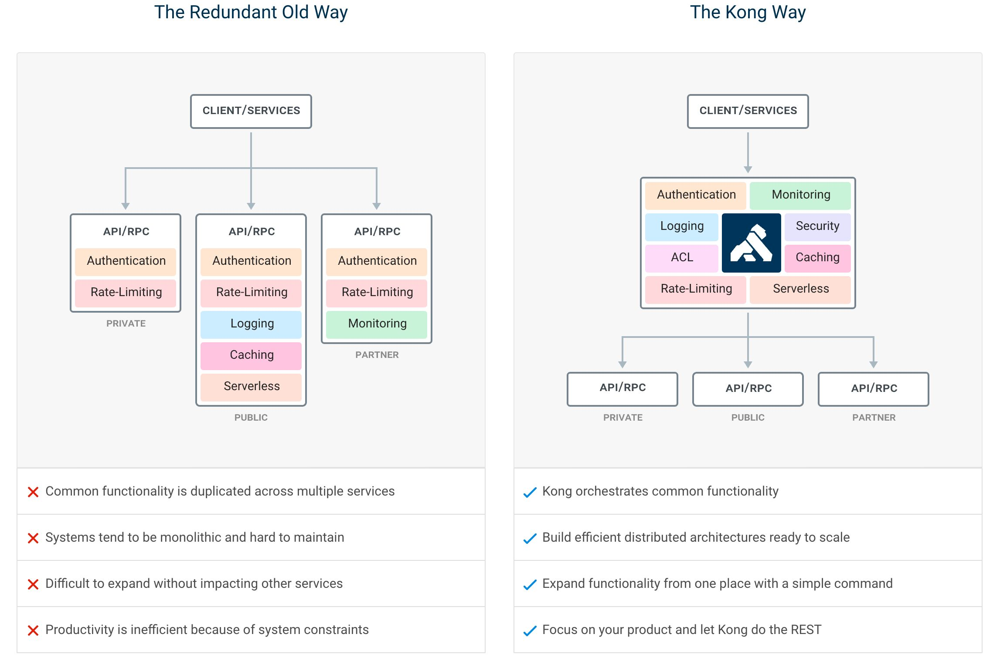

# Kong

Kong is a cloud-native, fast, scalable, and distributed Microservice Abstraction Layer *(also known as an API Gateway, API Middleware or in some cases Service Mesh)*. Made available as an open-source project in 2015, its core values are high performance and extensibility.

If you are building for web, mobile or IoT (Internet of Things) you will likely end up needing common functionality to run your actual software. Kong can help by acting as a gateway (or a sidecar) for microservices requests while providing load balancing, logging, authentication, rate-limiting, transformations, and more through plugins.



## Features

- **Cloud-Native:** Platform agnostic, Kong can run from bare metal to Kubernetes.
- **Dynamic Load Balancing:** Load balance traffic across multiple upstream services.
- **Hash-based Load Balancing:** Load balance with consistent hashing/sticky sessions.
- **Circuit-Breaker:** Intelligent tracking of unhealthy upstream services.
- **Health Checks:**Active and passive monitoring of your upstream services.
- **Service Discovery:** Resolve SRV records in third-party DNS resolvers like Consul.
- **Serverless:** Invoke and secure AWS Lambda or OpenWhisk functions directly from Kong.
- **WebSockets:** Communicate to your upstream services via WebSockets.
- **OAuth2.0:** Easily add OAuth2.0 authentication to your APIs.
- **Logging:** Log requests and responses to your system over HTTP, TCP, UDP, or to disk.
- **Security:** ACL, Bot detection, whitelist/blacklist IPs, etc...
- **Syslog:** Logging to System log.
- **SSL:** Setup a Specific SSL Certificate for an underlying service or API.
- **Monitoring:** Live monitoring provides key load and performance server metrics.
- **Forward Proxy:** Make Kong connect to intermediary transparent HTTP proxies.
- **Authentications:** HMAC, JWT, Basic, and more.
- **Rate-limiting:** Block and throttle requests based on many variables.
- **Transformations:** Add, remove, or manipulate HTTP requests and responses.
- **Caching:** Cache and serve responses at the proxy layer.
- **CLI:** Control your Kong cluster from the command line.
- **REST API:** Kong can be operated with its RESTful API for maximum flexibility.
- **Geo-Replicated:** Configs are always up-to-date across different regions.
- **Failure Detection & Recovery:** Kong is unaffected if one of your Cassandra nodes goes down.
- **Clustering:** All Kong nodes auto-join the cluster keeping their config updated across nodes.
- **Scalability:** Distributed by nature, Kong scales horizontally by simply adding nodes.
- **Performance:** Kong handles load with ease by scaling and using NGINX at the core.
- **Plugins:** Extendable architecture for adding functionality to Kong and APIs.

## Kong DB Less Declarative Config

https://docs.konghq.com/1.3.x/db-less-and-declarative-config

## Kong Helm Charts

```bash
helm install --name kg \
--set=admin.type=ClusterIP,proxy.type=LoadBalancer,proxy.loadBalancerIP=104.211.225.153 \
--namespace kong \
stable/kong

helm upgrade --set=admin.useTLS=true --namespace kong kg stable/kong

helm delete --purge kg

helm status kg

export POD_NAME=$(kubectl get pods --namespace kong -l "release=kg, app=kong" -o jsonpath="{.items[0].metadata.name}")
kubectl port-forward --namespace kong $POD_NAME 8444:8444

# Notes
    1. Kong Admin can be accessed inside the cluster using:
            DNS=kg-kong-admin.kong.svc.cluster.local
            PORT=8444

    To connect from outside the K8s cluster:
            HOST=127.0.0.1

            # Execute the following commands to route the connection to Admin SSL port:
            export POD_NAME=$(kubectl get pods --namespace kong -l "release=kg, app=kong" -o jsonpath="{.items[0].metadata.name}")
            kubectl port-forward --namespace kong $POD_NAME 8444:8444

    2. Kong Proxy can be accessed inside the cluster using:
            DNS=kg-kong-proxy.kong.svc.cluster.localPORT=443To connect from outside the K8s cluster:
            HOST=$(kubectl get svc --namespace kong kg-kong-proxy -o jsonpath='{.status.loadBalancer.ingress.ip}')
            PORT=$(kubectl get svc --namespace kong kg-kong-proxy -o jsonpath='{.spec.ports[0].nodePort}')
```

https://github.com/helm/charts/tree/master/stable/kong

## Commands

```bash
docker network create kong-net

docker run --name kong-database \
--network=kong-net \
-p 5432:5432 \
-e POSTGRES_USER=kong \
-e POSTGRES_DB=kong \
postgres:11.2

docker run --rm \
--network=kong-net \
-e KONG_DATABASE=postgres \
-e KONG_PG_HOST=kong-database \
kong:latest kong migrations bootstrap

docker run --name kong \
--network=kong-net \
-e KONG_DATABASE=postgres \
-e KONG_PG_HOST=kong-database \
-e KONG_PROXY_ACCESS_LOG=/dev/stdout \
-e KONG_ADMIN_ACCESS_LOG=/dev/stdout \
-e KONG_PROXY_ERROR_LOG=/dev/stderr \
-e KONG_ADMIN_ERROR_LOG=/dev/stderr \
-e "KONG_ADMIN_LISTEN=0.0.0.0:8001, 0.0.0.0:8444 ssl" \
-p 8000:8000 \
-p 8443:8443 \
-p 8001:8001 \
-p 8444:8444 \
kong:latest

docker run -p 1337:1337 \
--network=kong-net \
--name konga \
-v /Users/kongadata:/app/kongadata \
-e NODE_ENV=production \
pantsel/konga

curl -X POST \
-H "Content-Type: application/json" \
-d '{"name":"JohnDoe","username":"jdoe"}' \
http://localhost:8000/fake-api/users
```

http://localhost:8000/fake-api/users

## Konga

More than just another GUI to Kong Admin API

https://github.com/pantsel/konga

## Getting Started

[Get started with Konnect - Kong Konnect \| Kong Docs](https://docs.konghq.com/konnect/getting-started/)

### Installation using Konnect

```bash
brew tap kong/deck
brew install deck

export DECK_KONNECT_CONTROL_PLANE_NAME='serverless-default'
export DECK_KONNECT_TOKEN='kpat_eIfenaD74twNK4GTWCmAACVV0Dh69DML9fjDNU9YbXxAOrH9G'
deck gateway ping
```

### Config

```yaml
# Welcome to Konnect!
# In this quickstart, you'll set up a sample API and test key Kong Gateway
# features, including authentication and rate-limiting. Using decK, you'll
# sync the configuration in this file to a Serverless Gateway, giving you
# hands-on experience with managing Gateway setups as code.
# Once you're comfortable, you can define your own API in a decK configuration
# or sync this configuration to a Gateway running in another environment.

_format_version: "3.0"

# A service is Kong Gateway's entity that describes an API or microservice.
services:
- host: api.kong-air.com
  name: Kong-Air-Flights-API
  path: /flights
  port: 443
  protocol: https

  # A route defines the rules for how incoming requests are matched
  # by Kong Gateway and sent to the appropriate backend service.
  routes:
  - name: deck-demo-route
    methods:
    - GET
    - OPTIONS
    paths:
    - /first-route
    protocols:
    - http

  # A plugin adds functionality to Kong Gateway, enabling features like
  # authentication, rate limiting, logging, and more.
  plugins:
    # The key-auth plugin secures your service by requiring consumers to
    # provide an API key for access.
    - name: key-auth
      config:
        key_names:
        - apikey
        hide_credentials: false

# In order to be able to access your authenticated API, we need to define a consumer and credentials.
consumers:
- username: demo_user
  keyauth_credentials:
  - key: hello_world
```

### Sync & Test

```bash
deck gateway sync ./demo_deck_config.yaml

# test
curl https://kong-578a9e8f3ausw9mj7.kongcloud.dev/first-route -H "apikey: hello_world"
```

## Quiz

### Question 1

**What is a primary benefit of using Kong's plugin-driven architecture?**

1. It reduces the need for API versioning.
2. It allows custom extensions in multiple programming languages.
3. It eliminates the need for load balancing.
4. It replaces the need for microservices.

**Answer:** 2. It allows custom extensions in multiple programming languages.

---

### Question 2

**Which of the following best describes Kong's role in a microservices architecture?**

1. It replaces microservices with a single monolithic application.
2. It acts as an entry point for client requests, managing traffic to microservices.
3. It serves as a database for microservices data.
4. It directly processes client requests without routing them.

**Answer:** 2. It acts as an entry point for client requests, managing traffic to microservices.

---

### Question 3

**Which authentication methods are supported by Kong?**

1. Basic, JWT, HMAC, OAuth 2
2. Basic, SSH, HMAC, LDAP
3. OAuth 1, JWT, SAML, SSH
4. OAuth 2, SSH, LDAP, SAML

**Answer:** 1. Basic, JWT, HMAC, OAuth 2

---

### Question 4

**What is Kong's "Admin API" primarily used for?**

1. Managing backend service configurations.
2. Controlling consumer-level traffic directly.
3. Configuring and managing Kong Gateway settings.
4. Monitoring API health and performance metrics.

**Answer:** 3. Configuring and managing Kong Gateway settings.

## References

- [GitHub - Kong/kong: 🦍 The Cloud-Native API Gateway and AI Gateway.](https://github.com/Kong/kong)
- [Managing microservices and APIs with Kong and Konga | by Tselentis Panagis | Medium](https://medium.com/@tselentispanagis/managing-microservices-and-apis-with-kong-and-konga-7d14568bb59d)
- [The Platform Powering the API World | Kong Inc.](https://konghq.com/)
- [become an kong api gateway expert | kong api gateway full crash course - YouTube](https://www.youtube.com/watch?v=tagH5k7nBQ0)
