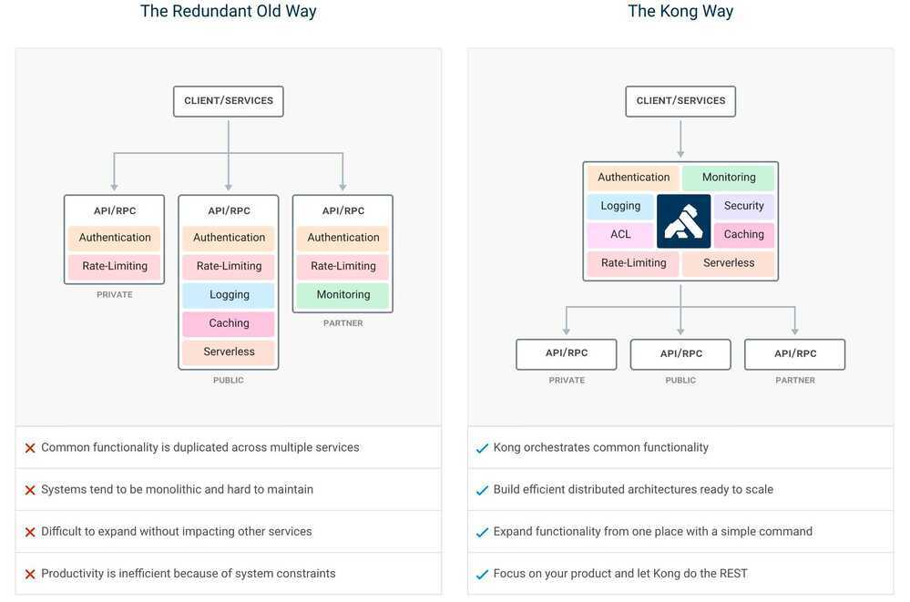

# Kong

Kong is a cloud-native, fast, scalable, and distributed Microservice Abstraction Layer *(also known as an API Gateway, API Middleware or in some cases Service Mesh)*. Made available as an open-source project in 2015, its core values are high performance and extensibility.

If you are building for web, mobile or IoT (Internet of Things) you will likely end up needing common functionality to run your actual software. Kong can help by acting as a gateway (or a sidecar) for microservices requests while providing load balancing, logging, authentication, rate-limiting, transformations, and more through plugins.



## Features

- **Cloud-Native:** Platform agnostic, Kong can run from bare metal to Kubernetes.
- **Dynamic Load Balancing:** Load balance traffic across multiple upstream services.
- **Hash-based Load Balancing:** Load balance with consistent hashing/sticky sessions.
- **Circuit-Breaker:** Intelligent tracking of unhealthy upstream services.
- **Health Checks:**Active and passive monitoring of your upstream services.
- **Service Discovery:** Resolve SRV records in third-party DNS resolvers like Consul.
- **Serverless:** Invoke and secure AWS Lambda or OpenWhisk functions directly from Kong.
- **WebSockets:** Communicate to your upstream services via WebSockets.
- **OAuth2.0:** Easily add OAuth2.0 authentication to your APIs.
- **Logging:** Log requests and responses to your system over HTTP, TCP, UDP, or to disk.
- **Security:** ACL, Bot detection, whitelist/blacklist IPs, etc...
- **Syslog:** Logging to System log.
- **SSL:** Setup a Specific SSL Certificate for an underlying service or API.
- **Monitoring:** Live monitoring provides key load and performance server metrics.
- **Forward Proxy:** Make Kong connect to intermediary transparent HTTP proxies.
- **Authentications:** HMAC, JWT, Basic, and more.
- **Rate-limiting:** Block and throttle requests based on many variables.
- **Transformations:** Add, remove, or manipulate HTTP requests and responses.
- **Caching:** Cache and serve responses at the proxy layer.
- **CLI:** Control your Kong cluster from the command line.
- **REST API:** Kong can be operated with its RESTful API for maximum flexibility.
- **Geo-Replicated:** Configs are always up-to-date across different regions.
- **Failure Detection & Recovery:** Kong is unaffected if one of your Cassandra nodes goes down.
- **Clustering:** All Kong nodes auto-join the cluster keeping their config updated across nodes.
- **Scalability:** Distributed by nature, Kong scales horizontally by simply adding nodes.
- **Performance:** Kong handles load with ease by scaling and using NGINX at the core.
- **Plugins:** Extendable architecture for adding functionality to Kong and APIs.

## Kong DB Less Declarative Config

https://docs.konghq.com/1.3.x/db-less-and-declarative-config

## Kong Helm Charts

```bash
helm install --name kg \
--set=admin.type=ClusterIP,proxy.type=LoadBalancer,proxy.loadBalancerIP=104.211.225.153 \
--namespace kong \
stable/kong

helm upgrade --set=admin.useTLS=true --namespace kong kg stable/kong

helm delete --purge kg

helm status kg

export POD_NAME=$(kubectl get pods --namespace kong -l "release=kg, app=kong" -o jsonpath="{.items[0].metadata.name}")
kubectl port-forward --namespace kong $POD_NAME 8444:8444

# Notes
    1. Kong Admin can be accessed inside the cluster using:
            DNS=kg-kong-admin.kong.svc.cluster.local
            PORT=8444

    To connect from outside the K8s cluster:
            HOST=127.0.0.1

            # Execute the following commands to route the connection to Admin SSL port:
            export POD_NAME=$(kubectl get pods --namespace kong -l "release=kg, app=kong" -o jsonpath="{.items[0].metadata.name}")
            kubectl port-forward --namespace kong $POD_NAME 8444:8444

    2. Kong Proxy can be accessed inside the cluster using:
            DNS=kg-kong-proxy.kong.svc.cluster.localPORT=443To connect from outside the K8s cluster:
            HOST=$(kubectl get svc --namespace kong kg-kong-proxy -o jsonpath='{.status.loadBalancer.ingress.ip}')
            PORT=$(kubectl get svc --namespace kong kg-kong-proxy -o jsonpath='{.spec.ports[0].nodePort}')
```

https://github.com/helm/charts/tree/master/stable/kong

## Commands

```bash
docker network create kong-net

docker run --name kong-database \
--network=kong-net \
-p 5432:5432 \
-e POSTGRES_USER=kong \
-e POSTGRES_DB=kong \
postgres:11.2

docker run --rm \
--network=kong-net \
-e KONG_DATABASE=postgres \
-e KONG_PG_HOST=kong-database \
kong:latest kong migrations bootstrap

docker run --name kong \
--network=kong-net \
-e KONG_DATABASE=postgres \
-e KONG_PG_HOST=kong-database \
-e KONG_PROXY_ACCESS_LOG=/dev/stdout \
-e KONG_ADMIN_ACCESS_LOG=/dev/stdout \
-e KONG_PROXY_ERROR_LOG=/dev/stderr \
-e KONG_ADMIN_ERROR_LOG=/dev/stderr \
-e "KONG_ADMIN_LISTEN=0.0.0.0:8001, 0.0.0.0:8444 ssl" \
-p 8000:8000 \
-p 8443:8443 \
-p 8001:8001 \
-p 8444:8444 \
kong:latest

docker run -p 1337:1337 \
--network=kong-net \
--name konga \
-v /Users/kongadata:/app/kongadata \
-e NODE_ENV=production \
pantsel/konga

curl -X POST \
-H "Content-Type: application/json" \
-d '{"name":"JohnDoe","username":"jdoe"}' \
http://localhost:8000/fake-api/users
```

http://localhost:8000/fake-api/users

## Konga

More than just another GUI to Kong Admin API

https://github.com/pantsel/konga

## References

https://github.com/Kong/kong

https://medium.com/@tselentispanagis/managing-microservices-and-apis-with-kong-and-konga-7d14568bb59d
