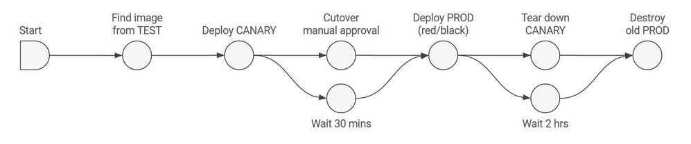

# Other - CICD

- CI - Continuous Integration
- CD - Continuous Delivery (building deployable artifacts / images)
- CD - Continuous Deployment (deploying those artifacts / images)
- CV - Continuous Verification

https://github.com/theonedev/onedev

## Github Actions - Workflow automation

- https://github.com/marketplace
- https://github.blog/2019-08-08-github-actions-now-supports-ci-cd
- Sign up for beta - https://github.com/features/actions
- https://dev.to/bnb/an-unintentionally-comprehensive-introduction-to-github-actions-ci-blm
- https://blog.kontena.io/deploying-to-kubernetes-from-github-actions
- https://help.github.com/en/categories/automating-your-workflow-with-github-actions
- https://github.com/Azure/k8s-actions
- https://dev.to/bnb/an-unintentionally-comprehensive-introduction-to-github-actions-ci-blm
- [Continuous Delivery: GitHub Actions (Developer Workflow Automation with GitHub Actions CICD)](https://www.youtube.com/watch?v=cKMO0aeh8GI&ab_channel=CodingTech)

### Blacksmith

- [Blacksmith](https://blacksmith.sh/)
- [Blacksmith - Overview + Get Started - YouTube](https://www.youtube.com/watch?v=lZO1HExEvtE)
- [Why Blacksmith?](https://docs.blacksmith.sh/getting-started/why-blacksmith)

### Github Actions - [Marketplace](https://github.com/marketplace)

- [Setup Node.js environment - GitHub Marketplace](https://github.com/marketplace/actions/setup-node-js-environment)
- [GitHub - peaceiris/actions-gh-pages: GitHub Actions for GitHub Pages 🚀 Deploy static files and publish your site easily. Static-Site-Generators-friendly.](https://github.com/peaceiris/actions-gh-pages)
- [Checkout - GitHub Marketplace](https://github.com/marketplace/actions/checkout)
- [Retry Step - GitHub Marketplace](https://github.com/marketplace/actions/retry-step)
- [retry action - GitHub Marketplace](https://github.com/marketplace/actions/retry-action)
- [Lighthouse CI Action · Actions · GitHub Marketplace · GitHub](https://github.com/marketplace/actions/lighthouse-ci-action)
- [GitHub - anishathalye/proof-html: A GitHub Action to validate HTML, check links, and more ✅](https://github.com/anishathalye/proof-html)

**Run github actions locally**

```bash
brew install act
```

https://github.com/nektos/act

**Run github actions on K8s cluster**

https://medium.com/nerd-for-tech/github-actions-self-hosted-runner-on-kubernetes-55d077520a31

**Github Secrets**

[Using secrets in GitHub Actions - GitHub Docs](https://docs.github.com/en/actions/security-guides/using-secrets-in-github-actions)

## Spinnaker

https://www.spinnaker.io/concepts



## Jenkins Operator

https://jenkinsci.github.io/kubernetes-operator

## Weave Flux

Weaveworks are originally known for creating Weave Net, a container SDN now available as both a Docker plugin and Kubernetes CNI option. Today, the company offers an extensive and eye-candy dashboard and a cloud offering, Weave Cloud.[The Flux Operator](https://github.com/weaveworks/flux) for Kubernetes allows GitOps style CD & release management where operator fetches the changes from git push events and handles the deployments gracefully. It continuously tries to match the declaritive configuration to the actualy deployment in Kubernetes. The cloud offering also has nice UI and Prometheus integration which aims to help your Continuous Delivery pipelines.


## Flux

The GitOps Kubernetes operator

We believe in GitOps

- You declaratively describe the entire desired state of your system in git.This includes the apps, config, dashboards, monitoring and everything else.
- What can be described can be automated.Use YAMLs to enforce conformance of the system. You don't need to runkubectl, all changes go through git. Use diff tools to detect divergence between observed and desired state and get notifications.
- You push code not containers.Everything is controlled through pull requests. There is no learning curve for new devs, they just use your standard git PR process. The history in git allows you to recover from any snapshot as you have a sequence of transactions. It is much more transparent to make operational changes by pull request, e.g. fix a production issue via a pull request instead of making changes to the running system.

Flux is a tool that automatically ensures that the state of a cluster matches the config in git. It uses an operator in the cluster to trigger deployments inside Kubernetes, which means you don't need a separate CD tool. It monitors all relevant image repositories, detects new images, triggers deployments and updates the desired running configuration based on that (and a configurable policy).

The benefits are: you don't need to grant your CI access to the cluster, every change is atomic and transactional, git has your audit log. Each transaction either fails or succeeds cleanly. You're entirely code centric and don't need new infrastructure.


https://github.com/fluxcd/flux

## Tekton (+1)

Kubernetes-native CI/CD

Tekton is a powerful and flexibleopen-source framework for creating CI/CD systems, allowing developers tobuild, test, and deployacross cloud providers and on-premise systems.

## CRDs

- Task
- PipelineResource
- Pipeline
- TaskRun
- PipelineRun

https://cloud.google.com/tekton

https://github.com/tektoncd/pipeline

https://tekton.dev

https://github.com/tektoncd/dashboard

[How to Build Cloud-Native CI/CD Pipelines With Tekton on Kubernetes- Speakers: Nikhil Thomas](https://www.youtube.com/watch?v=-ji5Z0qJmJs)

## Keel

Kubernetes Operator to automate Helm, DaemonSet, StatefulSet & Deployment updates

[https://keel.sh](https://keel.sh/)

https://github.com/keel-hq/keel

## DroneCI

Drone is a self-service Continuous Delivery platform for busy development teams.

Drone is a Container-Native, Continuous Delivery Platform

Drone is a Continuous Delivery system built on container technology. Drone uses a simple YAML configuration file, a superset of docker-compose, to define and execute Pipelines inside Docker containers.

https://drone.io

https://github.com/drone/drone

https://www.youtube.com/watch?v=myCcJJ_Fk10

## Concourse

https://github.com/concourse/concourse

https://concourse-ci.org

## CicleCI

https://www.youtube.com/watch?v=kDWHPlrEgEY

## Argo

### Workflows and Pipelines

Container native workflow engine for Kubernetes supporting both DAG and step based workflows

Argo Workflows is an open source container-native workflow engine for orchestrating parallel jobs on Kubernetes. Argo Workflows is implemented as a Kubernetes CRD.

- Define workflows where each step in the workflow is a container.
- Model multi-step workflows as a sequence of tasks or capture the dependencies between tasks using a graph (DAG).
- Easily run compute intensive jobs for machine learning or data processing in a fraction of the time using Argo Workflows on Kubernetes.
- Run CI/CD pipelines natively on Kubernetes without configuring complex software development products.

### Continuous Delivery

Declarative Continuous Delivery following Gitops

Application definitions, configurations, and environments should be declarative and version controlled. Application deployment and lifecycle management should be automated, auditable, and easy to understand.

### Advanced Deployment Controller

Additional Kubernetes deployment strategies such as Blue-Green and Canary

### Events

Event based dependency manager for Kubernetes

What Argo does differently is how they manage the actual CI/CD. It is specifically developed for Kubernetes and integrates with it through CRD's (Custom Resource Definitions). It defines a new CRD which is the 'Workflow'. In this workflow you define what needs to happen by laying out steps in a yaml format. Each step runs inits own Docker containeron your own Kubernetes cluster.

https://github.com/argoproj/argo

https://argoproj.github.io

### Others

https://argoproj.github.io/argo-rollouts

https://argoproj.github.io/argo-events/setup/kafka

## CI/CD

https://medium.com/axons/ci-cd-with-argo-on-kubernetes-28c1a99616a9

[**https://medium.com/@andrew.kaczynski/gitops-in-kubernetes-argo-cd-and-gitlab-ci-cd-5828c8eb34d6**](https://medium.com/@andrew.kaczynski/gitops-in-kubernetes-argo-cd-and-gitlab-ci-cd-5828c8eb34d6)

## GitlabCI

[**https://docs.gitlab.com/ee/ci/yaml/index.html**](https://docs.gitlab.com/ee/ci/yaml/index.html)

https://www.youtube.com/watch?v=LSdZj9X4MCM

https://www.freecodecamp.org/news/devops-with-gitlab-ci-course

[**https://dev.to/codicacom/how-to-deploy-a-static-website-to-aws-with-gitlab-ci-4g32**](https://dev.to/codicacom/how-to-deploy-a-static-website-to-aws-with-gitlab-ci-4g32)

https://about.gitlab.com/blog/2021/02/05/ci-deployment-and-environments

[**https://docs.gitlab.com/ee/ci/cloud_deployment/index.html#aws**](https://docs.gitlab.com/ee/ci/cloud_deployment/index.html#aws)

https://docs.gitlab.com/ee/ci/variables

[**https://docs.gitlab.com/ee/ci/variables/predefined_variables.html**](https://docs.gitlab.com/ee/ci/variables/predefined_variables.html)

### Example

```python
image: docker:latest

services:
    - docker:dind

stages:
    - build
    - deploy

variables:
    # Common
    AWS_ACCESS_KEY_ID: $AWS_ACCESS_KEY_ID
    AWS_SECRET_ACCESS_KEY: $AWS_SECRET_ACCESS_KEY
    AWS_REGION: $AWS_REGION
    S3_BUCKET_NAME: $S3_BUCKET_NAME
    CDN_DISTRIBUTION_ID: $CDN_DISTRIBUTION_ID

cache:
    key: $CI_COMMIT_REF_SLUG
    paths:
    - node_modules/

######################
##   BUILD STAGE    ##
######################
Build:
    stage: build
    image: node:latest
    script:
    - yarn install
    - yarn build
    artifacts:
    paths:
    - build/
    expire_in: 1 day

######################
##   DEPLOY STAGE   ##
######################
Deploy:
    stage: deploy
    when: manual
    before_script:
    - apk add --no-cache curl jq py-pip
    - pip install awscli
    - eval $(aws ecr get-login --no-include-email --region $AWS_REGION | sed 's|https://||')

    script:
        - aws s3 cp build/ s3://$S3_BUCKET_NAME/test/ --recursive --include "*"
        - aws cloudfront create-invalidation --distribution-id $CDN_DISTRIBUTION_ID --paths "/*"

Deploy:
    stage: deploy
    image: registry.gitlab.com/gitlab-org/cloud-deploy/aws-base:latest
    script:
        - aws s3 sync build/ s3://$S3_BUCKET_NAME/metta-web/$S3_BUCKET_PATH/ --delete
        - aws cloudfront create-invalidation --distribution-id $CDN_DISTRIBUTION_ID --paths "/*"
```

## Others

- [Vibinex • Open-source pull request personalization for GitHub, GitLab & Bitbucket](https://vibinex.com/)
