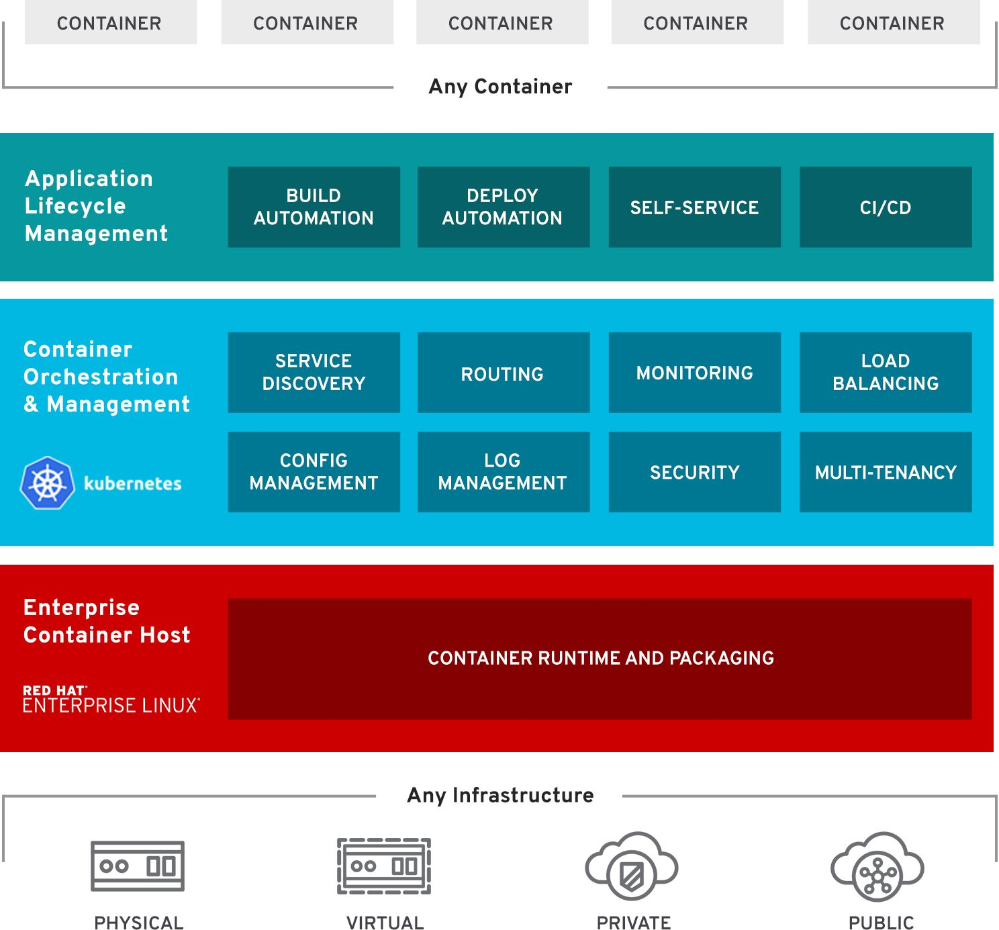
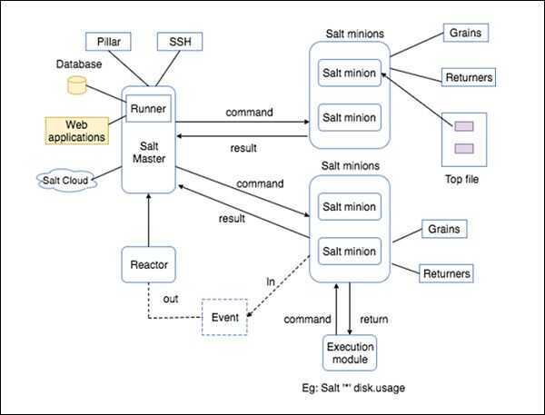

# Other Tools

## Resources

- [GitHub - avengers-p7/Documentation](https://github.com/avengers-p7/Documentation)

## Portainer

Portainer is an open-source lightweight management UI which allows us to easily manage our docker hosts or swarm clusters.

For adding new Endpoints

```bash
sudo vim /lib/systemd/system/docker.service

ExecStart=/usr/bin/dockerd -H fd:// -H tcp://0.0.0.0:4243

sudo systemctl restart docker.service
```

https://portainer.io

## Openshift

Is a comprehensive enterprise-grade application platform, built for containers with Kubernetes.



https://www.openshift.com/learn/what-is-openshift

Tools -

- EnMasse

Self-service messaging on Kubernetes and OpenShift

https://github.com/EnMasseProject/enmasse

## Jolokia

[Jolokia](https://jolokia.org/) is a JMX-HTTP bridge giving an alternative to JSR-160 connectors. It provides simple access to JMX beans via a RESTful API. This is a good fit to Kafka, as Kafka provides multiple JMX beans to monitor the brokers. Especially if your default monitoring tools rely on HTTP endpoints to check like in our case.

## Traefik

The cloud native edge router

A reverse proxy / load balancer that's easy, dynamic, automatic, fast, full-featured, open source, production proven, provides metrics, and integrates with every major cluster technology.

https://traefik.io

https://github.com/containous/traefik

## Consul

Consul is a distributed, highly available, and data center aware solution to connect and configure applications across dynamic, distributed infrastructure.

- **Service Discovery-** Consul makes it simple for services to register themselves and to discover other services via a DNS or HTTP interface. External services such as SaaS providers can be registered as well.
- **Health Checking-** Health Checking enables Consul to quickly alert operators about any issues in a cluster. The integration with service discovery prevents routing traffic to unhealthy hosts and enables service level circuit breakers.
- **Key/Value Storage-** A flexible key/value store enables storing dynamic configuration, feature flagging, coordination, leader election and more. The simple HTTP API makes it easy to use anywhere.
- **Multi-Datacenter-** Consul is built to be datacenter aware, and can support any number of regions without complex configuration.
- **Service Segmentation-** Consul Connect enables secure service-to-service communication with automatic TLS encryption and identity-based authorization.

https://www.consul.io

https://github.com/hashicorp/consul

## fabio

fabio is a fast, modern, zero-conf load balancing HTTP(S) and TCP router for deploying applications managed by [consul](https://consul.io/).

Register your services in consul, provide a health check and fabio will start routing traffic to them. No configuration required. Deployment, upgrading and refactoring has never been easier.

https://github.com/fabiolb/fabio

## Balena

Balena is a complete set of tools for building, deploying, and managing fleets of connected Linux devices. We provide infrastructure for fleet owners so they can focus on developing their applications and growing their fleets with as little friction as possible.

Our tools are designed to work well together as a platform, but you can also pick and choose the components you need for your project, and adapt them to your particular use case. We know that no two IoT projects are the same and there is no one-size-fits-all solution.

https://www.balena.io/what-is-balena

## Nebula

[Nebula](https://nebula-orchestrator.github.io/) is a open source project created for Docker orchestration and designed to manage massive clusters at scale, it achieves this by scaling each project component out as far as required. The project's aim is to act as Docker orchestrator for IoT devices as well as for distributed services such as CDN or edge computing. Nebula is capable of simultaneously updating tens of thousands of IoT devices worldwide with a single API call in an effort to help devs and ops treat IoT devices just like distributed Dockerized apps.

https://nebula.readthedocs.io/en/latest

https://github.com/nebula-orchestrator

https://nebula-orchestrator.github.io

https://dzone.com/articles/nebula-container-orchestratorcontainer-orchestrati-1

## Resin.io

Resin.iois a startup aiming to bring the benefits of Linux containers to the world of IoT, and specifically to embedded devices. According to the website, "Resin.io makes it simple to deploy, update, and maintain code running on remote devices. We are bringing the web development and deployment workflow to hardware."

## Eliot - Container platform for IoT devices

https://medium.com/devopslinks/announcing-eliot-container-platform-for-iot-devices-ad071e1917fd

## Caddy

- Fast, cross-platform HTTP/2 web server with automatic HTTPS
- Caddy 2 is a powerful, enterprise-ready, open source web serverwithautomatic HTTPSwritten in Go.
- Caddy simplifies your infrastructure. It takes care of TLS certificate renewals, OCSP stapling, static file serving, reverse proxying, Kubernetes ingress, and more.
- Its modular architecture means you can do more with a single, static binary that compiles for any platform.
- Caddy runs great in containers because it has no dependencies - not even libc. Run Caddy practically anywhere.

https://caddyserver.com

https://github.com/mholt/caddy

## Chaos Monkey

Chaos Monkey is a resiliency tool that helps applications tolerate random instance failures.

Chaos Monkey randomly terminates virtual machine instances and containers that run inside of your production environment. Exposing engineers to failures more frequently incentivizes them to build resilient services.

Chaos Monkey is an example of a tool that follows the [Principles of Chaos Engineering](http://principlesofchaos.org/).

https://github.com/Netflix/chaosmonkey

## Salt Stack

Software to automate the management and configuration of any infrastructure or application at scale.

SaltStack is a revolutionary approach to infrastructure management that replaces complexity with speed. SaltStack is simple enough to get running in minutes, scalable enough to manage tens of thousands of servers, and fast enough to communicate with each system in seconds.

Salt is a new approach to infrastructure management built on a dynamic communication bus. Salt can be used for data-driven orchestration, remote execution for any infrastructure, configuration management for any app stack, and much more.



https://docs.saltstack.com/en/latest/topics/tutorials/walkthrough.html

https://en.wikipedia.org/wiki/Salt_(software)

[https://www.saltstack.com](https://www.saltstack.com/)

https://github.com/saltstack/salt

https://docs.saltstack.com/en/getstarted

## CloudState

CloudState is an initiative to define what is "Serverless 2.0"- or what's the next generation of serverless is all about- by adding a concept, model, and implementation around managing state. Anyone who has built a cloud application, a distributed system, knows that state is actually the hardest thing to deal with, while serverless up to this point more or less ignores that. So we're trying to add that to the mix with essentially two things. First is a standardization effort defining a specification, a protocol and a TCK for implementing these things. Second is a reference implementation, implementing the spec.

https://github.com/cloudstateio/cloudstate/blob/master/README

## Nexus

Nexus by Sonatype is a repository manager that organizes, stores and distributes artifacts needed for development. With Nexus, developers can completely control access to, and deployment of, every artifact in an organization from a single location, making it easier to distribute software

## Packer

Packer is a tool which makes it easy to build machine images for different platforms like AWS EC2, Virtual Box, and VMWare.

Packer is a tool for creating identical machine images for multiple platforms from a single source configuration. It supports many different configuration sources including Shell, Chef, Puppet, Ansible, and Salt, and can output images for Compute Engine, Docker, and others. Packer is used by Jenkins agents to build images from configuration in Git repositories.

1. Packer is an open-source VM image creation tool by HashiCorp.
2. It automates VM image creation in cloud and on-prem environments.
3. Lightweight, runs on major OS, highly performant, and supports parallel builds.
4. Templates define image characteristics using JSON or HCL, providing abstraction.
5. Supports various builders (cloud, local), provisioners, data sources, and post-processors.
6. Artifacts are platform-specific image formats (AMIs, OVA) or metadata files.
7. Builds encapsulate the entire image creation process, triggered manually or automatically.
8. Commands (build, validate, inspect) manage Packer, extendable through plugins.
9. Templates use variables for dynamic configuration and reusability.
10. Enhances flexibility, security, and efficiency in managing machine images.

https://packer.io

## HuBot

Hubot is your friendly robot sidekick.Install him in your company to dramatically improve employee efficiency.

https://hubot.github.com

## Firecracker

Secure and fast microVMs for serverless computing.

Firecracker is an open source virtualization technology that is purpose-built for creating and managing secure, multi-tenant container and function-based services that provide serverless operational models. Firecracker runs workloads in lightweight virtual machines, called microVMs, which combine the security and isolation properties provided by hardware virtualization technology with the speed and flexibility of containers.

The main component of Firecracker is a virtual machine monitor (VMM) that uses the Linux Kernel Virtual Machine (KVM) to create and run microVMs. Firecracker has a minimalist design. It excludes unnecessary devices and guest-facing functionality to reduce the memory footprint and attack surface area of each microVM. This improves security, decreases the startup time, and increases hardware utilization. Firecracker currently supports Intel, AMD (preview) and Arm (preview) CPUs. Firecracker has also been integrated in container runtimes, for example [Kata Containers](https://github.com/kata-containers/documentation/wiki/Initial-release-of-Kata-Containers-with-Firecracker-support) and [Weaveworks Ignite](https://github.com/weaveworks/ignite).

Firecracker was developed at Amazon Web Services to accelerate the speed and efficiency of services like [AWS Lambda](https://aws.amazon.com/lambda/) and [AWS Fargate](https://aws.amazon.com/fargate/). Firecracker is open sourced under [Apache version 2.0](https://github.com/firecracker-microvm/firecracker/blob/master/LICENSE).

https://github.com/firecracker-microvm/firecracker

https://firecracker-microvm.github.io

https://aws.amazon.com/blogs/aws/firecracker-lightweight-virtualization-for-serverless-computing

## Nomad

Nomad is an easy-to-use, flexible, and performant workload orchestrator that can deploy a mix of microservice, batch, containerized, and non-containerized applications. Nomad is easy to operate and scale and has native Consul and Vault integrations.

Nomad is a cluster manager, designed for both long lived services and short lived batch processing workloads. Developers use a declarative job specification to submit work, and Nomad ensures constraints are satisfied and resource utilization is optimized by efficient task packing. Nomad supports all major operating systems and virtualized, containerized, or standalone applications.

https://www.nomadproject.io

https://github.com/hashicorp/nomad

## Ciao

https://www.brotandgames.com/ciao

## FastLane

Tool for iOS and Android developers to automate tedious tasks like generating screenshots, dealing with provisioning profiles, and releasing your application.

https://fastlane.tools

https://github.com/fastlane/fastlane

## Artifactory

[Artifactory](https://www.jfrog.com/artifactory/) is a product by JFrog that serves as a [binary repository manager](https://en.wikipedia.org/wiki/Binary_repository_manager). That said very often one will use a 'artifactory' as a synonym of the more general binary repository, much like many people use Frigidaire or fridge to denote the refrigerator regardless if it is a Frigidaire brand or not.

The binary repository is a natural extension to the source code repository, in that it will store the outcome of your build process, often denoted as artifacts. Most of the times one would not use the binary repository directly but through a package manager that comes with the chosen technology.

In most cases these will store individual application components that can later be assembled into a full product - thus allowing a build to be broken in smaller chunks, making more efficient use of resources, reducing build times, better tracking of binary debug databases etc.

Here are some of the most popular package managers that can be managed using a binary repository:

- Java: jar, ear, war etc has [Maven](https://maven.apache.org/) and the official [MavenCentral](https://search.maven.org/). There are many other package managers that will use the maven binary repository format as well ([ivy](http://ant.apache.org/ivy/), [gradle](https://gradle.org/) etc).
- .Net:[nuget](https://www.nuget.org/) for .NET components (DLL and EXE) but can also be used as a distribution mechanism under windows thorugh systems like [Chocolatey](https://chocolatey.org/). Newer versions of Powershell can also leverage this to distribute powershell modules though the [powershell gallery](https://www.powershellgallery.com/) of which one could build a local distribution with a binary repository and a repository in nuget format. Also check [OneGet](https://github.com/OneGet/oneget) if Windows distribution management is of interest to you.
- In JavaScript: we have [npm](https://www.npmjs.com/) which is one of the most popular, will require [nodejs](https://nodejs.org/en/).
- In python: there is [pip](https://pypi.python.org/pypi/pip) and the official package index [pypi](https://pypi.python.org/pypi), which one can also create a local instance through binary repository that will support the format.

This list is far from complete, just gives an idea of what's out there.

The binary repository can allow to host all of these under one roof, making their management much simpler for teams. Note that you do not need a very large team to start reaping benefits from binary package management. The initial investment is not very large and the benefits are felt immediately. Especially now that more and more platforms, frameworks and languages are integrating this dependency management directly in them. Their biggest advantage I have found however was to create an environment that your programmers will find natural and comfortable making it essential. It helps you as a devops creating a solid tool-chain and it helps them making the overall experience fit naturally in their stack of choice.

https://jfrog.com/artifactory

## Opendev

https://opendev.org

## registry / distribution

The Registry is a stateless, highly scalable server side application that stores and lets you distribute container images and other content.

Registry, the open source implementation for storing and distributing container images and other content, has been donated to the CNCF. Registry now goes under the name of Distribution, and the documentation has moved to [distribution/distribution](https://distribution.github.io/distribution/).

### Why use it

You should use the Registry if you want to:

- tightly control where your images are being stored
- fully own your images distribution pipeline
- integrate image storage and distribution tightly into your in-house development workflow

### Alternatives

Users looking for a zero maintenance, ready-to-go solution are encouraged to use one of the existing registry services. Many of these provide support and security scanning, and are free for public repositories. For example:

- [Docker Hub](https://hub.docker.com/)
- [Quay.io](https://quay.io/)
- [GitHub Packages](https://docs.github.com/en/packages/working-with-a-github-packages-registry/working-with-the-container-registry)
- [Harbor](https://goharbor.io/)
    - [Manage Container (Docker) Images, Helm, CNAB, and Other Artifacts With Harbor - YouTube](https://www.youtube.com/watch?v=f931M4-my1k)
- [CNCF Distribution](https://distribution.github.io/distribution/)
    - [GitHub - distribution/distribution: The toolkit to pack, ship, store, and deliver container content](https://github.com/distribution/distribution)
- ECR - Elastic Container Registry
- ACR - Azure Container Registry
- [Using S3 as a container registry | Adolfo Ochagavía](https://ochagavia.nl/blog/using-s3-as-a-container-registry/)

[Docker Hub](https://hub.docker.com/_/registry)

[Registry | Docker Docs](https://docs.docker.com/registry/)

```bash
docker run -d -p 5000:5000 --restart always --name registry registry:2
```

[GitHub - distribution/distribution: The toolkit to pack, ship, store, and deliver container content](https://github.com/distribution/distribution)
