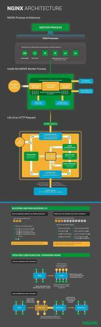

# NGINX

Designed to address the C10K problem: How can web servers handle 10,000 clients at the same time. With each new incoming connection, NGINX creates a file descriptor, which consumes less memory than an entire thread or process. Because its architecture is event-driven rather than process-based, NGINX also reduces the need for context switching that occurs in process-per-connection web servers.

## NGINX / HAProxy

- Load balancers
- Very efficient pings
- Can manage tens of thousands connection from a client from a single instance

## Installation

```python
sudo apt-get update
sudo apt-get install nginx --yes
sudo ufw app list
sudo ufw status
nginx -v
sudo systemctl start nginx   #start nginx
sudo systemctl status nginx  #check status of nginx
curl http://127.0.0.1        #test nginx
sudo systemctl stop nginx    #stop nginx

sudo nginx -t #test the config
sudo nginx -s reload # reload the config
```

<https://www.digitalocean.com/community/tutorials/how-to-install-nginx-on-ubuntu-16-04>

## Improvements

- worker_processes - nginx uses a fixed number of workers, each of which handles incoming requests. The general rule of thumb is that you should have one worker for each CPU-core your server contains.
- worker_connections

worker_connectionssets the number of connections every worker process can handle. The default is 512, but it can usually be increased.

- gzip compression
- Client Caching
- Filehandle Cache
- Caching

`proxy_cache_path /path/to/cache levels=1:2 keys_zone=my_cache:10m max_size=10g
inactive=60m;`

- Disable access logs
- **Switch from TCP to UNIX domain sockets**

When communicating to processes on the same machine UNIX sockets have better performance the TCP because there's less copying and fewer context switches.

- Setup upstream load balancing

Multiple upstream backends on the same machine produce higher throughout than a single one.

- Adjust client timeouts.
- Adjust output buffers.
- /etc/sysctl.conf tuning.
- Monitor

Continually monitor the number of open connections, free memory and number of waiting threads and set alerts if thresholds are breached. Install the NGINX stub_status module.

- proxy_buffering off;
- Nginx recommends pinning the number of workers to number of PC cores (just like we did with Apache's mpm_event configuration), by settingworker_processestoauto(default is 1) in/etc/nginx/nginx.conf.

<http://www.softwareprojects.com/resources/programming/t-optimizing-nginx-and-php-fpm-for-high-traffic-sites-2081.html>

## Architecture

NGINX stands out with an innovative event-driven architecture that allows it to scale to hundreds of thousands of concurrent connections on modern hardware.

There's one worker process per core to make efficient use of hardware resources, the ability to interleave multiple connections within a single worker process, and the capability to switch from connection to connection almost instantaneously as network traffic arrives. Put this magic together and you create the massively scalable HTTP application delivery engine that is NGINX.

<https://www.nginx.com/blog/inside-nginx-how-we-designed-for-performance-scale>

<https://www.aosabook.org/en/nginx.html>



## nginx 3rd party modules

<https://www.nginx.com/resources/wiki/modules>

## VTS

A virtual host and upstream traffic status module

<https://medium.com/@shevtsovav/ready-for-scraping-nginx-metrics-nginx-vts-exporter-prometheus-grafana-26c14816ae7c>

## Others

<https://github.com/kubernetes/ingress-nginx>

<https://www.freecodecamp.org/news/the-nginx-handbook>
