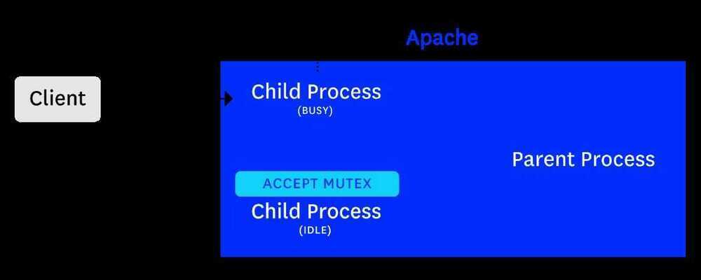
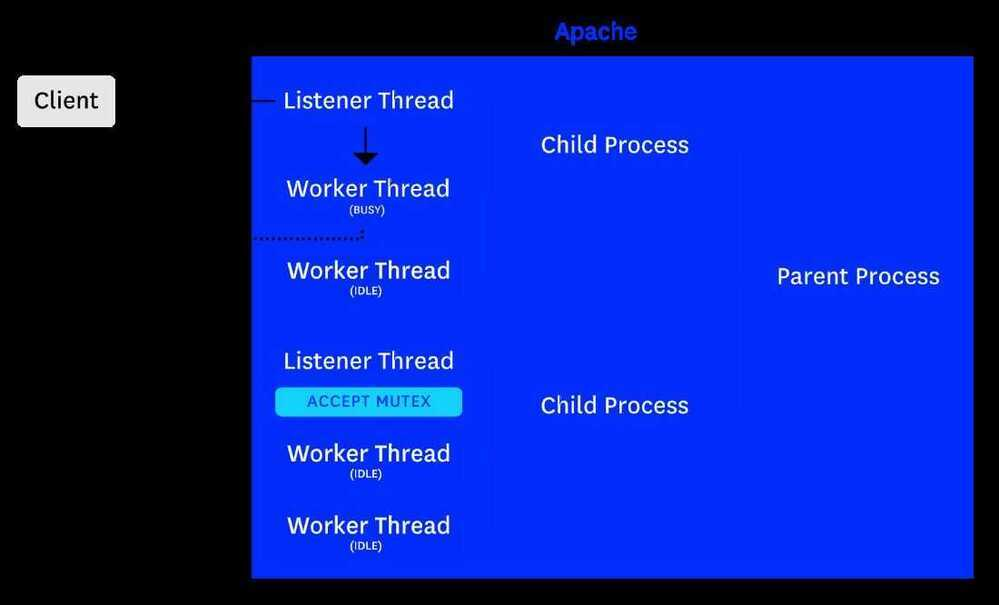

# Apache Server

## Apache HTTP Server

The [Apache HTTP Server](https://httpd.apache.org/), also known as Apache HTTPd, is a widely used open source web server that is extremely customizable. Its functionality can be extended through modules that suit a wide range of use cases, from serving [dynamic PHP content](https://wiki.apache.org/httpd/php) to acting as a [forward or reverse proxy](https://httpd.apache.org/docs/current/mod/mod_proxy.html).

The Apache HTTP Server, colloquially called Apache, is a Web server application notable for playing a key role in the initial growth of the World Wide Web. Originally based on the NCSA HTTPd server, development of Apache began in early 1995 after work on the NCSA code stalled. Apache quickly overtook NCSA HTTPd as the dominant HTTP server, and has remained the most popular HTTP server in use since April 1996.

Also known as HTTPd -- open source web server and extremely customizable

- Dynamic PHP content
- Acting as forward or reverse proxy

## Commands

```bash
apt install apache2
cd /etc/apache2/sites-available/
cp 000-default.conf gci.conf
nano gci.conf
a2ensite gci.conf
service apache2 start
service apache2 reload
nano /etc/apache2/apache2.conf
```

## Configs / Commands

```bash
cat /etc/apache2/mods-available/mpm_prefork.conf

cat /etc/apache2/apache2.conf

sudo systemctl restart apache2

apache2 reload

apache2ctl -l

apachectl configtest

apachectl -V

sudo apachectl status
sudo apachectl start
sudo apachectl restart
sudo apachectl stop
```

## Configs

```
/etc/apache2/
|-- apache2.conf
|-- ports.conf
|-- mods-enabled
||-- *.load
|-- *.conf
|-- conf-enabled
|-- *.conf
|-- sites-enabled
|--*.conf
```

- **apache2.conf** is the main configuration file. It puts the pieces together by including all remaining configuration files when starting up the web server.
- **ports.conf** is always included from the main configuration file. It is used to determine the listening ports for incoming connections, and this file can be customized anytime.
- Configuration files in the **mods-enabled/, conf-enabled/andsites-enabled/** directories contain particular configuration snippets which manage modules, global configuration fragments, or virtual host configurations, respectively.
- They are activated by symlinking available configuration files from their respective -available/ counterparts. These should be managed by using our helpers a2enmod, a2dismod, a2ensite, a2dissite, and a2enconf, a2disconf. See their respective man pages for detailed information.
- The binary is called apache2. Due to the use of environment variables, in the default configuration, apache2 needs to be started/stopped with/etc/init.d/apache2 or apache2ctl. Calling /usr/bin/apache2 directly will not work with the default configuration.

## Document Roots

By default, Ubuntu does not allow access through the web browser toanyfile apart of those located in/var/www, [public_html](http://httpd.apache.org/docs/2.4/mod/mod_userdir.html) directories (when enabled) and/usr/share(for web applications). If your site is using a web document root located elsewhere (such as in/srv) you may need to whitelist your document root directory in/etc/apache2/apache2.conf.

The default Ubuntu document root is/var/www/html. You can make your own virtual hosts under /var/www. This is different to previous releases which provides better security out of the box.

## modules

- mod_status

https://httpd.apache.org/docs/2.4/mod/mod_status.html

https://www.datadoghq.com/blog/collect-apache-performance-metrics

## Apache MPM (Multi Processing Module)

Apache's Multi-Processing Modules (MPMs) are responsible for binding to network ports on the machine, accepting requests, and dispatching children to handle the requests

By default mpm is prefork which is thread safe.

### Prefork MPM

Implements a non-threaded, pre-forking web server that handles requests in a manner similar to Apache 1.3. It is appropriate for sites that need to avoid threading for compatibility with non-thread-safe libraries. It is also the best MPM for isolating each request, so that a problem with a single request will not affect any other.

Prefork MPM uses multiple child processes with one thread each and each process handles one connection at a time.

That means that each Apache child process contains a single thread and handles one request at a time. Because of that, it consumes more resources than the threaded MPMs: Worker and Event.

Prefork is the default MPM, so if no MPM is selected in EasyApache, Prefork will be selected. It still is the best choice if Apache has to use non-thread safe libraries such as mod_php (DSO), and is ideal if isolation of processes is important.

The self-regulating MPM Prefork derives its namesake from how it forks or copies itself into new identical processes preemptively to wait for incoming requests. A non-threaded process-based approach at multiprocessing, MPM Prefork runs Apache in a single master parent server process. This parent is responsible for managing any additional child servers that make up its serverpool. While using MPM Prefork, each child server handles only a single request. This focus provides complete isolation from other requests dealt with on the server. MPM Prefork is typically used for compatibility when non-threaded libraries/software, like mod_php (DSO), are required. From an optimization standpoint, MPM Prefork can be sorely lacking when compared to multi-threaded solutions, requiring vastly more resources to reach similar traffic levels as a threaded MPM. It is resource intensive due to its need to spawn full copies of Apache for every request.

Each idle child process joins a queue to listen for incoming requests. This MPM uses a method called [accept mutex](https://httpd.apache.org/docs/2.4/mod/core.html#mutex) to ensure that only one process listens for and accepts the next TCP request (mutex stands for MUTual EXclusion mechanism). The first idle worker process in the queue acquires the mutex and listens for the next incoming connection. After receiving a connection, it releases the accept mutex by passing it to the next idle process in the queue, and processes the request (during which time it is considered a busy worker). After it finishes processing the request, it joins the queue once again.



Because this MPM needs a higher number of processes to handle any given number of requests, it is generally more memory-hungry than multi-threaded MPMs like worker and event. For this reason, if you are using mod_php you should consider switching over to [PHP-FPM](https://wiki.apache.org/httpd/PHP-FPM) so that you can use the worker or event MPM instead.

Avoid using MPM Prefork whenever possible. It's inability to scale well with increased traffic will quickly outpace the available hardware on most system configurations.

### Worker MPM

The [workerMPM](http://httpd.apache.org/docs/2.2/mod/worker.html) implements a hybrid multi-process multi-threaded server and gives better performance, hence it should be preferred unless one is using other modules that contain non-thread-safe libraries

Worker MPM uses multiple child processes with many threads each. Each thread handles one connection at a time.

Unlike Prefork, each child process under Worker can have multiple threads. As such, Worker can handle more requests with fewer resources than Prefork. Worker generally is recommended for high-traffic servers running Apache versions prior to 2.4. However, Worker is incompatible with non-thread safe libraries. If you need to run something that isn't thread safe, you will need to stick with Prefork.

In the [worker MPM](https://httpd.apache.org/docs/current/mod/worker.html), the parent process creates a certain number of child processes (once again, determined byStartServersin the main [configuration file](https://httpd.apache.org/docs/current/configuring.html)), and each child process creates a constant number of threads (ThreadsPerChild), as well as a listener thread.

Like the prefork MPM, the worker MPM usesaccept mutexto designate which thread will process the next incoming request. Each child process's listener thread only joins the idle queue (which indicates that it is eligible to obtain accept mutex) if it detects that at least one worker thread within the child process is currently idle. Therefore, for every process that has at least one idle worker thread, the listener thread will join the queue to apply for accept mutex.

The listener thread that accepts the mutex will listen for the next incoming request, accept the connection, and release the accept mutex so that another listener thread can shepherd the next incoming request. The listener thread then passes the socket to an idle worker thread within its process.



Unlike the prefork MPM, the worker MPM enables each child process to serve more than one request at a time, by utilizing multiple threads. Because you only need one thread per connection, instead of forking one process per connection, this MPM tends to be more memory-efficient than the prefork MPM.

The KeepAliveTimeOut directive currently defines the amount of time Apache will wait for requests. When utilizing KeepAlive with MPM Worker use the smallest KeepAliveTimeout as possible (1 second preferably).

### Event MPM

MPM tries to fix the 'keep alive problem' in HTTP.

Each process under Event also can contain multiple threads but, unlike Worker, each is capable of more than one task. Apache has the lowest resource requirements when used with the Event MPM.

Event, though, is supported only on servers running Apache 2.4. Under Apache 2.2, Event is considered experimental and is incompatible with some modules on older versions of Apache.

Based off the MPM Worker source code, MPM Event shares configuration directives with MPM Worker. It works nearly identical to MPM Worker except when it comes to handling KeepAlive requests. MPM Event uses a dedicated Listener thread in each child process. This Listening thread is responsible for directing incoming requests to an available worker thread. The Listening thread solves the issue encountered by MPM Worker which locks entire threads into waiting for the KeepAliveTimeout. The Listener approach of MPM Event ensures worker threads are not "stuck" waiting for KeepAliveTimeout to expire. This method keeps the maximum amount of worker threads handling as many requests as possible.

As of version 2.4 of Apache, the [event MPM](https://httpd.apache.org/docs/current/mod/event.html) is now an official MPM (it was formerly experimental). Like the worker MPM, each child process in the event MPM creates multiple threads (determined byThreadsPerChild), in addition to one listener thread.

In the other types of MPMs, if a worker thread or process handles a request on a keep-alive connection, the connection stays open (and the worker is blocked from processing other requests) for the duration of theKeepAliveTimeout, or until the client closes the connection.

A major benefit of the event MPM is that it handles keep-alive connections more efficiently by utilizing the kernel's I/O methods like [epoll](http://man7.org/linux/man-pages/man7/epoll.7.html)(on Linux) and [kqueue](https://www.freebsd.org/cgi/man.cgi?kqueue)(on BSD systems).

In the event MPM, a worker thread can write a request to the client, and then pass control of the socket to the listener thread, freeing the worker to address another request. The listener thread assumes control of sockets that don't require immediate action from a worker thread, until it detects an "event" on a socket (e.g. if the client sends a new request on a keep-alive connection, the kernel will create an event to notify the listener that the socket is readable). Once the event is detected, the listener thread will pass it on to the next available idle worker thread.

If the KeepAliveTimeout is reached before any activity occurs on the socket, the listener thread will close the connection. Also, if any listener thread detects that all worker threads within its process are busy, it will close keep-alive connections, forcing clients to create new connections that can be processed more quickly by other processes' worker threads (although, for the sake of simplicity, we do not show this in the example below). Because the dedicated listener thread helps monitor the lifetime of each keep-alive connection, worker threads that would otherwise have been blocked (waiting for further activity) are instead free to address other active requests.


There are a number of other experimental MPMs such as Threadpool, Perchild, and Leader.

https://www.liquidweb.com/kb/apache-performance-tuning-apache-mpm-modules

## Optimizations

### Remove the Burden of Processing Code From Apache

Apache modules provide a quick and easy solution to process the code needed to operate your website. Some of the most popular modules are mod_php for PHP, mod_rails for Ruby on Rails, and mod_python for Python.

However, these modules come with a price: they put the burden of code processing on Apache, which can slow down website response times across the board.

To improve Apache's performance, consider migrating to these alternative solutions instead:

- PHP: [php-fpm](https://php-fpm.org/)
- Ruby: [Unicorn](https://bogomips.org/unicorn/)
- Python: [uWSGI](https://uwsgi-docs.readthedocs.io/en/latest/) or [gnunicorn](http://gunicorn.org/)

### Change Apache's MaxKeepAliveRequests, KeepAlive, and KeepAliveTimeout Settings

- `MaxKeepAliveRequests` sets the maximum number of requests to accept per connection. The higher this number, the better the performance of the server, up to a point. The recommended value is 500.
- `KeepAliveTimeout` sets the number of seconds Apache will wait for a new request from a connection before it closes the connection. This number should be kept low. The recommended value is between 1 and 5.
- `MaxKeepAliveRequests` 500
- `KeepAlive` On
- `KeepAliveTimeout` 3

### Workers

```bash
sudo ps -y l C apache2 | awk '{x += $8;y += 1} END {print "Apache Memory Usage (MB): "x/1024; print "Average Process Size (MB): "x/((y-1)*1024)}'

MaxRequestWorkers = Baseline Free (with buffer space) / Avg Process Size

cat /etc/apache2/mods-available/mpm_prefork.conf

<IfModule mpm_prefork_module>
StartServers 10
MinSpareServers 20
MaxSpareServers 80
MaxRequestWorkers 250
MaxConnectionsPerChild 10000
</IfModule>
```

- **StartServers** is the number of child processes created upon starting Apache.
- [**MaxRequestWorkers**](https://httpd.apache.org/docs/2.4/mod/mpm_common.html#maxrequestworkers)(orMaxClientsin versions prior to 2.4) is the maximum number of connections that can be open at one time. Once this limit has been reached, any additional incoming connections are queued. The maximum size of the queue is determined by theListenBacklogsetting (by default 511, though it can be smaller depending on your OS; on Linux, the queue length is limited bynet.core.somaxconn).
- **MinSpareServers** / MinSpareThreads and MaxSpareServers / MaxSpareThreads refer to the minimum and maximum number of child processes (in the prefork MPM) or worker threads (in the worker and event MPMs) that should be idle at any one time. If the number of idle processes/threads does not fall within these bounds, the parent process will kill or spawn new processes/threads accordingly.
- **MaxConnectionsPerChild** (known as MaxRequestsPerChild prior to version 2.4) determines the total number of connections each child process can serve before it is restarted, which can be important for guarding against [memory leaks](https://www.datadoghq.com/blog/monitoring-apache-web-server-performance/#toc-host-level-resource-metrics) when using certain modules like mod_php.

- **Backlog Queue**
    - Backlog Queue settingnet.core.somaxconnfrom128to32768
    - Ephemeral Ports settingnet.ipv4.ip_local_port_rangefrom32768 60999to1024 65000

### Optimizations

- Remove Unused Modules
- Save memory by not loading modules that you do not need, including but not limited to mod_php, mod_ruby, mod_perl, etc.
- Use this command to list out modulesapache2 -Mit will list all the modules and then we have to stop loading unwanted modules. Please follow this articlehttps://haydenjames.io/strip-apache-improve-performance-memory-efficiency
- Please check and comparempm_prefork_moduleandmpm_event_module(better than prefork).
- Turn HostnameLookups Off
- Stop doing expensive DNS lookups. You will rarely ever need them and when you do, you can look them up after the fact.
- Do Not set KeepAliveTimeout too high
- If you have more requests than apache children, this setting can starve your pool of available clients.
- Check for SYMLINKS
- Avoid Wildcards in DirectoryIndex
- Use a specific DirectoryIndex, i.e. index.html or index.php, not index.
- Avoid using hostname in configs
- If you have HostnameLookups off, this will prevent you from having to wait for the DNS resolve of the hostnames in your configs, use IP addresses instead.
- Use Persistent Connections
- Set KeepAlive on and then set KeepAliveTimeout and KeepAliveRequests. KeepAliveTimeout is how long apache will wait for the next request, and KeepAliveRequests is the max number of requests for a client prior to resetting the connection. This will prevent the client from having to reconnect between each request.
- Turn off safe_mode for php
- It will utilize about 50-70% of your script time checking against these safe directives. Instead configure open_base_dir properly and utilize plugins such as mod_itk.
- Don't use threaded mpm with mod_php
- Look at using mod_itk, mod_php tends to segfault with threaded mpm.
- Flush buffers early for pre render
- It takes a relatively long time to create a web page on the backend, flush your buffer prior to page completion to send a partial page to the client, so it can start rendering. A good place to do this is right after the HEAD section -- so that the browser can start fetching other objects.
- Use mod_disk_cache NOT mod_mem_cache
- mod_mem_cache will not share its cache among different apache processes, which results in high memory usage with little performance gain since on an active server, mod_mem_cache will rarely serve the same page twice in the same apache process.
- Configure mod_disk_cache with a flat hierarchy
- Ensure that you are using CacheDirLength=2 and CacheDirLevels=1 to ensure htcacheclean will not take forever when cleaning up your cache directory.
- Disabling .htaccess

htaccess allows setting specific configuration for every single directory in our server root, without restarting. So, traversing all the directories, looking for the .htaccess files, on every request, incurs a performance penalty.

In general, you should only use.htaccessfiles when you don't have access to the main server configuration file.

In general, use of.htaccessfiles should be avoided when possible. Any configuration that you would consider putting in a.htaccessfile, can just as effectively be made in a `<directory>` section in your main server configuration file.

The solution is to disable it in/etc/apache2/apache2.conf:

AllowOverride None

If we need it for the specific directories, we can then enable it withinsections in our virtual host files:

AllowOverride All

## OS Specifics

- Increase Swappiness
    - Particularly on single site hosts this will increase performance. On linux systems increase /proc/sys/vm/swappiness to at least 60 if not greater. This will try to load as many files as possible into the memory cache for faster access.
- Increase Write Buffer Size
    - Increase your write buffer size for tcp/ip buffers. On linux systems increase /proc/sys/net/core/wmem_max and /proc/sys/net/core/wmem_default. If your pages fit within this buffer, apache will complete a process in one call to the tcp/ip buffer.
- Increase Max Open Files
    - If you are handling high loads increase the number of allowed open files. On linux, increase /proc/sys/fs/file-max and run ulimit -H -n 4096.

- If you need to get more speed from dynamic pages, you have a few options: add a **Varnish** or **Memcached** caching layer, switch to a faster PHP runtime (e.g., **HHVM**), do load balancing, or invest in extra hardware.

## Configurations

### Log Management

- Mod_log_config, which lets you define the settings and storage location for your logs.
- Mod_log_forensicrecords system state immediately before and after each request, so narrowing down suspicious activity becomes much easier.
- Mod_logiocharts all in and out traffic in bytes.

Apache gathers only two distinct types of logs: Access Log and Error Logs.

### Metrics to monitor

- Throughput and latency metrics
    - Request Processing Time
    - Rate of Requests
- Resource Utilization and activity metrics
- Host-level resource metrics
- Errors

| **Name**                             | **Description**                                                                |
|--------------------------|----------------------------------------------|
| Busy workers                         | Total number of busy worker threads/processes                                  |
| Idle workers                         | Total number of idle worker threads/processes                                  |
| Asynchronous connections: writing    | Number of async connections in writing state (only applicable to event MPM)    |
| Asynchronous connections: keep-alive | Number of async connections in keep-alive state (only applicable to event MPM) |
| Asynchronous connections: closing    | Number of async connections in closing state (only applicable to event MPM)    |

### Worker utilization

A worker is considered "busy" if it is in any of the following states: reading, writing, keep-alive, logging, closing, or gracefully finishing. An "idle" worker is not in any of the busy states;

If you consistently see a large number of idle workers, you may want to lower yourMinSpareServers(for the prefork MPM) orMinSpareThreads(for the worker and event MPMs) setting so that you are not sustaining a higher number of processes or threads than necessary to process your rate of traffic. Maintaining more processes or threads than you actually need will unncessarily exhaust system resources.

If, on the other hand, you have very few idle workers at all times, you may see slower request processing times because your server continually needs to spawn new processes or threads to handle new requests, rather than making use of the idle threads or processes already on hand. If you see thetotal number of workers (busy + idle)approaching yourMaxRequestWorkerslimit, any additional requests that come in will end up in the TCP ListenBacklog (which has a maximum size ofListenBacklog), until the next worker thread becomes available.

IncreasingMaxRequestWorkerscan help reduce the number of queued requests, but be careful not to set it unnecessarily high, as each additional worker thread or process requires additional system resources.

### Keep-alive connections

If you see a lot of connections in a keep-alive state (indicated by aKon the mod_status scoreboard), you may be getting many requests from clients that don't make subsequent requests (and therefore do not help you reap the intended benefits of keep-alive connections). If you are not already using the event MPM, try switching to it if possible, because this MPM was designed to process keep-alive connections more efficiently.

If youareusing the event MPM, Apache will expose the count of keep-alive async connections (any connections that are waiting for further events to signal that they are ready to get passed back to worker threads). If you see a high number of keep-alive async connections, combined with high CPU and memory utilization, you may want to lower the maximum number of simultaneous connections to the server (MaxRequestWorkers), and/or decrease theKeepAliveTimeoutto avoid holding connections open longer than necessary

[**Host-level resource metrics**](https://www.datadoghq.com/blog/monitoring-apache-web-server-performance/#host-level-resource-metrics)

### Memory usage

Memory is one of the most important resources to monitor when using Apache. If Apache runs out of memory, it will start swapping to disk, which greatly degrades performance. To guard against memory leakage (which is particularly important if you use mod_php), you could setMaxConnectionsPerChildto a high value (e.g. 1,000) rather than leaving it unbounded (by setting it to 0). By default, this directive is unbounded, which means that processes will never be forced to restart. If you do choose to set this directive, make sure not to set it too low, because restarting processes carries some overhead.

As mentioned above, memory use is also impacted by theMaxRequestWorkerssetting, which controls the maximum number of processes or threads running at any one time. The value ofMaxRequestWorkers(known asMaxClientsprior to version 2.4) should be calculated based on the maximum amount of memory you feel comfortable reserving for Apache processes. Using a tool like [htop](http://hisham.hm/htop/) should give you a rough idea of the actual, virtual, and cached memory usage of each Apache process. You can use this to calculate an estimate of what yourMaxRequestWorkersvalue should be.

For example, if you observe that each Apache process uses roughly 50MB, and your server has 4GB of RAM, you would calculateMaxRequestWorkerswith a rough formula of:( (4000 - `<OTHER_MEMORY_NEEDED>`) / 50 )

The value of `<OTHER_MEMORY_NEEDED>` depends on whatever else you're running, such as an application server or MySQL. You can also use htop to check how much memory your system is using when Apache isnotrunning, and use this value as a basis for `<OTHER_MEMORY_NEEDED>`. Make sure to add in a bit of a cushion as an extra precaution - it's better to be conservative about theMaxRequestWorkersvalue because you don't want to run out of memory and start swapping to disk. The [Apache docs](https://httpd.apache.org/docs/trunk/misc/perf-scaling.html#sizing-maxClients) offer more advice about determining a good value forMaxRequestWorkers.

If Apache is using too much memory, you should try to switch from prefork to the worker or event MPM if your system allows it, and if you do not need to use non-thread-safe libraries. You can also disable any unnecessary Apache modules (to check which ones are currently loaded, runhttpd -D DUMP_MODULESon [RPM-based systems](https://httpd.apache.org/docs/2.4/platform/rpm.html) orapache2ctl -Mon [other Unix-based systems](https://httpd.apache.org/docs/2.4/programs/apachectl.html)).

Lowering the number of processes created upon startup ([StartServers](https://httpd.apache.org/docs/2.4/mod/mpm_common.html#startservers)), and/or decreasingMaxSpareThreads(maximum allowed number of idle worker threads) can also help lower your memory footprint. Alternatively, you can add more memory to your servers, or [scale horizontally](https://wiki.apache.org/httpd/PerformanceScalingOut) to distribute the load among a higher number of servers.

### CPU utilization

If you see CPU usage continually rising on your Apache servers, this can indicate that you don't have enough resources to serve the current rate of requests. If you are running a database and/or application server on the same host as Apache, you should consider moving them onto separate machines. This gives you more flexibility to [scale each layer of your environment](https://wiki.apache.org/httpd/PerformanceScalingOut)(database, application, and web servers) as needed. The more connections Apache needs to serve, the more threads or processes are created (depending on the MPM in use), each of which requires additional CPU.

### Open file descriptors

Apache opens a file descriptor for each connection, as well as every log file. If your server has a large number of virtual hosts, you may run into a problem with your system-imposed limit, because Apache generates separate log files for each virtual host. [The documentation](https://httpd.apache.org/docs/2.4/vhosts/fd-limits.html) has some useful guidelines about how you can either raise the limit on your system, or [reduce the total number of logs created](http://httpd.apache.org/docs/current/logs.html#virtualhost), by writing all virtual host logs to the same file, and using a script like [split-logfile](http://httpd.apache.org/docs/current/programs/split-logfile.html) for downstream categorization

[**Errors**](https://www.datadoghq.com/blog/monitoring-apache-web-server-performance/#errors)

| **Name**          | **Description**                                                                                                      | **Availability**  |
|------------|------------------------------------------------|-------------|
| Client error rate | Rate of 4xx client errors (e.g. 403 Forbidden, 404 Not Found) per second                                             | Apache access log |
| Server error rate | Rate of 5xx server-side errors (e.g. 500 Internal Server Error, 502 Bad Gateway, 503 Service Unavailable) per second | Apache access log |

Apache will typically generate a 503 Service Unavailable status code when it is overloaded.

- **Apache 2.2** can generate one processes per second.
- **Apache 2.4** can generate up to 32 processes in on second. When minimum idle spare processes are less than MinSpareServers value, Apache start 1 process and wait for one second, If it's still less, Apache start 2 processes and wait a second, If it's still less Apache starts 4 processes and wait for a second, similarly Apache can start-up to 32 spare child processes per second and it repeated until minimum spare process exceeded MinSpareServers value.

[**https://www.datadoghq.com/blog/monitoring-apache-web-server-performance/**](https://www.datadoghq.com/blog/monitoring-apache-web-server-performance/)

https://www.datadoghq.com/blog/collect-apache-performance-metrics

https://cwiki.apache.org/confluence/display/httpd/PerformanceScalingUp

https://cwiki.apache.org/confluence/display/httpd/PerformanceScalingOut

https://httpd.apache.org/docs/2.4/mod/mpm_common.html

https://www.liquidweb.com/kb/apache-performance-tuning-mpm-directives/#prefork

## Apache Tomcat

Apache Tomcat (or simply Tomcat) is an open source web server and servlet container developed by the Apache Software Foundation (ASF). Tomcat implements the Java Servlet and the JavaServer Pages (JSP) specifications from Oracle, and provides a "pure Java" HTTP web server environment for Java code to run in. In the simplest config Tomcat runs in a single operating system process. The process runs a Java virtual machine (JVM). Every single HTTP request from a browser to Tomcat is processed in the Tomcat process in a separate thread.

[Running Multiple Tomcats with Single Server Installation](https://howtodoinjava.com/tomcat/running-multiple-instances-of-tomcat-with-single-server-installation/)

## Difference between Apache HTTP Server and Apache Tomcat

The Apache "http" server is often referred to as Apache and is a server that handles http requests. Its job is to listen for requests and pass it on to the appropriate module to process. There are modules to process C, Java, PERL, PHP, Python, Ruby etc.

Apache Tomcat is a Java Servlet container. It runs as an Apache http server module. It constructs the HTML pages by executing Java Servlets and Java Server Pages and returns them to the http server.

In simple words, Apache is a web-server meant to serve static web-pages. Example includes plain HTML pages (you can create a simple HTML page & Apache will serve it for you. Try using XAMPP or WAMP Server to see it for yourself on Windows machines). Facebook, Google, or Wordpress sites are some of the examples .

Apache Tomcat, on the other hand, is an application server meant to serve Java applications (Servlets, JSPs etc). You can serve web-pages as well through Tomcat, but it is less efficient at that as compared to Apache. IRCTC is one such website.

Apache is a server, And Tomcat is a Container.

Apache Takes The request from user, And handover to Tomcat. And Tomcat handover the request to suitable programs.

Programs process the request and provide a response and request back to Tomcat, Then Tomcat handover request and response object to Apache server and Finally Apache give a response to user.

https://www.quora.com/What-is-the-difference-between-apache-and-apache-tomcat

## Varnish

Varnish is an [HTTP accelerator](https://en.wikipedia.org/wiki/HTTP_accelerator) designed for content-heavy [dynamic web sites](https://en.wikipedia.org/wiki/Dynamic_web_site) as well as APIs. In contrast to other [web accelerators](https://en.wikipedia.org/wiki/Web_accelerator), such as [Squid](https://en.wikipedia.org/wiki/Squid_(software)), which began life as a client-side cache, or [Apache](https://en.wikipedia.org/wiki/Apache_HTTP_server) and [nginx](https://en.wikipedia.org/wiki/Nginx), which are primarily origin servers, Varnish was designed as an HTTP accelerator. Varnish is focused exclusively on [HTTP](https://en.wikipedia.org/wiki/HTTP), unlike other [proxy servers](https://en.wikipedia.org/wiki/Proxy_server) that often support [FTP](https://en.wikipedia.org/wiki/FTP), [SMTP](https://en.wikipedia.org/wiki/SMTP) and other [network protocols](https://en.wikipedia.org/wiki/Network_protocol)

Varnish is used by websites including [Wikipedia](https://en.wikipedia.org/wiki/Wikipedia), online newspaper sites such as [The New York Times](https://en.wikipedia.org/wiki/The_New_York_Times), [The Guardian](https://en.wikipedia.org/wiki/The_Guardian), [Gulf News](https://en.wikipedia.org/wiki/Gulf_News), [The Hindu](https://en.wikipedia.org/wiki/The_Hindu), [Corriere della Sera](https://en.wikipedia.org/wiki/Corriere_della_Sera), social media and content sites such as [Facebook](https://en.wikipedia.org/wiki/Facebook), [Twitter](https://en.wikipedia.org/wiki/Twitter), [Reddit](https://en.wikipedia.org/wiki/Reddit), Spotify, [Vimeo](https://en.wikipedia.org/wiki/Vimeo), and [Tumblr](https://en.wikipedia.org/wiki/Tumblr). In 2012, 5% of the top 10,000 sites in the web used the software.

- Layer 7 reverse proxy
- HTTP Cache

https://en.wikipedia.org/wiki/Varnish_(software)
