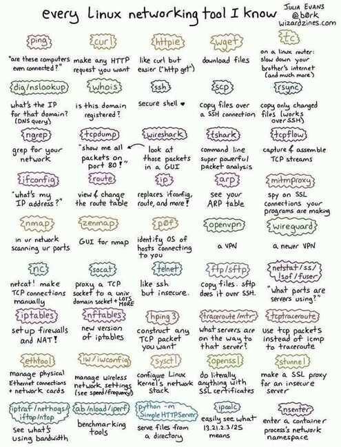

# Networking tools



https://haydenjames.io/linux-networking-commands-scripts

1. [aria2](https://aria2.github.io/)--downloading just about everything. Torrents included.
2. [arpwatch](https://linux.die.net/man/8/arpwatch)--Ethernet Activity Monitor.
3. [bmon](https://github.com/tgraf/bmon)--bandwidth monitor and rate estimator.
4. [bwm-ng](https://www.gropp.org/?id=projects&sub=bwm-ng)--live network bandwidth monitor.
5. [curl](https://curl.haxx.se/)--transferring data with URLs. (or try [httpie](https://httpie.org/))
6. [darkstat](https://unix4lyfe.org/darkstat/)-- captures network traffic, usage statistics.
7. [dhclient](https://linux.die.net/man/8/dhclient)-- Dynamic Host Configuration Protocol Client
8. [dig](https://linux.die.net/man/1/dig)--query DNS servers for information.
9. [dstat](https://github.com/dagwieers/dstat)--replacement for vmstat, iostat, mpstat, netstat and ifstat.
10. [ethtool](https://mirrors.edge.kernel.org/pub/software/network/ethtool/)--utility for controlling network drivers and hardware.
11. [gated](https://www.oreilly.com/library/view/linux-in-a/0596000251/re101.html)-- gateway routing daemon.
12. [host](https://linux.die.net/man/1/host)-- DNS lookup utility.
13. [hping](http://www.hping.org/)-- TCP/IP packet assembler/analyzer.
14. [ibmonitor](http://ibmonitor.sourceforge.net/)--shows bandwidth and total data transferred.
15. [ifstat](http://gael.roualland.free.fr/ifstat/)--report network interfaces bandwidth.
16. [iftop](http://www.ex-parrot.com/pdw/iftop/)-- display bandwidth usage.
17. [ip](https://access.redhat.com/sites/default/files/attachments/rh_ip_command_cheatsheet_1214_jcs_print.pdf)(PDF file) --acommandwith more features that ifconfig (net-tools).
18. [iperf3](https://github.com/esnet/iperf)-- network bandwidth measurement tool
19. [iproute2](https://wiki.linuxfoundation.org/networking/iproute2)--collection of utilities for controllingTCP/IP.
20. [iptables](https://netfilter.org/)-- take control of network traffic.
21. [IPTraf](http://iptraf.seul.org/)-- An IP Network Monitor.
22. [iputils](https://wiki.linuxfoundation.org/networking/iputils)--set of small useful utilities for Linux networking.
23. [iw](https://wireless.wiki.kernel.org/en/users/documentation/iw)-- a newnl80211based CLI configuration utility for wireless devices.
24. [jwhois](https://www.gnu.org/software/jwhois/)(whois) --client for the whois service.
25. ["lsof -i"](https://www.novell.com/coolsolutions/tip/18078.html)-- reveal information about your network sockets.
26. [mtr](http://www.bitwizard.nl/mtr/)--network diagnostic tool.
27. [net-tools](http://net-tools.sourceforge.net/)-- utilities include: arp, hostname, ifconfig, [netstat](http://net-tools.sourceforge.net/man/netstat.8.html), rarp, route, plipconfig, slattach, mii-tool, iptunnel and ipmaddr.
28. [ncat](https://nmap.org/ncat/)--improved re-implementation of the venerable netcat.
29. [netcat](http://nc110.sourceforge.net/)-- networking utility for reading/writing network connections.
30. [nethogs](https://github.com/raboof/nethogs)--a small 'net top' tool.
31. [Netperf](https://github.com/HewlettPackard/netperf)-- Network bandwidth Testing.
32. [netplan](https://netplan.io/)--Netplan is a utility for easily configuring networking on a linux system.
33. [netsniff-ng](http://netsniff-ng.org/)-- Swiss army knife for daily Linux network plumbing.
34. [netwatch](http://www.slctech.org/~mackay/NETWATCH/netwatch.html)--monitoring Network Connections.
35. [ngrep](https://github.com/jpr5/ngrep/)--grep applied to the network layer.
36. [nload](https://linux.die.net/man/1/nload)-- display network usage.
37. [nmap](https://nmap.org/)--network discovery and security auditing.
38. [nmcli](https://developer.gnome.org/NetworkManager/stable/nmcli.html)--a command-line tool for controlling NetworkManager and reporting network status.
39. [nmtui](https://access.redhat.com/documentation/en-US/Red_Hat_Enterprise_Linux/7/html/Networking_Guide/sec-Networking_Config_Using_nmtui.html)--provides a text interface to configure networking by controllingNetworkManager.
40. [nslookup](https://en.wikipedia.org/wiki/Nslookup)--query Internet name servers interactively.
41. [ping](https://en.wikipedia.org/wiki/Ping_(networking_utility))--send icmp echo_request to network hosts.
42. [route](https://en.wikipedia.org/wiki/Route_(command))--show / manipulate the IP routing table.
43. [slurm](https://github.com/mattthias/slurm)-- network load monitor.
44. [snort](https://www.snort.org/)-- Network Intrusion Detection and Prevention System.
45. [smokeping](https://oss.oetiker.ch/smokeping/)--keeps track of your network latency.
46. [socat](http://www.dest-unreach.org/socat/)--establishes two bidirectional byte streams and transfers data between them.
47. [speedometer](http://excess.org/speedometer/)--Measure and display the rate of data across a network.
48. [speedtest-cli](https://github.com/sivel/speedtest-cli)-- test internet bandwidth using speedtest.net
49. [ss](http://linux-ip.net/gl/ss/)--utility to investigate sockets.
50. [ssh](https://www.ssh.com/ssh/)--secure system administration and file transfers over insecure networks.
51. [tcpdump](https://www.tcpdump.org/)--command-line packet analyzer.
52. [tcptrack](https://github.com/bchretien/tcptrack)-- Displays information about tcp connections on a network interface.
53. [telnet](https://www.unix.com/man-page/linux/1/telnet/)--user interface to the TELNET protocol.
    1. `telnet 172-102-11-11 9094`
    2. `telnet <ip> <port>`
54. [tracepath](https://linux.die.net/man/8/tracepath)--very similar function to traceroute.
55. [traceroute](http://traceroute.sourceforge.net/)--print the route packets trace to network host.
56. [vnStat](https://humdi.net/vnstat/)-- network traffic monitor.
57. [websocat](https://github.com/vi/websocat)-- Connection forwarder from/to web sockets to/from usual sockets, in style of socat.
58. [wget](https://www.gnu.org/software/wget/)--retrieving files using HTTP, HTTPS, FTP and FTPS.
59. [Wireless Tools for Linux](https://hewlettpackard.github.io/wireless-tools/Tools.html)-- includesiwconfig, iwlist, iwspy, iwpriv andifrename.
60. [Wireshark](https://www.wireshark.org/)--network protocol analyzer.
61. FRP - A fast reverse proxy to help you expose a local server behind a NAT or firewall to the internet. - https://github.com/fatedier/frp


## magic-wormhole

get things from one computer to another, safely

```bash
brew install magic-wormhole
wormhole send /path/to/file
wormhole receive 4-yucatan-reform
```

https://github.com/magic-wormhole/magic-wormhole
