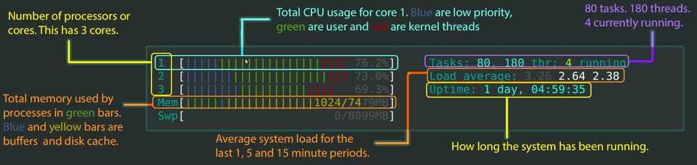
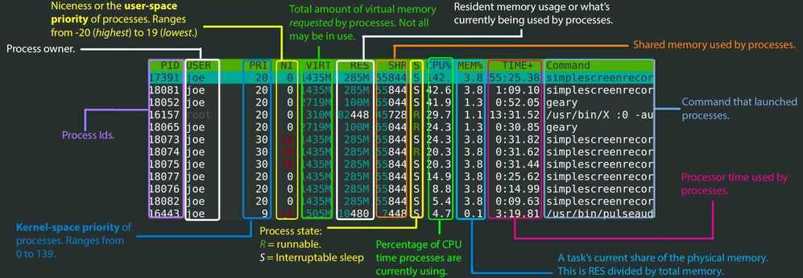

# Others

## Boot

1. When we turn on the power, BIOS (Basic Input/Output System) or UEFI (Unified Extensible Firmware Interface) firmware is loaded from non-volatile memory, and executes POST (Power On Self Test).
2. BIOS/UEFI detects the devices connected to the system, including CPU, RAM, and storage.
3. Choose a booting device to boot the OS from. This can be the hard drive, the network server, or CD ROM.
4. BIOS/UEFI runs the boot loader (GRUB), which provides a menu to choose the OS or the kernel functions.
5. After the kernel is ready, we now switch to the user space. The kernel starts up systemd as the first user-space process, which manages the processes and services, probes all remaining hardware, mounts filesystems, and runs a desktop environment.
6. systemd activates the default. target unit by default when the system boots. Other analysis units are executed as well.
7. The system runs a set of startup scripts and configure the environment.
8. The users are presented with a login window. The system is now ready.


## systemd / initd

systemd is a collection of tools for a range of different tasks.Its primary purpose is initializing, managing and tracking system services and daemons in Fedora, both during startupand while the system is running.

The **init system** is the first process started on Fedora after the kernel starts. In fact, the init system always gets the Process ID (PID) of 1 on a system. This process is always executed by the Linux kernel after the early stages of boo tup are completed by the BIOS and bootloader (GRUB).

The init system then must start all the necessary daemons, background processes and services required to make the operating system work. Examples of such processes include starting up a bootscreen, various parts of the networking stack, and hardware in your machine.

Often these processes continue to run in the background after they start, and are calleddaemons.These daemonsmanage many parts of your system, such as logging information, watching for devices you insert or remove, and managing user login.

https://fedoramagazine.org/what-is-an-init-system

https://www.digitalocean.com/community/tutorials/how-to-use-systemctl-to-manage-systemd-services-and-units

## systemctl

```bash
systemctl list-units | grep .service
systemctl status ssh.service
systemctl --failed
systemctl is-enabled ssh
systemctl reboot
systemctl poweroff
systemctl suspend
sudo systemctl start ssh.service
sudo systemctl stop ssh.service
sudo systemctl restart ssh.service
sudo systemctl disable ssh.service #will not run automatically on next startup
sudo systemctl enable ssh.service
```

## Journald

Journald replaces the plain text files of syslog with a binary format that:

- Allows for log messages with multiple fields and multi-line text
- Stores these messages in a space-efficient way that does not require renaming files for maintenance
- Gives fast access to messages given specific criteria, much like a database would

### Commands

```bash
- journalctl #view blob messages
- journalctl -a #view decoded messages
- journalctl -k #view kernel messages
- journalctl -f #follow messages
- journalctl -b #messages from this boot
- journalctl --since "2015-06-26 23:15:00" --until "2015-06-26 23:20:00"
- journalctl --since "2 days ago"
- journalctl --since "1 hour ago"
- journalctl -u nginx.service #only show nginx.service unit logs
```

## bashplotlib

`pip install bashplotlib #graphs in the console`

## jq

jq is like sed for JSON data - you can use it to slice and filter and map and transform structured data with the same ease that sed, awk, grep and friends let you play with text.

```bash
brew install jq

jq '.accounts[] | select(.userID == "77925937-d719-4ff6-9125-a9199ab6a9b6")' merkle_2023-04-01_2.json
```

https://stedolan.github.io/jq

## fq

jq for binary formats - tool, language and decoders for working with binary and text formats

[GitHub - wader/fq: jq for binary formats - tool, language and decoders for working with binary and text formats](https://github.com/wader/fq)

## Networking - socat

socat is a command line based utility that establishes two bidirectional byte streams and transfers data between them. Because the streams can be constructed from a large set of different types of data sinks and sources (see [address types](http://www.dest-unreach.org/socat/doc/socat.html#ADDRESS_TYPES)), and because lots of [address options](http://www.dest-unreach.org/socat/doc/socat.html#ADDRESS_OPTIONS) may be applied to the streams, socat can be used for many different purposes

http://www.dest-unreach.org/socat/doc/socat.html

## Networking - tshark

Dump and analyze network traffic

https://www.wireshark.org/docs/man-pages/tshark.html

## Logrotate

logrotate is designed to ease administration of systems that generate large numbers of log files. It allows automatic rotation, compression, removal, and mailing of log files. Each log file may be handled daily, weekly, monthly, or when it grows too large.

`Config file - /etc/logrotate.conf`

`Options - man logrotate.conf`

### Example

```json
/tmp/email.log {
    compress
    delaycompress
    daily
    create 666 ubuntu syslog
    missingok
    rotate 14
}

/var/log/access.log {
    compress
    delaycompress
    daily
    create 666 root root
    missingok
    rotate 14
}
```

### Manually trigger logrotate

`sudo logrotate -f /etc/logrotate.conf`

## File watchers (uses this to know how to see changes to a file)

1. inotify
2. poll

The biggest difference is that epoll can be used for ANY fd. This means it's good for watching all types of ways to communicate data. Sockets, IPC, files, printers.. anything. inotify is for filesystems only.

However, because inotify is specific to filesystems, you can receive notifications on a wide array of filesystem-specific attributes, such as file attributes and the file being read. These things are not possible via epoll.

In fact, inotify returns a file descriptor - which means you can use epoll to determine which inotify FD's you should call read on. So the two go hand in hand to some extent.

http://en.wikipedia.org/wiki/Inotify

## htop

htop - an interactive process viewer for Unix.

It shows a frequently updated list of the processes running on a computer, normally ordered by the amount of CPU usage. Unlike top, htop provides a full list of processes running, instead of the top resource-consuming processes. htop uses color and gives visual information about [processor](https://en.wikipedia.org/wiki/Central_processing_unit), [swap](https://en.wikipedia.org/wiki/Swap_space) and [memory](https://en.wikipedia.org/wiki/Random_access_memory) status.





https://peteris.rocks/blog/htop

[How CPU Efficient is your App? - YouTube](https://www.youtube.com/watch?v=BTD5I1BMx2Q)

## glances

Glances is a cross-platform monitoring tool which aims to present a large amount of monitoring information through a curses or Web based interface. The information dynamically adapts depending on the size of the user interface.

```bash
pip install glances

pip install 'glances [action, browser, cloud, cpuinfo, docker, export, folders, gpu, graph, ip, raid, snmp, web, wifi]'

glances -w
```

https://github.com/nicolargo/glances

## Interactive Filter

Searching the command history can be tedious. While both bash and zsh feature Ctrl+R keybinding, it only shows one substitution at a time. What is more, you need to enter the exact text that you used before. Since this is quite a common operation, once you start using the command line, it looks like a fine place for improvement.

Interactive filters, like [fzy](https://github.com/jhawthorn/fzy), [percol](https://github.com/mooz/percol), [peco](https://github.com/peco/peco) or [fzf](https://github.com/junegunn/fzf) help you with filtering long lines of text. This can either be the aforementioned command history, all the lines of code in a project directory, or a list of filenames generated byfind .. The general idea here is to present you first with all the lines available and then rely on fuzzy finding algorithms to filter out everything that doesn't match.

For example, binding Ctrl+R to fzf shows you a list of the most recent commands, which you can navigate up and down using arrows, or you can typegitto only show commands that feature Git somewhere inside.

Plus, you can make your interactive filter available inside your programmable text editor. This way, you will have unified searching capabilities between your shell and your editor.

## Big Data Terminal Tools

### Pipe Viewer (pv)

Terminal-based tool for monitoring the progress of data through a pipeline. It can be inserted into any normal pipeline between two processes to give a visual indication of how quickly data is passing through, how long it has taken, how near to completion it is, and an estimate of how long it will be until completion.

[GitHub - a-j-wood/pv: Pipe Viewer - monitor the progress of data through a pipe](https://github.com/a-j-wood/pv)

[ivarch.com: Pipe Viewer](https://www.ivarch.com/programs/pv.shtml)

[a-j-wood/pv: Pipe Viewer - monitor the progress of data through a pipe. - Codeberg.org](https://codeberg.org/a-j-wood/pv)

### Parallel

[GNU Parallel](https://savannah.gnu.org/projects/parallel/)

```bash
brew install pv
brew install parallel

pv abc.sql | parallel --pipe --block 10M grep -o "text_string" > output.txt

pv abc.sql.gz | parallel --pipe --block 10M zgrep -o "text_string" > output.txt
```

## Others

[GitHub - google/zx: A tool for writing better scripts](https://github.com/google/zx)

[GitHub - YS-L/csvlens: Command line csv viewer](https://github.com/YS-L/csvlens)
